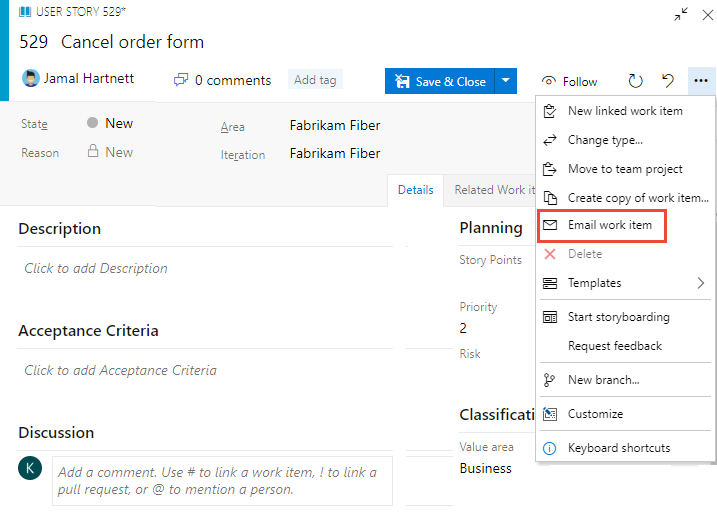
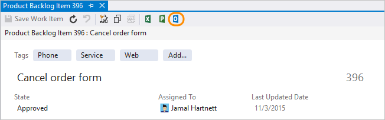
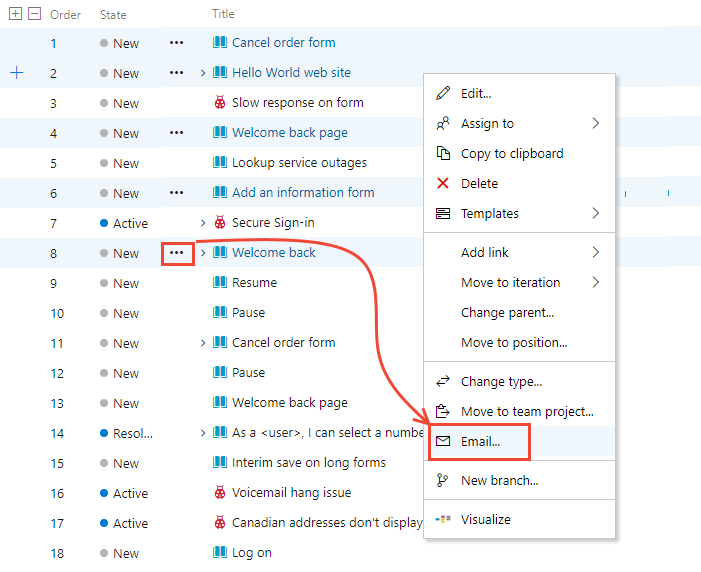
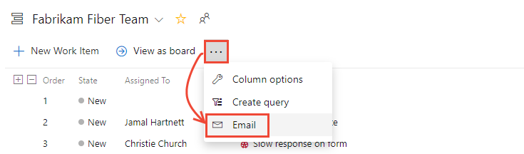
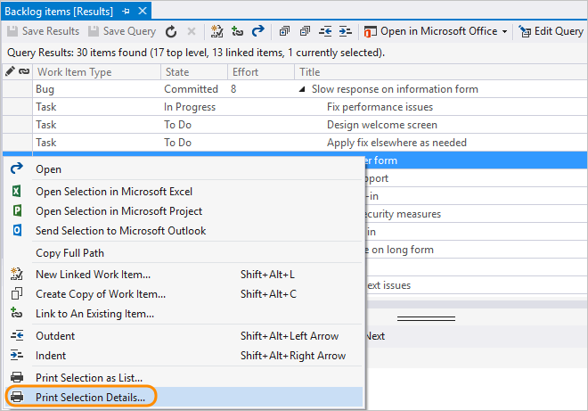
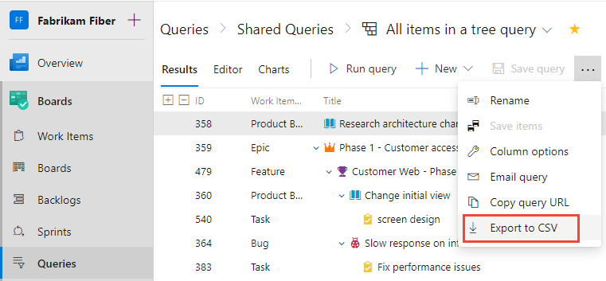

# Send an email of work items or print

[!INCLUDE [version-lt-eq-azure-devops](../../includes/version-lt-eq-azure-devops.md)]
[!INCLUDE [version-vs-gt-eq-2019.md](../../includes/version-vs-gt-eq-2019.md)] 

Using work items to track your work provides a host of benefits, including the ability to easily share information. You can capture most information within the work item Description or other rich-text formatted field. If you need to maintain the information in a different format, you can easily link to or attach a file. 

## Supported tasks 

Emailing lists of work items is a common way to share work tracking information. The following table indicates which tasks or features are supported from the web portal and Visual Studio.   

> [!NOTE]   
> The tasks/features listed in the following table aren't available when you're connected to a GitHub or third-party Git repository. Also, they aren't available from Visual Studio under the following conditions:   
> 
> * If you're set to use the default Landing page experience as described in [Set the Work Items experience in Visual Studio 2019](set-work-item-experience-vs.md).  
> * If you're set to use the new Git Tool as described in [Git experience in Visual Studio](/visualstudio/ide/git-with-visual-studio).  
 
---
:::row:::
   :::column span="2":::
      **Task/feature**
   :::column-end:::
   :::column span="":::
      **Web portal**
   :::column-end:::
   :::column span="":::
      **Visual Studio**
   :::column-end:::
:::row-end:::
---
:::row:::
   :::column span="2":::
      [Email summary list with links to work item(s)](#email-summary-lists)
   :::column-end:::
   :::column span="":::
      ✔️
   :::column-end:::
   :::column span="":::
      ✔️
   :::column-end:::
:::row-end:::
:::row:::
   :::column span="2":::
      [Print work item(s)](#print-items)
   :::column-end:::
   :::column span="":::
        
   :::column-end:::
   :::column span="":::
      ✔️
   :::column-end:::
:::row-end:::
:::row:::
   :::column span="2":::
      [Email link to a work item query](#copy-url)
   :::column-end:::
   :::column span="":::
      ✔️
   :::column-end:::
   :::column span="":::
      ✔️
   :::column-end:::
:::row-end:::
:::row:::
   :::column span="2":::
      [Email query results](#email-summary-lists)
   :::column-end:::
   :::column span="":::
      ✔️
   :::column-end:::
   :::column span="":::
      ✔️
   :::column-end:::
:::row-end:::
::: moniker range=">= azure-devops-2019"
:::row:::
   :::column span="2":::
      [Export query result as CSV](#export)
   :::column-end:::
   :::column span="":::
      ✔️
   :::column-end:::
   :::column span="":::
        
   :::column-end:::
:::row-end:::
::: moniker-end 
---

 

::: moniker range="< azure-devops"
> [!NOTE]   
> For the email feature to work, your administrator for Azure DevOps Server must [configure a Simple Mail Transfer Protocol (SMTP) server](/azure/devops/server/admin/setup-customize-alerts).  

::: moniker-end 

[!INCLUDE [temp](../includes/prerequisites-work-items.md)]

> [!NOTE]   
> Make sure you provide members of your organization [Stakeholder access](../../organizations/security/access-levels.md) who want to contribute to the discussion and review progress. These are typically members who don't contribute to code, but want to view work items, backlogs, Kanban boards, and dashboards.  

## Email a single item  

You can quickly email a summary of one or more work items. Summaries include the values assigned to these fields: work item ID, title, work item type, assigned to, state, and tags.  

> [!IMPORTANT]     
> If you use the built-in email feature, you can only send the email to individual address for a project member that is recognized by the system. Adding a team group or security group to the to line isn't supported. If you add an email account that the system doesn't recognize, you receive a message that one or more recipients of your email don't have permissions to read the mailed work items.  

<a id="team-services-email" />  

#### [Web portal](#tab/browser/)

**From the web portal**, open the work item, choose the :::image type="icon" source="../media/icons/actions-icon.png" border="false"::: actions icon, and select the **Email work item** option. The first 200 items in the list appear in a formatted table. 

> [!div class="mx-imgBorder"]  
>    

#### [Visual Studio](#tab/visual-studio/)

<a id="team-explorer-email" />

> [!IMPORTANT]  
> To email a summary of work items in Visual Studio 2019, you need to [Set the Work Items experience](../work-items/set-work-item-experience-vs.md) to the legacy option.

From Visual Studio or Team Explorer, choose . This option requires that you configure Office Outlook on your client computer.

  

* * *

::: moniker range="< azure-devops"  

> [!NOTE]  
> If you connect to an on-premises Azure DevOps Server, your server administrator must have [configured an SMTP server](/azure/devops/server/admin/setup-customize-alerts) for the email feature to work.   

::: moniker-end  

<a id="team-services-email-list" /> 
 

## Email summary lists with links to items  

Another way to share items is by emailing summary lists, such as a sprint summary plan or active bugs list. You can share items from a backlog or query results list.  

Depending on the option and client you choose, summary lists may or may not include a hyperlink to the work item ID.  

#### [Web portal](#tab/browser/)

**To email items from the web portal**: Open a backlog or query and highlight the items from the list. Open the context menu for one of the selected items and select to email them.   

> [!div class="mx-imgBorder"]  
>    

If you want to mail a list of all items in the backlog or query, choose the  :::image type="icon" source="../media/icons/actions-icon.png" border="false"::: actions icon, and select the **Email** option. 

> [!div class="mx-imgBorder"]  
>   

#### [Visual Studio](#tab/visual-studio/)

<a id="team-explorer-email-list" />

> [!NOTE]  
> To email a query results list in Visual Studio 2019, you need to [Set the Work Items experience](../work-items/set-work-item-experience-vs.md) to the legacy option.

**To email items from Visual Studio**: Open a query, highlight the items from the list, choose the context menu, and select **Send selection to Microsoft Outlook** from the menu. This option requires that you configure Office Outlook on your client computer.  

   

* * *

## Copy formatted list of work items  

With this option, you can copy an HTML formatted table of selected items. You can then email this list using your choice of email client.  

1.  From the web portal, open a backlog or a list of query results.  

2.  Select the work items you want to copy.   

      

    The formatted table contains a link to each work item included in your selected results list.  

3.  Paste the contents of the clipboard into your email client or other application. To open a linked work item, requires users to have read access to the project or area node for those work items.   

## Print items  

Open a query in Visual Studio that contains a work item that you want to print, select or highlight those items, and then select the **Print** option from the context menu.   

> [!IMPORTANT]  
> To print work items in Visual Studio 2019, you need to [Set the Work Items experience](../work-items/set-work-item-experience-vs.md) to the legacy option.

   

## Print work items as cards

Some teams want to work with physical cards when planning or updating their physical Kanban or Scrum task boards. There's no native support for printing work items as cards. However, you may find a solution from the [Azure DevOps Marketplace](https://marketplace.visualstudio.com/search?term=card&target=AzureDevOps&category=Azure%20Boards&sortBy=Relevance).   

<a id="team-explorer-copy-url" />

## Copy the URL to a single work item  

> [!NOTE]   
> All URLs you copy, regardless of the client you use to copy them, opens the work item in the web portal. 

#### [Web portal](#tab/browser/)

<a id="team-services-copy-url" />

**From the web portal**, copy the URL from the web browser address or hover over the title and then select the  copy-to-clipboard icon.

#### [Visual Studio](#tab/visual-studio/)

> [!NOTE]  
> To copy the URL of a work item in Visual Studio 2019, you need to [Set the Work Items experience](../work-items/set-work-item-experience-vs.md) to the legacy option.

**From Visual Studio**, right-click the work item tab to copy the URL. The URL opens the work item in the web portal. 

  

* * *

<a id="export" /> 

::: moniker range=">= azure-devops-2019"

## Export list as CSV 

From any query, you can export a list of work items as a comma-delimited list. Open the query, choose the :::image type="icon" source="../../media/icons/actions-icon.png" border="false"::: actions icon, and choose <strong>Export to CSV</strong>. For more information, see [Bulk import or update work items using CSV files](../queries/import-work-items-from-csv.md).

::: moniker-end

::: moniker range="azure-devops-2019"

> [!NOTE]   
> Requires Azure DevOps Server 2019 Update 1 or later version. 

::: moniker-end

::: moniker range=">= azure-devops-2019"

> [!div class="mx-imgBorder"]  
>    

::: moniker-end  

## Marketplace extensions  

You may find other ways to share information by exporting work items to other applications such as Microsoft Word. For more information, review the [Marketplace extensions that support Microsoft Word](https://marketplace.visualstudio.com/search?term=word&target=AzureDevOps&category=Azure%20Boards&sortBy=Relevance). 

## Related articles  

::: moniker range="azure-devops"

- [Use templates to add and update work items](../backlogs/work-item-template.md) 
- [Send email with work item](../work-items/email-work-items.md)
- [Define the hyperlink for a work item](work-item-url-hyperlink.md)  

::: moniker-end

::: moniker range="< azure-devops"

- [Use templates to add and update work items](../backlogs/work-item-template.md) 
- [Send email with work item](../work-items/email-work-items.md)
- [Define the hyperlink for a work item](work-item-url-hyperlink.md)  
- [Configure an SMTP server](/azure/devops/server/admin/setup-customize-alerts)

::: moniker-end
