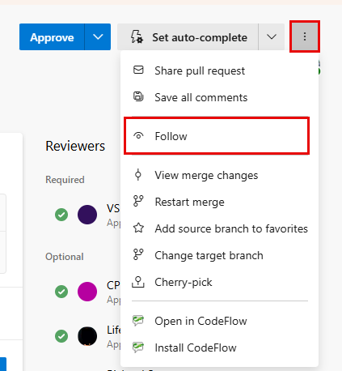

# Follow work items and pull requests  

[!INCLUDE [version-lt-eq-azure-devops](../../includes/version-lt-eq-azure-devops.md)]

  

Stay informed about changes to specific work items or pull requests by using the Follow feature. This feature provides targeted notifications on a case-by-case basis, helping you track items that matter most to your work without information overload.

 > [!TIP]
> **Quick start**: Select the :::image type="icon" source="../media/icons/follow-icon.png" border="false"::: **Follow** icon on any work item or pull request to start receiving notifications when it changes.

## What you can do with the Follow feature

- **Track specific items**: Get notifications only for work items and pull requests you choose to follow
- **Customize notifications**: Choose when to receive alerts (all changes, mentions only, or specific field updates)
- **Query followed items**: Use the `@Follows` macro to create custom queries and dashboards
- **Stay focused**: Avoid notification overload by following only what matters to your work

## How following differs from subscriptions

| Feature | Following | Notification Subscriptions |
|---------|-----------|---------------------------|
| **Scope** | Individual items you select | Broad criteria across projects |
| **Setup** | One-click on specific items | Configure rules and filters |
| **Best for** | Tracking specific work items/PRs | Automated team workflows |
| **Examples** | Following a bug you reported | All items assigned to you |

For automated notifications based on broader criteria, see [Manage personal notifications](../../organizations/notifications/manage-your-personal-notifications.md). 

## Prerequisites

[!INCLUDE [prerequisites-work-items](../includes/prerequisites-work-items.md)]

## Follow a work item

**Quick steps**: Select the :::image type="icon" source="../media/icons/follow-icon.png" border="false"::: **Follow** icon on any work item to start receiving notifications.

> [!div class="mx-imgBorder"]  
> 

### Customize your notification preferences

Select the :::image type="icon" source="../media/icons/gear_icon.png" border="false"::: **Settings** icon next to **Follow** to choose when you get notified:

> [!div class="mx-imgBorder"]  
> 

| Option | When you receive notifications | Best for |
|--------|------------------------|----------|
| **Subscribed** (default) | Any change to the work item | Items you actively work on |
| **Not Subscribed** | Only when someone @mentions you | Items you want to watch passively |
| **Custom** | When specific fields change | Critical updates only |

**Custom notification triggers:**
- **State changes**: When status updates, for example, New → Active → Resolved
- **Assignment changes**: When someone new gets assigned
- **Iteration changes**: When the system moves items to different sprints

### What triggers notifications

You receive email notifications when team members perform the following actions:

| Action | Example | 
|--------|---------|
| **Comment or discuss** | Add comments, @mention you, start discussions |
| **Update fields** | Change title, description, priority, tags |
| **Modify attachments** | Add screenshots, documents, or remove files |
| **Change relationships** | Link/unlink work items, update parent/child |

> [!NOTE]
> You don't receive notifications for changes you make yourself.

**Quick tip**: Change your email preferences at [Change your preferred email address](../../organizations/notifications/change-email-address.md).

**To stop following**: Select the :::image type="icon" source="../media/icons/following-icon.png" border="false"::: **Following** icon.
 

## Follow a pull request 

**Quick steps**: Go to any pull request → :::image type="icon" source="../media/icons/actions-icon.png" border="false"::: **More actions** → :::image type="icon" source="../media/icons/follow-icon.png" border="false"::: **Follow**.

> [!div class="mx-imgBorder"]  
> 

### Pull request notifications

| When | What happened | Why it matters |
|------|---------------|----------------|
| **Comments added** | Someone reviews or discusses code | Stay informed about feedback |
| **Review status changes** | Approved, changes requested, or new reviewers added | Track review progress |
| **Code updates** | New commits pushed to the branch | See latest changes |
| **Status changes** | PR completed, abandoned, or reopened | Know the final outcome |

> [!NOTE]
> Like work items, you don't get notified about changes you make yourself.

**To stop following**: Open **More actions** → select :::image type="icon" source="../media/icons/following-icon.png" border="false"::: **Following**. 

## View and manage items you follow

### Option 1: Quick access via Queries

**Path**: **Boards** → **Queries** → **All** → **My Queries** → **Followed work items**

> [!div class="mx-imgBorder"]  
> 

**What you can do here:**
- See all followed items across projects
- Sort and filter by any field
- Add custom columns
- Open items for quick review

### Option 2: Work Items hub

**Path**: **Boards** → **Work Items** → **Following** tab

> [!div class="mx-imgBorder"]  
> 

**Best for**: Streamlined view focused only on items you follow.   

## Create custom queries with @Follows

Use the **@Follows** macro to build powerful queries that combine items you follow with other criteria.

### Basic @Follows query

:::image type="content" source="media/follow-work/query-follows.png" alt-text="Screenshot showing Query Editor with ID In @Follows query clause.":::

**Steps:**
1. Create new query: **Boards** → **Queries** → **New query**
2. Add clause: **ID** **In** **@Follows**
3. Save and run

### Advanced query examples

**Most useful queries:**

| Query purpose | Query clauses | Why it's helpful |
|---------------|---------------|------------------|
| **High-priority items I follow** | ID In @Follows AND Priority = 1 | Focus on critical items |
| **My team's followed items** | ID In @Follows AND Assigned To In Group [Team] | Team collaboration |
| **Recently updated** | ID In @Follows AND Changed Date >= @Today - 7 | See recent activity |
| **Blocked items I follow** | ID In @Follows AND State = Blocked | Track impediments |

> [!TIP]
> **Share query structures**: While @Follows is personal to you, you can share query templates with teammates to create consistent follow-up workflows.

## Best practices for following items

Consider these strategies to make the most of the Follow feature:

### When to follow work items
- **Items you create**: Automatically follow bugs you report or features you request
- **Cross-team dependencies**: Follow items that impact your work but aren't assigned to you
- **Critical bugs**: Follow high-priority issues that affect your area
- **Learning opportunities**: Follow items to understand how your team resolves similar problems

### Managing notification volume
- **Use custom settings**: Set specific field triggers instead of following all changes
- **Review regularly**: Unfollow completed items that no longer need monitoring
- **Batch review**: Check the Following tab weekly instead of responding to every email
- **Team coordination**: Agree on following strategies to avoid duplicate monitoring

### Query strategies
- **Create personal dashboards**: Build widgets using @Follows queries for quick status checks
- **Set up alerts**: Use queries with @Follows to create additional notification rules
- **Track patterns**: Monitor followed items to identify common issues or bottlenecks

## Troubleshooting common issues

### Not receiving notifications

**Check these settings:**
1. **Personal notifications**: Verify your email address in [notification settings](../../organizations/notifications/manage-your-personal-notifications.md)
2. **Follow status**: Confirm the item shows the "Following" icon (not just "Follow")
3. **Notification preferences**: Check if you selected "Not Subscribed" by mistake
4. **Email filters**: Look for Azure DevOps emails in spam or filtered folders

### Too many notifications

**Reduce notification volume:**
- Switch high-volume items to "Custom" settings with specific field triggers
- Use "Not Subscribed" for items you want to track but don't need immediate alerts
- Create daily digest queries instead of real-time notifications
- Unfollow completed or irrelevant items

### Following not available

**Possible causes:**
- **Permissions**: You need at least Stakeholder access to follow items
- **Project access**: Verify you can view the work item or pull request
- **Feature availability**: Following requires Azure DevOps Services or TFS 2017 or later

## Frequently asked questions

### Q: Can I add someone else to follow a work item or PR?

**A:** No, following is personal - each user must follow items themselves. However, you can:
- **Share the item link** and ask them to follow it
- **Set up team notifications** for broader automatic alerts
- **Create shared queries** that include @Follows for team visibility

For team-wide notifications, see [Manage team notifications](../../organizations/notifications/manage-team-group-global-organization-notifications.md).

### Q: Will I get too many notifications if I follow many items?

**A:** You can control notification volume by:
- Using **Custom** notification settings for specific field changes only
- Setting items to **Not Subscribed** (mentions only) for passive monitoring
- Creating queries to review followed items in batches instead of individual emails

### Q: Can I follow items across different projects?

**A:** Yes! The Follow feature works across all projects in your organization. Use the **Followed work items** query to see everything in one place.

### Q: Do I automatically follow items I create or get assigned?

**A:** No, following is always a manual action. You need to explicitly select the Follow icon on each item you want to track.

### Q: Can I export a list of items I'm following?

**A:** Yes, use the "Followed work items" query and export the results to CSV, or create a custom query with @Follows and export that.

## Next step

> [!div class="nextstepaction"]
> [Add and update work items](../backlogs/add-work-items.md) 

## Related content

- [Create and save managed queries with Query Editor](../queries/using-queries.md)
- [View and configure notifications](../../organizations/notifications/about-notifications.md)
- [Manage personal notifications](../../organizations/notifications/manage-your-personal-notifications.md)
- [View work item history](../queries/history-and-auditing.md)
- [Set work tracking permissions](../../organizations/security/set-permissions-access-work-tracking.md)
