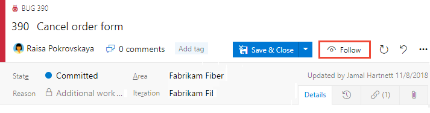

# Tutorial: Follow a user story, bug, issue, or other work item or pull request  

**Azure Boards | Azure Repos | Azure DevOps Server 2019 | TFS 2018 | TFS 2017**

  

To get notified of changes made to a specific work item or a pull request, you can elect to follow them. The Follow feature provides an ad hoc way of getting notified on a case-by-case basis. 

On the other hand, if you want to subscribe to receive notifications automatically based on changes that occur based on your targeted set of criteria, see [Manage personal notifications](../../notifications/howto-manage-personal-notifications.md). For example, you can create a subscription to automatically get notified whenever a work item that you created or that was assigned to you is modified. 

> [!NOTE]  
> Notification subscriptions allow you to personalize the notifications you receive automatically based on additional criteria you specify for [yourself](../../notifications/howto-manage-personal-notifications.md), a team, or a project. For example, you can create a subscription and add field criteria to receive changes based on one or more of the following templates. 
>
>  

This article shows you how to:

>[!div class="checklist"]  
> * Follow a work item
> * Follow a pull request 
> * Manage work items that you're following

::: moniker range=">= tfs-2017 <= azure-devops-2019"

[You must configure an SMTP server](/azure/devops/server/admin/setup-customize-alerts) in order for team members to receive notifications.   
::: moniker-end  

## Prerequisites

::: moniker range="azure-devops"

* You must connect to a project. If you don't have a project yet, [create one](/azure/devops/boards/get-started/sign-up-invite-teammates). 
* You must be added to a project as a member of the **Contributors** or **Project Administrators** security group. To get added, [Add users to a project or team](/azure/devops/organizations/security/add-users-team-project). 
* To view or follow work items, you must be granted **Stakeholder** access or higher. For details, see [About access levels](/azure/devops/organizations/security/access-levels). Also, you must have your **View work items in this node** and **Edit work items in this node** permissions set to **Allow**. By default, the **Contributors** group has this permission set. To learn more, see [Set permissions and access for work tracking](/azure/devops/organizations/security/set-permissions-access-work-tracking).  
* To view or follow pull requests, you must have **Basic** access or higher.   

::: moniker-end

::: moniker range="<= azure-devops-2019"

* You must connect to a project. If you don't have a project yet, [create one](/azure/devops/organizations/projects/create-project).
* You must be added to a project as a member of the **Contributors** or **Project Administrators** security group. To get added, [Add users to a project or team](/azure/devops/organizations/security/add-users-team-project). 
* To view or follow work items, you must be granted **Stakeholder** access or higher. For details, see [About access levels](/azure/devops/organizations/security/access-levels). Also, you must have your **View work items in this node** and **Edit work items in this node** permissions set to **Allow**. By default, the **Contributors** group has this permission set. To learn more, see [Set permissions and access for work tracking](/azure/devops/organizations/security/set-permissions-access-work-tracking).  
* To view or follow pull requests, you must have **Basic** access or higher.  

::: moniker-end 

follow-work-with-notifications

## Follow a work item

When you want to track the progress of a single work item, choose the  follow icon. This signals the system to notify you when changes are made to the work item.  

::: moniker range="azure-devops"

> [!div class="mx-imgBorder"]  
>  

If you want to specify conditions on when you'll get notified of changes, choose the  gear icon and choose from the options provided. 

> [!div class="mx-imgBorder"]  
>  

By default, you are **Subscribed** to receive a notification when any change is made to the work item. Choose **Not Subscribed** to receive notification only when you are @mentioned. Or choose **Custom** to receive notifications when one of the checked fields changes, **State**, **Assigned To**, or **Iteration Path**. 

::: moniker-end

::: moniker range=">= tfs-2017 <= azure-devops-2019"

> [!div class="mx-imgBorder"]  
>  

::: moniker-end

::: moniker range="tfs-2017"

> [!NOTE]   
> The **Follow a work item** feature is available from TFS 2017 and later versions. The **Follow a pull request** feature is available from TFS 2017.1 and later versions. To update your on-premises TFS, visit the [Visual Studio downloads page for Team Foundation Server](https://visualstudio.microsoft.com/downloads). 

::: moniker-end

You'll only receive notifications when other members of your team modifies the work item, such as adding to the discussion, changing a field value, or adding an attachment. 

Notifications are sent to your preferred email address, which [you can change from your user profile](../../notifications/change-email-address.md)

To stop following changes, choose the  following icon.
 

## Follow a pull request 

To track the progress of a single pull request, choose the  actions icon for the pull request, and select the  **Follow** option. This signals the system to notify you when changes are made to the PR.  

  

You'll only receive notifications when other members of your team modifies the PR, such as adding to the discussion or adding an attachment. 

Notifications are sent to your preferred email address, which [you can change from your user profile](../../notifications/change-email-address.md).  

To stop following changes, open the PR context menu and choose the  Following icon. 

## Manage work items that you're following  

You can review and manage all the work items you've selected to follow.

::: moniker range=">= azure-devops-2019"   

Open **Boards>Queries**, choose **All**, and under **My Queries**, choose **Followed work items**.   

> [!div class="mx-imgBorder"]  
>    

From this view, you can view all items you're following across all projects. Also, you can perform similar actions supported with a query results view, such as:
- Refresh the view
- Add or remove visible columns
- Sort the order of specific columns
- Filter results by text or tags 
- Set work item pane
- Enter full screen mode. 

You can also view and manage work that you're following from **Boards>Work Items** and pivot to **Following**. 

> [!div class="mx-imgBorder"]  
>    

::: moniker-end   

::: moniker range=">= tfs-2017 <= tfs-2018"

Open **Work>Queries** and choose **Followed work items**.  

  

From this view, you can view all items you're following across all projects. Also, you can perform similar actions supported with a query results view, such as:
- Refresh the view
- Add or remove visible columns
- Sort the order of specific columns
- Filter results by text or tags 
- Set work item pane
- Enter full screen mode. 

You can also view and manage work that you're following from your Project pages. To learn more, see [Work across projects](../../project/navigation/work-across-projects.md). 

::: moniker-end 

## Try this next

> [!div class="nextstepaction"]
> [Add, update, and follow a work item](../backlogs/add-work-items.md) 

## Related articles  

- [Manage personal notifications](../../notifications/howto-manage-personal-notifications.md)  
- [View and update work items via the mobile work item form](../../project/navigation/mobile-work.md)  

### Q: Can I add someone else to follow a work item or PR?

**A:** You can't add another team member to follow a work item or pull request at this time. You can subscribe them to get notified based on select criteria, such as when a work item is create or modified, or a pull request is created. For details, see [Manage team notifications](../../notifications/howto-manage-team-notifications.md).	

