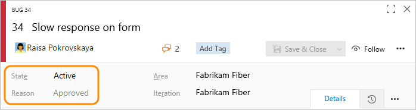
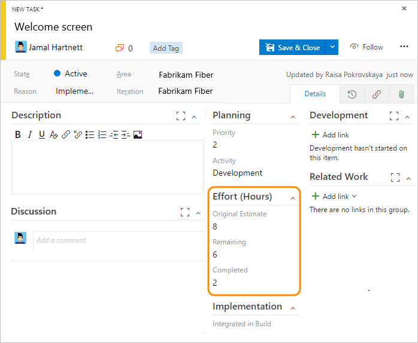
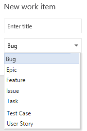

# Agile process work item types and workflow  

[!INCLUDE [temp](../../_shared/version-vsts-tfs-all-versions.md)]

Teams use the work item types (WITs) provided with the Agile process to plan and track progress of software projects. Teams define user stories to manage the backlog of work and then, using the Kanban board, track progress by updating the status of those stories.

To gain insight into a portfolio of features, scenarios, or user experiences, product owners and program managers can map user stories to features. When teams work in sprints, they define tasks which automatically link to user stories. If you are new to the Agile process, review the section [Plan and track work with Agile](agile-process.md#start-using) to get started. 

Using the web portal or Microsoft Test Manager, testers can create and run test cases. Bugs and issues are used to track code defects and blocking issues.  

[!INCLUDE [temp](../../_shared/note-work-item-form-differences.md)]  

## Define user stories

User stories define the applications, requirements, and elements that teams need to create. Product owners typically define and stack rank user stories. The team then estimates the effort and work to deliver the highest priority items.

Create user stories from the quick add panel on the [product backlog page](../../backlogs/create-your-backlog.md). From that page, you can also drag-and-drop items to reorder them or [map them to features](../../backlogs/organize-backlog.md). 

Later, you can open each user story to provide more details and estimate the story points.

 

By defining the **Story Points**, teams can use the forecast feature and velocity charts to estimate future sprints or work efforts. By prioritizing the user stories on the backlog page (which is captured in the Stack Rank field), product owners can indicate which items should be given higher priority.

Use the following guidance and that provided for [fields used in common across work item types](#definitions-in-common) when filling out the form.  

<table>
<thead>
<tr><th>
Field/tab
</th><th>
Usage
</th></tr>
</thead>
<tbody valign="top">
<tr>
	<td>
[Description](../../queries/titles-ids-descriptions.md)  
</td>
	<td>
For user stories, provide enough detail for estimating how much work will be required to implement the story. Focus on who the feature is for, what users want to accomplish, and why. Don't describe how the feature should be developed. Do provide sufficient details so that your team can write tasks and test cases to implement the item.

	</td>
</tr>
<tr>
	<td>
[Acceptance Criteria](../../queries/titles-ids-descriptions.md) 
</td>
	<td>
Provide the criteria to be met before the bug or user story can be closed. Before work begins, describe the customer acceptance criteria as clearly as possible. Conversations between the team and customers to define the acceptance criteria will help ensure that your team understands your customers' expectations. The acceptance criteria can be used as the basis for acceptance tests so that you can more effectively evaluate whether an item has been satisfactorily completed.

</td>
</tr>
<tr>
	<td>
[Value Area](../../queries/planning-ranking-priorities.md)
</td>
	<td>
The area of customer value addressed by the epic, feature, requirement, or backlog item. Values include:

        <ul>
        <li>
          

            <strong>Architectural </strong>: Technical services to implement business features that deliver solution 
          

        </li>
        <li>
          

            <strong>Business</strong>: Services that fulfill customers or stakeholder needs that directly deliver customer value to support the business (Default)
          

        </li>
      </ul>
</td></tr>
<tr>
	<td width="20%">
[Story Points](../../queries/query-numeric.md)
</td>
	<td>
Estimate the amount of work required to complete a user story using any numeric unit of measurement your team prefers.

Agile [velocity charts](../../../report/dashboards/velocity-chart-data-store.md) and [forecast](../../sprints/forecast.md) tools reference the values in this field. For additional guidance, see the [Estimating](https://msdn.microsoft.com/library/hh765979) white paper.
</td></tr>
<tr>
	<td>
[Priority](../../queries/planning-ranking-priorities.md)

</td>
	<td>
A subjective rating of the user story, feature, or requirement as it relates to the business. Allowed values are:
<ul><li>
<strong>1</strong>: Product cannot ship without the feature.
</li><li>
<strong>2</strong>: Product cannot ship without the feature, but it doesn't have to be addressed immediately.
</li><li>
<strong>3</strong>: Implementation of the feature is optional based on resources, time, and risk.
</li>
</ul>
</td>
</tr>
<tr>
	<td>
[Risk](../../queries/planning-ranking-priorities.md)
</td>
	<td>
A subjective rating of the relative uncertainty around the successful completion of a user story. Allowed values are:
<ul><li>
<strong>1 - High</strong>
</li><li>
<strong>2 - Medium</strong>
</li><li>
<strong>3 - Low</strong>
</li></ul></td>
</tr>

</tbody>
</table>

[!INCLUDE [temp](../../_shared/discussion-tip.md)] 

## Track progress

As work progresses, you change the State field to update the status. Optionally, you can specify a reason. The state and reason fields appear on the work item form in the header area. 

 

### Agile workflow states 

By updating the workflow, teams know which items are new, in progress, or completed. Most WITs support transition both forward and backward from each workflow state. These diagrams show the main progression and regression states of the user story, bug, and task WITs. 

> [!div class="mx-tdBreakAll"]  
> |User Story |Bug |Task |  
> |-------------|----------|---------| 
> | | || 

 
A typical workflow progression for a user story follows:

-   The product owner creates a user story in the **New** state with the default reason, **New user story**  
-   The team updates the status to **Active** when they decide to complete the work during the sprint  
-   A user story is moved to **Resolved** when the team has completed all its associated tasks and unit tests for the story pass  
-   A user story is moved to the **Closed** state when the product owner agrees that the story has been implemented according to the Acceptance Criteria and acceptance tests pass.  

### Update status with Kanban or taskboards

Teams can use the [Kanban board](../../boards/kanban-basics.md) to update the status of requirements, and the [sprint taskboard](../../sprints/task-board.md) to update the status of tasks. Dragging items to a new state column updates both the State and Reason fields.

You can customize the Kanban board to support additional [swim lanes](../../boards/expedite-work.md) or [columns](../../boards/add-columns.md). For additional customization options, see [Customize your work tracking experience](#customize-work-tracking).

## Map user stories to features

When you manage a suite of products or user experiences, you might want to view the scope and progress of work across the product portfolio. You can do this by [defining features](../../backlogs/define-features-epics.md) and [mapping user stories to features](../../backlogs/organize-backlog.md).

Using portfolio backlogs, you can [drill down from one backlog to another](../../plans/portfolio-management.md) to view the level of detail you want. Also, you can use portfolio backlogs to view a rollup of work in progress across several teams when you [setup a hierarchy of teams](../../../organizations/settings/add-teams.md).

## Define tasks 

When your team manages their work in sprints, they can use the [sprint backlog page](../../sprints/assign-work-sprint.md) to break down the work to be accomplished into distinct tasks.  

Name the task and estimate the work it will take.

 

Using Agile processes, teams forecast work and define tasks at the start of each sprint, and each team member performs a subset of those tasks. Tasks can include development, testing, and other kinds of work. For example, a developer can define tasks to implement user stories, and a tester can define tasks to write and run test cases.

When teams estimate work using hours or days, they define tasks and the **Remaining Work** and **Activity** (optional) fields.

<table><thead>
<tr><th>
Field/tab
</th><th>
Usage
</th></tr></thead>
<tbody valign="top">
<tr>
	<td>
[Original Estimate](../../queries/query-numeric.md)
</td>
	<td>
The amount of estimated work required to complete a task. Typically, this field doesn't change after it is assigned.

You can specify work in hours or in days. There are no inherent time units associated with this field.

</td>
</tr>

<tr>
	<td width="18%">
[Remaining Work](../../queries/query-numeric.md)
</td>
	<td>
The amount of work remaining to complete a task. As work progresses, update this field. It's used to calculate [capacity charts](../../sprints/set-capacity.md), the [sprint burndown chart](../../sprints/sprint-burndown.md), and the following (TFS only) reports: [Burndown and Burn Rate](https://msdn.microsoft.com/library/dd380678.aspx), [Remaining Work](https://msdn.microsoft.com/library/dd380673.aspx), and [Status on All Iterations](https://msdn.microsoft.com/library/dd380706.aspx).

If you divide a task into subtasks, specify hours for the subtasks only. You can specify work in any unit of measurement your team chooses.
</td></tr>

<tr>
	<td>
[Completed Work](../../queries/query-numeric.md) 
</td>
	<td>
The amount of work spent implementing a task.
</td></tr>
<tr>
	<td>
[Activity](../../queries/query-numeric.md) 
</td>
	<td>
Select the type of activity this task represents when your team estimates sprint capacity by activity.
</td></tr>
<tr>
	<td>
[Integrated in Build](../../queries/build-test-integration.md)
</td>
	<td>
Product build number that incorporates the code or fixes a bug.
</td>

</tr></tbody>
</table>  

If you use [Microsoft Project](../../backlogs/office/create-your-backlog-tasks-using-project.md) to assign resources and track a schedule, you can update these fields using Project.

## Track test progress 

 
### Test user stories

From the web portal or Test Manager, you can [create test cases that automatically link to a user story or bug](../../../test/create-test-cases.md). Or, you can link a user story to a test case from the  (links tab). 

The test case contains a number of fields, many of which are automated and integrated with Test Manager and the build process. For a description of each field, see [Query based on build and test integration fields](../../queries/build-test-integration.md).

 

The  (links tab) captures the links to user stories and bugs in a test case. By linking user stories and bugs to test cases, the team can track the progress made in testing each item. By defining these links, you support information that appears in the [Stories Overview Report](../../../report/sql-reports/stories-overview-report-agile.md) report.

### Track code defects

You can [create bugs from the web portal web portal, Visual Studio, or when testing with Test Manager](../../backlogs/manage-bugs.md). 

[!INCLUDE [temp](../../_shared/common-work-item-fields.md)]   

## Customize work item types
[!INCLUDE [temp](../../_shared/customize-work-tracking.md)] 

## Related articles

[!INCLUDE [temp](../../_shared/create-team-project-links.md)]  
  
 

### Track issues 

Issues are used to track events that may block progress or shipping a user story. Bugs, on the other hand, are used to track code defects. You can add an issue from the  [New work item widget](../../../report/dashboards/widget-catalog.md#new-work-item-widget) added to a [team dashboard](../../../report/dashboards.md), or from the **New** menu on the Queries page. 

  

Work items you add from the widget are automatically scoped to your team's default area and iteration paths. To change the team context, see [Switch team context](../../../project/navigation/go-to-project-repo.md?toc=/azure/devops/boards/plans/toc.json&bc=/azure/devops/boards/plans/breadcrumb/toc.json).  
 
### Track business value  
You can use the Priority field to differentiate the value of various stories. Or, you can add a custom field to the User Story WIT that tracks the relative value of stories. To learn how, see [Customize a field for a process](../../../organizations/settings/work/customize-process-field.md).

### Backlog list order

The [Stack Rank](../../queries/planning-ranking-priorities.md) field is used to track the relative ranking of user stories, however by default it doesn't appear on the work item form. The sequence of items on the backlog page is determined according to where you have [added the items or moved the items on the page](../../backlogs/create-your-backlog.md#move-items-priority-order). As you drag items, a background process updates this field.

### Links control, client work item form 

Work item forms displayed in a client and the web portal for TFS 2015 and earlier versions display link tabs and link control restrictions as described in the following table. 

<table>
<thead>
<tr>
<th>
Tab name
</th>
<th>
Work item type
</th>
<th>
Link restrictions
</th>
</tr>
</thead>
<tbody valign="top">
<tr>
<td>
<strong>All Links</strong>
</td>
<td>
User story

Bug

Feedback Request

Task

Test Case
</td>
<td><ul>
<li>
No restrictions.
</li>
</ul>

</td>
</tr>
<tr>
<td>
<strong>Implementation</strong>
</td>
<td>
User story

Task
</td>
<td><ul>
<li>
Allows only <strong>Parent</strong> and <strong>Child</strong> links between user stories and tasks.
</li>
<li>
Excludes links to work items in other projects.
</li>
</ul>

</td>
</tr>
<tr>
<td>
<strong>Links</strong>
</td>
<td>
Issue

Shared steps

</td>
<td><ul>
<li>
No restrictions.
</li>
</ul></td>
</tr>
<tr>
<td>
<strong>Links</strong>
</td>
<td>
Code Review Request
</td>
<td><ul>
<li>
Allows only <strong>Parent</strong> and <strong>Child</strong> links to Code Review Response work items.
</li>
<li>
Excludes links to work items in other projects.
</li>
</ul>

</td>
</tr>
<tr>
<td>
<strong>Stories</strong>
</td>
<td>
Feedback Response
</td>
<td><ul>
<li>
Allows only <strong>Related</strong> links to user stories.
</li>
<li>
Excludes links to work items in other projects.
</li>
</ul></td>
</tr>
<tr>
<td>
<strong>Storyboards</strong>
</td>
<td>
User Story
</td>
<td><ul>
<li>
Allows only <strong>Storyboard</strong> links.
</li>
</ul></td>
</tr>
<tr>
<td>
<strong>Test Cases</strong>
</td>
<td>
User story

Bug
</td>
<td><ul>
<li>
Allows only <strong>Tested By</strong> links.
</li>
<li>
Allows links only to test cases.
</li>
<li>
Excludes links to work items in other projects.
</li>
</ul></td>
</tr>
<tr>
<td>
<strong>Tested User Stories</strong>
</td>
<td>
Test case
</td>
<td><ul>
<li>
Allows only <strong>Tests</strong> links.
</li>
<li>
Allows links only to user stories.
</li>
<li>
Excludes links to work items in other projects.
</li>
</ul></td>
</tr>
</tbody>
</table>

