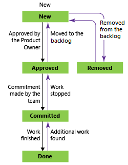

# About default processes and process templates

[!INCLUDE [version-lt-eq-azure-devops](../../../includes/version-lt-eq-azure-devops.md)]

Azure Boards offers various processes to choose from for managing work items. Selecting the right process is essential for optimizing a project workflow and ensuring its success. In this article, we explore the different processes available with Azure Boards. This article also provides guidance on how to choose the most suitable process for your project.

[!INCLUDE [temp](../../../includes/choose-process-introduction.md)]

The work tracking objects contained within the default processes and process templates, which are Basic, Agile, Capability Maturity Model Integration (CMMI), and Scrum, are the same. They're summarized in this article.

[!INCLUDE [temp](../../includes/get-latest-process-templates.md)]

## Default processes

The default processes differ mainly in the work item types they provide for planning and tracking work. The default processes are:

- **Basic**: Is the most lightweight and is in a selective preview.
- **Scrum**: Is the next most lightweight.
- **Agile**: Supports many Agile method terms.
- **CMMI**: Provides the most support for formal processes and change management.

[!INCLUDE [temp](../../includes/note-basic-process.md)]

:::row:::
   :::column span="2":::
   
   **Basic**

   Choose [Basic](../../get-started/plan-track-work.md) when your team wants the simplest model that uses Issue, Task, and Epic work item types to track work.

 Tasks support tracking Remaining Work.

   :::column-end:::
   :::column span="2":::
   
   
   :::column-end:::
:::row-end:::
---
:::row:::
   :::column span="2":::
   
   **Agile**

   Choose [Agile](agile-process.md) when your team uses Agile planning methods, including Scrum, and tracks development and test activities separately. This process works great for tracking User Stories and (optionally) bugs on the Kanban board. You can also track bugs and tasks on the taskboard.

   For more information about Agile methodologies, see [Agile Alliance](https://www.agilealliance.org/).
   
 Tasks support tracking Original Estimate, Remaining Work, and Completed Work.

   :::column-end:::
   :::column span="2":::
   
   
   :::column-end:::
:::row-end:::
---
:::row:::
   :::column span="2":::
   
   **Scrum**

   
   Choose [Scrum](scrum-process.md) when your team practices Scrum. This process works great for tracking product backlog items and bugs on the Kanban board. You can also break down product backlog items and bugs into tasks on the taskboard.
   
   This process supports the Scrum methodology as defined by the [Scrum organization](https://www.scrum.org/).

   Tasks support tracking Remaining Work only.

   :::column-end:::
   :::column span="2":::
   
   
   :::column-end:::
:::row-end:::
---
:::row::: 
   :::column span="2":::
   
   **CMMI**

   Choose [CMMI](cmmi-process.md) when your team follows more formal project methods that require a framework for process improvement and an auditable record of decisions. With this process, you can track requirements, change requests, risks, and reviews.
   
   
   This process supports [formal change management activities](./cmmi/guidance-background-to-cmmi.md). Tasks support tracking Original Estimate, Remaining Work, and Completed Work.
   
   :::column-end:::
   :::column span="2":::
   
   
   :::column-end:::
  :::row-end:::
---

If you need more than two or three backlog levels, add more based on the process model that you use:

- **Inheritance**: [Customize your backlogs or boards for a process](../../../organizations/settings/work/customize-process-backlogs-boards.md)
- **Hosted XML or On-premises XML**: [Add portfolio backlogs](../../../reference/add-portfolio-backlogs.md)

## Main distinctions among the default processes

The default processes are designed to meet the needs of most teams. If your team has unusual needs and connects to an on-premises server, customize a process and then create the project. You can also create a project from a process and then customize the project.

The following table summarizes the main distinctions between the work item types and states used by the four default processes.

:::row:::
   :::column span="1":::
   **Tracking area**
   :::column-end:::
   :::column span="1":::
   **Basic**
   :::column-end:::
   :::column span="1":::
   **Agile**
   :::column-end:::
   :::column span="1":::
   **Scrum**
   :::column-end:::
   :::column span="1":::
   **CMMI**
   :::column-end:::
:::row-end:::
---
:::row:::
   :::column span="1":::
   
   Workflow states
   :::column-end:::
   :::column span="1":::
   
   - To Do
   - Doing
   - Done
   
   :::column-end:::
   :::column span="1":::
   
   
   - New
   - Active
   - Resolved
   - Closed
   - Removed
   
   :::column-end:::
      :::column span="1":::
   
   
   - New
   - Approved
   - Committed
   - Done
   - Removed
   :::column-end:::   
   :::column span="1":::
   
   
   - Proposed
   - Active
   - Resolved
   - Closed
   
   :::column-end:::
:::row-end:::
:::row:::
   :::column span="1":::
   
   Product planning (see Note 1)
   :::column-end:::
   :::column span="1":::
   
   
   - Issue
   
   :::column-end:::
   :::column span="1":::
   
   
   - User Story
   - Bug (optional)
   
   :::column-end:::
   :::column span="1":::
   
   
   - Product backlog item
   - Bug (optional)
   
   :::column-end:::
   :::column span="1":::
   
   
   - Requirement
   - Bug (optional)
   
   :::column-end:::
:::row-end:::
:::row:::
   :::column span="1":::
   
   Portfolio backlogs (see Note 2)
   :::column-end:::
   :::column span="1":::
   
   
   - Epic
   
   :::column-end:::
   :::column span="1":::
   
   
   - Epic
   - Feature
   
   :::column-end:::
   :::column span="1":::
   
 
   - Epic
   - Feature
   
   :::column-end:::
   :::column span="1":::
   
   
   - Epic
   - Feature
   
   :::column-end:::
:::row-end:::
:::row:::
   :::column span="1":::
   
   Task and sprint planning (see Note 3)
   :::column-end:::
   :::column span="1":::
   
   
   - Task
   
   :::column-end:::
   :::column span="1":::
   
   
   - Task
   - Bug (optional)
   
   :::column-end:::
      :::column span="1":::
   
   
   - Task
   - Bug (optional)
   
   
   :::column-end:::
   :::column span="1":::
   
  
   - Task
   - Bug (optional)
   
   :::column-end:::
:::row-end:::
:::row:::
   :::column span="1":::
   
   Bug backlog management (see Note 1)
   :::column-end:::
   :::column span="1":::
   
  
   - Issue
   
   :::column-end:::
   :::column span="1":::
   
  
   - Bug
   
   :::column-end:::
   :::column span="1":::
   
   
   - Bug
   
   :::column-end:::
   :::column span="1":::
   
   
   - Bug
   
   :::column-end:::
:::row-end:::
:::row:::
   :::column span="1":::
   
   Issue and risk management
   :::column-end:::
   :::column span="1":::
   
  
   - Issue
   
   :::column-end:::
   :::column span="1":::
   
  
   - Issue
   
   :::column-end:::
   :::column span="1":::
   
   
   - Impediment
   
   :::column-end:::
   :::column span="1":::
   
   
   - Issue
   - Risk
   - Review
   
   :::column-end:::
:::row-end:::
---

Notes:

1. Add work items from the [product backlog](../../backlogs/create-your-backlog.md) or [Kanban board](../../boards/kanban-overview.md). The product backlog shows a single view of the current backlog of work that can be dynamically reordered and grouped. Product owners can quickly prioritize work and outline dependencies and relationships. Also, each team can configure how they want [bugs to show up on their backlogs and boards](../../../organizations/settings/show-bugs-on-backlog.md).
1. Define a hierarchy of portfolio backlogs to understand the scope of work across several teams and see how that work rolls up into broader initiatives. Each team configures which [portfolio backlogs appear for their use](../../../organizations/settings/select-backlog-navigation-levels.md).
1. Define tasks from the [sprint backlog and taskboard](../../sprints/assign-work-sprint.md). With capacity planning, teams can quickly determine if they're over- or undercapacity for a sprint.

### Workflow states, transitions, and reasons

Workflow states support tracking the status of work as it moves from a `New` state to a `Closed` or a `Done` state. Each workflow consists of a set of states, the valid transitions between the states, and the reasons for transitioning the work item to the selected state.

> [!IMPORTANT]
> For Azure DevOps Services and Azure DevOps Server 2019, the default workflow transitions support any state to any state transition. Customize these workflows to restrict some transitions. For more information, see [Customize work tracking objects to support your team's processes](../../../reference/customize-work.md).
>
> Also, view the supported workflow transitions for each work item type by installing the [State Model Visualization](https://marketplace.visualstudio.com/items?itemName=taavi-koosaar.StateModelVisualization) Marketplace extension. This extension adds a new hub under **Boards** labeled **State Visualizer**. On that page, choose a work item type and view the workflow state model.

The following diagrams show the typical forward progression of those work item types used to track work and code defects for the three default processes. They also show some of the regressions to former states and transitions to removed states.
Each image shows only the default reason associated with the transition.

#### [Agile process](#tab/agile-process)

:::row:::
   :::column span="1":::
   
   #### User Story
   
   :::column-end:::
   :::column span="1":::
   
   #### Feature
   
   :::column-end:::
   :::column span="1":::
   
   #### Epic
   
   :::column-end:::
:::row-end:::
:::row:::
   :::column span="1":::
   
   #### Bug
   
   :::column-end:::
   :::column span="1":::
   
   #### Task
   
   :::column-end:::
   :::column span="1":::
      
   :::column-end:::
:::row-end:::

#### [Basic process](#tab/basic-process)

> [!NOTE]
> The Basic process is available when you create a new project from Azure DevOps Services or [Azure DevOps Server 2019.1](https://go.microsoft.com/fwlink/?LinkId=2097609). For earlier on-premises deployments, choose the Agile, Scrum, or CMMI process.

:::row:::
   :::column span="1":::
   
   #### Epic, Issue, and Task hierarchy
   
   :::column-end:::
   :::column span="1":::
   
   #### Epic, Issue, and Task workflow 
   
   :::column-end:::
   :::column span="1":::
      
   :::column-end:::
:::row-end:::

#### [Scrum process](#tab/scrum-process)

:::row:::
   :::column span="1":::
   
   #### Product backlog item
   
   :::column-end:::
   :::column span="1":::
   
   #### Feature
   
   :::column-end:::
   :::column span="1":::
   
   #### Epic
   
   :::column-end:::
:::row-end:::
:::row:::
   :::column span="1":::
   
   #### Bug
   
   :::column-end:::
   :::column span="1":::
   
   #### Task
   
   :::column-end:::
   :::column span="1":::
     
   :::column-end:::
:::row-end:::

#### [CMMI process](#tab/cmmi-process)

:::row:::
   :::column span="1":::
   
   #### Requirement
   
   :::column-end:::
   :::column span="1":::
   
   #### Feature
   
   :::column-end:::
   :::column span="1":::
   
   #### Epic
   
   :::column-end:::
:::row-end:::
:::row:::
   :::column span="1":::
   
   #### Bug
   
   :::column-end:::
   :::column span="1":::
   
   #### Task
   
   :::column-end:::
   :::column span="1":::
     
   :::column-end:::
:::row-end:::

* * *

Most work item types used by Agile tools, the ones that appear on backlogs and boards, support any-to-any transitions. Update the status of a work item by using the Kanban board or the taskboard by dragging it to its corresponding state column.

Change the workflow to support other states, transitions, and reasons. For more information, see [Customize your work tracking experience](../../../reference/customize-work.md).

### Work item states

When you change the state of a work item to `Removed`, `Closed`, or `Done`, the system responds as follows:

- `Closed`/`Done`: Work items in this state don't appear on the portfolio backlog and backlog pages. They do appear on the sprint backlog pages, Kanban board, and taskboard. Also, when you change the portfolio backlog view to **Show backlog items**, for example, to view features to product backlog items, work items in the `Closed` and `Done` state appear.
- `Removed`: Work items in this state don't appear on any backlog or board.

Your project maintains work items as long as the project is active. Even if you set work items to `Closed`, `Done`, or `Removed`, the data store keeps a record. Use a record to create queries or reports.

[!INCLUDE [temp](../../includes/note-closed-items.md)]

If you need to permanently delete work items, see [Remove or delete work items](../../backlogs/remove-delete-work-items.md).

## Work item types added to all processes

The following work item types are added to all processes except the Basic process.

  

Your team can create and work with these types by using the corresponding tool.

|Tool  |Work item types  |
|---------|---------|
|Microsoft Test Manager     |   `Test Plan`, `Test Suite`, `Test Case Shared Steps`, `Shared Parameters`      |
|Request Feedback     |   `Feedback Request`, `Feedback Response`      |
|My Work (from Team Explorer), Code Review    | `Code Review Request`, `Code Review Response`        |

Work items from these type definitions aren't meant to be created manually and are then added to the `Hidden Types` category. Work item types added to the `Hidden Types` category don't appear on the menus that create new work items.

### Work item types that support the test experience

Work item types that support the test experience and work with Test Manager and the web portal are linked together by using the link types shown in the following image.

From the web portal or Microsoft Test Manager, view which test cases are defined for a test suite and view which test suites are defined for a test plan. However, these objects aren't connected to each other through link types. Customize these work item types as you would any other work item types. For more information, see [Customize work tracking objects to support your team's processes](../../../reference/customize-work.md).

If you change the workflow for the test plan and test suite, you might need to update the process configuration as described here. For definitions of each test field, see [Query based on build and test integration fields](../../queries/build-test-integration.md).

## Related articles

- [Customize your work tracking experience](../../../reference/customize-work.md)
- [Upload and download process templates](manage-process-templates.md)
