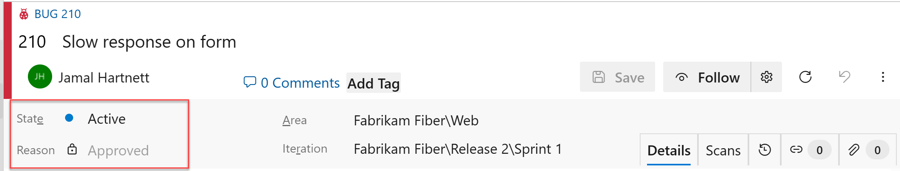
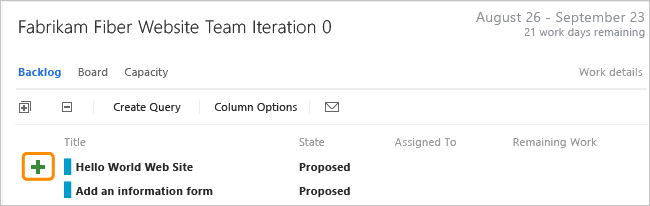
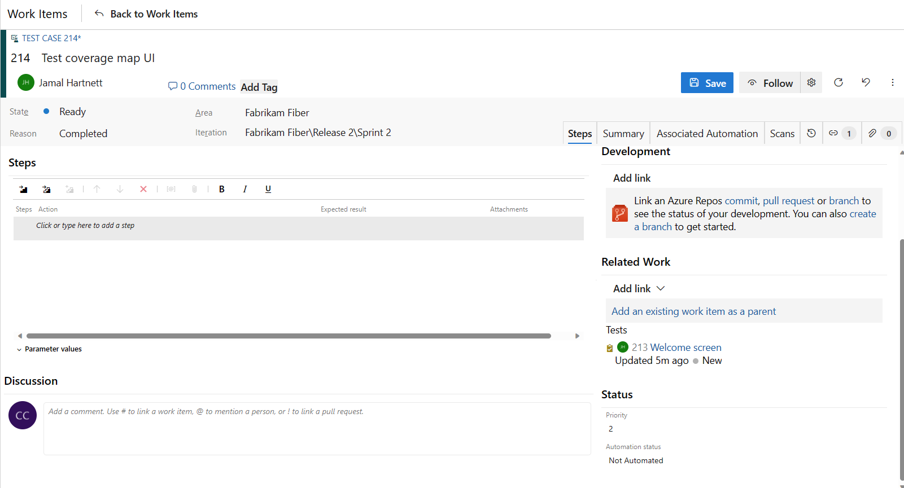
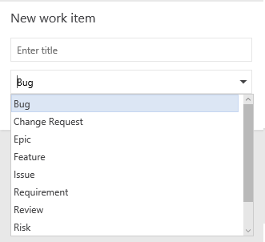

# CMMI process work item types and workflow in Azure Boards

[!INCLUDE [version-lt-eq-azure-devops](../../../includes/version-lt-eq-azure-devops.md)]

Teams use the work item types (WITs) provided with the MSF for CMMI Process Improvement 2015 (CMMI) process to plan and track progress of software projects. Teams define requirements to manage the backlog of work and then, using the Kanban board, track progress by updating the status of requirements.
 

To gain insight into a portfolio of requirements, product owners can map requirements to features. When teams work in iterations, they define tasks that automatically link to requirements.

Using Microsoft Test Manager and the web portal, testers create and run test cases and define bugs to track code defects.

To support other CMMI processes, teams can track change requests, risks, issues, and notes captured in review meetings. If you're new to the CMMI process, review the section [Plan and track work with CMMI](cmmi-process.md#start-using) to get started. 
 

## Define requirements 

Create requirements from the quick add panel on the [product backlog page](../../backlogs/create-your-backlog.md). Later, you can open each requirement to provide more details and estimate its size.

:::image type="content" source="../media/about-work-items/work-item-form-requirement.png" alt-text="Screenshot of Requirement work item form.":::

::: moniker range="> azure-devops-2019"
Or, you can bulk add requirements using a [cvs file](../../queries/import-work-items-from-csv.md). 
::: moniker-end

::: moniker range="<= azure-devops-2019"
Or, you can bulk add requirements using [Excel](../../backlogs/office//bulk-add-modify-work-items-excel.md) or [Project](/previous-versions/azure/devops/boards/backlogs/office/create-your-backlog-tasks-using-project).
::: moniker-end

[!INCLUDE [temp](../../includes/deprecate-project.md)]

Requirements specify the functions and product elements that teams need to create. Product owners typically define and stack rank requirements on the product backlog page. The team then scopes the size of the effort to deliver the highest priority items.

Use the following guidance and that provided for [fields used in common across work item types](#definitions-in-common) when filling out the form. For more information, see [Plan a project](cmmi/guidance-plan-a-project-cmmi.md).

  :::row:::
   :::column span="1":::
   **Field**
   :::column-end:::
   :::column span="3":::
   **Usage**
   :::column-end:::
  :::row-end:::
   ---
  :::row:::
   :::column span="1":::
   
   
   [Description](../../queries/titles-ids-descriptions.md)
   
   :::column-end:::
   :::column span="3":::
   
  Provide enough detail for estimating how much work will be required to implement the requirement. Focus on who the requirement is for, what users want to accomplish, and why. Don&#39;t describe how the requirement should be developed. Do provide sufficient details so that your team can write tasks and test cases to implement the item.

  In HTML fields, you can add rich text and images. 

   
   
   :::column-end:::
  :::row-end:::
  :::row:::
   :::column span="1":::
   
  [Impact Assessment](cmmi/guidance-requirements-field-reference-cmmi.md)

   :::column-end:::
   :::column span="3":::
   
  The customer impact of not implementing this requirement. You might include details from the Kano model about whether this requirement is in the surprise, required, or obvious categories. You capture this information in the rich-text HTML field that corresponds to Impact Assessment.

   
   
   :::column-end:::
  :::row-end:::
  :::row:::
   :::column span="1":::
   
  [Requirement Type](cmmi/guidance-requirements-field-reference-cmmi.md) (Required) 

   :::column-end:::
   :::column span="3":::
   
  The kind of requirement to implement. You can specify one of the following values: 

  
   - **Business Objective**
   - **Feature** (default)
   - **Functional**
   - **Interface**
   - **Operational**
   - **Quality of Service**
   - **Safety**
   - **Scenario**
   - **Security**
     
  
   :::column-end:::
  :::row-end:::
:::row:::
   :::column span="1":::
   [Value area](../../queries/planning-ranking-priorities.md)

   :::column-end:::
   :::column span="3":::
   The area of customer value addressed by the epic, feature, requirement, or backlog item. Values include:

   
   - **Architectural**: Technical services to implement business features that deliver solution 
   - **Business**: Services that fulfill customers or stakeholder needs that directly deliver customer value to support the business (Default)
   
   
  
   :::column-end:::
:::row-end:::
  :::row:::
   :::column span="1":::
   
   
   [Size](../../queries/query-numeric.md) 
   :::column-end:::
   :::column span="3":::
   
  Estimate the amount of work required to complete a requirement using any numeric unit of measurement your team prefers. 
 By defining the **Size** for requirements, teams can use the Agile [velocity charts](../../../report/dashboards/team-velocity.md) and [forecast](../../sprints/forecast.md) tools to estimate future iterations or work efforts. The Kanban [Cumulative Flow Diagram](../../boards/kanban-basics.md) references the values in this field. For more information, see the [Estimating](/previous-versions/visualstudio/visual-studio-2013/hh765979(v=vs.120)) white paper.

   :::column-end:::
  :::row-end:::
:::row:::
   :::column span="1":::
   [Original Estimate](../../queries/query-numeric.md) 

   :::column-end:::
   :::column span="3":::
   The amount of estimated work required to complete a task. Typically, this field doesn&#39;t change after it's assigned.

   You can specify work in hours or in days. There are no inherent time units associated with this field.

   :::column-end:::
:::row-end:::
:::row:::
   :::column span="1":::
   [Start Date/Finish Date](../../queries/query-by-date-or-current-iteration.md) 

   :::column-end:::
   :::column span="3":::
   The target dates for when the work will start or finish. 

   :::column-end:::
:::row-end:::
  :::row:::
   :::column span="1":::
   
   
   [Priority](../../queries/planning-ranking-priorities.md) (Required)
   :::column-end:::
   :::column span="3":::
   
  A subjective rating of the requirement as it relates to the business. Allowed values are:

  
   - **1**: Product can't ship without the item.
   - **2**: (default) Product can't ship without the item, but it doesn&#39;t have to be addressed immediately. 
   - **3**: Implementation of the item is optional based on resources, time, and risk.  
   
  
   
   
   :::column-end:::
  :::row-end:::
  :::row:::
   :::column span="1":::
   
   
   [Triage](../../queries/planning-ranking-priorities.md) (Required) 
   :::column-end:::
   :::column span="3":::
   
  Indicates the type of triage decision that is pending for the work item. Use this field when the work item is in the Proposed state and specify one of the following values: **Pending** (default), **More Info**, **Info Received**, and **Triaged**.

   :::column-end:::
  :::row-end:::
  :::row:::
   :::column span="1":::
   
   
   [Blocked](../../queries/planning-ranking-priorities.md)
   :::column-end:::
   :::column span="3":::
   
  Indicates whether a team member is prevented from making progress toward implementing a requirement or task or resolving a bug, change request, or risk. If an issue has been opened to track a blocking problem, you can create a link to the issue. You can specify **Yes** of **No**.

   :::column-end:::
  :::row-end:::
  :::row:::
   :::column span="1":::
   
   
   [Committed](../../queries/planning-ranking-priorities.md) (Required)  
   :::column-end:::
   :::column span="3":::
   
  Indicates whether the requirement is committed in the project or not. You can specify **Yes** or **No** (default).

   :::column-end:::
  :::row-end:::
  :::row:::
   :::column span="1":::
   
   
   [Integrated In](../../queries/build-test-integration.md)  
   :::column-end:::
   :::column span="3":::
   
  Product build number that incorporates the requirement, change request, or fixes a bug.

   :::column-end:::
  :::row-end:::
  :::row:::
   :::column span="1":::
   
   
   [User Acceptance Test](cmmi/guidance-requirements-field-reference-cmmi.md) (Required) 
   :::column-end:::
   :::column span="3":::
   
  The status of the user acceptance test for a requirement. You can specify one of the following values:   

  
   - **Pass**
   - **Fail**
   - **Not Ready**  (default)
   - **Ready**
   - **Skipped**
   - **Info Received**
     
  
   You specify Not Ready when the requirement is in the Active state, and you specify Ready when the requirement is in the Resolved state.

   :::column-end:::
  :::row-end:::
  :::row:::
   :::column span="1":::
   
   
   [Subject Matter Experts](cmmi/guidance-requirements-field-reference-cmmi.md) 
   
   :::column-end:::
   :::column span="3":::
   
  The names of team members who are familiar with the customer area that this requirement represents.

   :::column-end:::
  :::row-end:::
  ---

[!INCLUDE [temp](../../includes/discussion-tip.md)] 

## Track work progress

As work progresses, you change the State field to update the status. Optionally, you can specify a reason. The state and reason fields appear on the work item form in the header area. 

 

### CMMI workflow states 

These diagrams show the main progression and regression states for the Requirement, Bug, and Task WITs. 

> [!div class="mx-tdBreakAll"]  
> |Requirement  |Bug |Task |  
> |-------------|----------|---------| 
> | | | |

The typical workflow progression for a requirement is:  
-   The product owner creates a requirement in the **Proposed** state with the default reason, **New requirement**.  
-   The product owner updates the status to **Active** when they begin work to implement it.  
-   The team updates the status to **Resolved** when code development is finished and system tests have passed.  
-   Lastly, the team or product owner moves the requirement to **Closed** when the product owner agrees that it has been implemented according to the Acceptance Criteria and passed all validation tests.  

### Update work status with Kanban or taskboards

Teams can use the [Kanban board](../../boards/kanban-basics.md) to update the status of requirements, and the [sprint taskboard](../../sprints/task-board.md) to update the status of tasks. Dragging items to a new state column updates both the State and Reason fields.

You can customize the Kanban board to support more [swim lanes](../../boards/expedite-work.md) or [columns](../../boards/add-columns.md). For more customization options, see [Customize your work tracking experience](#customize-work-tracking).

## Map requirements to features

When you manage a suite of products or user experiences, you might want to view the scope and progress of work across the product portfolio. You can do view scope by [defining features](../../backlogs/define-features-epics.md) and [mapping requirements to features](../../backlogs/organize-backlog.md).

Using portfolio backlogs, you can [drill down from one backlog to another](../../plans/portfolio-management.md) to view the level of detail you want. Also, you can use portfolio backlogs to view a rollup of work in progress across several teams when you [setup a hierarchy of teams](../../../organizations/settings/add-teams.md).

The feature work item contains similar fields provided for requirements and includes other fields, as the following table describes.

## Define tasks

When your team manages their work in sprints, they can use the [sprint backlog page](../../sprints/assign-work-sprint.md) to break down the work to be accomplished into distinct tasks.  

Name the task and estimate the work it will take.

When teams estimate work, they define tasks and estimate the hours or days to complete tasks. Teams forecast work and define tasks at the start of an iteration, and each team member does a subset of those tasks. Tasks can include development, testing, and other kinds of work. For example, a developer can define tasks to implement requirements, and a tester can define tasks to write and run test cases. By linking tasks to requirements and bugs, they see the progress made on these items. For more information, see [Iteration activities](cmmi/guidance-iteration-activities.md).

:::row:::
   :::column span="1":::
   **Field**
   :::column-end:::
   :::column span="3":::
   **Usage**
   :::column-end:::
:::row-end:::

:::row:::
   :::column span="1":::
   [Task Type](cmmi/guidance-requirements-field-reference-cmmi.md) 

   :::column-end:::
   :::column span="3":::
   Select the kind of task to implement from the allowed values:

   
   - **Corrective Action**

   - **Mitigation Action**

   - **Planned**

   
   :::column-end:::
:::row-end:::
:::row:::
   :::column span="1":::
   [Discipline](../../queries/query-numeric.md)

   :::column-end:::
   :::column span="3":::
   Select the discipline this task represents when your team estimates sprint capacity by activity.

   
   - **Analysis**

   - **Development**

   - **Test**

   - **User Education**

   - **User Experience**

   
   This field is also used to calculate capacity by discipline. It's assigned to `type=&quot;Activity&quot;` in the ProcessConfiguration file. (2)

   For more information, see [Implement development tasks](cmmi/guidance-implement-development-tasks.md).

   :::column-end:::
:::row-end:::
:::row:::
   :::column span="1":::
   [Original Estimate](../../queries/query-numeric.md) 

   :::column-end:::
   :::column span="3":::
   The amount of estimated work required to complete a task. Typically, this field doesn&#39;t change after it's assigned.

   :::column-end:::
:::row-end:::
:::row:::
   :::column span="1":::
   [Remaining Work](../../queries/query-numeric.md)

   :::column-end:::
   :::column span="3":::
   
   The amount of work remaining to complete a task. As work progresses, update this field. It&#39;s used to calculate [capacity charts](../../sprints/set-capacity.md), the [sprint burndown chart](../../../report/dashboards/configure-sprint-burndown.md), and the [Sprint Burndown](../../../report/sql-reports/sprint-burndown-scrum.md) report. 
   If you divide a task into subtasks, specify hours for the subtasks only. You can specify work in any unit of measurement your team chooses.

   :::column-end:::
:::row-end:::
:::row:::
   :::column span="1":::
   [Completed Work](../../queries/query-numeric.md)

   :::column-end:::
   :::column span="3":::
   The amount of work that has been spent implementing a task.

   :::column-end:::
:::row-end:::

## Track test progress 

### Test requirements

From the web portal or Test Manager, you can [create test cases that automatically link to a requirement or bug](../../../test/create-test-cases.md).  Or, you can link a requirement to a test case from the :::image type="icon" source="../../backlogs/media/icon-links-tab-wi.png" border="false"::: (links tab). 

  

The test case contains many fields, many of which are automated and integrated with Test Manager and the build process. For a description of each field, see [Query based on build and test integration fields](../../queries/build-test-integration.md).  

The :::image type="icon" source="../../backlogs/media/icon-links-tab-wi.png" border="false"::: (links tab) lists all the requirements and bugs in a test case. By using linking, the team can track the progress made in testing each item and supports information that appears in the [Requirements Overview Report](/previous-versions/azure/devops/report/sql-reports/requirements-overview-report-cmmi) report.

### Track code defects

You can [create bugs from the web portal web portal, Visual Studio, or when testing with Test Manager](../../backlogs/manage-bugs.md). 

## Track change requests, risks, issues, and notes captured in review meetings

Along with the requirement, feature, task, and bug WITs, you can track information recommended by the CMMI process with the following WITS.

-  [Change request](cmmi/guidance-change-request-field-reference-cmmi.md) to [manage proposed changes](cmmi/guidance-manage-change.md) to any work product that is under change control.  
-   [Issue](cmmi/guidance-bugs-issues-risks-field-reference-cmmi.md) to track an event or situation that might block work or is blocking work on the product. [Issues differ from risks](cmmi/guidance-manage-issues-cmmi.md) in that teams identify issues spontaneously, generally during daily team meetings. 
-   [Risk](cmmi/guidance-bugs-issues-risks-field-reference-cmmi.md) to track the probability  and degree of variance between actual and desired outcomes. When you [manage risks](cmmi/guidance-manage-risks.md), you strategically minimize the variance between the outcome that you want and the actual outcome.  
-   [Review](cmmi/guidance-review-meeting-field-reference-cmmi.md) to document the results of a design or code review. Team members can [capture the details of how the design or code meets standards](cmmi/guidance-implement-development-tasks.md) in areas of name correctness, code relevance, extensibility, code complexity, algorithmic complexity, and code security.  
 
You can add an issue from the  [New work item widget](../../../report/dashboards/widget-catalog.md#new-work-item-widget) added to a [team dashboard](../../../report/dashboards/dashboards.md), or from the **New** menu on the Queries page. 

  

Work items you add from the widget are automatically scoped to your team's default area and iteration paths. To change the team context, see [Switch team context](../../../project/navigation/go-to-project-repo.md?toc=/azure/devops/boards/plans/toc.json).  

[!INCLUDE [temp](../../includes/common-work-item-fields.md)]   

## Customize work item types

[!INCLUDE [temp](../../includes/customize-work-tracking.md)] 

## Related articles 

[!INCLUDE [temp](../../includes/create-team-project-links.md)]  

### Backlog list order

The [Stack Rank](../../queries/planning-ranking-priorities.md) field is used to track the relative ranking of requirements, features, or epics. However, by default it doesn't appear on the work item form. The sequence of items on the backlog page is determined according to where you've [added the items or moved the items on the page](../../backlogs/create-your-backlog.md#move-items-priority-order). As you drag items, a background process updates this field.  

This field doesn't appear on the work item form. 
 