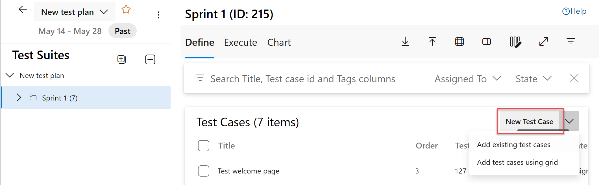

# CMMI process work item types and workflow in Azure Boards

[!INCLUDE [version-lt-eq-azure-devops](../../../includes/version-lt-eq-azure-devops.md)]

Teams use the work item types (WITs) that ship with the MSF for CMMI Process Improvement 2015 (CMMI) to plan and track software projects. Product owners define requirements to manage the backlog, and teams track progress on your board by updating requirement and task status.

Product owners map requirements to features to view portfolio-level progress. When teams work in iterations, they create tasks that automatically link to requirements.

Testers create and run test cases using Microsoft Test Manager or the web portal, and they file bugs to track code defects.

Teams also track change requests, risks, issues, and notes captured during review meetings. If you're new to the CMMI process, start with [Plan and track work with CMMI](cmmi-process.md#start-using).

## Define requirements

Create requirements from the quick add panel on the [product backlog page](../../backlogs/create-your-backlog.md). Later, open each requirement to supply details and estimate its size.

:::image type="content" source="../media/about-work-items/work-item-form-requirement.png" alt-text="Screenshot that shows the Requirement work item form.":::

::: moniker range="<=azure-devops"
Or, you can bulk add requirements using a CSV file (see [Import work items from CSV](../../queries/import-work-items-from-csv.md)). 
::: moniker-end

[!INCLUDE [temp](../../includes/deprecate-project.md)]

Requirements describe the product elements and functions teams need to build. Product owners typically define and stack-rank requirements on the product backlog page. The team then scopes the required effort and writes tasks and test cases to implement each item.

Use the following guidance and the section [fields used in common across work item types](#definitions-in-common) when you complete the form. For more information, see [Plan a project](cmmi/guidance-plan-a-project-cmmi.md).

:::row:::
 :::column span="1":::
 **Field**
 :::column-end:::
 :::column span="3":::
 **Usage**
 :::column-end:::
:::row-end:::
 ---
:::row:::
 :::column span="1":::
 
 [Description](../../queries/titles-ids-descriptions.md)
 
 :::column-end:::
 :::column span="3":::
 
 Provide enough detail for your team to estimate implementation effort. Focus on who the requirement serves, what users want to accomplish, and why. Avoid describing how to implement the requirement. Include enough context that your team can write tasks and test cases from the item.

 In HTML fields, you can add rich text and images.
 
 :::column-end:::
:::row-end:::
:::row:::
 :::column span="1":::
 
 [Impact Assessment](cmmi/guidance-requirements-field-reference-cmmi.md)

 :::column-end:::
 :::column span="3":::
 
 Capture the customer impact of not implementing the requirement in the Impact Assessment rich-text field. You might include Kano-model details that indicate whether the requirement is a surprise, required, or obvious feature.
 
 :::column-end:::
:::row-end:::
:::row:::
 :::column span="1":::
 [Requirement Type](cmmi/guidance-requirements-field-reference-cmmi.md) (Required) 
 :::column-end:::
 :::column span="3":::
 
 Specify one of these values for Requirement Type:
 
 - **Business Objective**
 - **Feature** (default)
 - **Functional**
 - **Interface**
 - **Operational**
 - **Quality of Service**
 - **Safety**
 - **Scenario**
 - **Security**
 
 :::column-end:::
:::row-end:::
:::row:::
 :::column span="1":::
 [Value area](../../queries/planning-ranking-priorities.md)

 :::column-end:::
 :::column span="3":::
 
 Indicate the area of customer value that the epic, feature, or requirement addresses. Common values include:

 - **Architectural**: Technical services to implement business features that deliver solution capabilities.
 - **Business**: Services that fulfill stakeholder needs and directly deliver customer value (Default).
 
 :::column-end:::
:::row-end:::
 :::row:::
 :::column span="1":::
 [Size](../../queries/query-numeric.md) 
 :::column-end:::
 :::column span="3":::
 
 Estimate the work required to complete a requirement using any numeric unit your team prefers. Teams use **Size** for velocity charts and forecasts. The [Cumulative Flow Diagram](../../boards/kanban-overview.md) also references values in this field. For more background, see the [Estimating](/previous-versions/visualstudio/visual-studio-2013/hh765979(v=vs.120)) white paper.
 
 :::column-end:::
:::row-end:::
:::row:::
 :::column span="1":::
 [Original Estimate](../../queries/query-numeric.md) 

 :::column-end:::
 :::column span="3":::
 
 Provide the original estimate for a task. Typically this value doesn't change once the task is assigned. You can specify work in hours or days; the field has no inherent time unit.
 
 :::column-end:::
:::row-end:::
:::row:::
 :::column span="1":::
 [Start Date/Finish Date](../../queries/query-by-date-or-current-iteration.md) 

 :::column-end:::
 :::column span="3":::
 
 Supply the target start and finish dates for the work.
 
 :::column-end:::
:::row-end:::
:::row:::
 :::column span="1":::
 [Priority](../../queries/planning-ranking-priorities.md) (Required)
 :::column-end:::
 :::column span="3":::
 
 Set a subjective rating that reflects business priority:
 
 - **1**: Product can't ship without the item.
 - **2**: (default) Product can't ship without the item, but it doesn't require immediate attention.
 - **3**: Implementation is optional based on resources, time, and risk.
 
 :::column-end:::
:::row-end:::
:::row:::
 :::column span="1":::
 [Triage](../../queries/planning-ranking-priorities.md) (Required) 
 :::column-end:::
 :::column span="3":::
 
 Use Triage when a work item is in the Proposed state. Choose one of: **Pending** (default), **More Info**, **Info Received**, **Triaged**.
 
 :::column-end:::
:::row-end:::
:::row:::
 :::column span="1":::
 [Blocked](../../queries/planning-ranking-priorities.md)
 :::column-end:::
 :::column span="3":::
 
 Indicate whether a team member can't make progress on the work item. If an issue blocks work, create a link to the issue. Choose **Yes** or **No**.
 
 :::column-end:::
:::row-end:::
:::row:::
 :::column span="1":::
 [Committed](../../queries/planning-ranking-priorities.md) (Required)  
 :::column-end:::
 :::column span="3":::
 
 Indicate whether the team committed to delivering the requirement. Choose **Yes** or **No** (default).
 
 :::column-end:::
:::row-end:::
:::row:::
 :::column span="1":::
 [Integrated In](../../queries/build-test-integration.md)  
 :::column-end:::
 :::column span="3":::
 
 Record the product build number that includes the requirement, change request, or bug fix.
 
 :::column-end:::
:::row-end:::
:::row:::
 :::column span="1":::
 [User Acceptance Test](cmmi/guidance-requirements-field-reference-cmmi.md) (Required) 
 :::column-end:::
 :::column span="3":::
 
 Set the status of the user acceptance test for a requirement from:
 
 - **Pass**
 - **Fail**
 - **Not Ready** (default)
 - **Ready**
 - **Skipped**
 - **Info Received**
 
 Use **Not Ready** when the requirement is Active, and **Ready** when it's Resolved.
 
 :::column-end:::
:::row-end:::
:::row:::
 :::column span="1":::
 [Subject Matter Experts](cmmi/guidance-requirements-field-reference-cmmi.md) 

 :::column-end:::
 :::column span="3":::
 
 List team members familiar with the customer area that the requirement represents.
 
 :::column-end:::
:::row-end:::
 ---
 
[!INCLUDE [temp](../../includes/discussion-tip-azure-devops.md)] 

## Track work progress

As work progresses, update the State field to reflect the current status. Optionally provide a reason; the state and reason fields appear in the work item form header.

### CMMI workflow states

The following diagrams show the main progression and regression states for the Requirement, Bug, and Task WITs.

> [!div class="mx-tdBreakAll"]  
> |Requirement  |Bug |Task |  
> |-------------|----------|---------| 
> | | | |

The typical workflow for a requirement follows these steps:
- The product owner creates a requirement in the **Proposed** state with the default reason, **New requirement**.
- The product owner moves the requirement to **Active** when work begins.
- The team sets the requirement to **Resolved** when development is finished and system tests pass.
- Finally, the team or product owner moves the requirement to **Closed** after acceptance criteria and validation tests confirm completion.

### Update work status with a board or Taskboards

Use the [board](../../boards/kanban-overview.md) or the [sprint taskboard](../../sprints/task-board.md) to update item states. Dragging an item to a different column updates both the State and Reason fields.

:::image type="content" source="../../boards/media/alm-cc-move-card.png" alt-text="Screenshot that shows tracking progress on the board in the web portal.":::

You can customize the board to add more [swim lanes](../../boards/expedite-work.md) or [columns](../../boards/add-columns.md).

## Map requirements to features

When you manage multiple products or user experiences, define features and map requirements to those features to view scope and progress across the portfolio.

Use portfolio backlogs to [drill down between backlog levels](../../plans/portfolio-management.md) and to roll up work in progress across teams. You can also view rollups after you [set up a hierarchy of teams](../../../organizations/settings/add-teams.md).

The feature work item contains fields similar to requirements plus other fields described in its reference.

## Define tasks

When your team delivers work in sprints, break requirements into tasks from the [sprint backlog page](../../sprints/assign-work-sprint.md) and estimate the effort.

Name the task and estimate the work.

When teams estimate work, they define tasks and estimate hours or days to complete them. Teams forecast capacity and refine tasks at the start of an iteration; each team member then performs a subset of tasks. Tasks can include development, testing, and other activities. For example, a developer creates tasks to implement a requirement while a tester creates tasks to write and run test cases. By linking tasks to requirements and bugs, teams clearly see implementation progress. For more information, see [Iteration activities](cmmi/guidance-iteration-activities.md).

:::row:::
 :::column span="1":::
 **Field**
 :::column-end:::
 :::column span="3":::
 **Usage**
 :::column-end:::
:::row-end:::

:::row:::
 :::column span="1":::
 [Task Type](cmmi/guidance-requirements-field-reference-cmmi.md) 

 :::column-end:::
 :::column span="3":::
 
 Select the task type from:
 
 - **Corrective Action**
 - **Mitigation Action**
 - **Planned**
 
 :::column-end:::
:::row-end:::
:::row:::
 :::column span="1":::
 [Discipline](../../queries/query-numeric.md)

 :::column-end:::
 :::column span="3":::
 
 Choose the discipline this task represents when you estimate sprint capacity by activity:
 
 - **Analysis**
 - **Development**
 - **Test**
 - **User Education**
 - **User Experience**
 
 This field also helps calculate capacity by discipline. It's assigned to `type="Activity"` in the ProcessConfiguration file. For more information, see [Implement development tasks](cmmi/guidance-implement-development-tasks.md).
 
 :::column-end:::
:::row-end:::
:::row:::
 :::column span="1":::
 [Original Estimate](../../queries/query-numeric.md) 

 :::column-end:::
 :::column span="3":::
 
 Enter the original estimate for the task.
 
 :::column-end:::
:::row-end:::
:::row:::
 :::column span="1":::
 [Remaining Work](../../queries/query-numeric.md)

 :::column-end:::
 :::column span="3":::
 
 Update Remaining Work as the team progresses. This value feeds capacity charts, the [sprint burndown chart](../../../report/dashboards/configure-sprint-burndown.md), and related reports. If you break a task into subtasks, track hours on the subtasks only.
 
 :::column-end:::
:::row-end:::
:::row:::
 :::column span="1":::
 [Completed Work](../../queries/query-numeric.md)

 :::column-end:::
 :::column span="3":::
 
 Record the work already spent implementing the task.
 
 :::column-end:::
:::row-end:::

## Track test progress

### Test requirements

From the web portal or Test Manager, create test cases that automatically link to a requirement or bug, or add a link from the :::image type="icon" source="../../backlogs/media/icon-links-tab-wi.png" border="false"::: (links tab).

The test case contains many fields, including fields that integrate with the build and test process. See [Query based on build and test integration fields](../../queries/build-test-integration.md) for details.

The :::image type="icon" source="../../backlogs/media/icon-links-tab-wi.png" border="false"::: (links tab) lists all requirements and bugs referenced by a test case. Linking helps teams track test progress and supports reports such as the [Requirements Overview Report](/previous-versions/azure/devops/report/sql-reports/requirements-overview-report-cmmi).

### Track code defects

Create bugs from the web portal, Visual Studio, or Test Manager (see [Manage bugs](../../backlogs/manage-bugs.md)).

## Track change requests, risks, issues, and notes captured in review meetings

In addition to requirements, features, tasks, and bugs, the CMMI process recommends these WITs:

- [Change request](cmmi/guidance-change-request-field-reference-cmmi.md) to manage proposed changes to work products under change control.  
- [Issue](cmmi/guidance-bugs-issues-risks-field-reference-cmmi.md) to track events or situations that might block work. [Issues differ from risks](cmmi/guidance-manage-issues-cmmi.md) because teams typically identify issues spontaneously during daily meetings. 
- [Risk](cmmi/guidance-bugs-issues-risks-field-reference-cmmi.md) to track probability and variance between actual and desired outcomes. When you [manage risks](cmmi/guidance-manage-risks.md), you minimize the variance between expected and actual outcomes.  
- [Review](cmmi/guidance-review-meeting-field-reference-cmmi.md) to document how a design or code review meets standards such as name correctness, code relevance, extensibility, complexity, and security.  

You can add an issue using the [New work item widget](../../../report/dashboards/widget-catalog.md#new-work-item-widget) on a [team dashboard](../../../report/dashboards/dashboards.md) or from the **New** menu on the Queries page.

Work items added from the widget automatically scope to your team's default area and iteration paths. To change the team context, see [Switch team context](../../../project/navigation/go-to-project-repo.md?toc=/azure/devops/boards/plans/toc.json).

[!INCLUDE [temp](../../includes/common-work-item-fields.md)]   

## Customize work item types

[!INCLUDE [temp](../../includes/customize-work-tracking.md)] 

## Related content

[!INCLUDE [temp](../../includes/create-team-project-links.md)]  

### Backlog list order

Use the [Stack Rank](../../queries/planning-ranking-priorities.md) field to track the relative ranking of requirements, features, or epics. The backlog page determines sequence based on where you add or move items on the page (see [Create your backlog](../../backlogs/create-your-backlog.md#move-items-priority-order)). As you drag items, a background process updates the Stack Rank field. This field doesn't appear on the work item form by default.
