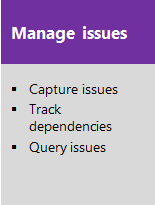
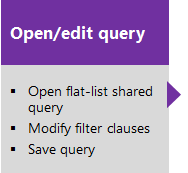
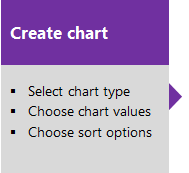

# CMMI process
 
<meta name="keywords" content="CMMI tools" />

[!INCLUDE [temp](../../_shared/version-vsts-tfs-all-versions.md)]

The CMMI process supports the following work item types (WITs) to plan and track work, tests, feedback, and code review. With different WITs you can track different types of work&mdash;such as requirements, change requests, tasks, bugs and more. These artifacts are created when you create a project using the CMMI process. They are based on the [Capability Maturity Model Integration (CMMI)](https://msdn.microsoft.com/library/ee461556.aspx) process.

  

In addition to the WITs, teams have access to a set of work item queries to track information, analyze progress, and make decisions.  

[!INCLUDE [temp](../../_shared/process-customize.md)] 

<a id="start-using" />

## Plan and track work with CMMI

<meta name="description" content="CMMI project management" />

Teams plan their project by capturing features and requirements. When teams work in sprints, they define tasks and link them to requirements. To gain insight into a rollup of requirements across teams, program managers link requirements to a feature. Blocking issues are tracked using issues. For details on using these WITs, see [CMMI process work item types and workflow](cmmi-process-workflow.md)

The essential flow for getting started is as shown. To get started using Scrum or Kanban tools, see [Get started with Agile tools to plan and track work](../../get-started/what-is-azure-boards.md).  

*Click one of the following images to go to the linked article.*

> [!NOTE]  
> A work item is a database record that contains the definition, assignment, priority, and state of work. Work item types define the template of fields, workflow, and form for each type. Work items can be linked to each other to support tracking dependencies, roll up of work, and reports.  

 

## List work items

You can use work item queries to list work items based on their type, such as change requests, bugs, tasks, and requirements.  

[!INCLUDE [temp](../../_shared/shared-queries.md)] 

::: moniker range="<= tfs-2018"

Or, use one of the shared queries that the CMMI process provides.

[Descriptions of predefined queries](#predefined-queries) are listed later in this article.  

::: moniker-end

[!INCLUDE [temp](../../_shared/quick-tips-shared-query.md)] 

## Monitor progress  

<meta name="description" content="CMMI monitor progress" />
All processes&mdash;Agile, Scrum, and CMMI&mdash;support [building status and trend charts and dashboards](../../../report/dashboards/overview.md). In addition, several charts are automatically built based on the Agile tools you use. These charts display within the web portal.  

## Create light-weight charts  
To get started, you can open a shared query and create a chart based on your tracking interests. Chart types include status&mdash;pie, bar, column, stacked bar, and pivot&mdash;and trend&mdash;stacked area, line, and area&mdash;charts.   

  

[!INCLUDE [temp](../../_shared/powerbi-reports-links.md)] 

::: moniker range="<= azure-devops-2019"

## SQL Server reports  

If your project collection and the project are configured with SQL Server Analysis Services and Reporting Services, you'll have access to a number of CMMI reports. For these reports to be useful, [teams must perform certain activities](../../../report/admin/review-team-activities-for-useful-reports.md), such as define build processes, link work items, and update status or remaining work.  

If you need to add reporting services or update reports to the latest versions, see [Add reports to a project](../../../report/admin/add-reports-to-a-team-project.md).  
::: moniker-end

::: moniker range=">= tfs-2013 <= tfs-2017"

## SharePoint portal dashboards

You can access Agile process dashboards displayed through SharePoint. These dashboards display project data, support investigation tasks, and help teams to perform common tasks quickly. These dashboards support the display of web access parts for listing work items and reports that were built in the Analysis Services cube.

To use [SharePoint dashboards](../../../report/sharepoint-dashboards/project-portal-dashboards.md) your project must have a [project portal configured and the project portal must point to a SharePoint site](../../../report/sharepoint-dashboards/configure-or-add-a-project-portal.md).
::: moniker-end

## Related notes  

[!INCLUDE [temp](../../_shared/create-team-project-links.md)]

### CMMI process versions  

As updates are made to the CMMI process template, the version number is updated. The following table provides a mapping of the versioning applied as updates are made to the Azure DevOps on-premises process templates. For Azure Boards, the latest version is always used. Starting with TFS 2012, the `version` element was added to the process template to support versioning of the templates. This element specifies a major and minor version. Prior to this change, the version was specified within the process template name. 

> [!div class="mx-tdCol2BreakAll"]
> |TFS version | CMMI name | Major version |
> |-------------|-------------------|--------------|
> | Azure DevOps Server 2019 | CMMI | 17 |
> | TFS 2018 | CMMI | 16 |
> | TFS 2017 | CMMI | 15 |
> | TFS 2015 | CMMI | 7 |
> | TFS 2013 | MSF for CMMI Process Improvement 2013 | 7 |
> | TFS 2012 | MSF for CMMI Process Improvement 6.0  | 6 |
> | TFS 2008 | MSF for CMMI Process Improvement - v4.*n* |   |

For a summary of updates made to process templates, see [Changes made to process templates](changes-to-process-templates.md).

### Additional CMMI guidance

The situations and working practices of development teams vary widely, and most companies will have their own well-established processes. For these reasons, the guidance given here does not attempt to prescribe a development process in full. Instead, we describe just the activities that are relevant to making best use of the CMMI process.

-  [Background to CMMI](cmmi/guidance-background-to-cmmi.md) : Provides an overview of CMMI and the six capability levels that are intrinsic to the model.

-  [Project management](cmmi/guidance-project-management.md) : Provides guidance to help you better understand how to manage, plan, and coordinate the development and maintenance of software products working with the CMMI model.

-  [Engineering](cmmi/guidance-engineering.md) : Addresses the value-added activities for discovering the information that is required to design and build software products

Using the CMMI template and guidance can help you achieve the aims of CMMI if you use it as part of a process improvement program. You should adapt this guidance to your own situation, which will depend on the type and history of the product that you are developing, the project's scale, the background of the team members, and accepted practices in your organization.

 This guidance was developed in partnership with David Anderson. For more information, see the following Web page: [David J Anderson & Associates](http://go.microsoft.com/fwlink/?LinkId=178527).  

<a id="predefined-queries" />

::: moniker range="<= tfs-2018"

### CMMI process predefined queries  

#### Query for items assigned to you

You can find the work items that are assigned to you by using one of the shared queries that the following table describes.

> [!div class="mx-tdCol2BreakAll"]
> | Shared query | Description |
> |---|---|
> | My Test Cases | Lists all test cases that are not closed and that are assigned to the team member who is running the query. Test cases are sorted by priority and then ID. |
> | My Work Items | Lists all work items, excluding shared steps, that are not closed and that are assigned to the team member who is running the query. Work items are sorted by rank, priority, type, and ID. |

#### Development and test queries

Team members can use the shared queries that are described in the following table to track the status of development and test tasks and active and resolved bugs.

> [!div class="mx-tdCol2BreakAll"]
> | Shared query | Description |
> |---|---|
> | Active Bugs | Lists all active bugs and sorts them by rank, priority, and severity. |
> | Development Tasks | Lists all tasks whose **Discipline** is set to **Development**. Tasks are sorted by ID. |
> | My Test Cases | Lists all test cases that are not closed and that are assigned to the team member who is running the query. Test cases are sorted by priority and then ID. |
> | Open Tasks | Lists all tasks that are not closed, sorted by rank, priority, and then ID. |
> | Open Test Cases | Lists all test cases that are not closed, sorted by priority and then ID. |
> | Resolved Bugs | Lists all resolved bugs that are defined for the project, sorted by rank, priority, and severity. |
> | Test Tasks | Lists all tasks whose **Discipline** is set to **Test**, sorted by ID. |

#### Backlog management queries

Product owners can use the shared queries that are described in the following table to track the status of requirements and untriaged work.

> [!div class="mx-tdCol2BreakAll"]
> | Shared query | Description |
> |---|---|
> | Customer Requirements | Lists all requirements, sorted by ID, that have been identified as Scenario or Quality of Service work items. |
> | Product Requirements | Lists all requirements, sorted by ID, that have been identified as Functional, Operational, Security, Safety, or a Feature. |
> | Open Requirements | Lists all requirements that are not closed, sorted by iteration ID, priority, and then work item ID. |
> | Open Requirements without Test Cases | Lists all requirements that are not closed and that do not have a Tested By link to a test case, sorted by work item ID. |
> | Open Work Items | Lists all work items except shared steps that are not closed. Work items are sorted by rank, priority, type, and then ID. |
> | Proposed Work Items | Lists all proposed work items, sorted by rank, priority, iteration, area, triage, and then work item ID. |
> | Reviews | Lists all reviews, sorted by work item ID. |
> | Untriaged Work Items | Lists all requirements, tasks, change requests, bugs, and issues that have not been closed or triaged. The Triage field for these work items is set to Pending, More Info, or Info Received.  Work items are sorted by state, triage, rank, priority, iteration, and area. |
> | Work Breakdown | Lists all requirements that are not closed and their child requirements or tasks. |
> | Work Items With Summary Values | Lists all tasks that have child tasks and that contain non-zero values for the Remaining Work or Completed Work fields. This query is designed to find tasks that report work effort that is already accounted for in their child tasks. For the hours to be counted only once, summary tasks should not be assigned any hours.  For more information, see [Address inaccuracies published for summary values](../../../report/sql-reports/address-inaccuracies-published-for-summary-values.md). |

#### Change management queries

Product owners can use the shared queries that are described in the following table to track change requests and dependencies that have been identified between change requests and requirements.

> [!div class="mx-tdCol2BreakAll"]
> | Shared query | Description |
> |---|---|
> | Change Requests | Lists all change requests, sorted by ID. |
> | Open Change Requests with Requirements | Lists change requests that are not closed and their linked requirements, sorted by ID. Only change requests that are linked to a requirement with a link type of Affects appears in the list. |
> | Requirements with Open Change Requests | Lists requirements and the change requests that are not closed and that depend on them, sorted by ID. Only requirements that are linked to a change request with a link type of Affected By are listed. |

#### Troubleshooting queries

Product owners can use the shared queries that are described in the following table to troubleshoot issues and risks to the product schedule.

> [!div class="mx-tdCol2BreakAll"]
> | Shared query | Lists |
> |---|---|
> | Blocked Work Items | Lists all work items where the **Blocked** field is set to **Yes**.  Only requirements, tasks, bugs, issues, and change requests can be blocked. |
> | Corrective Action Status | Lists all tasks whose **Task Type** is set to **Corrective Action**. |
> | Mitigation Actions | Lists all tasks whose **Task Type** is set to **Mitigation Action**. |
> | Open Issues | Lists all issues that are not closed.  The [Issues workbook](https://msdn.microsoft.com/library/ee461548) references this query. |
> | Risks | Lists all risks, sorted by ID. |

::: moniker-end

::: moniker range="<= tfs-2017"

### Workbooks

You can use Excel workbooks to review open issues and to rank and assign untriaged work items. Workbooks are only available when your project has been configured with a SharePoint portal. Each workbook references a shared query.  

-  The [Issues workbook](../../../report/sharepoint-dashboards/workbooks.md) uses the Open Issues shared query
-  The [Triage workbook](../../../report/sharepoint-dashboards/workbooks.md) uses the Untriaged Work Items shared query  

Because these queries support workbooks, if you change these queries, it will affect those workbooks that use them.
 
::: moniker-end

