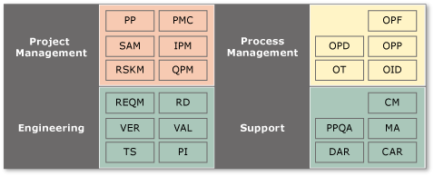

# Background to CMMI

[!INCLUDE [temp](../../../_shared/version-vsts-tfs-all-versions.md)]

The definitive guide to the Capability Maturity Model Integration (CMMI) for Development is published by the Software Engineering Institute as "CMMI: Guidelines for Process Integration and Product Improvement." This book specifically describes the CMMI for Development (CMMI-DEV) version 1.3, which is one of the models within the current CMMI product suite at the time of this writing. This model is extremely stable and should continue to be current well beyond 2010. You may also find "CMMI Distilled: A Practical Introduction to Integrated Process Improvement" to be a useful and accessible book about the topic.   
  
 The CMMI started life in 1987 as the Capability Maturity Model (CMM), a project at the Software Engineering Institute, which is a research center at Carnegie-Mellon University. This center was established and funded by the United States Department of Defense. The CMM for Software was first published in 1991 and is based on a checklist of critical success factors in software development projects during the late 70s and early 80s. The model is also informed by research at International Business Machines (IBM) Corporation and 20th-century quality assurance leaders Philip Crosby and W. Edwards Deming. Both the name, Capability Maturity Model, and the five levels in the Staged Representation (as discussed later in this article) were inspired by Crosby's Manufacturing Maturity Model. Applied mainly to defense programs, CMM has achieved considerable adoption and undergone several revisions and iterations. Its success led to the development of CMMs for a variety of subjects beyond software. The proliferation of new models was confusing, so the government funded a two-year project that involved more than 200 industry and academic experts to create a single, extensible framework that integrated systems engineering, software engineering, and product development. The result was CMMI.  
  
 The most important thing to understand about the CMMI-DEV is that it is a model. It is not a process or a prescription to be followed. It is a set of organizational behaviors that have proven to be of merit in software development and systems engineering. Why use such a model? What is its purpose? And how best should it be used? These are critical questions and are perhaps the most misunderstood issues with CMMI.  
  
##   Why use a model?  
 Without a model of how our organizations work, which functions they need, and how those functions interact, it is difficult to lead efforts to improve. A model gives us an understanding of discrete elements in our organizations and helps us formulate language and discussion of what needs to be improved and how such improvement might be achieved. A model offers the following benefits:  

- provides a common framework and language to help communicate  
- leverages years of experience  
- helps users keep the big picture in mind while focusing specifically on improvement  
- is often supported by trainers and consultants  
- can provide a standard to help solve disagreements  
  
##   What is the purpose of the CMMI model?  
 The textbook will tell you that the purpose of the model is to assess the maturity of an organization's processes and to provide guidance on improving processes that will lead to improved products. When talking directly with people from the Software Engineering Institute, you might hear them say that the CMMI is a model for risk management and indicates an organization's ability to manage risk. This indication is evidence for the likelihood that the organization can deliver on its promises or deliver products of high quality that are attractive to the market. Another way to think of this is that the model provides a good indicator of how an organization will perform under stress. A high maturity, high capability organization will take unexpected, stressful events in its stride, react, change, and proceed forward. A low maturity and lower capability organization will tend to panic under stress, blindly follow obviated procedures, or throw out all process altogether and retrench back to chaos.  
  
 The CMMI has not proven a good indicator of the economic performance of an organization. Although higher maturity organizations may manage risk better and be more predictable, there is evidence of risk aversion among higher maturity firms. This aversion can lead to a lack of innovation or evidence of greater bureaucracy that results in long lead times and a lack of competitiveness. Lower maturity firms tend to be more innovative and creative but chaotic and unpredictable. When results are achieved, they are often the result of heroic effort by individuals or managers.  
  
##   What's the best way to use the CMMI model?  
 The model was designed to be used as the basis for a process improvement initiative, with its use in assessment only a support system for measuring improvement. There has been mixed success with this usage. It is all too easy to mistake the model for a process definition and try to follow it, instead of a map that identifies gaps in existing processes that may need to be filled. The fundamental building block of CMMI is a process area that defines goals and several activities that are often used to meet them. One example of a process area is Process and Product Quality Assurance. Another is Configuration Management. It is important to understand that a process area is not a process. A single process may cross multiple process areas, and an individual process area may involve multiple processes.  
  
 The CMMI-DEV is really two models that share the same underlying elements. The first and most familiar is the Staged Representation, which presents the 22 process areas mapped into one of five organizational maturity levels. An appraisal of an organization would assess the level at which it was operating, and this level would be an indicator of its ability to manage risk and, therefore, deliver on its promises.  
  
   
  
 Levels 4 and 5 are often referred to as higher maturity levels. There is often a clear difference between higher maturity organizations, which exhibit the quantitative management and optimizing behaviors, and lower maturity organizations, which are merely managed or following defined processes. Higher maturity organizations exhibit lower variability in processes and often use leading indicators as part of a statistically defensible management method. As a result, higher maturity organizations tend to be both more predictable and faster at responding to new information, assuming that other bureaucracy does not get in the way. Where low maturity organizations tend to exhibit heroic effort, high maturity organizations may blindly follow processes when under stress and fail to recognize that a process change may be a more appropriate response.  
  
 The second, the Continuous Representation, models process capability within each of the 22 process areas individually, allowing the organization to tailor their improvement efforts to the processes that offer the highest business value. This representation is more in line with Crosby's original model. Appraisals against this model result in profiles of capability rather than a single number. Of course, because the organizational maturity level is the level that most managers and executives understand, there are ways of mapping the results of a continuous model assessment into the five stages.  
  
   
  
 Using the staged model as a basis for a process improvement program can be dangerous because implementers may forget that the CMMI is not a process or workflow model but provides goals for process and workflow to achieve. Meeting those goals will improve the maturity of the organization and the likelihood that events unfold as planned. Perhaps the biggest failure mode is making achieving a level the goal and then creating processes and infrastructure simply to pass the appraisal. The goal of any process improvement activity should be measurable improvement, not a number.  
  
 The Continuous model seems to have some greater success as a guide to process improvement, and some consulting firms choose only to offer guidance around the Continuous model. The most obvious difference is that a process improvement program that is designed around the Continuous model does not have artificial goals that are determined by maturity levels. The Continuous model also more naturally lends itself to applying process improvement in the areas where it is most likely to leverage an economic benefit for the organization. Therefore, those who follow the Continuous model are more likely to receive positive feedback from an initiative that is based on the CMMI model. Moreover, positive feedback is more likely to lead to the development of a virtuous cycle of improvements.  
  
 
##  Elements of the CMMI model  
 The CMMI model is divided into 22 process areas, which are listed in the following table:  
  
|Acronym|Process Area|  
|-------------|------------------|  
|CAR|Causal Analysis & Resolution|  
|CM|Configuration Management|  
|DAR|Decision Analysis & Resolution|  
|IPM|Integrated Project Management|  
|MA|Measurement & Analysis|  
|OID|Organizational Innovation & Deployment|  
|OPD|Organizational Process Definition|  
|OPF|Organizational Process Focus|  
|OPP|Organizational Process Performance|  
|OT|Organizational Training|  
|PI|Product Integration|  
|PMC|Project Monitoring & Control|  
|PP|Project Planning|  
|PPQA|Process & Product Quality Assurance|  
|QPM|Quantitative Project Management|  
|RD|Requirements Definition|  
|REQM|Requirements Management|  
|RSKM|Risk Management|  
|SAM|Supplier Agreement Management|  
|TS|Technical Solution|  
|VER|Verification|  
|VAL|Validation|  
  
 In the Staged Representation, the process areas are mapped against each stage, as shown in the following illustration.  
  
   
  
 In the Continuous Representation, the process areas are mapped into functional groupings, as shown in the following illustration.  
  
   
  
 Each process area is made up of required, expected, and informative components. Only the required components are actually required to satisfy an appraisal against the model. The required components are the specific and generic goals for each process area. The expected components are the specific and generic practices for each specific or generic goal. Note that, because an expected component is merely expected and not required, this indicates that a specific or generic practice can be replaced by an equivalent practice. The expected practices are there to guide implementers and appraisers. If an alternative practice is chosen, it will be up to the implementer to advise an appraiser and justify why an alternative practice is appropriate. Informative components provide details that help implementers get started with a process improvement initiative that is guided by the CMMI model. Informative components include sub-practices of generic and specific practices and typical work products.  
  
 It is very important that we understand that only generic and specific goals are required. Everything else is provided as a guide. The examples of the expected and informative components that are given in the CMMI literature are very often pulled from large space and defense-systems integration projects. These projects are run by companies that sponsor and support the Software Engineering Institute at Carnegie-Mellon University. These projects may not reflect the type of projects that are undertaken in your organization, nor may they reflect more recent trends in the industry, such as the emergence of agile software development methods.  

## Related articles
 [CMMI process](../cmmi-process.md)