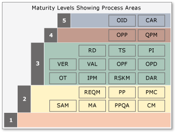

# Background to Capability Maturity Model Integration (CMMI)

[!INCLUDE [version-lt-eq-azure-devops](../../../../includes/version-lt-eq-azure-devops.md)]

The definitive guide to the Capability Maturity Model Integration (CMMI) for Development is published by the Software Engineering Institute as "CMMI: Guidelines for Process Integration and Product Improvement." This book specifically describes the CMMI for Development (CMMI-DEV) version 1.3, which is one of the models within the CMMI product suite. You may also find "CMMI Distilled: A Practical Introduction to Integrated Process Improvement" to be a useful and accessible book about CMMI. 

> [!NOTE]
> The guidance provided here is based on version 1.3 for CMMI and supports the CMMI process available with Azure DevOps. No plans exist at this time to update this content to support later versions. 

## Historical notes
  
The CMMI began in 1987 as the Capability Maturity Model (CMM), a project at the Software Engineering Institute (SEI). SEI is a research center at Carnegie-Mellon University, which was established and funded by the United States Department of Defense. First published in 1991, the CMM for Software began as a checklist of critical success factors. The model also built upon research at International Business Machines (IBM) Corporation and 20th-century quality assurance leaders such as Philip Crosby and W. Edwards Deming. Both the name, *Capability Maturity Model*, and the [Staged Representation](#staged-representation) five levels were inspired by Crosby's Manufacturing Maturity Model. Applied mainly to defense programs, CMM achieved considerable adoption and underwent several revisions. Its success led to the development of CMMs for a variety of subjects beyond software. The proliferation of new models was confusing. In response, the government funded a two-year project to create a single, extensible framework that integrated systems engineering, software engineering, and product development. This effort involved more than 200 industry and academic experts. The result was CMMI.  
  
CMMI-DEV is a model. It isn't a process, nor a prescription to be followed. Instead, CMMI-DEV provides a set of organizational behaviors that have proven to be of use in software development and systems engineering. Why use such a model? What is its purpose? And how best should it be used? These critical questions are perhaps the most misunderstood issues with CMMI.  

 
  
## Why use a model?

Improvement efforts require a model of how your organization works, which functions they need, and how those functions interact. A model gives you an understanding of organizational elements and assists in discussions of how and what can and should be improved. 

A model offers the following benefits:  

- Provides a common framework and language to help communicate  
- Leverages years of experience  
- Helps users consider the large picture while focusing on improvement  
- Is often supported by trainers and consultants  
- Can help solve disagreements by providing agreed-upon standards
  
 

## What is the purpose of the CMMI model? 

The purpose of the CMMI model is to assess the maturity of an organization's processes and to provide guidance on improving processes, with a goal of improved products. Also, CMMI is a model for risk management and provide a way to measure an organization's ability to manage risk. The  ability to manage risk factors factors into an organizations ability to deliver high-quality products. Another perspective on managing risk is how well an organization will perform under stress. A high maturity, high capability organization can easily respond to unexpected, stressful events. A low maturity and lower capability organization tends to panic under stress, blindly follow obviated procedures, or throw out all process altogether and retrench back to chaos.  
  
The CMMI, however, isn't a proven indicator of the economic performance of an organization. Although higher maturity organizations may manage risk better and be more predictable, evidence exists that higher maturity firms tend to be risk-averse. Risk aversion can lead to a lack of innovation or evidence of greater bureaucracy that results in long lead times and a lack of competitiveness. Lower maturity firms tend to be more innovative and creative but chaotic and unpredictable. When results are achieved, they are often the result of heroic effort by individuals or managers.  
  
 

## What's the best way to use the CMMI model?

The model was designed to be used as the basis for a process improvement initiative, with its use in assessment only a support system for measuring improvement. There has been mixed success with this usage. It is all too easy to mistake the model for a process definition and try to follow it, instead of a map that identifies gaps in existing processes that may need to be filled. The fundamental building block of CMMI is a process area that defines goals and several activities that are often used to meet them. One example of a process area is Process and Product Quality Assurance. Another is Configuration Management. It is important to understand that a process area is not a process. A single process may cross multiple process areas, and an individual process area may involve multiple processes.  
  
The CMMI-DEV is really two models that share the same underlying elements. The first and most familiar is the Staged Representation, which presents the 22 process areas mapped into one of five organizational maturity levels. An appraisal of an organization would assess the level at which it was operating, and this level would be an indicator of its ability to manage risk and, as, deliver on its promises.  
  
  
  
Levels 4 and 5 are often referred to as higher maturity levels. There is often a clear difference between higher maturity organizations, which demonstrate the quantitative management and optimizing behaviors, and lower maturity organizations, which are merely managed or following defined processes. Higher maturity organizations show lower variability in processes and often use leading indicators as part of a statistically defensible management method. As a result, higher maturity organizations tend to be both more predictable and faster at responding to new information, assuming that other bureaucracy doesn't get in the way. Where low maturity organizations tend to demonstrate heroic effort, high maturity organizations may blindly follow processes when under stress and fail to recognize that a process change may be a more appropriate response.  
  
The Continuous Representation models process capability within each of the 22 process areas individually, which allows the organization to tailor their improvement efforts to the processes that offer the highest business value. This representation is more in line with Crosby's original model. Appraisals against this model result in profiles of capability rather than a single number. Because the organizational maturity level is the level that most managers and executives understand, there are ways of mapping the results of a continuous model assessment into the five stages.  
  
  
  
Using the staged model as a basis for a process improvement program can be dangerous when implementers forget that the CMMI isn't a process nor a workflow model. Instead, the CMMI is designed to provide goals for process and workflow to achieve. Meeting such goals will improve the maturity of the organization and the likelihood that events unfold as planned. Perhaps the biggest failure mode is making achieving a level the goal and then creating processes and infrastructure simply to pass the appraisal. The goal of any process improvement activity should be measurable improvement, not a number.  
  
The Continuous model has enjoyed success as a guide to process improvement. Some consulting firms choose only to offer guidance around the Continuous model. The most obvious difference is that a process improvement program that is designed around the Continuous model doesn't have artificial goals that are determined by maturity levels. The Continuous model also lends itself to applying process improvement in areas where it is most likely to leverage an economic benefit for the organization. Therefore, those who follow the Continuous model are more likely to receive positive feedback from an initiative that is based on the CMMI model. Moreover, positive feedback is more likely to lead to the development of a virtuous cycle of improvements.  
  
 

## Elements of the CMMI model  

The following table lists the 22 process areas that comprise the CMMI model (version 1.3):  
  
|Acronym|Process Area|  
|-------------|------------------|  
|CAR|Causal Analysis & Resolution|  
|CM|Configuration Management|  
|DAR|Decision Analysis & Resolution|  
|IPM|Integrated Project Management|  
|MA|Measurement & Analysis|  
|OID|Organizational Innovation & Deployment|  
|OPD|Organizational Process Definition|  
|OPF|Organizational Process Focus|  
|OPP|Organizational Process Performance|  
|OT|Organizational Training|  
|PI|Product Integration|  
|PMC|Project Monitoring & Control|  
|PP|Project Planning|  
|PPQA|Process & Product Quality Assurance|  
|QPM|Quantitative Project Management|  
|RD|Requirements Definition|  
|REQM|Requirements Management|  
|RSKM|Risk Management|  
|SAM|Supplier Agreement Management|  
|TS|Technical Solution|  
|VER|Verification|  
|VAL|Validation|  

  
In the Staged Representation, the process areas are mapped against each stage, as shown in the following illustration.  
  
  
  
In the Continuous Representation, the process areas are mapped into functional groupings, as shown in the following illustration.  
  
  
  
Each process area is made up of required, expected, and informative components. Only the required components are actually required to satisfy an appraisal against the model. The required components are the specific and generic goals for each process area. The expected components are the specific and generic practices for each specific or generic goal. Note that, because an expected component is merely expected and not required, this indicates that a specific or generic practice can be replaced by an equivalent practice. The expected practices are there to guide implementers and appraisers. If an alternative practice is chosen, it will be up to the implementer to advise an appraiser and justify why an alternative practice is appropriate. Informative components provide details that help implementers get started with a process improvement initiative that is guided by the CMMI model. Informative components include subpractices of generic and specific practices and typical work products.  
  
Only generic and specific goals are required. Everything else is provided as a guide. For  examples of expected and informative components, the CMMI literature pulled data from large space and defense-systems projects. These projects might not reflect the type of projects that are undertaken in your organization, nor may they reflect more recent trends in the industry, such as the emergence of [Agile software development](/devops/plan/what-is-agile-development) methods.  

## Related articles

- [CMMI process](../cmmi-process.md)
- [Software Engineering Institute Releases Version 1.3 of CMMI Product Suite](https://www.sei.cmu.edu/news-events/news/article.cfm?assetid=509086)
- [CMMI for Development: Guidelines for Process Integration and Product Improvement, Third Edition](https://resources.sei.cmu.edu/library/asset-view.cfm?assetid=31054)
- [CMMI for Development: Guidelines for Process Integration and Product Improvement (SEI Series in Software Engineering)](https://www.amazon.com/CMMI-Development-Integration-Improvement-Engineering/dp/0321711505)
- [What is Agile Development?](/devops/plan/what-is-agile-development)
