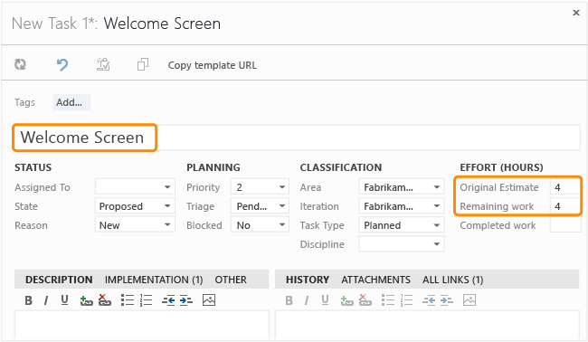

# Implement development tasks

[!INCLUDE [temp](../../../_shared/version-vsts-tfs-all-versions.md)]

A development task is a small piece of development work that stems from a requirement. Implementing a development task involves adding the appropriate new functionality to your software. After you complete a development task, it should be unit tested, reviewed, code analyzed, and integrated into the existing code base.  
   
  
##   Estimate  
 Estimating the cost of development tasks helps control the scope of features and schedule development work. Cost estimates for all development tasks should be completed and any issues should be resolved before the iteration planning meeting. If the total cost of the development tasks is more than can be done in an iteration, a task must be deferred or reassigned. After a development task is chosen, it is the responsibility of the developer to cost the task.  
  
 Create a task work item for each development task that is chosen, and link it to the requirement from which it was created. This is accomplished from the Implementation tab on either the task or the requirement work item. Base your estimates on the time that was required to complete similar tasks, and be sure to factor in the cost of writing unit tests. For each task, enter the estimate into the Original Estimate field of the task work item.  
  
 The form for task work items stores data in the fields and tabs that the following illustrations show:  
  
   
  
 After tasks have been created and estimated, use the Work Breakdown query to view the breakdown of all your requirements and tasks. For more information, see [CMMi process, List work items](../cmmi-process.md).  
  
##   Design Documents  
 Your design documents should include enough information to describe to a developer how to write code to implement the requirement in the product.  
  
 Design documents can be a collection of specifications, requirement work items, and other documents, depending on your team process.  
  
 Consider using design patterns, object-oriented design, structural models, modeling languages, entity relationship models, and other techniques in the guidelines for the design that is determined for your team. It is also a good idea to document the rationale for key decisions that were made. For example, if there is a significant effect on cost, schedule, or technical performance, document the reason for the decisions behind these effects, and include that information in your design.  
  
 After you create the necessary design documents, store them where your team members can share them. For more information, see [Manage documents and document libraries](../../../../report/sharepoint-dashboards/manage-documents-and-document-libraries.md).  
  
##   Design Review  
 A design review is used to ensure that the new or revised design is technically accurate, complete, testable, and of high quality and that it implements the requirement correctly. Design reviews are a key method of guaranteeing quality early by identifying problems before they appear in the code. Design reviews also provide additional insight about the design from other developers.  
  
 The developer who is responsible for creating the design should organize the design review by identifying reviewers, scheduling the review, and distributing the design to all the reviewers.  
  
 Any stakeholders who are involved or affected by the design should participate in the review. Typically this might include the project manager, the lead developer, and the tester for the design area. All developers who are on the same team as the developer whose code is being reviewed should also participate in the review.  
  
 Schedule the review meeting, and distribute the design documents early enough to give each reviewer sufficient time to read them. Plan the length of the review meeting to correspond to how many technical details must be reviewed.  
  
### Verify Quality  
 Ensure that the design is testable. Does it build code that cannot be verified or validated in a reasonable manner? If so, you cannot ensure the quality of the code, and the design must be reworked. Examine the design documents for problems that will lead to code errors. Look for incorrect interface descriptions, design mistakes, or naming confusion. Compare the design documents against existing criteria, such as operator interface standards, safety standards, production constraints, design tolerances, or parts standards. Create bug work items that describe any flaws that are found in the design documents, and assign them to the responsible developer.  
  
### Create a Review Work Item for the Design  
 A review work item is created to document the results of the design review. The review team must decide the next steps for the design, which depend on the magnitude of the changes necessary. If no changes are necessary, set the State of the work item to Closed, set the Reason to Accepted (as is), and note that coding can start on the design. If minor changes are necessary, set the State of the work item to Resolved, and set the Reason to Accepted with Minor Changes. This indicates that coding can start after the minor changes have been implemented in the design. If major changes are necessary, set the State of the work item to Resolved, and set the Reason to Accepted with Major Changes. The design must be reworked and another design review must be performed before coding can start on the design.  
  
##   Unit Tests  
 Unit tests verify the correct implementation of a unit of code. Writing and performing unit tests identifies bugs before testing starts and, therefore, helps reduce the cost of quality control. Developers must write unit tests for all code that will be written as part of implementing a development task or fixing a bug. For more information, see [Unit Test Your Code](https://msdn.microsoft.com/library/dd264975).  
  
##   Code Analysis  
 Code analysis checks code against a set of rules that help enforce development guidelines. The goal of code analysis is to have no code analysis violations or warnings. Code analysis can inspect your code for more than 200 potential issues in naming conventions, library design, localization, security, and performance.  
  
 If you start to run code analysis early in your development cycle, you can minimize violations and warnings on an ongoing basis.  
  
 However, if you run code analysis on existing code that has not been checked before, you may have many rule violations. If this is the case, you might want to create a baseline set of critical rules that the code must pass and then expand the rule set as the more critical issues are resolved. That way, a team can move forward on new functionality as it improves its existing code base.  
  
 For more information, see [Analyzing Application Quality by Using Code Analysis Tools](https://msdn.microsoft.com/library/dd264897) and [Enhancing Code Quality with Team Project Check-in Policies](https://msdn.microsoft.com/library/dd264876).  
  
##   Code Review Process  
 The lead developer should organize the code review by identifying the reviewers, scheduling the code review, and sending the code for review to all reviewers. To prepare for the code review, take the following steps:  
  
1.  Create a review work item to track the decisions that are made in the review. If no changes are necessary, set the State of the work item to Closed, set the Reason to Accepted (as is), and note that coding can start on the design. If minor changes are necessary, set the State of the work item to Resolved, and set the Reason to Accepted with Minor Changes, which indicates that coding can start after the minor changes have been implemented. If major changes are necessary, set the State of the work item to Resolved, and set the Reason to Accepted with Major Changes. The design must be reworked and another design review must be performed before coding can start on the design.  
  
2.  Determine who will participate in the code review. Typically, at least the lead developer and the architect who is responsible for the code area should participate in the review.  
  
3.  Schedule a review meeting with the reviewers, and allow sufficient time for each reviewer to read and understand the code before the meeting. Plan the length of the review meeting to correspond to how much code must be reviewed.  
  
### Code Review  
 A code review is used to ensure that new or changed code meets an established quality bar before it is integrated into the daily build. Quality considerations are coding standards, conformance to architecture and design, performance, readability, and security. Code reviews also provide additional insight from other developers about how code should be written.  
  
|||  
|-|-|  
|Verify Code Relevance|The code that is being reviewed is relevant to the task for which the code is written. No code changes should be allowed that do not address the functionality that is implemented or corrected.|  
|Verify Extensibility|The code is written so that it can be extended, if that is the intent, or reused in other areas of the system.   String constants that are used in the code are correctly put in resources that can be internationalized.|  
|Verify Minimal Code Complexity|Repeated code can be simplified into common functions.   Similar functionality is put in a common procedure or function.|  
|Verify Algorithmic Complexity|The number of execution paths in the code that is reviewed is minimized.|  
|Verify Code Security|The code is checked for the protection of assets, privilege levels, and the use of data at entry points.|  
  
##   Refactor Code  
 Code is refactored after a code review has determined that changes must be made to address code quality, performance, or architecture.  
  
 Read the code review work item notes to determine how you will refactor the code.  
  
 Apply the refactoring incrementally, one change at a time. Change the code and all references to the modified area as necessary.  
  
 Perform unit tests so that the area remains semantically equivalent after the refactoring. Fix any unit tests that do not work. Perform code analysis, and fix any warnings. Perform unit tests again if code changes are made as a result of code analysis.  
  
##   Integrate Changes  
 The final step is to integrate the changes by checking them in to version control. Before code is checked in, any tests that are required by your process should be performed. For more information about how to check code for problems before it is checked in, see [Enhancing Code Quality with Team Project Check-in Policies](https://msdn.microsoft.com/library/dd264876).  
  
 If the work item that is associated with the changes is a scenario or a quality of service requirement of which you are not the owner, notify the owner that the changes are complete. Set the task work item to Resolved, and assign it to one of the testers who created the test cases for the work item.  
  
 If the work item that is associated with the changes is a bug, set the bug work item to Resolved, and assign it to the original person who created it.