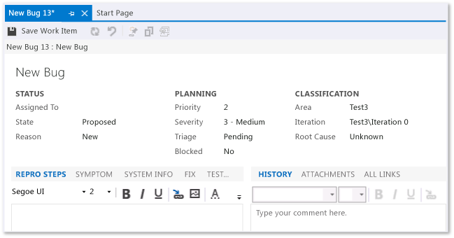

# Track bugs

[!INCLUDE [temp](../../../_shared/version-vsts-tfs-all-versions.md)]

As you run tests to verify your requirements, you are bound to find bugs. Use the bug work item to describe and track progress for each bug that you find.  
  
   
  
 For more information about how to create bug work items, see [Run manual tests](../../../../test/run-manual-tests.md). As bugs are found, follow the process in this article to prioritize them, to make sure that they get fixed, and to make sure that you have a record of the work and the decisions that were involved.  
  
##   Triage bugs  
 Triage meetings should be held at set intervals after the development work and testing have started on the project. How often you hold the meetings and how long they should be depends on your situation.  
  
 Typically, bug triage meetings are run by a project manager and attended by team leads and perhaps business analysts and stakeholders who can speak about specific project risks. The project manager can use the Active Bugs query for new and reopened bugs to generate a list of bugs to be triaged.  
  
 Before triage starts, devise a set of criteria to determine which bugs should be fixed and in what priority. The criteria will typically identify the severity of bugs, bugs that are associated with features of significant value (or significant opportunity cost of delay), or other project risks.  
  
 The triage criteria should be stored in the Documents folder of your project. Over time, the document will be updated. It is assumed that your project has version control turned on and that the specific criteria that are being used at any given time on the project can be retrieved for audit and appraisal evidence purposes.  
  
 Early in the project, you will likely decide to fix most of the bugs that you triage. However, as the project proceeds, the triage criteria (or bar) may be raised to reduce the number of bugs that are fixed.  
  
 Raising the triage criteria bar and allowing reported bugs to remain unfixed is a trade-off. It is a trade-off that says that fixing the bug is less important than meeting the project scope, budget, and schedule.  
  
 Use your criteria to determine which bugs to fix and how to set their State, Priority, Severity, and other fields. By default, the template provides four priorities: 1 for "must fix" through 4 for "unimportant." If you change the definitions in the process template, you should update the guidance, the help text, and any criteria documents accordingly.  
  
##   Fix bugs  
 After a bug has passed triage and has been prioritized, it should be assigned to a developer for additional investigation.  
  
 The bug work item has a tab for repro steps, which should provide what you need to reproduce the bug. However, you may also be able to use IntelliTrace help you reproduce difficult bugs. For more information about IntelliTrace, see [Tracking test results](../../../../test/track-test-status.md).  
  
 After the developer decides on a course of action, they should note their decisions in the bug work item.  
  
### Decide on the fix  
 Working with other team members, the developer may recommend a fix that has implications for other sections of the code and that may require significant regression testing. Any conversations that relate to assessing the risk of such a fix should be recorded in the bug work item history because it documents useful decision analysis and risk management evidence for an audit or Standard CMMI Appraisal Method for Process Improvement (SCAMPI) appraisal. For more information about CMMI see [Background to CMMI](guidance-background-to-cmmi.md).  
  
### Update and run unit tests for fixing the bug  
 Unit tests verify the correct implementation of a unit of code. Writing and performing unit tests identifies bugs before testing starts and, therefore, helps reduce the cost of quality control. Developers must write unit tests for all code that will be written as part of implementing a development task or implementing a fix for the bug. For more information, see [Unit Test Your Code](https://msdn.microsoft.com/library/dd264975).  
  
 You may prefer to write the unit test before making any code fixes in a test-first development strategy. This type of strategy is preferred by agile software developers. The CMMI does not require that unit tests are written in a particular sequence, only that effective verification of functionality is achieved.  
  
 Evidence that unit tests were both written and run is required for a CMMI appraisal. Be sure to link the tests to the task work items for the code fix, and link those tasks to the bug work item. This provides the traceability of evidence that a SCAMPI lead appraiser will look for.  
  
### Review and refactor the code for fixing the bug  
 A code review is used to ensure that new or changed code meets an established quality bar before the code is integrated into the daily build. Quality considerations are coding standards, conformance to architecture and design, performance, readability, and security. Code reviews also provide additional insight from other developers about how code should be written. For more information about how to review and refactor code, see [Implement development tasks](guidance-implement-development-tasks.md).  
  
##   Close bugs  
 After a bug is fixed, it should be assigned to a tester to verify that the problem is solved before the bug work item is closed.  
  
### Verifying a fix  
 To verify a fix, the tester should attempt to reproduce bug, look for additional unexpected behavior, and, if necessary, reactivate the bug.  
  
 When verifying a bug resolution, you may find that the bug was not completely fixed or you may disagree with the resolution. In this case, you discuss the bug with the person who resolved it, come to an agreement, and possibly reactivate the bug. If you do reactivate a bug, make sure that you include the reasons for reactivating the bug in the bug description so that information is preserved.  
  
### Closing the bug work item  
 A bug is closed for many reasons. In a simple case, the bug was verified as fixed and can also be closed. However, a bug can be deferred to the next version of the product, proven not to be reproducible, or confirmed as a duplicate. Each of these reasons must be documented, and the bug must be closed correctly to ensure that there is no confusion about why it is closed.
