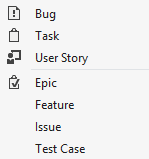

# Upload or download a process template

[!INCLUDE [temp](../../../_shared/version-tfs-all-versions.md)]

When you create a project, the Project Creation Wizard (PCW) reads the process template to configure initial settings and upload artifacts and template files. Each process template defines the building blocks of the work item tracking system as well as other sub-systems. For the Hosted XML and On-premises XML process models, you can customize a process template to either update a project or create a project. For the Inheritance process model, you customize work tracking through a process. To learn more, see [Customize your work tracking experience](../../../reference/customize-work.md).  

::: moniker range="tfs-2018 || azure-devops-2019"
> [!IMPORTANT]  
> When you create a project from the web portal, several process template files are ignored. Specifically, the files that would create a SharePoint project portal or Report Manager site aren't supported. SharePoint integration has been deprecated as described in [Discontinue SharePoint integration](../../../report/sharepoint-dashboards/deprecation/discontinue-pre-tfs-2017-sharepoint-integration.md).
>
> If you want to use SQL Server Reporting with an on-premises TFS 2018 or Azure DevOps Server 2019, you'll have to add support after you create your project. For details, see [Process template and plug-in files, Client support for project creation](../../../reference/process-templates/overview-process-template-files.md#client-support).  

::: moniker-end

You can upload, download, and delete process templates for a project collection. Also, you can mark a template to appear as the default when you add projects. 

[!INCLUDE [temp](../../_shared/get-latest-process-templates.md)]

## To manage a process template 

1.	Open the same version of Visual Studio, Visual Studio Community, or Team Explorer as the on-premises TFS that you connect to. For example, if you connect to a TFS 2017 instance, you must connect from Visual Studio 2017 or Visual Studio Community 2017. 

	You can always download a free version of Visual Studio Community from the [Visual Studio download site](https://visualstudio.microsoft.com/downloads/#visual-studio-community-2015-with-update-3-free).  

	If you aren't a member of the Project Collection Administrators group, [get added as one](../../../organizations/security/set-project-collection-level-permissions.md).  

2.	From, Visual Studio, open the Process Template Manager from the **Team, Team Project Collection Settings** menu.

	

	You'll see a list of each process template that has been uploaded to the project collection. 

	
	
	> [!TIP]   
	> For a comparison of the default process templates&mdash;Agile, CMMI, and Scrum&mdash;see [Choose a process](choose-process.md).  

	The <b>Upload</b>, <b>Download</b>, <b>Make Default</b>, and <b>Delete</b> buttons are disabled when you don't have the necessary permissions to manage process templates. 
 
3.	Select the process template that you want to work with and then choose from the following actions.  

	<table>
	<tbody valign="top">
	<tr>
	<td width="15%">
	**Upload**
	</td>
	<td>To upload a process template. 
	
In the **Upload Process Template** dialog box, choose the folder that contains the root file, ProcessTemplate.xml, for the process template that you want to upload. See also [Process template restrictions and validation checks](#restrictions).

	</td>
	</tr>
	
	<tr>
	<td>
	**Download**
	</td>
	<td>To download the process template to a local computer. 
	
In the **Download Process Template** dialog box, select a folder where the process template will be downloaded.

	
If you're downloading a process template to use to [configure new features](../../../reference/configure-features-after-upgrade.md), [manually add new features](../../../reference/add-features-manually.md) or [update a custom process template to enable new features](../../../reference/update-customized-process-template.md)--choose the process that corresponds to the one you used previously to create your project. For example, if you're updating a project based on the Scrum process template, then select **Scrum**. Note that all version numbers have been removed from the process templates. If you don't see Agile, CMMI, or Scrum, then you need to [update TFS](https://visualstudio.microsoft.com/downloads/download-visual-studio-vs). 

	
You can determine which process template to select based on the [work item types defined for your existing project](#wit_correlation).

	</td>
	</tr>
	
	<tr>
	<td>
	**Make Default**
	</td>
	<td>
	To cause the selected process template to appear as the default selection in the **New Team Project Wizard**.
	</td>
	</tr>
	
	<tr>
	<td>
	**Delete**
	</td>
	<td>
	To permanently remove the selected process template from the collection.
	</td>
	</tr>
	
	</tbody>
	</table>

##Process template correlation with an existing project

To determine the type of process template that was used to create your project, review the work item types that appear in the <b>New Work Item</b> menu for Team Explorer and then compare them with the work item types in the following chart. If your work item types differ from those shown listed, then a custom process template might have been used.

<table>
<tbody valign="top">
<tr>
<th>Scrum</th>
<th>Agile</th>
<th>CMMI</th>
</tr>
<tr>
<td>
 
</td>
<td>
 
</td>
<td>
 
</td>
</tr>
</tbody>
</table>

##Process template restrictions and validation checks 
Uploading a process template requires that it pass the following validation checks:  

- Process template names must be unique and 256 Unicode characters or less. Same-named templates will overwrite existing templates. 
Also, names cannot contain the following characters: . , ; ' ` : / \ * | ? " &amp; % $ ! + = ( ) [ ] { } &lt; &gt; 
For additional restrictions, see [Naming restrictions](../../../organizations/settings/naming-restrictions.md). 
- Process template folders can't contain any .exe files. If they do, the process template may upload successfully, however project creation will fail.
- Process template total size should be 2 GB or less, or project creation will fail.
- The upload process performs a partial verification check to make sure that the XML of each process template XML file is valid. If you receive any errors when you try to upload the process template, review the XML to determine the cause of the error. Note that duplicate tags in an XML file can cause errors. If there is no error in the XML, check to make sure all the appropriate files are included in your process template in the correct folder locations.

> [!IMPORTANT]  
>The schema definition for process templates uses a mix of camel-case and all capitalized elements. If you encounter errors when validating your type definition files, check the case structure of your elements. Also, the case structure of opening and closing tags must match according to the rules for XML syntax. 
>
>See [Process template plug-ins: Index to XML element definitions](../../../reference/process-templates/process-template-plug-ins-xml-elements-index.md).

## Related articles  

Periodically, updates are made to the process templates to support new features. For details, see [Changes made to process templates](changes-to-process-templates.md).  

- [Create a project](../../../organizations/projects/create-project.md)   
- [Customize a process template](../../../reference/process-templates/customize-process.md)   
- [Process template and plug-in files](../../../reference/process-templates/overview-process-template-files.md)  
- [Import and update a process (Hosted XML)](../../../organizations/settings/work/import-process/import-process.md)     
- [Customize your work tracking experience](../../../reference/customize-work.md)  

### Update a process template to enable new features 
When you upgrade your on-premises TFS to a later version, new features may become available. [To gain access to these new features](../../../reference/configure-features-after-upgrade.md), you may need to [update a customized process template](../../../reference/update-customized-process-template.md). 

### Add another project 
You can add a project from the web portal or Visual Studio/Team Explorer. Some process template files are ignored when you create a project from the web portal. For details, see [Process template and plug-in files, Client support for project creation](../../../reference/process-templates/overview-process-template-files.md#client-support). 

