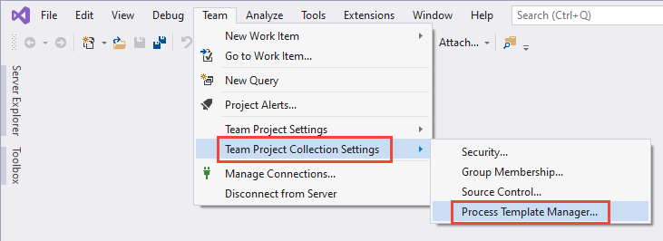
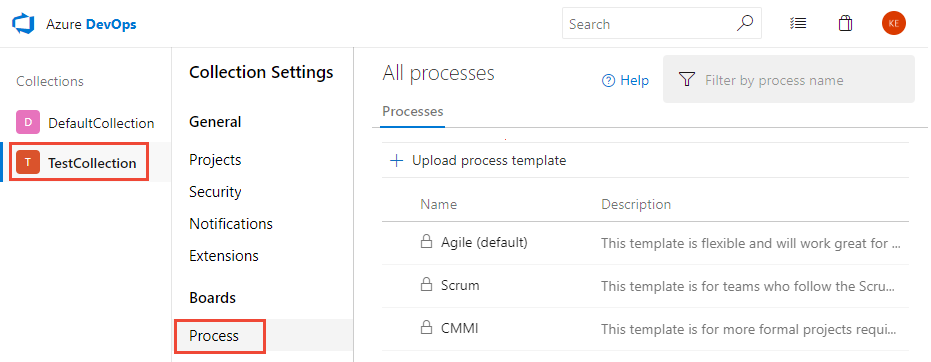
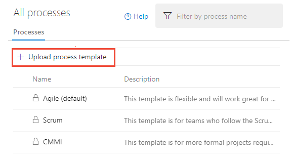
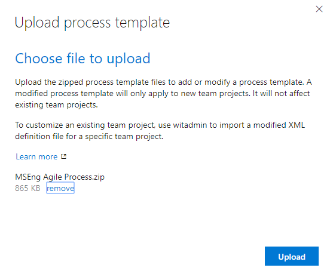
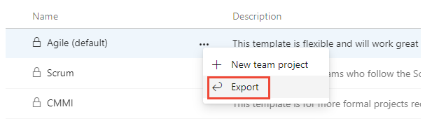
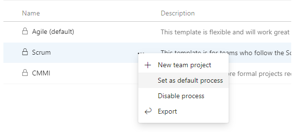
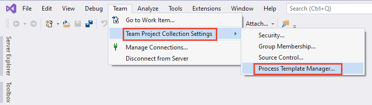
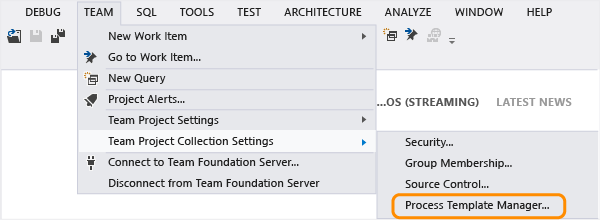
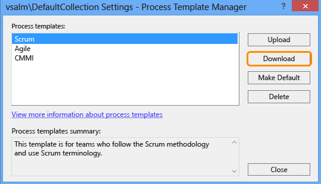
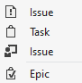

# Upload or download a process template

[!INCLUDE [temp](../../../includes/version-tfs-all-versions.md)]

When you create a project, the Project Creation Wizard (PCW) reads the process template to configure initial settings and upload artifacts and template files. Each process template defines the building blocks of the work item tracking system as well as other sub-systems. For the Hosted XML and On-premises XML process models, you can customize a process template to either update a project or create a project. For the Inheritance process model, you customize work tracking through a process. To learn more, see [Customize your work tracking experience](../../../reference/customize-work.md).  

::: moniker range="azure-devops"
> [!IMPORTANT]  
> Uploading and downloading Inherited processes isn't supported. However, you may be able to export a process using the [Process Migrator for Node.js](https://github.com/microsoft/process-migrator).  
>
> To manage Inherited processes, see [About process customization and inherited processes](../../../organizations/settings/work/inheritance-process-model.md). To manage Hosted XML processes, see [Hosted XML process model](../../../organizations/settings/work/hosted-xml-process-model.md).

::: moniker-end

::: moniker range=">= azure-devops-2019 < azure-devops"
You can upload and export process templates only for those project collections configured to use the On-premises XML processes. Also, you can mark a template to appear as the default when you add projects.

Support for uploading and downloading Inherited processes isn't supported through the user interface. You may be able to export a process using the [Process Migrator for Node.js](https://github.com/microsoft/process-migrator). To manage Inherited processes, see [About process customization and inherited processes](../../../organizations/settings/work/inheritance-process-model.md).

::: moniker-end

::: moniker range="<= tfs-2018"
You can upload, download, and delete process templates for a project collection. Also, you can mark a template to appear as the default when you add projects.
::: moniker-end 

[!INCLUDE [temp](../../includes/get-latest-process-templates.md)]

::: moniker range="< azure-devops"

## Prerequisites

- Open the same version of Visual Studio, Visual Studio Community, or Team Explorer as the on-premises Azure DevOps Server that you connect to. For example, if you connect to a TFS 2017 instance, you must connect from Visual Studio 2017 or Visual Studio Community 2017. You can always download a free version of Visual Studio Community from the [Visual Studio download site](https://visualstudio.microsoft.com/downloads/).

- If you aren't a member of the Project Collection Administrators group, [get added as one](../../../organizations/security/set-project-collection-level-permissions.md).  

## To manage a process template  

> [!NOTE]  
> The way the Process Template Manager works changed with the release of Visual Studio 2017 and Visual Studio 2019. Opening the Process Template Manager from Visual Studio 2017 and Visual Studio 2019 opens the web portal **Collection Settings** or **Organization Settings**.  

# [Visual Studio 2019](#tab/visual-studio-2019)

1. From Visual Studio 2019, connect to an on-premises Azure DevOps Server collection that uses On-premises XML process model. 
2. Choose **Team>Team Project Collection Settings>Process Template Manager** from the menu bar.

	> [!div class="mx-imgBorder"] 
	> 

	A web browser tab opens to the **Organization Settings>Process** page. 

	> [!div class="mx-imgBorder"] 
	> 

3. To upload a process template, choose the :::image type="icon" source="../../../media/icons/blue-add-icon.png" border="false":::**Upload Process Template** option.

	> [!div class="mx-imgBorder"] 
	> 

	In the Upload process template dialog, choose the .zip folder that contains the root file, ProcessTemplate.xml, for the process template that you want to upload. See also [Process template restrictions and validation checks](#restrictions).

	> [!div class="mx-imgBorder"] 
	> 

4. To download or export a process template, choose the  :::image type="icon" source="../../media/icons/actions-icon.png" border="false"::: actions icon, and choose the **Export** option.

	> [!div class="mx-imgBorder"] 
	> 

4. To set a process as the default when adding new projects or to disable a process from being used, choose the  :::image type="icon" source="../../media/icons/actions-icon.png" border="false"::: actions icon for the process, and select either the **Set as default process** or **Disable process** options.

	> [!div class="mx-imgBorder"] 
	> 

# [Visual Studio 2017](#tab/visual-studio-2017)

1. From Visual Studio 2017, connect to an on-premises Azure DevOps collection. 

2. Choose **Team>Team Project Collection Settings>Process Template Manager** from the menu bar.

	> [!div class="mx-imgBorder"] 
	> 

	A web browser tab opens to the **Organization Settings>Process** page. 

	> [!div class="mx-imgBorder"] 
	> 

3. To upload a process template, choose the :::image type="icon" source="../../../media/icons/blue-add-icon.png" border="false":::**Upload Process Template** option.

	> [!div class="mx-imgBorder"] 
	> 

	In the Upload process template dialog, choose the .zip folder that contains the root file, ProcessTemplate.xml, for the process template that you want to upload. See also [Process template restrictions and validation checks](#restrictions).

	> [!div class="mx-imgBorder"] 
	> 

4. To download or export a process template, choose the  :::image type="icon" source="../../media/icons/actions-icon.png" border="false"::: actions icon, and choose the **Export** option.

	> [!div class="mx-imgBorder"] 
	> 

4. To set a process as the default when adding new projects or to disable a process from being used, choose the  :::image type="icon" source="../../media/icons/actions-icon.png" border="false"::: actions icon for the process, and select either the **Set as default process** or **Disable process** options.

	> [!div class="mx-imgBorder"] 
	> 

# [Visual Studio 2015](#tab/visual-studio-2015)

1. From Visual Studio 2015 or earlier version, open the Process Template Manager from the **Team>Team Project Collection Settings>Process Template Manager** bar menu.

	> [!div class="mx-imgBorder"] 
	> 

   You'll see a list of each process template that has been uploaded to the project collection. 

   
	
   > [!TIP]   
   > For a comparison of the default process templates&mdash;Agile, CMMI, and Scrum&mdash;see [Choose a process](choose-process.md).  

   The <b>Upload</b>, <b>Download</b>, <b>Make Default</b>, and <b>Delete</b> buttons are disabled when you don't have the necessary permissions to manage process templates. 
 
3. Select the process template that you want to work with and then choose from the following actions.  

   <table>
   <tbody valign="top">
   <tr>
   <td width="15%">
   <strong>Upload</strong>
   </td>
   <td>To upload a process template. 
   
In the <strong>Upload Process Template</strong> dialog box, choose the folder that contains the root file, ProcessTemplate.xml, for the process template that you want to upload. See also <a href="#restrictions" data-raw-source="[Process template restrictions and validation checks](#restrictions)">Process template restrictions and validation checks</a>.

   </td>
   </tr>
	
   <tr>
   <td>
   <strong>Download</strong>
   </td>
   <td>To download the process template to a local computer. 
   
In the <strong>Download Process Template</strong> dialog box, select a folder where the process template will be downloaded.

   
If you&#39;re downloading a process template to use to <a href="/previous-versions/azure/devops/reference/upgrade/configure-features-after-upgrade" data-raw-source="[configure new features](/previous-versions/azure/devops/reference/upgrade/configure-features-after-upgrade)">configure new features</a>, <a href="/previous-versions/azure/devops/reference/upgrade/add-features-manually" data-raw-source="[manually add new features](/previous-versions/azure/devops/reference/upgrade/add-features-manually)">manually add new features</a> or <a href="/previous-versions/azure/devops/reference/upgrade/additional-configuration-options" data-raw-source="[update a custom process template to enable new features](/previous-versions/azure/devops/reference/upgrade/additional-configuration-options)">update a custom process template to enable new features</a>--choose the process that corresponds to the one you used previously to create your project. For example, if you&#39;re updating a project based on the Scrum process template, then select <strong>Scrum</strong>. Note that all version numbers have been removed from the process templates. If you don&#39;t see Agile, CMMI, or Scrum, then you need to <a href="https://visualstudio.microsoft.com/downloads/download-visual-studio-vs" data-raw-source="[update TFS](https://visualstudio.microsoft.com/downloads/download-visual-studio-vs)">update TFS</a>. 

   
You can determine which process template to select based on the <a href="#wit_correlation" data-raw-source="[work item types defined for your existing project](#wit_correlation)">work item types defined for your existing project</a>.

   </td>
   </tr>
	
   <tr>
   <td>
   <strong>Make Default</strong>
   </td>
   <td>
   To cause the selected process template to appear as the default selection in the <strong>New Team Project Wizard</strong>.
   </td>
   </tr>
	
   <tr>
   <td>
   <strong>Delete</strong>
   </td>
   <td>
   To permanently remove the selected process template from the collection.
   </td>
   </tr>
	
   </tbody>
   </table>

::: moniker-end

## Process template correlation with an existing project

To determine the type of process template that was used to create your project, review the work item types that appear in the <b>New Work Item</b> menu for Team Explorer and then compare them with the work item types in the following chart. If your work item types differ from those shown listed, then a custom process template might have been used.

::: moniker range=">= azure-devops-2019"

<table>
<tbody valign="top">
<tr>
<th>Agile</th>
<th>Basic</th>
<th>CMMI</th>
<th>Scrum</th>
</tr>
<tr>
<td>
 
</td>
<td>
 
</td>
<td>
 
</td>
<td>
 
</td>
<td>
</tr>
</tbody>
</table>

::: moniker-end

::: moniker range="<= tfs-2018"

<table>
<tbody valign="top">
<tr>
<th>Scrum</th>
<th>Agile</th>
<th>CMMI</th>
</tr>
<tr>
<td>
 
</td>
<td>
 
</td>
<td>
 
</td>
</tr>
</tbody>
</table>

::: moniker-end

::: moniker range="< azure-devops"

## Process template restrictions and validation checks 

If you upload the process template through the web portal, you may encounter errors such as those shown in the following image. 

> [!div class="mx-imgBorder"] 
> 

You must resolve each error and then retry the upload process. You may find additional information about resolving process template errors from [Resolve validation errors for process import](../../../organizations/settings/work/import-process/resolve-errors.md). 

Uploading a process template requires that it pass the following validation checks.

::: moniker-end

::: moniker range=">= tfs-2017 < azure-devops"

- Process template names must be unique and 256 Unicode characters or less. Same-named templates will overwrite existing templates. 
Also, names cannot contain the following characters: . , ; ' ` : / \ * | ? " &amp; % $ ! + = ( ) [ ] { } &lt; &gt; 
For additional restrictions, see [Naming restrictions](../../../organizations/settings/naming-restrictions.md). 
- Process template folders can't contain any .exe files. If they do, the process template may upload successfully, however project creation will fail.
- Process template total size should be 2 GB or less, or project creation will fail.
- The upload process performs a partial verification check to make sure that the XML of each process template XML file is valid. If you receive any errors when you try to upload the process template, review the XML to determine the cause of the error. Note that duplicate tags in an XML file can cause errors. If there is no error in the XML, check to make sure all the appropriate files are included in your process template in the correct folder locations.
- If XML definition files reference an extension, then the extension must be installed and enabled in the collection.

> [!IMPORTANT]  
>The schema definition for process templates uses a mix of camel-case and all capitalized elements. If you encounter errors when validating your type definition files, check the case structure of your elements. Also, the case structure of opening and closing tags must match according to the rules for XML syntax. 
>
>See [Process template plug-ins: Index to XML element definitions](../../../reference/process-templates/process-template-plug-ins-xml-elements-index.md).

::: moniker-end

::: moniker range="<= tfs-2015"

- Process template names must be unique and 256 Unicode characters or less. Same-named templates will overwrite existing templates. 
Also, names cannot contain the following characters: . , ; ' ` : / \ * | ? " &amp; % $ ! + = ( ) [ ] { } &lt; &gt; 
For additional restrictions, see [Naming restrictions](../../../organizations/settings/naming-restrictions.md). 
- Process template folders can't contain any .exe files. If they do, the process template may upload successfully, however project creation will fail.
- Process template total size should be 2 GB or less, or project creation will fail.
- The upload process performs a partial verification check to make sure that the XML of each process template XML file is valid. If you receive any errors when you try to upload the process template, review the XML to determine the cause of the error. Note that duplicate tags in an XML file can cause errors. If there is no error in the XML, check to make sure all the appropriate files are included in your process template in the correct folder locations.

> [!IMPORTANT]  
>The schema definition for process templates uses a mix of camel-case and all capitalized elements. If you encounter errors when validating your type definition files, check the case structure of your elements. Also, the case structure of opening and closing tags must match according to the rules for XML syntax. 
>
>See [Process template plug-ins: Index to XML element definitions](../../../reference/process-templates/process-template-plug-ins-xml-elements-index.md).

::: moniker-end

## Related articles  

Periodically, updates are made to the process templates to support new features. For details, see [Changes made to process templates](changes-to-process-templates.md).  

- [Create a project](../../../organizations/projects/create-project.md)   
- [Customize a process template](../../../reference/process-templates/customize-process.md)   
- [Process template and plug-in files](../../../reference/process-templates/overview-process-template-files.md)  
- [Import and update a process (Hosted XML)](../../../organizations/settings/work/import-process/import-process.md)     
- [Customize your work tracking experience](../../../reference/customize-work.md)  

::: moniker range="<= tfs-2017"

### Update a process template to enable new features 

When you upgrade your on-premises Azure DevOps to a later version, new features may become available. [To gain access to these new features](/previous-versions/azure/devops/reference/upgrade/configure-features-after-upgrade), you may need to [update a customized process template](/previous-versions/azure/devops/reference/upgrade/additional-configuration-options). 

::: moniker-end

::: moniker range=">= tfs-2017 <= tfs-2018"

### Add another project 

You can add a project from the web portal or Visual Studio/Team Explorer. Some process template files are ignored when you create a project from the web portal. For details, see [Process template and plug-in files, Client support for project creation](../../../reference/process-templates/overview-process-template-files.md#client-support). 

::: moniker-end
