# Upload or download a process template

[!INCLUDE [version-lt-eq-azure-devops](../../../includes/version-lt-eq-azure-devops.md)] 

When you create a project, a process template defines the work item types and other settings for Azure Boards.
For the Hosted XML and On-premises XML process models, you upload a process template to create or update a project.
For the Inheritance process model, you customize work tracking through the web portal.
For more information, see [Customize your work tracking experience](../../../reference/customize-work.md).

::: moniker range="< azure-devops"
You can upload and export process templates only for project collections configured to use On-premises XML processes.
You can also set a template as the default for new projects.
 
::: moniker-end

[!INCLUDE [temp](../../includes/get-latest-process-templates.md)]

## Prerequisites

| Category | Requirements |
|----------|-------------|
| **Permissions** | Member of the **Project Collection Administrators** group. To get added, see [Change project collection-level permissions](../../../organizations/security/change-organization-collection-level-permissions.md). |

::: moniker range="<=azure-devops"

> [!IMPORTANT]  
> Uploading and downloading inherited processes isn't supported. To manage inherited processes, see [About process customization and inherited processes](../../../organizations/settings/work/inheritance-process-model.md). 

[!INCLUDE [temp](../../../organizations/settings/includes/open-process-admin-context-ts.md)]
::: moniker-end 

::: moniker range="azure-devops"

## Import a process template (Hosted XML process)   

1.  From the **Processes** tab, select **Import process**, and then drag and drop or browse to the .zip file of the process you customized.

	> [!div class="mx-imgBorder"]  
	> 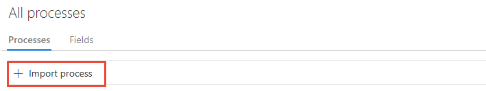

    > [!NOTE]    
    > If the **Import process** link doesn't appear, your organization isn't set up to support the Hosted XML process model. Use the [Inheritance process model](../../../organizations/settings/work/manage-process.md) for your customization needs. The Hosted XML process model is only supported if your account was created through the [Data Import Service](../../../migrate/migration-overview.md).

2.  Select the file to upload. Your [custom process must meet specific constraints](../../../organizations/settings/work/import-process/customize-process.md) to pass validation checks during import.

	> [!div class="mx-imgBorder"]  
	> 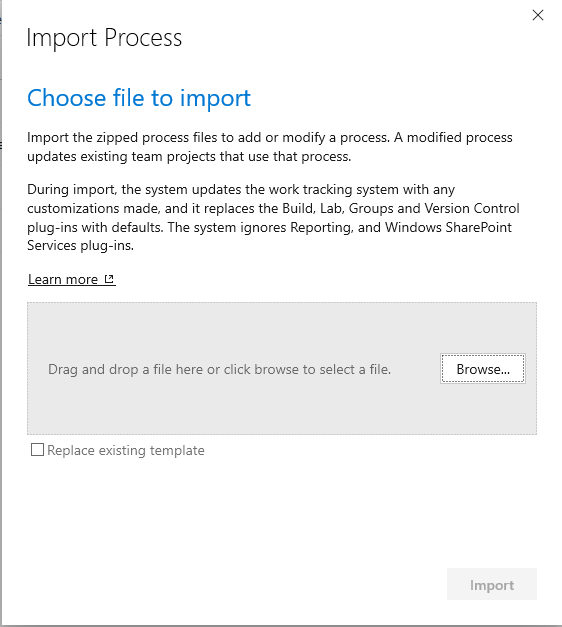

	Select **Replace existing template** if you're updating an existing template.
	The import overwrites any template with the same name and requires you to confirm the replacement.

	> [!IMPORTANT]  
	> You can't update the locked processes: Agile, Basic, CMMI, and Scrum.

3.  After a successful import, a confirmation message appears.

	> [!div class="mx-imgBorder"]  
	> 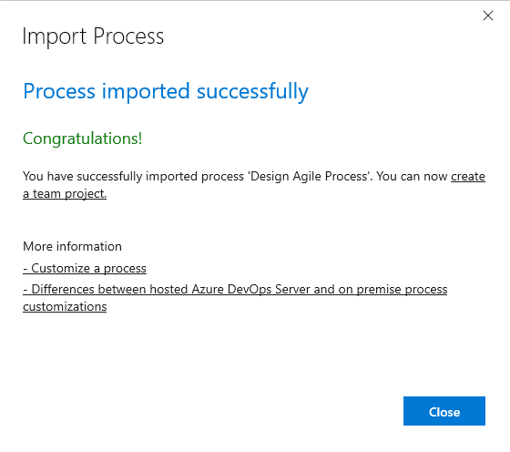

    If the process doesn't pass validation checks, a list of error messages appears. [Correct each error](../../../organizations/settings/work/import-process/resolve-errors.md) and retry the import.

4.  You can immediately create a project using the newly imported process.

	> [!div class="mx-imgBorder"]  
	> 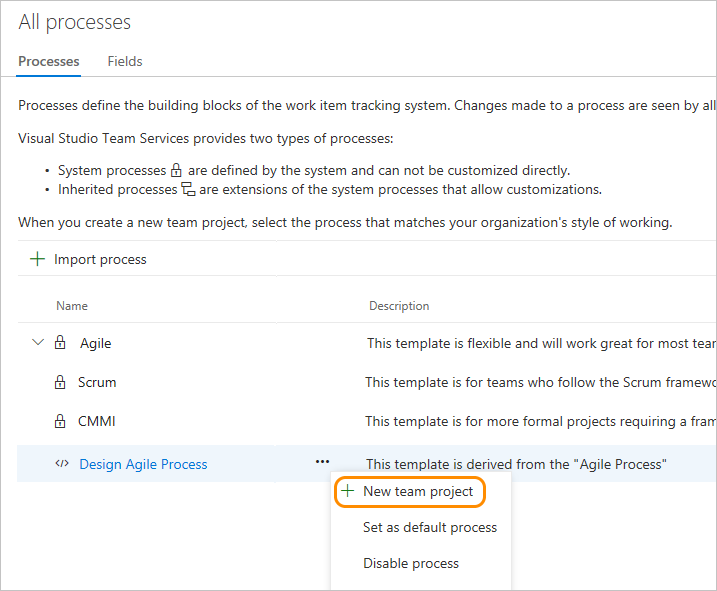

5. Complete the form that appears.
	For more information, see [Create a project](../../../organizations/projects/create-project.md).

	> [!div class="mx-imgBorder"]  
	> 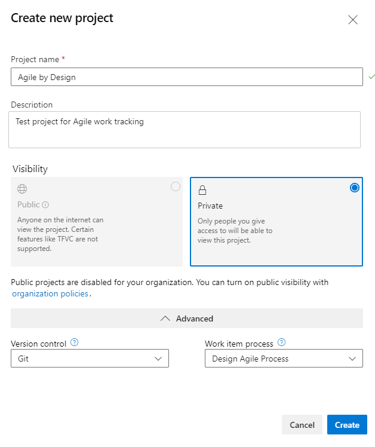

For other Hosted XML process management tasks, see [Import and export a Hosted XML process](../../../organizations/settings/work/import-process/import-process.md).

::: moniker-end 

::: moniker range="<azure-devops"

## Manage a process template (On-premises XML process)  

1. To upload a process template, select the :::image type="icon" source="../../../media/icons/blue-add-icon.png" border="false":::**Upload Process Template** option.

	> [!div class="mx-imgBorder"] 
	> 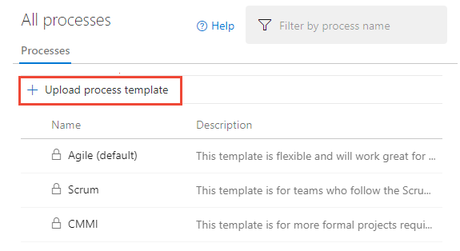

	In the **Upload process template** dialog, choose the .zip folder that contains the root file, **ProcessTemplate.xml**, for the process template that you want to upload. See also [Process template restrictions and validation checks](#restrictions).

	> [!div class="mx-imgBorder"] 
	> 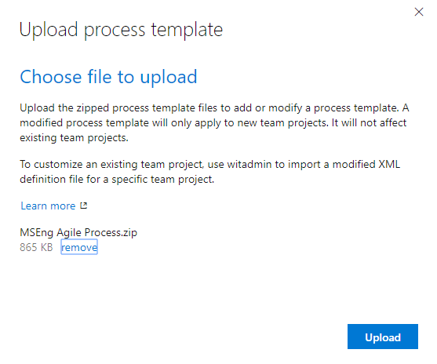

1. To download or export a process template, select the  :::image type="icon" source="../../media/icons/actions-icon.png" border="false"::: actions icon, and choose the **Export** option.

	> [!div class="mx-imgBorder"] 
	> 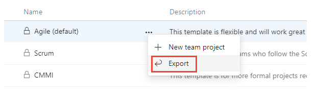

1. To set a process as the default when adding new projects or to disable a process from being used, select the  :::image type="icon" source="../../media/icons/actions-icon.png" border="false"::: actions icon for the process, and select either the **Set as default process** or **Disable process** options.

	> [!div class="mx-imgBorder"] 
	> 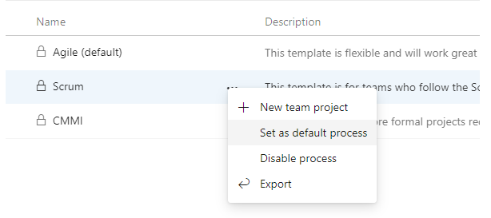

::: moniker-end

## Correlate a process template with an existing project

To determine the type of process template that you used to create your project, review the work item types that appear in the **New Work Item** menu for Team Explorer and then compare them with the work item types in the following chart. If your work item types differ from those items, your project might use a custom process template.

::: moniker range="<=azure-devops"

| **Agile**| **Basic**| **CMMI**| **Scrum**| 
|-----------|-----------|-----------|-----------|
| 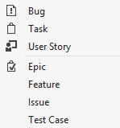 | 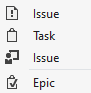 | 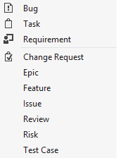 | 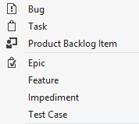 | 

::: moniker-end

## Process template restrictions and validation checks 

When you upload a process template through the web portal, validation errors might appear.

> [!div class="mx-imgBorder"] 
> 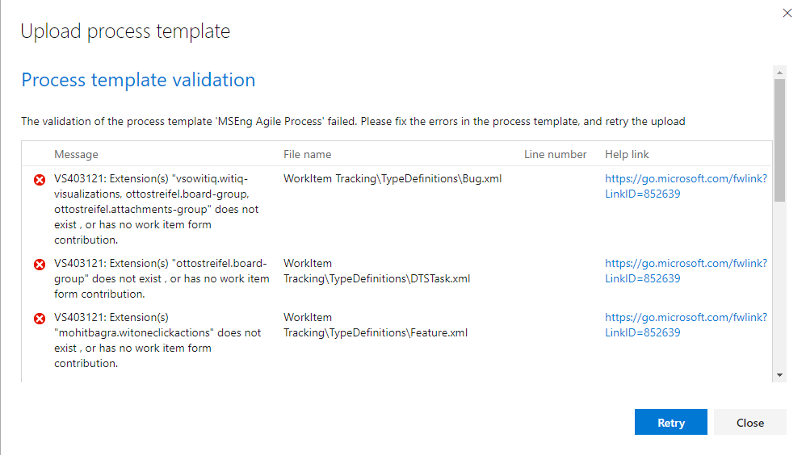

Resolve each error and retry the upload.
For more information, see [Resolve validation errors for process import](../../../organizations/settings/work/import-process/resolve-errors.md).

The following validation checks must pass when you upload a process template:

- Process template names must be unique and 256 Unicode characters or less.
Same-named templates overwrite existing templates.
Names can't contain the following characters: . , ; ' ` : / \ * | ? " &amp; % $ ! + = ( ) [ ] { } &lt; &gt;.
For more restrictions, see [Naming restrictions](../../../organizations/settings/naming-restrictions.md).
- Process template folders can't contain .exe files.
If they do, the template might upload successfully, but project creation fails.
- Process template total size must be 2 GB or less, or project creation fails.
- The upload process runs a partial verification check to validate the XML in each process template file.
If you receive errors, review the XML to determine the cause.
Duplicate tags in an XML file can cause errors.
If no XML errors exist, verify that all required files are included in the correct folder locations.
- If XML definition files reference an extension, the extension must be installed and enabled in the collection.

> [!IMPORTANT]  
> The schema definition for process templates uses a mix of camel case and all capitalized elements.
> If you encounter errors when validating your type definition files, check the case structure of your elements.
> Opening and closing tag casing must match according to XML syntax rules.
> For more information, see [Process template plug-ins: Index to XML element definitions](../../../reference/process-templates/process-template-plug-ins-xml-elements-index.md).

## Related content  

- [Create a project](../../../organizations/projects/create-project.md)   
- [Customize a process template](../../../reference/process-templates/customize-process.md)   
- [Process template and plug-in files](/previous-versions/azure/devops/reference/process-templates/overview-process-template-files)  
- [Import and update a process (Hosted XML)](../../../organizations/settings/work/import-process/import-process.md)     
- [Customize your work tracking experience](../../../reference/customize-work.md)
