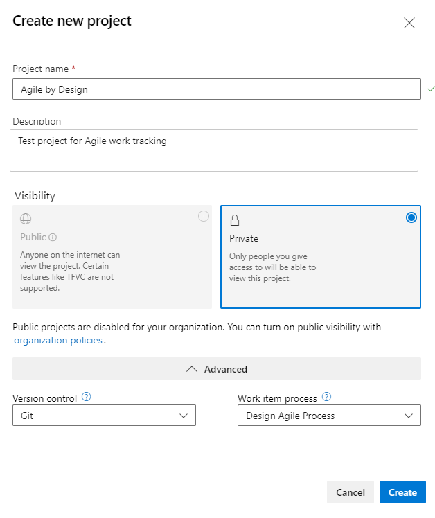

# Upload or download a process template

[!INCLUDE [version-lt-eq-azure-devops](../../../includes/version-lt-eq-azure-devops.md)] 

When you create a project, a process is used to specify the work item types to configure and other settings. Each process template primarily defines the building blocks of the work item tracking system for Azure Boards. For the Hosted XML and On-premises XML process models, you can upload a process template to either update an existing project or create a project. For the Inheritance process model, you customize work tracking through the web portal. To learn more about these different processes, see [Customize your work tracking experience](../../../reference/customize-work.md).  

::: moniker range=">= azure-devops-2019 < azure-devops"
You can upload and export process templates only for those project collections configured to use the On-premises XML processes. Also, you can mark a template to appear as the default when you add projects.
 
::: moniker-end

::: moniker range="tfs-2018"
You can upload, download, and delete process templates for a project collection. Also, you can mark a template to appear as the default when you add projects.
::: moniker-end 

[!INCLUDE [version-all](../../../includes/version-selector-minimize.md)]

[!INCLUDE [temp](../../includes/get-latest-process-templates.md)]

## Prerequisites
 
To manage process templates, you must be a member of the **Project Collection Administrators** group, To get added to this group, see [Change project collection-level permissions](../../../organizations/security/change-organization-collection-level-permissions.md). 

::: moniker range=">= azure-devops-2019"

> [!IMPORTANT]  
> Uploading and downloading Inherited processes isn't supported. To manage Inherited processes, see [About process customization and inherited processes](../../../organizations/settings/work/inheritance-process-model.md). 

[!INCLUDE [temp](../../../organizations/settings/includes/open-process-admin-context-ts.md)]
::: moniker-end 

::: moniker range="azure-devops"

## Import a process template (Hosted XML process)   

1.  From the **Processes** tab, choose **Import process** and then drag-and-drop or browse to the zip file of the process you've customized.  

	> [!div class="mx-imgBorder"]  
	> 

    > [!NOTE]    
    > If you don't see the **Import process** link, then your organization isn't set up to support the Hosted XML process model. You should work with the [Inheritance process model](../../../organizations/settings/work/manage-process.md) for your customization needs. The Hosted XML process model is only supported if your account was created through the [Data Import Service](../../../migrate/migration-overview.md).

2.  Choose the file to upload. Your [custom process must meet specific constraints](../../../organizations/settings/work/import-process/customize-process.md) to pass validation checks during import.  

	> [!div class="mx-imgBorder"]  
	> 

	Check the **Replace existing template** if you're updating an existing template. The import process overwrites any template that has the same name as the one you import and requires that you check this box to confirm you want it replaced.

	> [!IMPORTANT]  
	> You can't update one of the locked processes: Agile, Basic, CMMI, and Scrum.  

3.  Upon successful import, you'll see the following message.  

	> [!div class="mx-imgBorder"]  
	> 

    If the process doesn't pass the validation checks performed on import, you'll receive a list of error messages.  
    [Correct each error](../../../organizations/settings/work/import-process/resolve-errors.md) and then retry the import. 

4.  You can immediately create a project using the newly imported process. 

	> [!div class="mx-imgBorder"]  
	> 

5. Complete the form that appears. To learn more about the different options, see [Create a project](../../../organizations/projects/create-project.md).

	> [!div class="mx-imgBorder"]  
	> 

For other Hosted XML process management tasks, see [Import and export a Hosted XML process](../../../organizations/settings/work/import-process/import-process.md).

::: moniker-end 

::: moniker range=">= azure-devops-2019 < azure-devops"

## Manage a process template (On-premises XML process)  

1. To upload a process template, choose the :::image type="icon" source="../../../media/icons/blue-add-icon.png" border="false":::**Upload Process Template** option.

	> [!div class="mx-imgBorder"] 
	> 

	In the Upload process template dialog, choose the .zip folder that contains the root file, ProcessTemplate.xml, for the process template that you want to upload. See also [Process template restrictions and validation checks](#restrictions).

	> [!div class="mx-imgBorder"] 
	> 

1. To download or export a process template, choose the  :::image type="icon" source="../../media/icons/actions-icon.png" border="false"::: actions icon, and choose the **Export** option.

	> [!div class="mx-imgBorder"] 
	> 

1. To set a process as the default when adding new projects or to disable a process from being used, choose the  :::image type="icon" source="../../media/icons/actions-icon.png" border="false"::: actions icon for the process, and select either the **Set as default process** or **Disable process** options.

	> [!div class="mx-imgBorder"] 
	> 

::: moniker-end

::: moniker range="tfs-2018"

## Open Process Template Manager 

1. From Visual Studio 2015, open the Process Template Manager from the **Team>Team Project Collection Settings>Process Template Manager** bar menu.

	> [!div class="mx-imgBorder"] 
	> 

   You'll see a list of each process template that has been uploaded to the project collection. 

   

   > [!TIP]   
   > For a comparison of the default process templates--Agile, CMMI, and Scrum--see [About processes and process templates](choose-process.md).  
   The **Upload**, **Download**, **Make Default**, and **Delete** buttons are disabled when you don't have the necessary permissions to manage process templates. 

3. Select the process template that you want to work with and then choose from the following actions.  

	|**Choose this task** | **To perform this operation** |
	|---------------------|-------------------------------|
	|**Upload**|To upload a process template. In the **Upload Process Template** dialog box, choose the folder that contains the root file, ProcessTemplate.xml, for the process template that you want to upload. See also [Process template restrictions and validation checks](#restrictions). |
	|**Download** | To download the process template to a local computer. In the **Download Process Template** dialog box, select a folder where the process template gets downloaded.  If you're downloading a process template to use to [configure new features](/previous-versions/azure/devops/reference/upgrade/configure-features-after-upgrade), [manually add new features](/previous-versions/azure/devops/reference/upgrade/add-features-manually) or [update a custom process template to enable new features](/previous-versions/azure/devops/reference/upgrade/additional-configuration-options)--choose the process that corresponds to the one you used previously to create your project. For example, if you're updating a project based on the Scrum process template, then select **Scrum**. All version numbers have been removed from the process templates. If you don't see Agile, CMMI, or Scrum, then you need to [update TFS](https://visualstudio.microsoft.com/downloads/download-visual-studio-vs).   You can determine which process template to select based on the [work item types defined for your existing project](#wit_correlation). |
	|**Make Default**| To cause the selected process template to appear as the default selection in the **New Team Project Wizard**. | 
	|**Delete**	|To permanently remove the selected process template from the collection.	| 

::: moniker-end

## Correlate a process template with an existing project

To determine the type of process template that was used to create your project, review the work item types that appear in the <b>New Work Item</b> menu for Team Explorer and then compare them with the work item types in the following chart. If your work item types differ from those items shown, then a custom process template might have been used.

::: moniker range=">= azure-devops-2019"

| **Agile**| **Basic**| **CMMI**| **Scrum**| 
|-----------|-----------|-----------|-----------|
|  |  |  |  | 

::: moniker-end

::: moniker range="tfs-2018"

| **Agile**| **CMMI**| **Scrum**| 
|-----------|-----------|-----------|-----------|
|  |  |  | 

::: moniker-end

## Process template restrictions and validation checks 

If you upload the process template through the web portal, you may come across errors such as those shown in the following image. 

> [!div class="mx-imgBorder"] 
> 

Resolve each error and then retry the upload process. You may find additional information about resolving process template errors from [Resolve validation errors for process import](../../../organizations/settings/work/import-process/resolve-errors.md). 

The following validation checks must pass when uploading a process template.  

- Process template names must be unique and 256 Unicode characters or less. Same-named templates overwrite existing templates. 
Also, names can't contain the following characters: . , ; ' ` : / \ * | ? " &amp; % $ ! + = ( ) [ ] { } &lt; &gt;. For more restrictions, see [Naming restrictions](../../../organizations/settings/naming-restrictions.md). 
- Process template folders can't contain any .exe files. If they do, the process template may upload successfully, however project creation fails.
- Process template total size should be 2 GB or less, or project creation fails.
- The upload process runs a partial verification check to make sure that the XML of each process template XML file is valid. If you receive any errors when you try to upload the process template, review the XML to determine the cause of the error. Duplicate tags in an XML file can cause errors. If there's no error in the XML, check to make sure all the appropriate files are included in your process template in the correct folder locations.
- If XML definition files reference an extension, then the extension must be installed and enabled in the collection.

> [!IMPORTANT]  
> The schema definition for process templates uses a mix of camel-case and all capitalized elements. If you encounter errors when validating your type definition files, check the case structure of your elements. Also, the case structure of opening and closing tags must match according to the rules for XML syntax. See also [Process template plug-ins: Index to XML element definitions](../../../reference/process-templates/process-template-plug-ins-xml-elements-index.md).
 

## Related articles  

Periodically, updates are made to the process templates to support new features. For more information, see [Release Notes for Azure DevOps Server](/azure/devops/server/release-notes/azuredevops2020u1).  

- [Create a project](../../../organizations/projects/create-project.md)   
- [Customize a process template](../../../reference/process-templates/customize-process.md)   
- [Process template and plug-in files](/previous-versions/azure/devops/reference/process-templates/overview-process-template-files)  
- [Import and update a process (Hosted XML)](../../../organizations/settings/work/import-process/import-process.md)     
- [Customize your work tracking experience](../../../reference/customize-work.md)   
 
<!--- 

1/5/2023: Removed link to the [Process Migrator for Node.js](https://github.com/microsoft/process-migrator) tool as it is not being updated. 
 
-->

