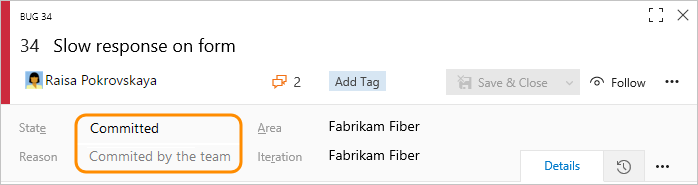
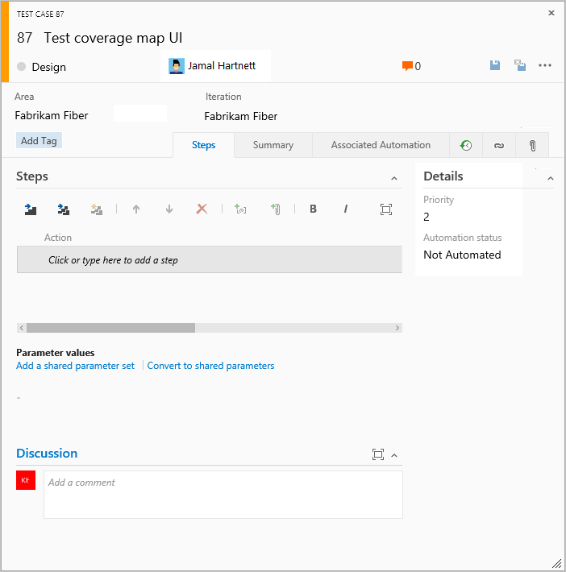

# Scrum process work item types and workflow  

[!INCLUDE [temp](../../_shared/version-vsts-tfs-all-versions.md)]

To plan a software project and track software defects using Scrum, teams use the product backlog item (PBI) and bug work item types (WITs). To gain insight into a portfolio of features, scenarios, or user experiences, product owners and program managers can map PBIs and bugs to features. When teams work in sprints, they define tasks which automatically link to PBIs and bugs.

 

> [!NOTE]  
> If you are new to the Scrum process, review [About Sprints, Scrum and project management](../../sprints/scrum-overview.md) to get started. 

Using the web portal or Microsoft Test Manager, testers can create and run test cases and create bugs to track code defects. Impediments track blocking issues. 

[!INCLUDE [temp](../../_shared/note-work-item-form-differences.md)]   

## Define PBIs and bugs  

When you define a product backlog item, you want to focus on the value that your customers will receive and avoid descriptions of how your team will develop the feature. The product owner can prioritize your product backlog based on each item's business value, effort, and relative dependency on other backlog items. As your business requirements evolve, so does your product backlog. Typically, teams specify details only for the highest priority items, or those items assigned to the current and next sprint.

You can create PBIs and bugs from the [quick add panel on the product backlog page](../../backlogs/create-your-backlog.md).  

 

Later, you can open each PBI or bug to provide more details and estimate the effort. Also, by prioritizing the PBIs and bugs on the backlog page (which is captured in the Backlog Priority field), product owners can indicate which items should be given higher priority.  

  

By defining the **Effort** for PBIs and bugs, teams can use the forecast feature and velocity charts to estimate future sprints or work efforts. By defining the **Business Value**, product owners can specify priorities separate from the changeable backlog stack ranking.
 
Use the following guidance and that provided for [fields used in common across work item types](#definitions-in-common) when filling out the form. For details about creating bugs, see [Manage bugs](../../backlogs/manage-bugs.md). 

<table>
<thead>
<tr><th>
Field/tab
</th><th>
Usage
</th></tr>
</thead>
<tbody valign="top">
<tr>
	<td width="20%">
[Effort](../../queries/query-numeric.md)
</td>
	<td>
Estimate the amount of work required to complete a PBI using any unit of measurement your team prefers, such as story points or time. A numeric value is required. 

Agile [velocity charts](../../../report/dashboards/velocity-chart-data-store.md) and [forecast](../../sprints/forecast.md) tools reference the values in this field. For additional guidance, see the [Estimating](https://msdn.microsoft.com/library/hh765979) white paper.
</td></tr>
<tr>
	<td>
[Business Value](../../queries/query-numeric.md)
</td>
	<td>
Specify a number that captures the relative value of a PBI compared to other PBIs. The higher the number, the greater the business value.
</td>

</tr>
<tr>
	<td>
[Description](../../queries/titles-ids-descriptions.md)  
</td>
	<td>
Provide enough detail for estimating how much work will be required to implement the item. Focus on who the feature is for, what users want to accomplish, and why. Don't describe how the feature should be developed. Do provide sufficient details so that your team can write tasks and test cases to implement the item. 

	</td>
</tr>
<tr>
	<td>
[Acceptance Criteria](../../queries/titles-ids-descriptions.md) 
</td>
	<td>
Define what "Done" means by describing the criteria that the team should use to verify whether the PBI or the bug fix has been fully implemented.  Before work begins on a PBI or bug, describe the criteria for customer acceptance as clearly as possible. Conversations between the team and customers to determine the acceptance criteria helps ensure a common understanding within the team to meet customers'  expectations. The acceptance criteria can be used as the basis for acceptance tests so that the team can more effectively evaluate whether an item has been satisfactorily completed.

</td>
</tr>

</tbody>
</table>

[!INCLUDE [temp](../../_shared/discussion-tip.md)] 

## Track progress

As work progresses, you change the State field to update the status. Optionally, you can specify a reason. The state and reason fields appear on the work item form in the header area. 

 

### Scrum workflow states 

By updating the State, teams know which items are new, in progress, or completed. Most WITs support transition both forward and backward from each workflow state. These diagrams show the main progression and regression states of the PBI, bug, and task WITs. 

> [!div class="mx-tdBreakAll"]  
> |Product Backlog Item |Bug |Task |  
> |-------------|----------|---------| 
> | | | |

PBIs and bugs follow this typical workflow progression:

-   The product owner creates a PBI or a tester creates a bug in the **New** state with the default reason, **New backlog item**  
-   The product owner moves the item to **Approved** after it is sufficiently described and ready for the team to estimate the level of effort. Most of the time, items near the top of the Product Backlog are in the Approved state, while items toward the middle and bottom are in a New state  
-   The team updates the status to **Committed** when they decide to commit to working on it during the sprint  
-   The item is moved to the **Done** state when the team has completed all its associated tasks and the product owner agrees that it has been implemented according to the Acceptance Criteria.  

### Update status with Kanban or taskboards

Teams can use the [Kanban board](../../boards/kanban-basics.md) to update the status of PBIs, and the [sprint taskboard](../../sprints/task-board.md) to update the status of tasks. Dragging items to a new state column updates both the State and Reason fields.

You can customize the Kanban board to support additional [swim lanes](../../boards/expedite-work.md) or [columns](../../boards/add-columns.md). For additional customization options, see [Customize your work tracking experience](#customize-work-tracking).

## Map PBIs to features

When you manage a suite of products or user experiences, you might want to view the scope and progress of work across the product portfolio. You can do this by [defining features](../../backlogs/define-features-epics.md) and [mapping PBIs to features](../../backlogs/organize-backlog.md).

Using portfolio backlogs, you can [drill down from one backlog to another](../../plans/portfolio-management.md) to view the level of detail you want. Also, you can use portfolio backlogs to view a rollup of work in progress across several teams when you [setup a hierarchy of teams](../../../organizations/settings/add-teams.md).

## Define tasks  

When your team manages their work in sprints, they can use the sprint backlog page to break down the work to be accomplished into distinct tasks.

  

Name the task and estimate the work it will take.

  

Using Scrum, teams forecast work and define tasks at the start of each sprint, and each team member performs a subset of those tasks. Tasks can include development, testing, and other kinds of work. For example, a developer can define tasks to implement PBIs, and a tester can define tasks to write and run test cases.

When teams estimate work using hours or days, they define tasks and the **Remaining Work** and **Activity** (optional) fields.

<table><thead>
<tr><th>
Field/tab
</th><th>
Usage
</th></tr></thead>
<tbody valign="top">  
<tr>
	<td width="18%">
[Remaining Work](../../queries/query-numeric.md) 
</td>
	<td>
Indicate how many hours or days of work remain to complete a task. As work progresses, update this field. It's used to calculate capacity charts, the sprint burndown chart, and the [Sprint Burndown (Scrum)](../../../report/sql-reports/sprint-burndown-scrum.md) report. If you divide a task into subtasks, specify Remaining Work for the subtasks only. You can specify work in any unit of measurement your team chooses.
</td>
</tr>

<tr>
	<td>
[Activity](../../queries/query-numeric.md) 
</td>
	<td>
Select the type of activity this task represents when your team estimates sprint capacity by activity.
</td></tr>
</tbody>
</table>  

## Track test progress

### Test PBIs  

From the web portal or Test Manager, you can [create test cases that automatically link to a PBI or bug](../../../test/create-test-cases.md). Or, you can link a PBI or bug to a test case from the  (links tab).  

 

The test case contains a number of fields, many of which are automated and integrated with Test Manager and the build process. For a description of each field, see [Query based on build and test integration fields](../../queries/build-test-integration.md).

  

The  (links tab) captures the links to all the PBIs and bugs in a test case. By linking PBIs and bugs to test cases, the team can track the progress made in testing each item.  

### Track code defects

You can [create bugs from the web portal web portal, Visual Studio, or when testing with Test Manager](../../backlogs/manage-bugs.md). 

[!INCLUDE [temp](../../_shared/common-work-item-fields.md)]   

## Customize work item types
[!INCLUDE [temp](../../_shared/customize-work-tracking.md)] 

## Related articles

[!INCLUDE [temp](../../_shared/create-team-project-links.md)]  
  

### Track impediments

Use the impediment WIT to track events that may block progress or ship a PBI. Use the Bug WIT exclusively to track code defects.  

You can add an impediment from the [New work item widget](../../../report/dashboards/widget-catalog.md#new-work-item-widget) added to a [team dashboard](../../../Report/dashboards.md), or from the **New** menu on the Queries page. 

  

Work items you add from the widget are automatically scoped to your team's default area and iteration paths. To change the team context, see [Switch team context](../../../project/navigation/go-to-project-repo.md?toc=/azure/devops/boards/plans/toc.json&bc=/azure/devops/boards/plans/breadcrumb/toc.json).  

### Backlog list order

The [Backlog Priority](../../queries/planning-ranking-priorities.md) field is used to track the relative ranking of PBIs, bugs, features, or epics. However, by default it doesn't appear on the work item form. The sequence of items on the backlog page is determined according to where you have [added the items or moved the items on the page](../../backlogs/create-your-backlog.md#move-items-priority-order). As you drag items, a background process updates this field.  

### Links control, client work item form 

Work item forms displayed in a client and the web portal for TFS 2015 and earlier versions display link tabs and link control restrictions as described in the following table. 

<table>
<thead>
<tr>
<th>
Tab name
</th>
<th>
Work item type
</th>
<th>
Link restrictions
</th>
</tr>
</thead>
<tbody valign="top">
<tr>
<td>
<strong>All Links</strong>
</td>
<td>
Feedback Request

Feedback Response
</td>
<td><ul>
<li>
No restrictions.
</li>
</ul></td>
</tr>
<tr>
<td>
<strong>Links</strong>
</td>
<td>
Product Backlog Item

Bug

Impediment

Shared steps

Task

Test Case

</td>
<td><ul>
<li>
No restrictions.
</li>
</ul>

</td>
</tr>
<tr>
<td>
<strong>Links</strong>
</td>
<td>
Code Review Request
</td>
<td><ul>
<li>
Allows only <strong>Parent</strong> and <strong>Child</strong> links to Code Review Response work items.
</li>
<li>
Excludes links to work items in other projects.
</li>
</ul>

</td>
</tr>
<tr>
<td>
<strong>Stories</strong>
</td>
<td>
Feedback Response
</td>
<td><ul>
<li>
Allows only <strong>Related</strong> links.
</li>
<li>
Allows links to Bug and Product Backlog Items.
</li>
<li>
Excludes links to work items in other projects.
</li>
</ul>

</td>
</tr>
<tr>
<td>
<strong>Storyboards</strong>
</td>
<td>
Product Backlog Item
</td>
<td><ul>
<li>
Allows only <strong>Storyboard</strong> links.
</li>
</ul></td>
</tr>
<tr>
<td>
<strong>Tasks</strong>
</td>
<td>
Product Backlog Item
</td>
<td><ul>
<li>
Allows only <strong>Child</strong> links to Tasks.
</li>
<li>
Excludes links to work items in other projects.
</li>
</ul></td>
</tr>
<tr>
<td>
<strong>Test Cases</strong>
</td>
<td>
Product Backlog Item

Bug
</td>
<td><ul>
<li>
Allows only <strong>Tested By</strong> links.
</li>
<li>
Allows links only to test cases.
</li>
<li>
Excludes links to work items in other projects.
</li>
</ul></td>
</tr>
<tr>
<td>
<strong>Tested Backlog Items</strong>
</td>
<td>
Test case
</td>
<td><ul>
<li>
Allows only <strong>Tests</strong> links.
</li>
<li>
Allows links to Bug and Product Backlog Items.
</li>
<li>
Excludes links to work items in other projects.
</li>
</ul></td>
</tr>
</tbody>
</table>

[!INCLUDE [temp](../../../_shared/help-support-shared.md)]
