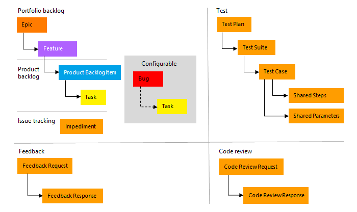
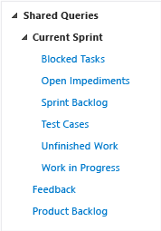

# Manage your Scrum process template artifacts  

[!INCLUDE [version-lt-eq-azure-devops](../../../includes/version-lt-eq-azure-devops.md)]

The Scrum process supports the following work item types (WITs) to plan and track work, tests, feedback, and code review. With different WITs you can track different types of work&mdash;such as product backlog items, tasks, bugs, and more. These artifacts are created when you create a project using the Scrum process. They're based on [Scrum principles and values](https://www.scrum.org/). 

  

Along with the WITs, teams have access to a set of work item queries to track information, analyze progress, and make decisions.  

[!INCLUDE [temp](../../includes/process-customize.md)] 

<a id="start-using-scrum" />

## Plan and track work with Scrum processes

You build your project plan by creating a backlog of work items that represent the features, requirements, user stories, or other work to do. You track bugs, tasks, and blocking issues using the bug, task, and impediment WITs. To support portfolio management, teams create features and epics to view a roll up of their product backlog items within or across teams. For details about using Scrum WITs, see [Scrum process work item types and workflow](scrum-process-workflow.md).  

[!INCLUDE [temp](../../includes/process-guidance-conceptual.md)] 
 
[Scrum work item types and workflow](scrum-process-workflow.md) provides more details about using these WITs.  

 

### List work items

Define work item queries to list work items for a current sprint or the product backlog.  

[!INCLUDE [temp](../../includes/shared-queries.md)] 

::: moniker range="tfs-2018"

Or, use the shared queries that the Scrum process provides.

  

[Descriptions of predefined queries](#predefined-queries) are listed later in this article.   

> [!TIP]
> Queries listed under the **Current Iteration** folder do not automatically update when a new iteration becomes current. The current iteration is based on the dates that you [assign to your sprint schedules](../../sprints/define-sprints.md). You must manually update the iteration path of each query to have it point to the iteration path that corresponds to the current iteration. Or, you can edit the shared query to [use the <strong>@CurrentIteration</strong> macro](../../queries/query-by-date-or-current-iteration.md).

::: moniker-end

[!INCLUDE [temp](../../includes/quick-tips-shared-query.md)] 

## Monitor work progress  

All processes&mdash;Agile, Scrum, and CMMI&mdash;support [building status and trend charts and dashboards](../../../report/dashboards/overview.md). Also, several charts are automatically built based on the Agile tools you use. These charts display within the web portal. 

[!INCLUDE [temp](../../includes/create-lightweight-charts.md)] 

[!INCLUDE [temp](../../includes/powerbi-reports-links.md)] 

::: moniker range="< azure-devops-2022"

## Scrum process and SQL Server reports

If your project collection and the project are configured with SQL Server Analysis Services and Reporting Services, you'll have access to many Scrum reports. For these reports to be useful, [teams must complete certain activities,](/previous-versions/azure/devops/report/admin/review-team-activities-for-useful-reports) such as define build processes, link work items, and update status or remaining work.  

If you need to add reporting services or update reports to the latest versions, see [Add reports to a project](/previous-versions/azure/devops/report/admin/add-reports-to-a-team-project).  

::: moniker-end

## Related articles 

[!INCLUDE [temp](../../includes/create-team-project-links.md)]

### Scrum process versions   

As updates are made to the Scrum process template, the version number is updated. The following table provides a mapping of the versioning applied as updates are made to the Azure DevOps on-premises process templates. For Azure Boards, the latest version is always used. Each template provides a `version` element. This element specifies a major and minor version. 

> [!div class="mx-tdCol2BreakAll"]
> |Version | Scrum process name | Major version |
> |-------------|-------------------|--------------|
> | Azure DevOps Services Azure DevOps Server 2022 | Scrum | 18 |
> | Azure DevOps Server 2020 Azure DevOps Server 2019 | Scrum | 17 |
> | TFS 2018 | Scrum | 16 |

For a summary of updates made to process templates, see [Changes made to process templates](changes-to-process-templates.md).

<a id="predefined-queries" />

::: moniker range="tfs-2018"

### Scrum process predefined queries

Your product owner can plan and track product backlog items and bugs in the product backlog by using the **Product Backlog** query. You can find work items that are assigned to the current sprint by using the shared queries that are listed under the **Current Sprint** folder. These queries find work items that are assigned to a specified iteration or sprint. As you plan more sprints, you can modify these queries to specify the latest sprint and save them to other folders that you create, such as **Sprint 2** or **Sprint 3**.

The project administrator for each project [defines area paths](../../../organizations/settings/set-area-paths.md) and [iteration paths](../../../organizations/settings/set-iteration-paths-sprints.md) for that project so that the team can track progress by those designations.  

> [!div class="mx-tdCol2BreakAll"]
> |Shared queries|Description| 
> |---|---|  
> |Blocked Tasks | Lists all tasks in the current sprint that have been marked as Blocked.|
> |Open Impediments |Lists all open impediment work items in the current sprint.|
> |Sprint Backlog |Lists all product backlog items, bugs, and their linked tasks that your team has committed to complete in the current sprint.|
> |Test Cases |Lists all test cases in the current sprint and sorts them by priority.|
> |Unfinished Work |Lists all product backlog items, bugs, and their linked tasks that have not been marked as Done in the current sprint.|
> |Work in Progress |Lists all tasks in the current sprint that are marked as In Progress.| 
> |Feedback | Lists all feedback responses that are in an Active state. |
> |Product Backlog |Lists all product backlog items and bugs that are assigned to the root iteration. Product backlog items and bugs are sorted by backlog priority.|  

::: moniker-end