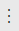

# Manage work item attachments

[!INCLUDE [version-gt-eq-2019](../../includes/version-gt-eq-2019.md)] 
[!INCLUDE [version-vs-gt-eq-2019](../../includes/version-vs-gt-eq-2019.md)] 

Attachments enhance work items by enabling you to share essential information with your team. You can attach files, images, and links directly to work items, facilitating better collaboration and documentation. This article provides guidance on managing attachments within Azure DevOps.

::: moniker range="azure-devops"

Each work item can include up to **100 attachments**, with each file limited to **60 MB**. This article provides guidance on managing attachments within Azure DevOps.

::: moniker-end

::: moniker range="< azure-devops"
By default, each work item can include up to **100 attachments**, with each file limited to **4 MB**. The maximum size of attachments can be configured via the Azure DevOps Server Administration Console. 

::: moniker-end

## Prerequisites

| Category | Requirements |
|--------------|-------------|
| **Permissions** | - To view, follow, and edit work items: **View work items in this node** and **Edit work items in this node** permissions set to **Allow**. By default, the **Contributors** group has these permissions. For more information, see [Set work tracking permissions](../../organizations/security/set-permissions-access-work-tracking.md).   - To add tags to work items: Project-level **Create new tag definition** permission set to **Allow**. By default, the **Contributors** group has this permission. |
| **Access levels** | - [Project member](../../organizations/security/add-users-team-project.md).   - To add new tags to work items or to view or follow pull requests: At least [**Basic** access](../../organizations/security/access-levels.md).   - To view or follow work items: At least **Stakeholder** access. For more information, see [About access levels](../../organizations/security/access-levels.md).   - All project members, including those in the **Readers** group, can send emails containing work items. |
|**Permanent deletion permissions**| To permanently delete attachments: **Permanently delete work items** permission set to **Allow**.|

## Manage attachments through the web portal

Do the following steps to manage attachments through the web portal:

::: moniker range=" azure-devops"

1. Go to the desired work item and select the **Attachments** tab.

   :::image type="content" source="media/manage-work-items/attachments-tab-services.png" alt-text="Screenshot showing highlighted Attachments button in work item." :::

2. Use the **Collapse/Expand** button to toggle the visibility of attachments.

   :::image type="content" source="media/manage-work-items/expand-collapse-attachments.png" alt-text="Screenshot showing highlighted expand or collapse attachments button in work item." :::

3. Switch between **List** and **Grid** views by selecting the corresponding icon.

   :::image type="content" source="media/manage-work-items/attachments-list-grid-view-buttons-services.png" alt-text="Screenshot showing list and grid view buttons." :::

4. After you [add an attachment](#add-attachment), hover over the work item to access the **more actions**  menu. This menu allows you to do the following tasks:
   - **Preview** the attachment
   - [**Add** and **Edit** a comment](#add-and-edit-comment)
   - [**Copy** an attachment link](#copy-attachment-link)
   - [**Download** an attachment](#download-attachment)
   - [**Delete** attachments](#delete-attachment)
   - [**Permanently Delete** an attachment](#permanently-delete-attachment)
### Tips

- **Bulk management**: To manage multiple attachments simultaneously, consider using bulk actions available in the **Attachments** tab.
- **Permissions**: Ensure you have the appropriate permissions to add, edit, or delete attachments. Project administrators typically have full access, while other roles might have limited permissions.
- **File size and type**: Be mindful of the attachment size limits (up to **60 MB** per file) and ensure that the file types you upload are supported by Azure DevOps.

::: moniker-end

::: moniker range="< azure-devops"

1. Go to the desired work item and select the **Attachments** tab.

   :::image type="content" source="media/manage-work-items/attachments-tab-server.png" alt-text="Screenshot of highlighted Attachments button in work item." :::

2. Choose a list or grid view of attachments. The grid view provides a thumbnail preview of the attachment.   

   :::image type="content" source="media/manage-work-items/attachments-list-grid-view-buttons-server.png" alt-text="Screenshot showing list and grid view buttons." :::

3. After you [add an attachment](#add-attachment), hover over the work item to access the **more actions**  menu. This menu allows you to do the following tasks:
   - **Preview** an attachment
   - [**Add** and **Edit** a comment](#add-and-edit-comment)
   - [**Download** an attachment](#download-attachment)
   - [**Delete** an attachment](#delete-attachment)

::: moniker-end

### Add attachment

To add an attachment to a work item, do the following steps:

1. From your work item, select **Attachments** > **Add attachment**.
   
   :::image type="content" source="../backlogs/media/add-attachment.png" alt-text="Screenshot showing highlighted Attachments button.":::

2. Select the file > **Open** > **Save**. 

The attachment gets added to the work item. To add more attachments, select **+ Add attachment**.

### Add and edit comment

To add or edit a comment for an attachment, do the following steps:

::: moniker range="azure-devops"

1. Hover over the attachment and select **more actions** :::image type="icon" source="../media/icons/more-actions.png" border="false"::: > **Edit comment**.

   :::image type="content" source="media/manage-work-items/add-comment-attachment.png" alt-text="Screenshot showing add comment to attachment flow.":::

1. Add or edit your comment and select **Save**.

::: moniker-end

::: moniker range="< azure-devops"

1. Select or hover over the attachment and select **more actions** :::image type="icon" source="../media/icons/more-actions-horizontal.png" border="false"::: > **Edit comment**.

   :::image type="content" source="media/manage-work-items/add-comment-attachment.png" alt-text="Screenshot showing add comment to attachment flow.":::

1. Edit your comment and select **Save**.

::: moniker-end

::: moniker range="azure-devops"

### Copy attachment link

To copy the link to an attachment:

Hover over the attachment and select **more actions** :::image type="icon" source="../media/icons/more-actions.png" border="false"::: > **Copy attachment link**.

::: moniker-end

### Download attachment

To download an attachment to your browser's download directory:

::: moniker range="azure-devops"

Hover over the attachment and select **more actions** :::image type="icon" source="../media/icons/more-actions.png" border="false"::: > **Edit comment**.

::: moniker-end

::: moniker range="< azure-devops"

Select or hover over the attachment and select **more actions** :::image type="icon" source="../media/icons/more-actions-horizontal.png" border="false"::: > **Download attachment**.

::: moniker-end

### Delete attachment

To delete an attachment, do the following steps: 

::: moniker range="azure-devops"

1. Hover over the attachment and select **more actions** :::image type="icon" source="../media/icons/more-actions.png" border="false"::: > **Delete attachment**.

1. Select **Delete** to confirm you want to delete the attachment.

   :::image type="content" source="../backlogs/media/confirm-delete-attachment.png" alt-text="Screenshot showing Delete button for confirming delete action.":::

::: moniker-end

::: moniker range="< azure-devops"

1. Select or hover over the attachment and select **more actions** :::image type="icon" source="../media/icons/more-actions-horizontal.png" border="false"::: > **Delete attachment**.

1. Select **Delete** to confirm you want to delete the attachment.

   :::image type="content" source="../backlogs/media/confirm-delete-attachment.png" alt-text="Screenshot showing Delete button for confirming delete action.":::

The deleted attachment can't be restored and is permanently removed after 28 days. In the meantime, if you have permissions, you can [permanently delete](#permanently-delete-attachment) it.

::: moniker-end

The deleted attachment can't be restored and is permanently removed after 28 days. In the meantime, if you have permissions, you can [permanently delete](#permanently-delete-attachment) it.

::: moniker range="azure-devops"

### Permanently delete attachment

This action is typically reserved for situations requiring immediate removal, such as when files are infected. Otherwise, deleted attachments are automatically removed within 28 days.

1. From your work item, select the **Attachments** tab. 
2. Select **more actions** :::image type="icon" source="../media/icons/more-actions.png" border="false"::: > **Permanently delete attachment**.

   :::image type="content" source="../backlogs/media/permanently-delete-attachment.png" alt-text="Screenshot showing permanently delete attachment flow.":::

3. Select **Delete** to confirm you want to permanently delete the attachment.

   :::image type="content" source="../backlogs/media/confirm-permanently-delete-attachment.png" alt-text="Screenshot showing Delete button for confirming permanent delete action.":::

The attachment is permanently deleted and isn't accessible from any other links. 

> [!NOTE]
> This feature requires the **New Boards Hub**, which is enabled by default. For more information, see [Manage or enable features](../../project/navigation/preview-features.md).

::: moniker-end

## Related articles

- [Learn about work items and work item types](about-work-items.md)
- [Manage work items](../backlogs/manage-work-items.md)
- [View and add work items](view-add-work-items.md)
