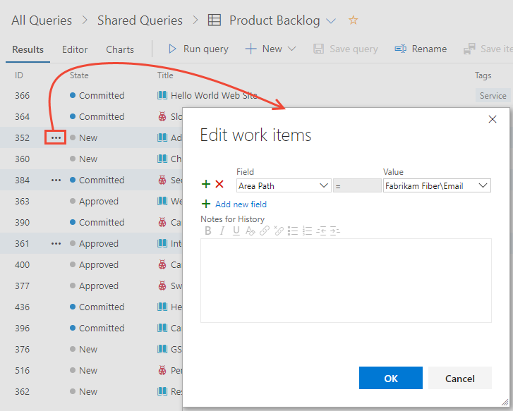
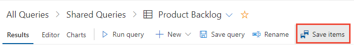
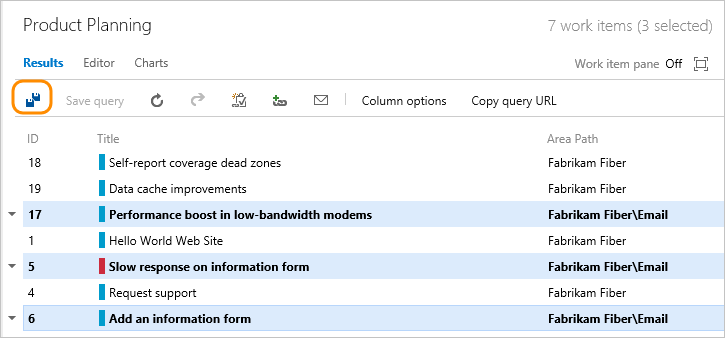

# Move work items from one team to another team

[!INCLUDE [version-lt-eq-azure-devops](../../includes/version-lt-eq-azure-devops.md)]

When you add a team or your teams undergo reorganization, you may need to move work items assigned to one team to new **Area Paths** owned by another team. All work items are assigned to an **Area Path**, even if it is at the top of the hierarchy for the project.  

Work items that belong to the Requirements category appear on a team's backlog based on their assignment to the **Area Path(s)** owned by a team. Assigning other work items to a team's **Area Path(s)** support queries based on team ownership. 

To learn how to add a team, see [Create or add a team](../../organizations/settings/add-teams.md). 
 

## Prerequisites 

::: moniker range="azure-devops"  

- To change the **Area Paths** of work items, you must be a project member and have permissions to view and edit work items under the **Area Path** nodes. To learn about these permissions, see [Set work tracking permissions, Create child nodes, modify work items under an area or iteration path](../../organizations/security/set-permissions-access-work-tracking.md#create-child-nodes-modify-work-items-under-an-area-or-iteration-path).    
- To use Azure CLI commands, you must first install Azure CLI as described in [Get started with Azure DevOps CLI](../../cli/index.md).   

::: moniker-end  

::: moniker range="< azure-devops"  

- To change the **Area Paths** of work items, you must be a project member and have permissions to view and edit work items under the **Area Path** nodes. To learn about these permissions, see [Set work tracking permissions, Create child nodes, modify work items under an area or iteration path](../../organizations/security/set-permissions-access-work-tracking.md#create-child-nodes-modify-work-items-under-an-area-or-iteration-path).  

::: moniker-end  


## Move work items under teams 

From the web portal, you can perform bulk updates of the **Area Path**.  
 
::: moniker range=">= azure-devops-2019"

1. [Create a query](../queries/using-queries.md) of all work items you want to reassign. 

1. Multi-select those items, which belong to each team, and [bulk edit the area path](../backlogs/bulk-modify-work-items.md).

   

1. After you bulk modify, do a bulk save.  
  
     
 
::: moniker-end

::: moniker range="tfs-2018"  

1. [Create a query](../queries/using-queries.md) of all work items you want to reassign. Multi-select those items belonging to each team, and [bulk edit the area path](../backlogs/bulk-modify-work-items.md).

2. After you bulk modify, do a bulk save.  

     

::: moniker-end  

<a id="move-work-items" /> 


::: moniker range="azure-devops"   

## Move a work item using Azure CLI

You can use the [az boards work-item update](/cli/azure/boards/work-item#az-boards-work-item-update) to move a single work item by updating it's Area Path.   

> [!div class="tabbedCodeSnippets"]
```azurecli
az boards work-item update --id
                           [--area]
                           [--assigned-to]
                           [--description]
                           [--discussion]
                           [--fields]
                           [--iteration]
                           [--open]
                           [--reason]
                           [--state]
                           [--title]
```

#### Parameters

- **id**: Required. The ID of the work item to update.
- **area**: Optional. Absolute path of an area. Example: --path \ProjectName\Area\AreaName.  
- **assigned-to**: Optional. Name of the person the work item is assigned to *Jamal*.
- **description**: Optional. Description of the work item. 
- **discussion**: Optional. Comment to add to a discussion in a work item.
- **fields**: Optional. Space separated "field=value" pairs for custom fields you want to set.
- **iteration**: Optional. Absolute path of an iteration. Example: \ProjectName\Iteration\IterationName.  
- **open**: Optional. Open the work item in the default web browser. 
- **reason**: Optional. Reason for the state of the work item. 
- **state**: Optional. State of the work item, for example, *Active*. 
- **title**: Optional. Title of the work item. 

#### Example

You can only move one work item at a time using Azure DevOps CLI. In this example, we move work item *ID=148* under the *Fabrikam Fiber\Production Planning* area path.

> [!div class="tabbedCodeSnippets"]
```azurecli
az boards work-item update --id 148 --area "Fabrikam Fiber\Production Planning" --output yaml
```

The YAML output listed below provides information on each of the fields defined for the work item. 

> [!div class="tabbedCodeSnippets"]
```YAML output
fields:
  Microsoft.VSTS.Common.Priority: 2
  Microsoft.VSTS.Common.StackRank: 1500000001.0
  Microsoft.VSTS.Common.StateChangeDate: '2021-11-23T22:26:28.27Z'
  Microsoft.VSTS.Common.ValueArea: Business
  System.AreaPath: Fabrikam Fiber\Production Planning
  System.AssignedTo:
    _links:
      avatar:
        href: https://fabrikamprime.visualstudio.com/_apis/GraphProfile/MemberAvatars/aad.NDEwY2FkMDQtOWQyOS03NDFlLTk2MmEtNGZlYmU2NGE1NTM4
    descriptor: aad.NDEwY2FkMDQtOWQyOS03NDFlLTk2MmEtNGZlYmU2NGE1NTM4
    displayName: Jamal Hartnett
    id: d291b0c4-a05c-4ea6-8df1-4b41d5f39eff
    imageUrl: https://fabrikamprime.visualstudio.com/_apis/GraphProfile/MemberAvatars/aad.NDEwY2FkMDQtOWQyOS03NDFlLTk2MmEtNGZlYmU2NGE1NTM4
    uniqueName: fabrikamfiber4@hotmail.com
    url: https://spsprodeus27.vssps.visualstudio.com/A5d5b8da6-3db7-4829-baf9-1e500c21cc12/_apis/Identities/d291b0c4-a05c-4ea6-8df1-4b41d5f39eff
  System.BoardColumn: Backlog
  System.ChangedBy:
   _links:
      avatar:
        href: https://fabrikamprime.visualstudio.com/_apis/GraphProfile/MemberAvatars/aad.NDEwY2FkMDQtOWQyOS03NDFlLTk2MmEtNGZlYmU2NGE1NTM4
    descriptor: aad.NDEwY2FkMDQtOWQyOS03NDFlLTk2MmEtNGZlYmU2NGE1NTM4
    displayName: Jamal Hartnett
    id: d291b0c4-a05c-4ea6-8df1-4b41d5f39eff
    imageUrl: https://fabrikamprime.visualstudio.com/_apis/GraphProfile/MemberAvatars/aad.NDEwY2FkMDQtOWQyOS03NDFlLTk2MmEtNGZlYmU2NGE1NTM4
    uniqueName: fabrikamfiber4@hotmail.com
    url: https://spsprodeus27.vssps.visualstudio.com/A5d5b8da6-3db7-4829-baf9-1e500c21cc12/_apis/Identities/d291b0c4-a05c-4ea6-8df1-4b41d5f39eff
  System.ChangedDate: '2022-05-19T22:58:52.93Z'
  System.CommentCount: 0
  System.CreatedBy:
   _links:
      avatar:
        href: https://fabrikamprime.visualstudio.com/_apis/GraphProfile/MemberAvatars/aad.NDEwY2FkMDQtOWQyOS03NDFlLTk2MmEtNGZlYmU2NGE1NTM4
    descriptor: aad.NDEwY2FkMDQtOWQyOS03NDFlLTk2MmEtNGZlYmU2NGE1NTM4
    displayName: Jamal Hartnett
    id: d291b0c4-a05c-4ea6-8df1-4b41d5f39eff
    imageUrl: https://fabrikamprime.visualstudio.com/_apis/GraphProfile/MemberAvatars/aad.NDEwY2FkMDQtOWQyOS03NDFlLTk2MmEtNGZlYmU2NGE1NTM4
    uniqueName: fabrikamfiber4@hotmail.com
    url: https://spsprodeus27.vssps.visualstudio.com/A5d5b8da6-3db7-4829-baf9-1e500c21cc12/_apis/Identities/d291b0c4-a05c-4ea6-8df1-4b41d5f39eff
  System.CreatedDate: '2021-11-23T22:26:28.27Z'
  System.Description: <div>This user story is for documentation purposes.&nbsp; </div>
  System.IterationPath: Fabrikam Fiber\Release 2\Sprint 1
  System.Reason: New
  System.State: New
  System.TeamProject: Fabrikam Fiber
  System.Title: Test the Request feedback functionality
  System.WorkItemType: User Story
  WEF_10182DA5BCCD4CE2A43629FFBD290EF2_Kanban.Column: Backlog
id: 148
relations:
- attributes:
    isLocked: false
    name: Child
  rel: System.LinkTypes.Hierarchy-Forward
  url: https://fabrikamprime.visualstudio.com/854a3f67-9962-43d1-a968-2e5f2eb66c99/_apis/wit/workItems/152
- attributes:
    isLocked: false
    name: Child
  rel: System.LinkTypes.Hierarchy-Forward
  url: https://fabrikamprime.visualstudio.com/854a3f67-9962-43d1-a968-2e5f2eb66c99/_apis/wit/workItems/153
- attributes:
    isLocked: false
    name: Child
  rel: System.LinkTypes.Hierarchy-Forward
  url: https://fabrikamprime.visualstudio.com/854a3f67-9962-43d1-a968-2e5f2eb66c99/_apis/wit/workItems/151
- attributes:
    isLocked: false
    name: Child
  rel: System.LinkTypes.Hierarchy-Forward
  url: https://fabrikamprime.visualstudio.com/854a3f67-9962-43d1-a968-2e5f2eb66c99/_apis/wit/workItems/149
rev: 5
url: https://fabrikamprime.visualstudio.com/854a3f67-9962-43d1-a968-2e5f2eb66c99/_apis/wit/workItems/148

```

::: moniker-end 
 

## Verify your team backlog 

After you move work items from one team to another team, check your team backlog to ensure the items appear. See [Create your backlog](../backlogs/create-your-backlog.md).  

If you encounter any problems, review [Set up your project's backlogs and boards](../backlogs/set-up-your-backlog.md).

## Related articles

- [Create or add a team](../../organizations/settings/add-teams.md)
- [About teams and Agile tools](../../organizations/settings/about-teams-and-settings.md) 