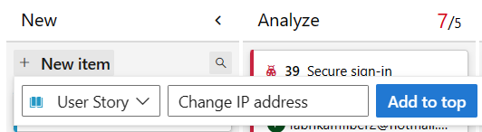

# View and add work items

[!INCLUDE [version-gt-eq-2019](../../includes/version-gt-eq-2019.md)] 
[!INCLUDE [version-vs-gt-eq-2019](../../includes/version-vs-gt-eq-2019.md)] 

View work items that you created or are assigned to you. The **Work items** page offers several personalized pivots and interactive filter functions to streamline listing work items. Use this page to quickly find work items defined across teams within a project.

This article shows how to add any type of work item. However, use the backlog or board to add backlog or portfolio items—such as user stories, product backlog items, features, or epics. For more information, see [Create your backlog](../backlogs/create-your-backlog.md), [Define features and epics](../backlogs/define-features-epics.md), and [Start using your board](../boards/kanban-quickstart.md).

To create test cases and link them to user stories, see [Add, run, and update inline tests](../boards/add-run-update-tests.md) and [Create test plans and test suites](../../test/create-a-test-plan.md).

You can add work items in the following ways:

- [Add work items from the Work items page](#add-a-work-item-from-the-work-items-page)
- [Add work items from a Boards, Backlogs, or Sprints page](#add-a-work-item-from-a-boards-backlogs-or-sprints-page)
- [Add work items using the Azure DevOps CLI](#add-a-work-item-from-a-boards-backlogs-or-sprints-page)

These methods provide flexibility in how you manage and track your work items within Azure DevOps.

> [!NOTE]     
> The **Work Items** page is available from Azure DevOps Services, Azure DevOps Server 2019 and later versions, and Visual Studio 2019 RC1. 

[!INCLUDE [temp](../includes/prerequisites-work-items.md)] 

## Open the Work items page

# [Web portal](#tab/browser)

From your project, select **Boards** > **Work items**. 

> [!div class="mx-imgBorder"]  
> 

# [Visual Studio 2019](#tab/visual-studio)

Open Visual Studio 2019, Team Explorer, and then select **Work Items**. To switch between the **Work Items** (default) view and the legacy view, see [Set the Work Items experience in Visual Studio 2019](set-work-item-experience-vs.md).  

[!INCLUDE [temp](../includes/note-git-vs-github-connect.md)] 

> [!div class="mx-imgBorder"]  
>  

If you don't see the **Work Items** option, you're not connected to a project. From the Connect to a Project dialog. Use **CTRL-Shift** to select your options and then choose **Connect**.

> [!div class="mx-imgBorder"]  
> 

::: moniker range="azure-devops-2019"

> [!NOTE]   
> The new **Work Items** experience is available when you connect to a Azure Repos Git repository. If you connect to a TFVC repository, you'll continue to see the legacy query-focused experience.  

::: moniker-end

# [Azure DevOps CLI](#tab/azure-devops-cli)

There's no [**az boards**](/cli/azure//boards) command that opens the **Work Items** page at this time. The Azure DevOps CLI commands are valid for Azure DevOps Services only.

---

> [!NOTE]    
> The types of work items you can create depend on the process chosen when the project was created—[Agile](guidance/agile-process-workflow.md), [Basic](../get-started/plan-track-work.md), [Scrum](guidance/scrum-process-workflow.md), or [CMMI](guidance/cmmi-process-workflow.md). For example, backlog items may be called user stories (Agile), issues (Basic), product backlog items (Scrum), or requirements (CMMI). All these types describe the customer value to deliver and the work to be performed.
>
> For more information, see [About processes and process templates](../work-items/guidance/choose-process.md). 

## View work items

You can view work items assigned to you, work items you're following, work items in which you're mentioned, and work items that you recently viewed or updated via the web portal and Visual studio.

::: moniker range="azure-devops"

You can also view work items usings the Azure DevOps CLI.

::: moniker-end


# [Web portal](#tab/browser)

Use the drop-down menu to focus on relevant items within a project using one of seven pivots. Additionally, [filter](#filter-to-create-personal-views) each pivot view.  

:::row:::
   :::column span="1":::
      ::: moniker range=">= azure-devops-2020"
        
      ::: moniker-end
      ::: moniker range="< azure-devops-2020"
        
      ::: moniker-end
   :::column-end:::
   :::column span="2":::
      ::: moniker range=">= azure-devops-2022" 
      - **Assigned to me**: Lists all work items assigned to you in the project in the order they were last updated. Doesn't include items moved to the **Removed** category state. To open or update a work item, select its title.  
      - **Following**: Lists work items that you&#39;re [following](follow-work-items.md).  
      - **Mentioned**: Lists work items in which you're mentioned in the last 30 days.  
      - **My activity**: Lists work items that you recently viewed or updated.  
      - **My team(s)**: Lists work items that your team members recently viewed or updated.  
      ::: moniker-end
      ::: moniker range="azure-devops-2020" 
      - **Assigned to me**: Lists all work items assigned to you in the project in the order they were last updated. To open or update a work item, select its title.  
      - **Following**: Lists work items that you&#39;re [following](follow-work-items.md).  
      - **Mentioned**: Lists work items in which you're mentioned in the last 30 days.  
      - **My activity**: Lists work items that you recently viewed or updated.  
      - **My team(s)**: Lists work items that your team members recently viewed or updated.  
      ::: moniker-end
      ::: moniker range="< azure-devops-2020" 
      - **Assigned to me**: Lists all work items assigned to you in the project in the order they were last updated. To open or update a work item, select its title.  
      - **Following**: Lists work items that you&#39;re [following](follow-work-items.md).  
      - **Mentioned**: Lists work items in which you're mentioned in the last 30 days.  
      - **My activity**: Lists work items that you recently viewed or updated.   
      ::: moniker-end
      ---
      - **Recently updated**: Lists work items recently updated in the project.  
      - **Recently completed**: Lists work items completed or closed in the project.  
      - **Recently created**: Lists work items created within the last 30 days in the project.  
   :::column-end:::
:::row-end:::

You can sort your view by any column field selected from the **Column Options** dialog in the web portal. For more information, see [Change column options](../backlogs/set-column-options.md).

# [Visual Studio 2019](#tab/visual-studio)

To view a work item, double-select the title or open the context menu (right-select or select the menu key) and **Open**. A browser window opens with the work item form.

:::row:::
   :::column span="2":::
        
   :::column-end:::
   :::column span="2":::
      - **Assign to me**: Changes the **Assigned To** field to your user name.    
      - **New Branch...**: Opens a dialog to create a new branch automatically linked to the work item. For more information, see [Drive Git development](../backlogs/connect-work-items-to-git-dev-ops.md).
      - **Complete work item**: Updates the **State** field to Completed, Done, or Closed.
      - **Relate to changes**: Links the work item to the current commit of recent changes.  
   :::column-end:::
:::row-end:::


# [Azure DevOps CLI](#tab/azure-devops-cli)

::: moniker range="azure-devops"  

You can view a new work item with the [az boards work-item show](/cli/azure/boards/work-item?#az-boards-work-item-show) command. To get started, see [Get started with Azure DevOps CLI](../../cli/index.md).

```azurecli
az boards work-item show --id
                         [--open]
                         [--org]
```

#### Parameters

- **id**: Required. The ID of the work item.
- **open**: Optional. Open the work item in the default web browser.
- **org**: Azure DevOps organization URL. You can configure the default organization using `az devops configure -d organization=ORG_URL`. Required if not configured as default or picked up using `git config`. Example: `--org https://dev.azure.com/MyOrganizationName/`.

#### Example

The following command opens the bug with the ID 864 in your default web browser. It also displays the results in the Azure DevOps CLI in table format.

```azurecli
az boards work-item show --id 864  --open --output table

ID    Type    Title      Assigned To          State
----  ------  ---------  -------------------  -------
864   Bug     fix-issue  contoso@contoso.com  New
```

::: moniker-end

[!INCLUDE [temp](../../includes/note-cli-not-supported.md)]

---


## Filter to create personal views

Filter each work item pivot view by entering a keyword or using fields like work item type (Types), State, Area Path, and Tags. The page remembers your filters for each pivot, providing personalized views across all pivots. For more information, see [Filter backlogs, boards, queries, and plans](../backlogs/filter-backlogs-boards-plans.md).

# [Web portal](#tab/browser)

> [!div class="mx-imgBorder"]
> 

# [Visual Studio 2019](#tab/visual-studio)

> [!div class="mx-imgBorder"]
> 

# [Azure DevOps CLI](#tab/azure-devops-cli)

No [**az boards**](/cli/azure//boards) command applies to filtering. Azure DevOps CLI commands are only valid for Azure DevOps Services.

---

## Add work items

You can add work items from the **Work Items** page or from a **Boards**, **Backlogs**, or **Sprints** page in the web portal, from Visual Studio, or by using the Azure DevOps CLI.

## Add a work item from the Work items page

> [!NOTE]   
> New work items are assigned the last **Area Path** and **Iteration Path** selected by the user. 

# [Web portal](#tab/browser)

Select **New Work Item** and choose the work item type from the drop-down menu.
For example, here we choose User Story. 

> [!div class="mx-imgBorder"]  
> 

> [!TIP]    
> Work items you add are automatically assigned to the current team's area and iteration paths. To change the team context, see [Switch project or team focus](../../project/navigation/go-to-project-repo.md?toc=/azure/devops/boards/work-items/toc.json). Enter a title and save the work item. You must save it before changing its initial default state.  

  

# [Visual Studio 2019](#tab/visual-studio)

1. Select **New Work Item** and choose the work item type you want. For example, we choose User Story.

> [!div class="mx-imgBorder"]  
> 

A browser window opens, displaying the work item form for you to complete.
 
2. Enter a title and then **Save** the work item. You must save it before changing its initial default state.

  

# [Azure DevOps CLI](#tab/azure-devops-cli) 

[!INCLUDE [temp](../includes/add-work-items-cli.md)]

[!INCLUDE [temp](../../includes/note-cli-not-supported.md)]

---

[Add tags to any work item](../queries/add-tags-to-work-items.md) to filter backlogs, queries, and work item lists. Users with **Basic** access can create new tags, while users with **Stakeholder** access can only add existing tags.

## Add a work item from a Boards, Backlogs, or Sprints page

Do the following steps to add a work item from your Boards, Backlogs, or Sprints page.

### [Browser](#tab/browser/)

1. From your **Boards**, **Backlogs**, or **Sprints** page, choose the :::image type="icon" source="../../media/icons/blue-add.png" border="false"::: plus icon or **+ New Work Item**. The following example shows creating a work item from a board.
   
   :::image type="content" source="media/new-work-item-button.png" alt-text="Screenshot showing highlighted New item button, for creating a work item.":::

   > [!NOTE]
   > Depending on the process chosen when the project was created&mdash;[Agile](../work-items/guidance/agile-process.md), [Basic](../get-started/plan-track-work.md), [Scrum](../work-items/guidance/scrum-process.md),
   or [CMMI](../work-items/guidance/cmmi-process.md)&mdash;the types of work items you can create are different. For example, backlog items may be called user stories (Agile), issues (Basic) product backlog items (Scrum), or requirements (CMMI). All four are similar: they describe the customer value to deliver and the work to be performed.
   >
   > For more information, see [About processes and process templates](../work-items/guidance/choose-process.md). The Basic process requires Azure DevOps Server 2019.1 or later version.

2. Select a work item type from the dropdown menu, enter a title, and then select **Enter**. From a board, for example, you can also select **Add to top**. Before you can change the state from its initial default, save it.  

     

You can [add tags to any work item to filter backlogs and queries](../queries/add-tags-to-work-items.md).

Added work items are automatically scoped to your team's default area path and iteration path. To change the team context, see [Switch project or team focus](../../project/navigation/go-to-project-repo.md).

Create as many work items as you need of the type you need to track the work you want to manage.  

### [Visual Studio 2019](#tab/visual-studio/)

1. Open Visual Studio 2019, Team Explorer, and then choose **Work Items**. 

    > [!div class="mx-imgBorder"]  
    >  

    If you don't see the **Work Items** option, you need to connect to a project and not just a repository. From the Connect to a Project dialog. Use **CTRL-Shift** to select your options and then choose **Connect**.

    > [!div class="mx-imgBorder"]  
    > 

1. Choose **New Work Item** and select the work item type you want. 

    > [!div class="mx-imgBorder"]  
    > 

    When you work within Visual Studio 2017 or later version, a browser window opens with the work item form to complete. If you work within Visual Studio 2015 or earlier version, a work item form opens within Visual Studio. 

### [Azure DevOps CLI](#tab/azure-devops-cli/)

[!INCLUDE [temp](../includes/add-work-items-cli.md)]

[!INCLUDE [temp](../../includes/note-cli-not-supported.md)]

* * *

## Open a view as a query  

From the web portal, you can open any view, filtered view, or selected set of work items as a query. Choose **Open in Queries** or the **Open selected items in Queries** option from the context menu. 

Queries provide the following features and more: 
* Edit one or more fields of several work items    
* Add or remove tags from several work items 
* Change the work item type 
* Delete work items 
* Apply work item templates

For more information, see [Bulk modify work items](../backlogs/bulk-modify-work-items.md?toc=/azure/devops/boards/work-items/toc.json). For more information about queries, see [Use the query editor to list and manage queries](../queries/using-queries.md) and [Query fields, operators, and macros](../queries/query-operators-variables.md).

## Use work items page controls  

Use the following three controls to manage your views in the web portal.

> [!div class="mx-tdBreakAll"]
> | Control    | Function       |
> |--------------------------|-------------------------------|
> |  | View/hide completed items | 
> |  | [Turn filtering On/Off](#filter-to-create-personal-views)  | 
> |  /      | Enter or exit full screen mode      |

## Next steps

> [!div class="nextstepaction"]
> [Manage work items](../backlogs/manage-work-items.md)

## Related articles

- [Azure Boards FAQs](../faqs.yml)   
- [Move, change, or delete work items (Recycle Bin)](../backlogs/remove-delete-work-items.md)
- [Manage or enable features](../../project/navigation/preview-features.md)
- [Use work item form controls](about-work-items.md#work-item-form-controls)
- [Keyboard shortcuts](../../project/navigation/keyboard-shortcuts.md)
- [Work across projects](../../project/navigation/work-across-projects.md)
