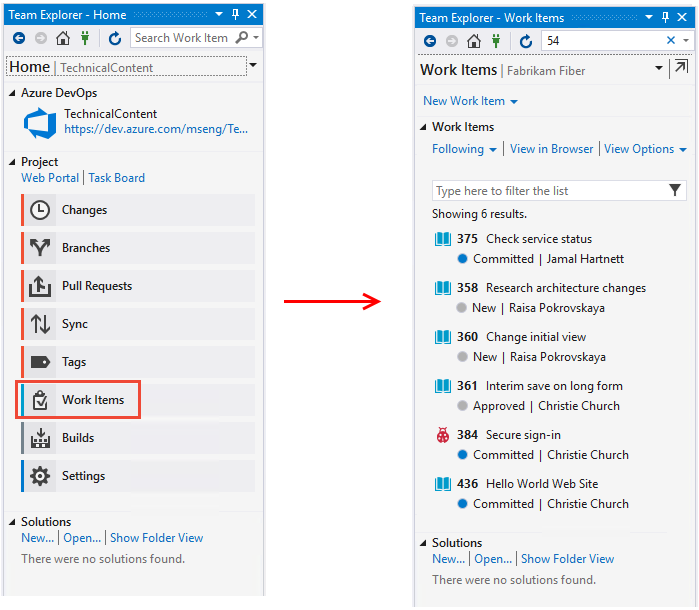
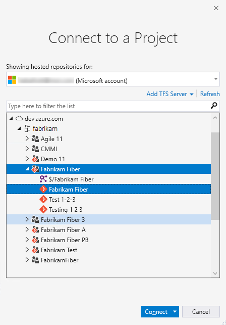
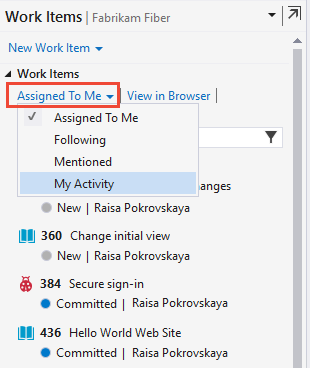
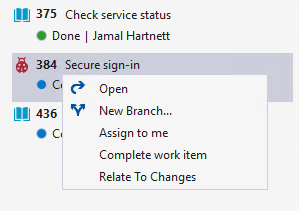
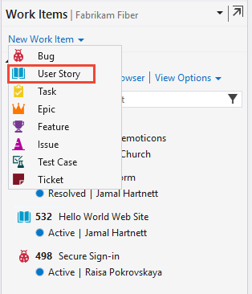
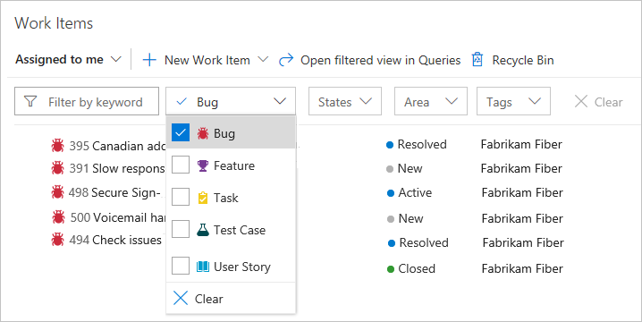
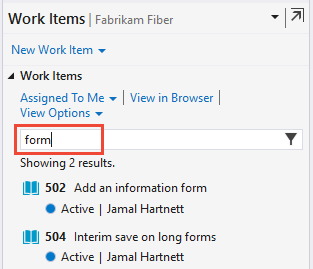

# View and add work items using the Work Items page  

**Azure Boards | Azure DevOps Server 2019 | Visual Studio 2019** 

View work items that you created or are assigned to you. The **Work Items** page provides several personalized pivots and filter functions to streamline listing work items. Use this page to quickly find work items defined across teams within a project. 

> [!NOTE]     
> The **Work Items** page is currently available from Azure DevOps Services, Azure DevOps Server 2019 RC1, and Visual Studio 2019 RC1. 

[!INCLUDE [temp](../_shared/prerequisites-work-items.md)] 

## Open Work Items

You can start viewing and adding work items once you connect to a project. 

<a id="browser" /> 

# [Web portal](#tab/browser)

(1) Check that you have selected the right project, then (2) choose **Boards>Work Items**. 

> [!div class="mx-imgBorder"]  
> 

::: moniker range="azure-devops-2019"

> [!NOTE]   
> The new Work Items experience is available when you connect to a GitHub repository. If you connect to a TFVC repository, you'll continue to see the legacy query-focused experience. 
::: moniker-end

# [Visual Studio 2019](#tab/visual-studio)

Open Visual Studio 2019, Team Explorer, and then choose **Work Items**. 

> [!div class="mx-imgBorder"]  
>  

If you don't see the **Work Items** option, you need to connect to a project and not just a repository. From the Connect to a Project dialog. Use **CTRL-Shift** to select your options and then choose **Connect**.

> [!div class="mx-imgBorder"]  
> 

---

> [!NOTE]    
> Depending on the process chosen when the project was created&mdash;[Agile](guidance/agile-process-workflow.md), [Scrum](guidance/scrum-process-workflow.md), or [CMMI](guidance/cmmi-process-workflow.md)&mdash;the types of work items you can create will differ. For example, backlog items may be called user stories (Agile), product backlog items (Scrum), or requirements (CMMI). All three are similar: they describe the customer value to deliver and the work to be performed.
>
> For an overview of all three processes, see [Choose a process](../work-items/guidance/choose-process.md). 

## View work items

Using the drop-down menu, you can focus on relevant items inside a project using one of seven pivots. Additionally, you can [filter](#filter) and [sort](#sort) each pivot view.  

# [Web portal](#tab/browser)

<table>
<tbody valign="top">
<tr>
<td>

</td>
<td>
<ul>
<li>**Assigned to me**: lists all work items assigned to you in the project in the order they were last updated. To open or update a work item, simply click its title.</li>
<li>**Following**: lists work items that you're [following](follow-work-items.md). </li>
<li>**Mentioned**: lists work items in which you've been mentioned in the last 30 days. </li>
<li>**My activity**: lists work items that you've recently viewed or updated.</li>
<li>**Recently updated**: lists work items recently updated in the project. </li>
<li>**Recently completed**: lists work items completed or closed in the project.</li>
<li>**Recently created**: lists work items created within the last 30 days in the project.</li>
</ul>
</td>
</tr>
</tbody>
</table>

# [Visual Studio 2019](#tab/visual-studio)

<table>
<tbody valign="top">
<tr>
<td>

</td>
<td>
<ul>
<li>**Assigned to me**: lists all work items assigned to you in the project in the order they were last updated. To open or update a work item, simply click its title.</li>
<li>**Following**: lists work items that you're [following](follow-work-items.md). </li>
<li>**Mentioned**: lists work items in which you've been mentioned in the last 30 days. </li>
<li>**My activity**: lists work items that you've recently viewed or updated.</li>
</ul>
</td>
</tr>
</tbody>
</table>

To view a work item, double-click the title or open the context menu for the work item (right-click or enter the menu key) and select **Open**. A browser window will open with the work item form.

<table>
<tbody valign="top">
<tr>
<td>

</td>
<td>
Additional menu options support the following tasks: 
<ul>
<li>**Assign to me**: Changes the Assigned to field to your user name. </li>
<li>**New Branch...**: Opens a dialog to create a new branch automatically linked to the work item. For details, see [Drive GIt development](../backlogs/connect-work-items-to-git-dev-ops.md). </li>
<li>**Complete work item**: Updates the State field to Completed, Done, or Closed. </li>
<li>**Relate to changes**: Links the work item to the current commit of recent changes.</li>
</ul>
</td>
</tr>
</tbody>
</table>

---

## Add a work item
Adding a work item is just one click away. Simply choose the work item type from the **New Work Item** drop down menu.  

For example, here we choose User Story. 

# [Web portal](#tab/browser)

> [!div class="mx-imgBorder"]  
> 

# [Visual Studio 2019](#tab/visual-studio)

Choose **New Work Item** and select the work item type you want. 

> [!div class="mx-imgBorder"]  
> 

A browser window will open with the work item form to fill out. 

---

<!---
> [!TIP]    
> Work items you add are automatically scoped to the currently selected team's area and iteration paths. To change the team context, see [Switch project or team focus](../../project/navigation/go-to-project-repo.md?toc=/azure/devops/boards/work-items/toc.json&bc=/azure/devops/boards/work-items/breadcrumb/toc.json). -->

Enter a title and then save the work item. Before you can change the State from its initial default, you must save it.  

  

You can [add tags to any work item](../queries/add-tags-to-work-items.md) to filter backlogs, queries, and work item lists. Users with **Basic** access can create new tags by default, users with **Stakeholder** access can only add existing tags. 

 
<a id="filter" />
## Filter to create personal views

You can filter each work item pivot view by typing a keyword or using one or more of the fields provided, such as work item type (Types), State, Area Path, and Tags. The page remembers the filters you set for each pivot, supporting personalized views across all pivots.  

# [Web portal](#tab/browser)

> [!div class="mx-imgBorder"]

# [Visual Studio 2019](#tab/visual-studio)

> [!div class="mx-imgBorder"]

---

<a id="sort" />
## Add columns and sort by a column 

From the web portal, you can sort your view by one of the column fields that you select from the **Column Options** dialog. For details, see [Change column options](../backlogs/set-column-options.md).

[!INCLUDE [temp](../_shared/discussion-tip.md)] 

## Copy selected items to the clipboard or email them

To select several items in a sequence, hold down the shift key from a web portal page. To select several non-sequential items, use the **Ctrl** key. Then, you can use **Ctrl+c** to copy the selected items to a clipboard. Or, you can open the context menu for the selected work items, click ( actions icon), and then select an option from the menu. 

> [!div class="mx-imgBorder"]

## Open a view as a query  

From the web portal, you can open any view, filtered view, or selected set of work items as a query. Simply choose **Open in Queries** or the **Open selected items in Queries** option from the context menu. 

Queries provide additional features that you can use, including: 
* Edit one or more fields of several work items    
* Add or remove tags from several work items 
* Change the work item type 
* Delete work items 
* Apply work item templates
* And more

For details, see [Bulk modify work items](../backlogs/bulk-modify-work-items.md?toc=/azure/devops/boards/work-items/toc.json&bc=/azure/devops/boards/work-items/breadcrumb/toc.json). To learn more about queries, see [Use the query editor to list and manage queries](../queries/using-queries.md).  

## Work Items page controls  

Use the following three controls to manage your views in the web portal.

> [!div class="mx-tdBreakAll"]
> | Control                  | Function                      |
> |--------------------------|-------------------------------|
> |  | View/hide completed items | 
> |  | [Turn filtering On/Off](#filter)  | 
> |  /      | Enter or exit full screen mode      |

## Related articles
- [Best tool to add, update, and link work items](best-tool-add-update-link-work-items.md)  
- [Move, change, or delete work items (Recycle Bin)](../backlogs/remove-delete-work-items.md?toc=/azure/devops/boards/work-items/toc.json&bc=/azure/devops/boards/work-items/breadcrumb/toc.json)
- [Enable preview features](../../project/navigation/preview-features.md)
- [Use work item form controls](work-item-form-controls.md)
- [Keyboard shortcuts for work item forms and the Work Items page](work-item-form-keyboard-shortcuts.md)
- [Work across projects](../../project/navigation/work-across-projects.md)

> [!NOTE]
> You can create and manage work items from the command line or scripts using the [Azure DevOps CLI](/cli/azure/ext/azure-devops/?view=azure-cli-latest).

