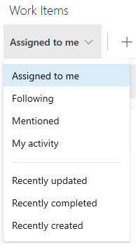

# View and add work items using the Work Items page  

**Azure Boards | TFS 2018.2**  

View work items that you created or are assigned to you. The **Boards>Work Items** page provides several personalized pivots and filter functions to streamline listing work items. Use this page to quickly find work items defined across teams within a project. 

::: moniker range=">= tfs-2018"
> [!NOTE]     
> The **Work Items** page is available from TFS 2018.2 and later versions. 
::: moniker-end  

## Prerequisites 

- You must connect to a project. If you don't have a project yet, [create one](../get-started/index.md). You can then [connect to a project from your web portal or Visual Studio](../../organizations/projects/connect-to-projects.md).
- To view or add work items, you must be a member of the Contributors group or be granted [Stakeholder access](../../organizations/security/get-started-stakeholder.md). If you don't have access to the project, ask the [organization owner or project administrator](../../organizations/security/lookup-organization-owner-admin.md) to add you.

## Open the Work Items page
You can start viewing and adding work items once you connect to a project. 

<a id="browser" /> 

[!INCLUDE [temp](../../_shared/new-navigation.md)] 

# [New navigation](#tab/new-nav)
::: moniker range="vsts"
(1) Check that you have selected the right project, then (2) choose **Boards>Work Items**. 

> [!div class="mx-imgBorder"]  
> 

::: moniker-end

::: moniker range=">= tfs-2013 <= tfs-2018"
[!INCLUDE [temp](../../_shared/new-navigation-not-supported.md)] 
::: moniker-end

# [Previous navigation](#tab/previous-nav)

Open a browser window, choose **Work**, and then **Work Items**. 

> [!div class="mx-imgBorder"]

---

> [!NOTE]    
> Depending on the process chosen when the project was created&mdash;[Agile](guidance/agile-process-workflow.md), [Scrum](guidance/scrum-process-workflow.md), or [CMMI](guidance/cmmi-process-workflow.md)&mdash;the types of work items you can create will differ. For example, backlog items may be called user stories (Agile), product backlog items (Scrum), or requirements (CMMI). All three are similar: they describe the customer value to deliver and the work to be performed.
>
> For an overview of all three processes, see [Choose a process](../work-items/guidance/choose-process.md). 

## View work items

Using the drop-down menu, you can focus on relevant items inside a project using one of the seven pivots as described next. Additionally, you can [filter](#filter) and [sort](#sort) each pivot view.  

<table>
<tbody valign="top">
<tr>
<td>

</td>
<td>
<ul>
<li>**Assigned to me**: lists all work items assigned to you in the project in the order they were last updated. To open or update a work item, simply click its title.</li>
<li>**Following**: lists work items that you've elected to [follow](follow-work-items.md). </li>
<li>**Mentioned**: lists work items in which you've been mentioned in the last 30 days. </li>
<li>**My activity**: lists work items that you have recently viewed or updated.</li>
<li>**Recently updated**: lists work items recently updated in the project. </li>
<li>**Recently completed**: lists work items completed or closed in the project.</li>
<li>**Recently created**: lists work items created within the last 30 days in the project.</li>
</ul>
</td>
</tr>
</tbody>
</table>

 

## Add a work item
Adding a work item is just one click away. Simply choose the work item type from the **New Work Item** drop down menu.  

For example, here we choose User Story. 

> [!div class="mx-imgBorder"]  

<!---
> [!TIP]    
> Work items you add are automatically scoped to the [Currently selected team's area and iteration paths](../../organizations/settings/set-team-defaults.md). To change the team context, see [Switch project or team focus](../../project/navigation/go-to-project-repo.md?toc=/azure/devops/boards/work-items/toc.json&bc=/azure/devops/boards/work-items/breadcrumb/toc.json). -->

Enter a title and then save the work item. Before you can change the State from its initial default, you must save it.  

  

You can [add tags to any work item](../queries/add-tags-to-work-items.md) to filter backlogs, queries, and work item lists.

 
<a id="filter" />
## Filter to create personal views
You can filter each work item pivot view by typing a keyword or using one or more of the fields provided, such as work item type (Types), State, Area Path, and Tags. The page remembers the filters you set for each pivot, supporting personalized views across all pivots.  

> [!div class="mx-imgBorder"]

<a id="sort" />
## Sort your view and other View options 

You can sort your view by one of the column fields that you select from the **View options** menu. 

> [!NOTE]   
> The column fields differ depending on the view that you select. You can't change the fields supported by a view. 

<table>
<tbody valign="top">
<tr>
<td>

</td>
<td>
<ul>
<li>**ID, Work Item Type, Title, State, Area Path, Tags** (Assigned to me view): Sorts by the column selected.  </li>
<li>**Ascending/Descending**: click to change the sort order.   </li>
<li>**Completed Work Items**: Click the slider to choose to show completed work items in the current pivot view.  </li>
</ul>
</td>
</tr>
</tbody>
</table>

[!INCLUDE [temp](../_shared/discussion-tip.md)] 

## Copy selected items to the clipboard or email them

To select several items in a sequence, hold down the shift key. To select several non-sequential items, use the Ctrl key. Then, you can use **Ctrl+c** to copy the selected items to a clipboard. Or, you can open the context menu for the selected work items, click (), and then choose the option you want from the menu. 

> [!div class="mx-imgBorder"]

## Open a view as a query  

You can open any view, filtered view, or selected set of work items as a query. Simply click the **Open in Queries** link or **Open selected items in Queries** option from the context menu. 

Queries provide additional features that you can use, including: 
* Edit one or more fields of several work items    
* Add or remove tags from several work items 
* Change the work item type 
* Delete work items 
* Apply work item templates
* And more

For details, see [Bulk modify work items](../backlogs/bulk-modify-work-items.md?toc=/azure/devops/boards/work-items/toc.json&bc=/azure/devops/boards/work-items/breadcrumb/toc.json). To learn more about queries, see [Use the query editor to list and manage queries](../queries/using-queries.md).  

## Work Items page controls  

Use the following three controls to manage your views.

> [!div class="mx-tdBreakAll"]
> | Control                  | Function                      |
> |--------------------------|-------------------------------|
> |  | [Set sort order, view completed items](#sort)  | 
> |  | [Turn filtering On/Off](#filter)  | 
> |  /      | Enter or exit full screen mode      |

## Related articles
- [Move, change, or delete work items (REcycle Bin)](../backlogs/remove-delete-work-items.md?toc=/azure/devops/boards/work-items/toc.json&bc=/azure/devops/boards/work-items/breadcrumb/toc.json)
- [Enable preview features](../../project/navigation/preview-features.md)
- [Use work item form controls](work-item-form-controls.md)
- [Keyboard shortcuts for work item forms and the Work Items page](work-item-form-keyboard-shortcuts.md)
- [Work across projects](../../project/navigation/work-across-projects.md)

> [!NOTE]
> You can create and manage work items from the command line or scripts using the [Azure DevOps CLI](/cli/vsts/overview?view=vsts-cli-latest).

