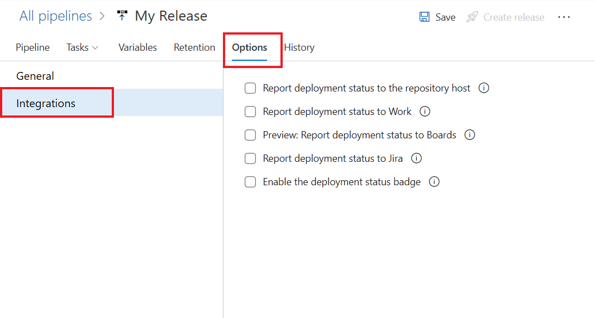
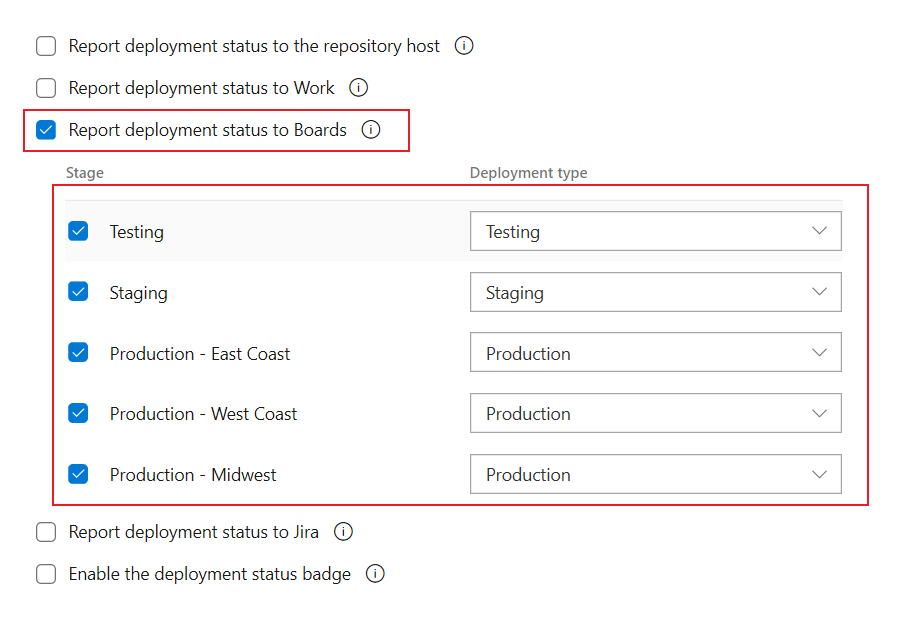

---
title: See release deployment information from the work item form
titleSuffix: Azure Boards
description: Link your work item to releases to visualize what deployments your work item has been deployed too
ms.custom: work-items, releases
ms.technology: devops-agile
ms.prod: devops
ms.assetid: B2E9B082-15BE-448C-96D8-3EF048A15560
ms.topic: conceptual
ms.manager: jillfra
ms.author: kaelli
author: danhellem
monikerRange: 'azure-devops'
ms.date: 08/26/2019
--- 

# Link work items to deployments

[!INCLUDE [temp](../_shared/version-vsts-only.md)]

> [!NOTE]  
> The deployments control currently works with classic release pipelines only.
>
> This feature is currently under private preview. <a href="mailto:dahellem@microsoft.com">Please email us directly</a> if you wish to enroll in that preview.

The deployments control will show release information for only those work items that have been associated to a commit that is part of the build being released.

- [Learn how to associate work items to commits](../backlogs/connect-work-items-to-git-dev-ops.md)

## Configure release

First thing you must do is configure the release definition to post deployment information back to Azure Boards. 

1. Open Release definition, Options and Integrations

   > [!div class="mx-imgBorder"]  
   > 

2. Select the "Preview: Report deployment status to Boards" option and configure the stages and deployment types

   > [!div class="mx-imgBorder"]  
   > 

## Deployment control

Once the release has been configured to send deployment information to Azure Boards, and you have work items associated to the commits in the build, you can now go to the work item and see the status of the release. In the below example we have multiple environments that the release is targeting.

> [!div class="mx-imgBorder"]  
> 

When opening the work item, you can see the stages the release is being deployed, in real time.

> [!div class="mx-imgBorder"]  
> 

## Related articles  

- [Create a release](../../pipelines/release/define-multistage-release-process.md)
- [Associate work items to commits](../backlogs/connect-work-items-to-git-dev-ops.md)

