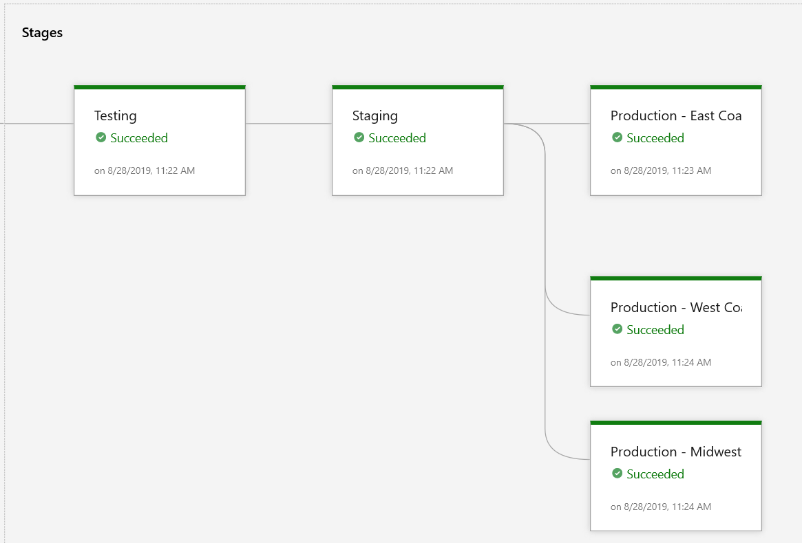
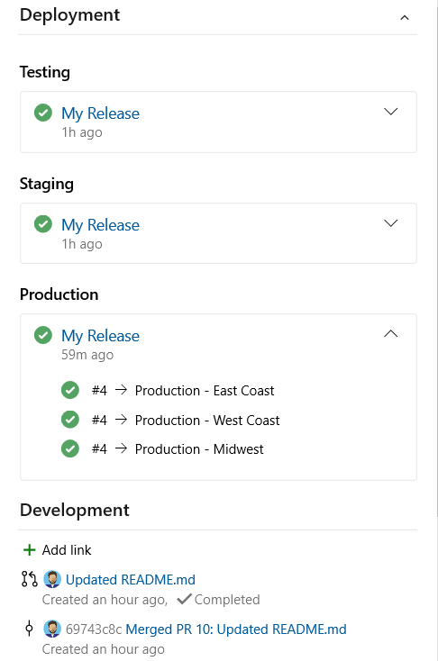

---
title: Link work items to deployments
titleSuffix: Azure Boards
description: Improve traceability, visualize and navigate to deployments which include work items by linking them to releases
ms.custom: boards-work-items  
ms.technology: devops-agile
ms.topic: how-to
ms.author: kaelli
author: KathrynEE
monikerRange: '>= azure-devops-2020'
ms.date: 08/13/2021
--- 

# Link and view work items to builds and deployments

[!INCLUDE [temp](../includes/version-azure-boards-plus-azure-devops-server-2020.md)]

One of the main ways Azure DevOps supports traceability is by linking objects. Work items link to Git branches, commits, pull requests, builds, and more. Work item forms provide two controls to show and quickly navigate to development objects. The **Deployment** control is described in this article, and the **Development** control is described in [Drive Git development from a work item](../backlogs/connect-work-items-to-git-dev-ops.md).

With the **Deployment** control, you can determine at a glance whether a feature or user story has been deployed and to what stage. You gain visual insight into the status of a work item as it is deployed to different release environments as well as quick navigation to each release stage and run. 

> [!NOTE]
> The **Deployment** control requires configuration of a Classic release pipeline. It doesn't support linking to release stages defined for a YAML pipeline. 
 
As shown in the following image, the  **Deployment** control shows release information for two release stages those work items that have been linked to a Git commit or pull request for a release pipeline configured to integrate with Azure Boards.  

:::image type="content" source="media/deployments-control/deployment-control-intro.png " alt-text="Screenshot of Work item form, Deployment control.":::

## How linking is supported 

 Work items linked to a Git repository branch, commit, or pull request participate in populating the **Deployment** control.   
You can view all links through the work item form **Links** tab. 
 
- Work items associated with commits in the build will show the status of the release  
- Only work items co-located with the same project where the release pipeline is defined are linked to. 
  
:::image type="content" source="../../notifications/media/types-of-work-item-links.png" alt-text="Conceptual image of Git and integrated link types.":::

To learn how to associate work items to commits, see [Drive Git development from a work item](../backlogs/connect-work-items-to-git-dev-ops.md) or [Link to work items from other objects](../../notifications/add-links-to-work-items.md?toc=/azure/devops/boards/toc.json&bc=/azure/devops/boards/breadcrumb/toc.json). To view objects linked to a work item, see [View list of links for a work item](#view-link-list).  

## Prerequisites

- To configure the integration options for a Classic release pipeline, you must have permissions to edit the release. 
- To link work items to commits and pull requests, you must have your **Edit work items in this node** permissions set to **Allow** for the Area Path assigned to the work item. By default, the Contributors group has this permission set.  
- To view work items, you must have your **View work items in this node** permissions set to **Allow** for the Area Path assigned to the work item.  
 
To populate the **Deployment** control, perform the following steps: 

1. Define a Classic release pipeline and set up the release stages as described in [Define your multi-stage continuous deployment (CD) pipeline](../../pipelines/release/define-multistage-release-process.md).  
2. Configure the pipeline as described in [Configure pipelines to support work tracking, Report deployment status to Boards](../../pipelines/integrations/configure-pipelines-work-tracking.md#classic-report-boards).   
3. Link work items to a commit or pull request in Azure Repos Git repository. For details, see: 
	-  [Drive Git development from a work item](../backlogs/connect-work-items-to-git-dev-ops.md)  
	-  [Link to work items from other objects](../../notifications/add-links-to-work-items.md)
4.  Run the pipeline.
	<!---  Only manually triggered releases??? --> 

<!--- 
### Unsupported scenarios 
 
> [!NOTE]  
> Support for GitHub.com, GitHub Enterprise Server, and other Git repositories aren't supported. 

Other scenarios that aren't supported at this time: 
- Work items linked to Team Foundation Version control changesets, shelvesets, or builds aren't supported. 
-  Work items linked to a Git pull request which are stored in a different project aren't linked to the release runs. 
- Manual versus scheduled triggers
-   
Question - can you link to work items in a different project ???
 How to verify correctness for "Link work items to deployments" Mention other work item - pipeline integration settings

--> 

### Deployment control and work item types

By default, the Deployment control appears on the work item forms for User Story (Agile), Product Backlog Item (Scrum), Issue (Basic), Requirement (CMMI), Feature, Epic, Bug, Task, and Test Case work item types. It is automatically enabled for custom work item types you define using the Inherited process. If you don't use the control, you can choose to [Hide from layout](../../organizations/settings/work/customize-process-field.md#hide-a-field-or-custom-control).

If your project is customized using a Hosted XML process or you need to add it to a custom work item type for an On-premises XML process, you'll need to update your work item type definitions to display the control. For details, see [Hosted XML process model, Add release deployment support to a work item type](../../organizations/settings/work/hosted-xml-process-model.md#add-support-wit).

## Deployment control

The work item deployment control displays the status of releases within those work items that are associated with commits in the build and those release pipelines you've configured to report deployment information to Azure Boards. 

The following example shows multiple environments that the release is targeting which the selected work item is associated with. 

> [!div class="mx-imgBorder"]  
> 

When you open the work item, you can see the stages the release is being deployed, in real time.

> [!div class="mx-imgBorder"]  
> 

<a id="view-link-list" /> 

## View list of links for a work item

To view and navigate to the builds and releases linked to a work item, choose the :::image type="icon" source="../media/icons/icon-links-tab-wi.png" border="false"::: **Links** tab. Links are grouped under their link type and listed in the order they were created. Choose the **State** or **Latest Update** column headings to sort by the column. Links prefaced with the :::image type="icon" source="../../media/icons/required-icon.png" border="false"::: red exclamation mark indicate that the build, release, or other object has been deleted. This is usually due to retention policies which automatically delete these objects after a certain time period has passed. 

:::image type="content" source="media/deployments-control/links-list.png" alt-text="Screenshot of Links tab, Integrated in build and Integrated in release stage.":::

## Unlink work items  

Once a work item is linked to a commit or pull request, it will continue to show up as part of the release stages. For example, if you have a work item that didn't pass testing criteria, you may want to remove it from the builds and releases. 

To remove the work item from participating in future builds and releases, delete the link to the most recent commit and pull request. You can do that by opening the **Links** tab for the work item as shown in the previous section.  

## Query for linked work items 

You can't query for work items that are included in releases. However, you can create a query for work items with an `External Link Count > 0`. Include other query filters to optimize your search criteria. 

## Related articles  

**Azure Repos, Git**

- [Configure repositories and branches to integrate with work tracking](../../repos/git/configure-repos-work-tracking.md)
- [Drive Git development from a work item](../backlogs/connect-work-items-to-git-dev-ops.md)

**Azure Pipelines**

- [Define your multi-stage continuous deployment (CD) pipeline](../../pipelines/release/define-multistage-release-process.md)
- [Release pipelines (Classic) overview](../../pipelines/release/index.md)
- [Configure pipelines to support work tracking](../../pipelines/integrations/configure-pipelines-work-tracking.md).  
- [How to retrieve all work items associated with a release pipeline using Azure DevOps API](https://devblogs.microsoft.com/premier-developer/how-to-retrieve-all-work-items-associated-with-a-release-pipeline-using-azure-devops-api/)
 
**Link work items**

- [Link to work items from other objects](../../notifications/add-links-to-work-items.md?toc=/azure/devops/boards/toc.json&bc=/azure/devops/boards/breadcrumb/toc.json)
- [End-to-end traceability](../../cross-service/end-to-end-traceability.md)
- [Linking, traceability, and managing dependencies](../queries/link-work-items-support-traceability.md)
- [Link type reference](../queries/link-type-reference.md)

**Process customization**
- [Hosted XML process model, Add release deployment support to a work item type](../../organizations/settings/work/hosted-xml-process-model.md#add-support-wit)

