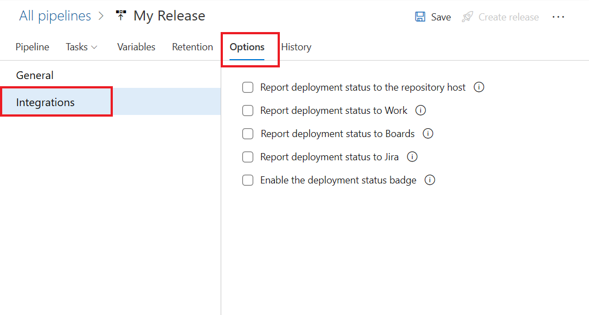

---
title: Link work items to deployments
titleSuffix: Azure Boards
description: Visualize the deployments which include your work items by linking them to releases
ms.custom: boards-work-items  
ms.technology: devops-agile
ms.topic: how-to
ms.author: kaelli
author: KathrynEE
monikerRange: '>= azure-devops-2020'
ms.date: 07/06/2020
--- 

# Link work items to deployments

[!INCLUDE [temp](../includes/version-azure-boards-plus-azure-devops-server-2020.md)]

The release deployments control shows release information for those work items that have been associated to a Git commit which is part of a build being released. To learn how to associate work items to commits, see [Drive Git development from a work item](../backlogs/connect-work-items-to-git-dev-ops.md).

> [!NOTE]  
> The release deployments control currently works with classic release pipelines and with Azure DevOps Server 2020 and Azure DevOps Services (cloud). If your project is customized using a Hosted XML process, you need to update your work item type definitions to display the control. For details, see [Hosted XML process model, Add release deployment support to a work item type](../../organizations/settings/work/hosted-xml-process-model.md#add-support-wit).

## Configure release

Configure your release definition to post deployment information to Azure Boards. 

1. Open Pipelines>Releases, choose to edit your release pipeline, then choose **Options>Integrations**.

   > [!div class="mx-imgBorder"]  
   > 

2. Check the **Report deployment status to Boards** checkbox and choose the stages and deployment types to report. 

   > [!div class="mx-imgBorder"]  
   > 

## Deployment control

The work item deployment control displays the status of releases within those work items that are associated with commits in the build and those release pipelines you've configured to report deployment information to Azure Boards. 

The following example shows multiple environments that the release is targeting which the selected work item is associated with. 

> [!div class="mx-imgBorder"]  
> 

When you open the work item, you can see the stages the release is being deployed, in real time.

> [!div class="mx-imgBorder"]  
> 

## Related articles  

- [Create a release](../../pipelines/release/define-multistage-release-process.md)
- [Associate work items to commits](../backlogs/connect-work-items-to-git-dev-ops.md)

