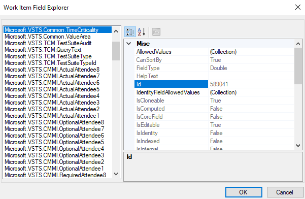

# Work item fields and attributes

[!INCLUDE [temp](../_shared/version-vsts-tfs-all-versions.md)]

Work item fields are used to track information. Each work item type (WIT) definition specifies the fields defined for that WIT. Each field is associated with a number of attributes, many of which are set by the system and cannot be changed. 

Each field is defined by the following three attributes. 
- **Data type**: Specifies the type of data that can be entered into the field, such as Boolean, Double, Integer, HTML, and String. For descriptions of each data type, see [Query fields, operators, and macros](../queries/query-operators-variables.md#field-values). 
- **Friendly name**: Specifies the name assigned to the field and that you select for a **Field** in a query clause. This name may differ from that displayed on the work item form. 
- **Reference name**: Specifies the name that you use when creating [WIQL query](../queries/wiql-syntax.md) or an [ad hoc work item template](../backlogs/work-item-template.md), using [REST API commands](/rest/api/azure/devops/wit/), or defining [XML work item type definitions](../../reference/xml/field-definition-element-reference.md). Once defined, the reference name cannot be changed.  
 
For a description of each field attribute and how you can list them, see [Field attributes](#field-attributes) and [List field attributes](#list-attributes) later in this article. For an overview of WITs and work items, see [Track work with user stories, issues, bugs, features, and epics](about-work-items.md). 

## Field names

The field friendly name identifies each work item field. When adding a custom field, make sure the friendly name falls within these guidelines:  

- Must be unique within the organization or project collection  
- Must be 128 or fewer Unicode characters  
- Can't contain any leading or trailing spaces, nor two or more consecutive spaces  
- Must contain at least one alphabetic character  
- Can't contain the following characters: ```.,;'`:~\/\*|?"&%$!+=()[]{}<>```.   

For additional information, see [Naming restrictions and conventions](../../organizations/settings/naming-restrictions.md#work-items-work-item-types-and-customizations).


### System and predefined fields

All system defined fields have reference names that begin with *System*, for example, System.AreaPath, System.AssignedTo, and continue in that pattern.

Predefined fields defined by the default process begin with Microsoft.VSTS and then further differ based on their usage. Examples of predefined fields that are used in common, for scheduling purposes and integration with Office Project, for integration with Team Foundation Build, and integration with test case management (TCM) are as follows:

-   Microsoft.VSTS.Common.Priority  
-   Microsoft.VSTS.Scheduling.DueDate  
-   Microsoft.VSTS.Build.FoundIn   
-   Microsoft.VSTS.TCM.Steps  

For an overview of all system and predefined fields that are defined for the default processes/process templates, see [Work item field index](guidance/work-item-field.md). For more information about specifying field names, see [Naming restrictions](../../organizations/settings/naming-restrictions.md).

### Custom fields 
Because custom fields are defined for an organization or project collection, you can't add a custom field to a process with the same field name that you add to another process.  

When adding custom fields, note the following limits:  
*   A maximum of 256 fields can be defined for each WIT  
*   A maximum of 512 fields can be defined per process   

The field data type determines the kind and size of data that you can store in the field. A field can have only one type defined within a project collection. This restriction encourages organizations to use common fields across projects and work item types.


::: moniker range=">= azure-devops-2019"

When you add a custom field to an inherited process, Azure DevOps assigns a reference name based on the process name and the name of the field. For example, you add a field named Triage to the My Agile process, the reference name is **MyAgile.Triage**. No spaces are allowed within the reference name.  

::: moniker-end


## How can I determine the field data type? 

::: moniker range="azure-devops"

You can view the data type of fields defined for your organization by [opening the Process>Fields page](../../organizations/settings/work/customize-process-field.md#review-fields).

> [!div class="mx-imgBorder"]  
>   
::: moniker-end

::: moniker range="azure-devops-2019"
When your project collection uses the Inheritance process model to customize work tracking, you can view the data type of fields by [opening the Process>Fields page](../../organizations/settings/work/customize-process-field.md#review-fields). 

> [!div class="mx-imgBorder"]  
>   

If the On-premises XML process model is used, you can look up the data type through the [Work item field index](guidance/work-item-field.md). Or, you can open the Work Item Field Explorer to review the fields defined and their attribute assignments, or use the **witadmin listfields** command to list the field attributes. For details, see [Work Item Field Explorer](#wi-explorer) and [List field attributes](#list-attributes) later in this article.
::: moniker-end

::: moniker range="<= tfs-2018" 
You can look up the data type through the [Work item field index](guidance/work-item-field.md). Or, you can open the Work Item Field Explorer to review the fields defined and their attribute assignments, or use the **witadmin listfields** command to list the field attributes.  For details, see [Work Item Field Explorer](#wi-explorer) and [List field attributes](#list-attributes) later in this article.

::: moniker-end


<a id="field-attributes" />
## Field attributes

There are a number of non-changeable and virtually hidden attributes for each work item field. 
The following table describes each attribute.  

> [!NOTE]   
> The attribute listed in the first column of the table is supported through the [**Fields - Get** REST API](/rest/api/azure/devops/wit/fields/get) and [**Work Item Types Field** - Get](/rest/api/azure/devops/wit/work%20item%20types%20field/get) commands. The attribute listed in the second column is supported through the Work Item Field Explorer (WIFE) tool, and the [FieldDefinition Properties](/previous-versions/visualstudio/visual-studio-2013/bb172008(v%3dvs.120)). The attributes assigned to a field depend on the platform and version you use. 


<table valign="top">
<thead>
<tr>
<th width="10%"><p>Attribute (REST)</p></th>
<th width="10%"><p>Attribute (WIFE)</p></th>
<th width="7%"><p>Attribute type</p></th>
<th width="60%"><p>Description</p></th>
<th width="13%"><p>Can change?</p></th>
</tr>
</thead>
<tbody valign="top">
<tr>
	<td></td>
	<td>AllowedValues</td>
	<td>collection</td>
	<td>Gets the collection of valid values for a field that contains picklist values. You can change this by specifying a picklist or global list (on-premises). </td>
	<td>Yes</td>
</tr>
<tr>
	<td>canSortBy</td>
	<td>CanSortBy</td>
	<td>boolean</td>
	<td>Indicates whether you can sort query results with this field. </td>
	<td>No</td>
</tr>
<tr>
	<td>description</td>
	<td>HelpText</td>
	<td>string</td>
	<td>Specifies a description for the field, which also defines the help text that appears when you hover over the field within the work item form.  </td>
	<td>Yes</td>
</tr>
<tr>
	<td> </td>
	<td>Id</td>
	<td>boolean</td>
	<td>Specifies the internal ID of the field. </td>
	<td>No</td>
</tr>
<tr>
	<td> </td>
	<td>IsCloneable </td>
	<td>boolean</td>
	<td>Indicates whether the value defined for the field is copied when a user chooses to copy a work item. For example, the work item Title, Tags, and Description are copied, but the ID and History fields aren't copied. </td>
	<td>No</td>
</tr>
<tr>
	<td> </td>
	<td>IsComputed </td>
	<td>boolean</td>
	<td>Indicates if the value set by this field is computed by the system (True) or not (False). Examples of computed fields are ones that are set by the system, such as the ID, Revised Date, Changed Date, and External Link Count. </td>
	<td>No</td>
</tr>
<tr>
	<td> </td>
	<td>IsCoreField</td>
	<td>boolean</td>
	<td>Indicates whether this field is specified for all work item types. </td>
	<td>No</td>
</tr>
<tr>
	<td> </td>
	<td>IsEditable</td>
	<td>boolean</td>
	<td>Indicates if users can modify this field (True) or not (False). Examples of non-editable fields are ones that are set by the system, such as the ID, Revision, Created By, and Changed By fields</td>
	<td>No</td>
</tr>
<tr>
	<td>isIdentity</td>
	<td>IsIdentity </td>
	<td>boolean</td>
	<td>Indicates whether this field is an Identity field. Identity fields are string fields used to store user identities. </td>
	<td>No</td>
</tr>
<tr>
	<td>  </td>
	<td>IsIndexed<sup>1</sup> </td>
	<td>boolean</td>
	<td>Indicates whether this field is indexed to support search.</td>
	<td>No</td>
</tr>
<!---
<tr>
	<td>  </td>
	<td>IsInternal </td>
	<td>boolean</td>
	<td>It appears that all fields are set to False.</td>
	<td>No</td>
</tr>
-->
<tr>
	<td> </td>
	<td>IsLongText </td>
	<td>boolean</td>
	<td>Indicates that the field can contain more than 255 characters, such as fields assigned a data type of PlainText, HTML, or History.</td>
	<td>No</td>
</tr> 

<tr>
	<td>isPicklist<sup>2</sup></td>
	<td> </td>
	<td>boolean</td>
	<td>Indicates whether the field is associated with a picklist. The value is set to True when a custom field is defined for Azure DevOps Services and Picklist (String) or Picklist (Integer) type is selected. The value is set to False for inherited fields that define picklists.  </td>
	<td>No</td>
</tr>
<tr>
	<td>isPicklistSuggested<sup>2</sup></td>
	<td> </td>
	<td> </td>
	<td>Indicates whether the field allows users to enter their own values for a picklist. The value is set to True when a custom field is defined for Azure DevOps Services, Picklist (String) or Picklist (Integer) type is selected, and the checkbox for **Allow users to set their own values** is checked.</td>
	<td>Yes</td>
</tr>
<tr>
	<td>isQueryable</td>
	<td>IsQueryable</td>
	<td>boolean</td>
	<td>Indicates if the field shows up within the set of fields you can add to filter a query (True) or not (False). Most fields are queryable. </td>
	<td>No</td>
</tr>

<tr>
	<td> </td>
	<td>IsReportable <sup>3</sup></td>
	<td>boolean</td>
	<td>Indicates if the reportable attribute is defined or set to anything other than **None**. </td>
	<td>Yes</td>
</tr>

<tr>
	<td> </td>
	<td>IsUsedInGlobalWorkflow</td>
	<td>boolean</td>
	<td>Indicates if the field is defined within a [global workflow](../../reference/xml/global-workflow-xml-element-reference.md). </td>
	<td>No</td>
</tr>
<!---
<tr>
	<td> </td>
	<td>IsUsedInWorkItemType</td>
	<td>boolean</td>
	<td>TBD. </td>
	<td>No</td>
</tr>
-->
<tr>
	<td> </td>
	<td>IsUserNameField</td>
	<td>boolean</td>
	<td>Indicates if the field is used to display an Identity field. </td>
	<td>No</td>
</tr>
<tr>
	<td>name</td>
	<td>Name</td>
	<td>string</td>
	<td>Friendly name assigned to the field. The friendly name can't be changed for Azure DevOps Services, but can be changed for on-premises using the **witadmin changefield** command. </td>
	<td>On-prem only</td>
</tr>
<tr>
	<td>picklistId</td>
	<td></td>
	<td> </td>
	<td>If the field is a picklist, the identifier of the associated picklist, otherwise null. A unique GUID value is assigned when a custom field is defined for Azure DevOps Services and Picklist (String) or Picklist (Integer) type is selected.</td>
	<td>No</td>
</tr>

<tr>
	<td> </td>
	<td>ProhibitedValues</td>
	<td>collection</td>
	<td>Gets the collection of prohibited values for a field that specifies such values. You can only define prohibited values for on-premises deployments.</td>
	<td>On-prem only</td>
</tr>
<!--- 
<tr>
	<td> </td>
	<td>PsFieldType</td>
	<td> </td>
	<td>Specifies the  </td>
	<td>No</td>
</tr>

<tr>
	<td> </td>
	<td>PsReportingFormula</td>
	<td> </td>
	<td>Specifies the  </td>
	<td>No</td>
</tr>


<tr>
	<td> </td>
	<td>PsReportingType</td>
	<td> </td>
	<td>Specifies the  </td>
	<td>No</td>
</tr>

-->

<tr>
	<td>readOnly</td>
	<td> </td>
	<td>boolean</td>
	<td>Indicates whether the field is set to read only. For Azure Cloud Services, only custom fields can be changed to be read only. System fields cannot be modified. </td>
	<td>Yes</td>
</tr>
<tr>
	<td>referenceName</td>
	<td>ReferenceName</td>
	<td>string</td>
	<td>Specifies the reference name of the field definition.</td>
	<td>No</td>
</tr>
<tr>
	<td> </td>
	<td>ReportingAttributes<sup>3</sup></td>
	<td> </td>
	<td>Specifies **Detail**, **Dimension**, or **Measure**, depending on whether and how you want the field to be included in reports. Data from fields that have a value other than **None** for this attribute are exported to the data warehouse and can be included in reports.</td>
	<td>On-prem only</td>
</tr>


<tr>
	<td> </td>
	<td>ReportingName<sup>3</sup></td>
	<td>string</td>
	<td>Specifies the label for a field when data appears in reports. If you do not specify a value, the field's friendly name is used.</td>
	<td>On-prem only</td>
</tr>

<tr>
	<td> </td>
	<td>ReportingReferenceName<sup>3</sup></td>
	<td>string</td>
	<td>Specifies a different reference name to a field that is used when data is exported to the relational data warehouse. If you do not specify a value, the fields reference name is used.  </td>
	<td>On-prem only</td>
</tr>
<tr>
	<td>supportedOperations</td>
	<td> </td>
	<td>*set*</td>
	<td>The set of query operators that are valid for use when referencing this field. For a quick reference of supported operations based on data type, see [Query quick reference, Operators and macros supported for each data type](../queries/query-index-quick-ref.md#fields-operators-macros).</td>
	<td>No</td>
</tr>

<tr>
	<td> </td>
	<td>SupportsTextQuery</td>
	<td>boolean</td>
	<td>Indicates whether the field supports text queries such as **Contains Words**, **Does Not Contains Words**. </td>
	<td>No</td>
</tr>


<tr>
	<td> </td>
	<td>SystemType</td>
	<td>string</td>
	<td>Specifies the data type of the field, referencing the system name such as System.DateTime, System.String, and so on.</td>
	<td>No</td>
</tr>


<tr>
	<td>type</td>
	<td>FieldType</td>
	<td>string</td>
	<td>Specifies the data type of the field, such as Boolean, DateTime, Integer, String, and so on. For a complete list and descriptions, see [Query fields, operators, and macros](../queries/query-operators-variables.md)</td>
	<td>No</td>
</tr>
<tr>
	<td>usage</td>
	<td>Usage</td>
	<td>string</td>
	<td>Specifies whether the field is intended for use with work items (WorkItem) or work item link (WorkItemLink) objects. The usage for most fields is WorkItem. For a complete list of usage values, see [Get Fields, FieldUsage](/rest/api/azure/devops/wit/fields/get#fieldusage)</td>
	<td>No</td>
</tr>

</tbody>
</table>

**Notes:**

1. For on-premises deployments, you can enable indexing for a field to improve query response times when filtering on the field. For more information, see [Indexed fields](#index-fields) later in this article. 
2. The **isPicklist** and **isPicklistSuggested** attributes are only assigned to custom fields defined for an inherited process. The Inherited process model is only supported for Azure DevOps Services and Azure DevOps Server 2019. 
3. All reporting attributes are valid only for on-premises deployments whose projects have been configured to support SQL Server Reporting and SQL Server Analysis Services. 


<a id="reportable-attributes" />
::: moniker range="< azure-devops"  

## Reportable attributes

All reporting attributes are valid only for on-premises deployments whose projects have been configured to support SQL Server Reporting and SQL Server Analysis Services. For details, see [Add reports to a project](../../report/admin/add-reports-to-a-team-project.md).

For a description of each reportable attribute, see [Add or modify work item fields to support reporting](../../reference/xml/add-or-modify-work-item-fields-to-support-reporting.md). 

For a list of fields that have reportable attributes defined by default, see [Reportable fields reference](../../reference/xml/reportable-fields-reference.md).


<a id="index-fields" />
## Indexed fields

You can enable or disable indexing for a work item field by using the **witadmin indexfield** command. When you enable indexing for a field, you may increase the performance of finding work items whose queries specify that field. By default, the following fields are indexed: Assigned To, Created Date, Changed By, State, Reason, Area ID, Iteration ID, and Work Item Type. 

If you add a custom field that you use in many of your work item queries, you may want to enable indexing for that field. For more information, see [Manage work item fields (witadmin)](../../reference/witadmin/manage-work-item-fields.md).

::: moniker-end


<a id="list-attributes" />


## List field attributes 

::: moniker range="azure-devops"  

You can list the attributes assigned to a field by using the [**Fields - Get** REST API](/rest/api/azure/devops/wit/fields/get). Enter your organization name for *OrganizationName*.

> [!div class="tabbedCodeSnippets"]
```REST
https://dev.azure.com/OrganizationName/_apis/wit/fields/FieldReferenceName
```

For example, here we list the attributes for the Iteration Path, specifying the reference name, `System.IterationPath`, for the fabrikam organization. 

```REST
https://dev.azure.com/fabrikam/_apis/wit/fields/System.IterationPath
```

**Returned data:**

> [!div class="tabbedCodeSnippets"]
```JSON
{
"name": "Iteration Path",
"referenceName": "System.IterationPath",
"description": "The iteration within which this bug will be fixed",
"type": "treePath",
"usage": "workItem",
"readOnly": false,
"canSortBy": true,
"isQueryable": true,
"supportedOperations": [
{
"referenceName": "SupportedOperations.Under",
"name": "Under"
},
{
"referenceName": "SupportedOperations.NotUnder",
"name": "Not Under"
},
{
"referenceName": "SupportedOperations.Equals",
"name": "="
},
{
"referenceName": "SupportedOperations.NotEquals",
"name": "<>"
},
{
"referenceName": "SupportedOperations.In",
"name": "In"
},
{
"name": "Not In"
}
],
"isIdentity": false,
"isPicklist": false,
"isPicklistSuggested": false,
"url": "https://dev.azure.com/mseng/_apis/wit/fields/System.IterationPath"
}
```
::: moniker-end

::: moniker range=">= tfs-2018 < azure-devops"  

You can list the attributes assigned to a field by using the [**Fields - Get** REST API](/rest/api/azure/devops/wit/fields/get). Enter your organization name for *OrganizationName*. To get started using REST, see [Azure DevOps Services REST API Reference](/rest/api/azure/devops/?view=vsts-rest-tfs-4.1)

> [!div class="tabbedCodeSnippets"]
```REST
https://{ServerName:Port}/tfs/{Collection}/_apis/wit/fields/FieldReferenceName?api-version={version}
```

For example, here we list the attributes for the Iteration Path, specifying the reference name, `System.IterationPath`, for the fabrikam server. 

```REST
https://fabrikam:8080/tfs/DefaultCollection/_apis/wit/fields/System.IterationPath?api-version=4.1
```

**Returned data:**

> [!div class="tabbedCodeSnippets"]
```JSON
{
"name": "Iteration Path",
"referenceName": "System.IterationPath",
"description": "The iteration within which this bug will be fixed",
"type": "treePath",
"usage": "workItem",
"readOnly": false,
"canSortBy": true,
"isQueryable": true,
"supportedOperations": [
{
"referenceName": "SupportedOperations.Under",
"name": "Under"
},
{
"referenceName": "SupportedOperations.NotUnder",
"name": "Not Under"
},
{
"referenceName": "SupportedOperations.Equals",
"name": "="
},
{
"referenceName": "SupportedOperations.NotEquals",
"name": "<>"
},
{
"referenceName": "SupportedOperations.In",
"name": "In"
},
{
"name": "Not In"
}
],
"isIdentity": false,
"isPicklist": false,
"isPicklistSuggested": false,
"url": "https://fabrikam:8080/tfs/DefaultCollection/_apis/wit/fields/System.IterationPath?api-version=4.1"
}
```

::: moniker-end

::: moniker range="< azure-devops"  
### List attributes using witadmin command line tool

You can list select field attributes&mdash;such as the data type, reportable attributes, and indexing&mdash;using the [**witadmin listfields** command](../../reference/witadmin/manage-work-item-fields.md). 

For example, you can enter the following command to list the attributes defined for a specified field, such as Microsoft.VSTS.Common.Issue.  
  
> [!div class="tabbedCodeSnippets"]
```CMD
witadmin listfields /collection:http://fabrikam:8080/tfs/DefaultCollection /n:Microsoft.VSTS.Common.Issue  
```  

Field and attribute information appears for the named field, as shown in this example.  

> [!div class="tabbedCodeSnippets"]
```CMD
Field: Microsoft.VSTS.Common.Issue  
Name: Issue  
Type: String  
Reportable As: dimension  
Use: Adventure Works (Shared Steps), AW Future (Shared Steps), AW Current (Shared Steps)  
Indexed: False  
```  

The **Use** parameter indicates the name of each project and the work item type where the field is used. 

::: moniker-end


<a id="wi-explorer">  </a>
## Work Item Field Explorer 

You can look up the assignments of field attributes using the Work Item Field Explorer tool.  



::: moniker range=">= tfs-2017" 
To access the Work Item Field Explorer, you must install the Process Editor (requires that you have installed a version of Visual Studio). [Install the TFS Process Template editor from the Visual Studio Marketplace](https://marketplace.visualstudio.com/items?itemName=KarthikBalasubramanianMSFT.TFSProcessTemplateEditor). You can use this version of the Process Editor to modify the old-style work item forms. You can't use it to edit forms associated with the [new web forms](../../reference/process/new-work-item-experience.md). 
::: moniker-end


::: moniker range="<= tfs-2015"
To access the Work Item Field Explorer, you must install the Process Editor (requires that you have installed a version of Visual Studio) by installing the [TFS Power Tools](https://marketplace.visualstudio.com/items?itemName=TFSPowerToolsTeam.MicrosoftVisualStudioTeamFoundationServer2015Power). 
::: moniker-end

::: moniker range="<= tfs-2018"  

## Project integration and project field mapping  

You can change how work tracking fields map to fields in Project, and you can change how specific fields are published. See [The Microsoft Project Field Mapping File](../../reference/xml/customize-project-field-mapping-file.md). 

::: moniker-end  

## Add and modify fields   
::: moniker range="azure-devops"  

To add fields to a process, you add them to one or more work item types. To learn more, see [Customize an inheritance process](../../organizations/settings/work/inheritance-process-model.md). 
::: moniker-end

::: moniker range="azure-devops-2019"
You can add or modify the fields contained within a WIT or add a custom WIT. To learn more, see:
- For project collections that use the Inheritance process model: [Customize an inheritance process](../../organizations/settings/work/inheritance-process-model.md).  
- For project collections that use the On-premises XML process model: [Customize the On-premises XML process model](../../reference/on-premises-xml-process-model.md). 

You can change the field name, the index, and the report attributes for any field except system fields by using the **witadmin** command-line tool. For more information, see [Manage work item fields-witadmin](../../reference/witadmin/manage-work-item-fields.md).  

::: moniker-end

::: moniker range="< azure-devops-2019"

To add fields to a project, you add them to one or more work item types. See [Add or modify a field to track work](../../reference/add-modify-field.md).  

You can change the field name, the index, and the report attributes for any field except system fields by using the **witadmin** command-line tool. For more information, see [Manage work item fields-witadmin](../../reference/witadmin/manage-work-item-fields.md).  
::: moniker-end  


## Related articles  

::: moniker range="azure-devops"  
- [Query quick reference](../queries/query-index-quick-ref.md)
- [Work item field index](guidance/work-item-field.md) 
- [Add and manage fields for an inherited process](../../organizations/settings/work/customize-process-field.md)
::: moniker-end  


::: moniker range="azure-devops-2019"  
- [Query quick reference](../queries/query-index-quick-ref.md)
- [Work item field index](guidance/work-item-field.md) 
- [Choose the process model for your project collection](/azure/devops/reference/customize-work#choose-process-model&view=azure-devops-2019)
- [Add or modify a field to track work](../../reference/add-modify-field.md)
- [Manage work item fields-witadmin](../../reference/witadmin/manage-work-item-fields.md)
::: moniker-end  


::: moniker range="<= tfs-2018"  
- [Query quick reference](../queries/query-index-quick-ref.md)
- [Work item field index](guidance/work-item-field.md) 
- [Add or modify a field to track work](../../reference/add-modify-field.md)
- [Manage work item fields-witadmin](../../reference/witadmin/manage-work-item-fields.md)
::: moniker-end  