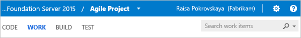

# Work item form controls

[!INCLUDE [temp](../_shared/version-vsts-tfs-2017-on.md)]

Different types of work items track different data. Each work item form contains some standard fields&mdash;such as title, assigned to, and area and iteration path&mdash;as well as fields specific to the type. You can link work items to one another, as well as to changesets and source code files. 

As the following image shows, each work item form comes with a number of controls, fields, and tabs.

> [!NOTE]    
>Depending on the process chosen when the project was created&mdash;
[Agile](./guidance/agile-process.md), [Scrum](./guidance/scrum-process.md), or [CMMI](./guidance/cmmi-process.md)&mdash;the types of work items you can create will differ. For example, backlog items may be called user stories (Agile), product backlog items (Scrum), or requirements (CMMI). All three are similar: they describe the customer value to deliver and the work to be performed.
>
> For an overview of all three processes, see [Choose a process](./guidance/choose-process.md). 
	 
  

### Work item form controls

| Control                  | Function                      |
|--------------------------|-------------------------------|
|  | Copy URL of work item to clipboard (appears on hover over work item title)  |
|  | Go to Discussions section  |
|  | Open Actions menu for additional work item tasks           |
|  | Refresh work item with latest changes  |  
|  | Revert changes to work item           |  
|  | Open History tab        |
|  | Open Links tab     |
|  | Open Attachments tab   |
|  /      | Enter or exit full display mode of a section within the form   |
|/ | Collapse or expand a section within the form   |  
|  | Add new work item and link to existing work item (May appear under  Actions menu)  |  
|  | [Change work item type](../backlogs/remove-delete-work-items.md) (Appears under  Actions menu)  | 
|  | [Move work item to a different project](../backlogs/remove-delete-work-items.md) (Appears under  Actions menu)  | 
|  | [Copy work item and optionally change work item type](../backlogs/copy-clone-work-items.md#copy-clone) (Appears  under  Actions menu)  |  
|  | [Email work item](email-work-items.md)  (Appears  under  Actions menu)  |  
|  | [Recycle work item](../backlogs/remove-delete-work-items.md)  (Appears  under  Actions menu)  | 
|  | [Storyboard with PowerPoint](../backlogs/office/storyboard-your-ideas-using-powerpoint.md)  (Appears  under  Actions menu)  | 

## Update work status  
As work progresses, team members can update the state and reassign it as needed. 

  

While the workflow states differ for different work item types, they usually follow a progression from New or Active to Closed or Done. The following image shows the work flow states for the Agile process user story. If you want to discard a work item, change the state to Removed.  

<table>
<tbody valign="top">
<tr>
<td>

<b>Typical workflow progression:</b> 
 
<ul>
<li>Create a user story in the default state, New.</li>
<li>Change the state from New to Active.</li>
<li>Change the state from Active to Resolved.</li>
<li>Change the state from Resolved to Closed.</li>
</ul>
 

<b>Atypical transitions:</b> 
 
<ul>
<li>Change the state from New to Removed.</li>
<li>Change the state from Removed to New.</li>
<li>Change the state from Active to Removed.</li>
<li>Change the state from Resolved to Active.</li>
<li>Change the state from Closed to Resolved.</li>
</ul>
</td>
<td>
    
</td>
</tr>
</tbody>
</table>

Removed work items remain in the data store and can be reactivated by changing the State. If you want to permanently remove a work item, you can [delete it](../backlogs/remove-delete-work-items.md). 

With each update, the Reason field also updates and changes are recorded in the History field which you can view through the  **History** tab. To find work items based on their history, see [History & auditing](../queries/history-and-auditing.md).   

  

## Link items to support traceability  
By linking work items using Related or Dependent link types, you can track work that is dependent on other work. Each work item contains one or more tabs with link controls. These controls support linking the work item to one or more objects.  

There are three links controls provided on most forms. The Development and Related Work scoped links controls appear on the Details tab. The  Links tab provides access to all links made to the work item.  

  

## Add links  

From each links control, you can perform these actions:  

- To open an associated item or object, click the linked item  
- To delete a link, highlight it and click the  delete icon   
- To link to an existing item, or create and link a new work item, select one of the menu options.  

  

To learn more, see [Add links to work items](../backlogs/add-link.md).

### Development scoped links control  

The Development links control displays all of your development links, whether based on a git or Team Foundation version control (TFVC) repository. It displays links in a set order, and provides calls-to-action that support users to [drive development from a work item](../backlogs/connect-work-items-to-git-dev-ops.md).  

Team Foundation version control (TFVC) lets you link work items to version control changesets or versioned source code files by using the Changeset and Versioned Item link types. When you check in pending changes or use My Work to check in changes, [work items are automatically linked to your changes](../../repos/tfvc/check-your-work-team-codebase.md).  

Git lets you link work items to commits by using the Commit link type. To learn how, see [Manage and commit your changes](../../repos/git/commits.md).  

### Related scoped links control 
The Related Work links control displays links to other work items in a set order on the front page of the form. It supports these link types: Duplicate/Duplicate of, Parent/Child, Predecessor/Successor, Related, and Tests/Tested by. To learn more about different link types, see [Linking, traceability, and managing dependencies](../queries/link-work-items-support-traceability.md).

### Links control tab 

In addition, the Links control tab provides access to all links made to the work item&mdash;both work items and external objects. 

   

## Add to the discussion  

Add and review comments made about the work being performed by going to the discussion section. This way, you capture all comments within the work item rather than maintaining a long email thread. 

Click the  discussion icon, which indicates how many comments have been added, to move your focus to the discussion section.  Click the  full screen icon to expand the display of the discussion section within the form.   

  

Within the discussion section, you can use the [**@mention** control](../../notifications/at-mentions.md) to notify another team member about the discussion. Simply type **@** and their name. 

::: moniker range="azure-devops" 
> [!NOTE]   
> You can also use group mentions. Simply start type the name of a team or a security group, click the search icon and then select from the options listed.    
::: moniker-end 

To reference a work item, use the [**#ID** control](../../notifications/add-links-to-work-items.md). Type **#** and a list of work items that you've recently referenced will appear from which you can select.  

::: moniker range=">= tfs-2017 <= tfs-2018" 
> [!IMPORTANT]  
> For on-premises TFS, [you must configure an SMTP server](/tfs/server/admin/setup-customize-alerts) in order for team members to receive notifications. 
::: moniker-end 

## Copy the URL
From the web portal, simply copy the URL from the web browser address or hover over the title and then click the  copy-to-clipboard icon. For other copy options, see [Copy or clone work items](../backlogs/copy-clone-work-items.md). 
  
  

## Start storyboarding  

> [!NOTE]    
> </b>The **Start storyboarding** menu option is only available from the new web form. However, from TFS, you can choose the **Start Storyboarding** link from the **Storyboard** tab from a backlog item, or simply open PowerPoint. See [Storyboard your ideas using PowerPoint](../backlogs/office/storyboard-your-ideas-using-powerpoint.md) for requirements and usage.    

You can storyboard your ideas using PowerPoint to bring your ideas to life with storyboard shapes, text, animation, and all the other features that PowerPoint Storyboarding provides. From any work item, you can open PowerPoint by choosing the Start storyboarding menu option.    

 

##Find or list work items  
Type an ID in the Search work items box and then choose the search icon.  

  

Use the  context menu to add a filter based on [assignment, status, a keyword, or a work item type](../queries/example-queries.md). 

Or, using the  context menu, add filters to find items based on assignment, status, a keyword, or a work item type. For example, enter **A=@Me T=Task** to list all tasks assigned to you. Use the **=**, **:**, and **-** operators to specify the operations: Equals, Contains, and Not, respectively.  

Once you have a results list, you can [modify the filter criteria to refine your search results](../queries/using-queries.md).

## Related articles

Keep in mind that the work item tracking experience and forms that appear in Visual Studio won't show several of the features that the web portal makes available. To add a field or customize a work item type, see [Customize your work tracking experience](../../reference/customize-work.md). 

See also: 
- [Keyboard shortcuts for work item forms and the Work Items page](work-item-form-keyboard-shortcuts.md)

<!---

From the [New work item widget](../../Report/widget-catalog.md#new-work-item-widget) added to a [team dashboard](../../report/dashboards/dashboards.md), you can choose the type of work item you want to create.  

  

If you have a number of product backlog items, user stories, requirements, or tasks that you want to bulk add, you can use [Excel](../backlogs/office/bulk-add-modify-work-items-excel.md) or [Project](../backlogs/office/create-your-backlog-tasks-using-project.md).

If you are planning a product suite and managing a portfolio of projects across several teams, you'll want to read [Agile tools, Scale: Manage work across the enterprise](../get-started/what-is-azure-boards.md#scale).
-->