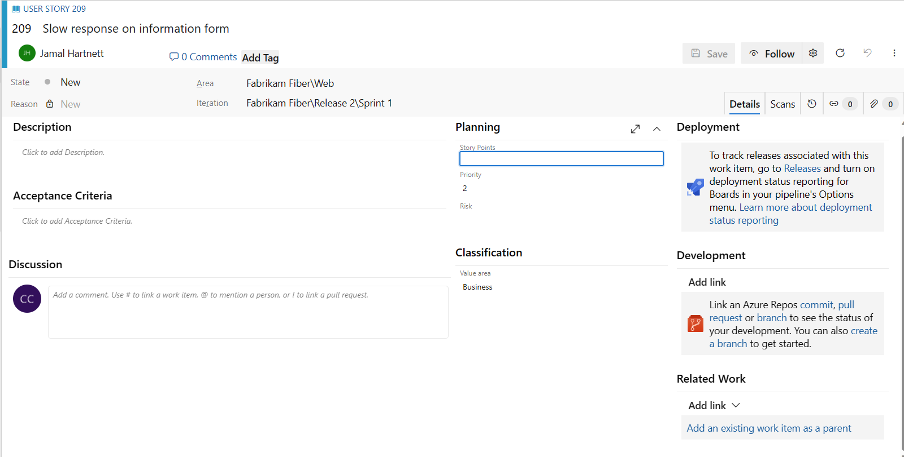

# Work item form controls 

[!INCLUDE [version-lt-eq-azure-devops](../../includes/version-lt-eq-azure-devops.md)]

Different types of work items track different data. Each work item form contains some standard fields&mdash;such as title, assigned to, and area and iteration path&mdash;and to fields specific to the type. You can link work items to one another and to changesets and source code files. 

### Web portal form 

As the following image shows, each work item form comes with several controls, fields, and tabs. Keep in mind that the work item tracking experience and forms that appear in Visual Studio won't show several of the features that the web portal makes available. 

::: moniker range=">= azure-devops-2019"

> [!NOTE]    
> Depending on the process chosen when the project was created&mdash;[Agile](./guidance/agile-process.md), [Basic](../get-started/plan-track-work.md), [Scrum](./guidance/scrum-process.md), or [CMMI](./guidance/cmmi-process.md)&mdash;the types of work items you can create differ. For example, backlog items may be called user stories (Agile), product backlog items (Scrum), or requirements (CMMI). All three are similar: they describe the customer value to deliver and the work to be performed.
>
> For more information, see [About processes and process templates](./guidance/choose-process.md). 

::: moniker-end

::: moniker range="< azure-devops-2019"

> [!NOTE]    
>Depending on the process chosen when the project was created&mdash;[Agile](./guidance/agile-process.md), [Scrum](./guidance/scrum-process.md), or [CMMI](./guidance/cmmi-process.md)&mdash;the types of work items you can create differ. For example, backlog items may be called user stories (Agile), product backlog items (Scrum), or requirements (CMMI). All three are similar: they describe the customer value to deliver and the work to be performed.
>
> FFor more information, see [About processes and process templates](./guidance/choose-process.md). 

::: moniker-end

  

### Form controls

| Control                  | Function                      |
|--------------------------|-------------------------------|
|  | Copy URL of work item to clipboard (appears on hover over work item title)  |
|  | Go to Discussions section  |
|   :::image type="icon" source="../media/icons/actions-icon.png" border="false":::  | Open Actions menu for other work item tasks           |
|  | Refresh work item with latest changes  |  
|  | Revert changes to work item           |  
|  | Open History tab        |
|  | Open Links tab     |
|  | Open Attachments tab   |
|  /      | Enter or exit full display mode of a section within the form   |
|/ | Collapse or expand a section within the form   |  
|  | Add new work item and link to existing work item (May appear under   :::image type="icon" source="../media/icons/actions-icon.png" border="false":::  Actions menu)  |  
|  | [Change work item type](../backlogs/remove-delete-work-items.md) (Appears under   :::image type="icon" source="../media/icons/actions-icon.png" border="false":::  Actions menu)  | 
|  | [Move work item to a different project](../backlogs/remove-delete-work-items.md) (Appears under   :::image type="icon" source="../media/icons/actions-icon.png" border="false":::  Actions menu)  | 
|  | [Copy work item and optionally change work item type](../backlogs/copy-clone-work-items.md#copy-clone) (Appears  under   :::image type="icon" source="../media/icons/actions-icon.png" border="false":::  Actions menu)  |  
|  | [Send email with work item](email-work-items.md)  (Appears  under   :::image type="icon" source="../media/icons/actions-icon.png" border="false":::  Actions menu)  |  
|  | [Recycle work item](../backlogs/remove-delete-work-items.md)  (Appears  under   :::image type="icon" source="../media/icons/actions-icon.png" border="false":::  Actions menu)  | 
|  | [Storyboard with PowerPoint](/previous-versions/azure/devops/boards/backlogs/office/storyboard-your-ideas-using-powerpoint)  (Appears  under   :::image type="icon" source="../media/icons/actions-icon.png" border="false":::  Actions menu)  | 

## Update work status  

As work progresses, team members can update the state and reassign it as needed. 

  

While the workflow states differ for different work item types, they usually follow a progression from New or Active to Closed or Done. The following image shows the work flow states for the Agile process user story. If you want to discard a work item, change the state to Removed.  

:::row:::
   :::column span="2":::
   
   **Typical workflow progression:** 
   - Create a user story in the default state, New.
   - Change the state from New to Active.
   - Change the state from Active to Resolved.
   - Change the state from Resolved to Closed.

   **Atypical transitions:** 
   - Change the state from New to Removed.
   - Change the state from Removed to New.
   - Change the state from Active to Removed.
   - Change the state from Resolved to Active.
   - Change the state from Closed to Resolved.
   
   :::column-end:::
   :::column span="1":::
   
     
   :::column-end:::
:::row-end:::

Removed work items remain in the data store and can be reactivated by changing the State. If you want to permanently remove a work item, you can [delete it](../backlogs/remove-delete-work-items.md). 

With each update, the Reason field also updates and changes are recorded in the History field, which you can view through the  **History** tab. To find work items based on their history, see [History & auditing](../queries/history-and-auditing.md).   

  

## Link items to support traceability  

By linking work items using Related or Dependent link types, you can track work that is dependent on other work. Each work item contains one or more tabs with link controls. These controls support linking the work item to one or more objects.  

::: moniker range=">= azure-devops-2020"

There are four links controls provided on most forms. The **Deployment**, **Development**, and **Related Work** scoped links controls appear on the **Details** tab. The  **Links** tab provides access to all links made to the work item.  

:::image type="content" source="media/linkscontrol-bug-form-dev-related-links-azure-devops.png" alt-text="Screenshot of Bug work item form, Agile process, Deployment, Development, and Related links controls.":::
::: moniker-end

::: moniker range="< azure-devops-2020"

There are three links controls provided on most forms. The **Development** and **Related Work** scoped links controls appear on the **Details** tab. The  **Links** tab provides access to all links made to the work item.  

  

::: moniker-end

## Add links  

From each links control, you can complete these actions:  

- To open an associated item or object, select the linked item  
- To delete a link, highlight it and select the  delete icon   
- To link to an existing work item, or create and link to a new work item, select one of the menu options from the **Related Work** control.  

::: moniker range=">= azure-devops-2019"
:::image type="content" source="media/linkscontrol-related-work-menu-options-azure-devops.png" alt-text="Screenshot of Related Links control menu options. ":::
::: moniker-end
 
::: moniker range="tfs-2018"
  
::: moniker-end

For more information, see [Add links to work items](../backlogs/add-link.md).

::: moniker range=">= azure-devops-2020"

### Deployment control  

The **Deployment** control supports a quick view of where and when a work item has been deployed and to what stage. You gain visual insight into the status of a work item as it is deployed to different release environments and quick navigation to each release stage and run. 
For more information, see [Link work items to builds and deployments](work-item-deployments-control.md).

:::image type="content" source="media/deployments-control/deployment-control-intro.png" alt-text="Screenshot of Deployment control with links to production and staging runs. "::: 

::: moniker-end

### Development control  

The **Development** control displays all of your development links, whether based on a Git repository or Team Foundation version control (TFVC) repository. It displays links in a set order, and provides calls-to-action that support users to [drive development from a work item](../backlogs/connect-work-items-to-git-dev-ops.md).  

Git lets you link work items to commits by using the **Commit**, **Pull Request**, or **Branch link** types. To learn how, see [Manage and commit your changes](../../repos/git/commits.md).  

If you've connected your Azure DevOps project to a GitHub repository, you can link to GitHub commits, PRs, and issues. To learn how, see [Link GitHub commits, pull requests, and issues to work items](../github/link-to-from-github.md).

Team Foundation version control (TFVC) lets you link work items to version control changesets or versioned source code files by using the Changeset and Versioned Item link types. When you check in pending changes or use My Work to check in changes, [work items are automatically linked to your changes](../../repos/tfvc/check-your-work-team-codebase.md).  

### Related scoped links control 

The Related Work links control displays links to other work items in a set order on the front page of the form. It supports these link types: Duplicate/Duplicate of, Parent/Child, Predecessor/Successor, Related, and Tests/Tested by. To learn more about different link types, see [Linking, traceability, and managing dependencies](../queries/link-work-items-support-traceability.md).

### Links control tab 

Also, the Links control tab provides access to all links made to the work item&mdash;both work items and external objects. 

[!INCLUDE [temp](../includes/discussion-tip.md)]

## Copy the URL

From the web portal, simply copy the URL from the web browser address or hover over the title and then select the :::image type="icon" source="../../media/icons/copy-clone-icon.png" border="false"::: copy icon. For other copy options, see [Copy or clone work items](../backlogs/copy-clone-work-items.md). 

 

::: moniker range="<= azure-devops-2019"

## Use the Start storyboarding menu option  

> [!IMPORTANT]  
> Starting with Visual Studio 2019, the Azure DevOps Office Integration plug-in has deprecated support for Storyboarding with PowerPoint and Microsoft Project. Also, the Visual Studio Gallery for PowerPoint Storyboarding has been deprecated.  
 
The **Start storyboarding** menu option is only available from the new web form. However, from the old web form, you can choose the **Start Storyboarding** link from the **Storyboard** tab from a backlog item, or open PowerPoint. See [Storyboard your ideas using PowerPoint](/previous-versions/azure/devops/boards/backlogs/office/storyboard-your-ideas-using-powerpoint) for requirements and usage.    

You can storyboard your ideas using PowerPoint to bring your ideas to life with storyboard shapes, text, animation, and all the other features that PowerPoint Storyboarding provides. From any work item, you can open PowerPoint by choosing the Start storyboarding menu option.    

::: moniker-end

## Related articles

- [Run a semantic work item search](../queries/search-box-queries.md)
- [Keyboard shortcuts](../../project/navigation/keyboard-shortcuts.md)
- [Customize your work tracking experience](../../reference/customize-work.md) 

