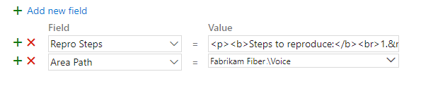
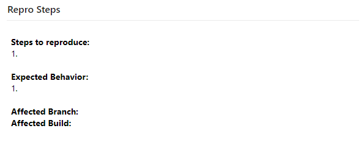
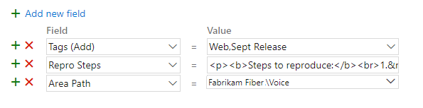

# Sample work item templates  

[!INCLUDE [temp](../_shared/version-vsts-tfs-2017-on.md)]

Work item templates can help save time and provide guidance to your team when defining user stories, features, bugs, or tasks. Teams use templates to support the following objectives:

- Create bugs for specific product areas 
- Provide guidance to fill out the work item 
- Create work items with specific tags 
- Define a bug template for use with another application or extension, such as [Bug Bash Pro](https://marketplace.visualstudio.com/items?itemName=mohitbagra.bugbashpro).

Review this article for examples of defining specific values of work item templates. For guidance on adding, managing, and applying work item templates, see [Use templates to add and update work items](../backlogs/work-item-template.md).

> [!NOTE]  
> Work item templates are distinct from process templates. For information on process templates, see [Choose a process template](../work-items/guidance/choose-process.md) or these specific topics for the default process templates: [Basic](../get-started/track-issues-tasks.md), [Agile](../work-items/guidance/agile-process.md), [Scrum](../work-items/guidance/scrum-process.md), or [CMMI](../work-items/guidance/cmmi-process.md).  


<a id="area-path"> </a> 

## Specify the Area Path 

As an organization grows, the number of product or feature areas and number of teams can grow in number. To support work items to appear on a team's backlog or board, templates should specify the Area Path that the team owns.  

In this example, the Voice team sets the <strong>Area Path</strong>=`Fabrikam Fiber/Voice`. 

> [!div class="mx-imgBorder"]  
>  

To learn more about area paths, see [About area and iteration paths (aka sprints)](../../organizations/settings/about-areas-iterations.md). 


<a id="rich-text"> </a> 

## Add guidance in a rich-text field

To provide guidance, enter HTML syntax into a rich-text field's value.  

For example, here we add the following syntax into the <strong>Repos Steps</strong> field

> [!div class="tabbedCodeSnippets"]
> ```HTML
> <p><b>Steps to reproduce:</b><br>1.&nbsp; <br><br><b>Expected Behavior:</b><br>1. <br><br><b>Affected Branch:</b> <br> <b>Affected Build:</b><br></p>
> ```
> 
> [!div class="mx-imgBorder"]  
>  

The work item form renders this as shown. 

> [!div class="mx-imgBorder"]  
>  


For more information about rich-text fields, see [Share information within work items and social tools](../queries/share-plans.md). 


<a id="add-tags"> </a> 

## Add tags 

Work item tags are useful to quickly filter backlogs, boards, or queries. You can add tags to track anything of interest, for example: Customer issue, Release, Milestone.

To add two or more tags, add them all within a single <strong>Tags (Add)</strong> field, entering a comma between tags. 

For example, here we add Web and Sept Release.

> [!div class="mx-imgBorder"]  
>  

To learn more about tags, see [Add work item tags to categorize and filter lists and boards](../queries/add-tags-to-work-items.md). 

You can also use the <strong>Tags (Remove)</strong> template field to remove tags from work items. For example, if many work items were tagged with Milestone 1, and that no longer applies, you could query for all those work items and remove the tag by doing a bulk apply of a template that removed the Milestone 1 tag. 

## Define and pre-populate custom fields 

You can pre-populate a custom field that has been added to the work item type. Prior to adding it to a template, you must first add it to the work item type. For inherited process models, see [Add and manage fields for an inherited process](../../organizations/settings/work/customize-process-field.md). For On-premises XML process models, see [Add or modify a field to track work](../../reference/add-modify-field.md).  

For example, the <strong>Triage</strong> custom field can be set to `False`, indicating the bug needs to be triaged. 

> [!div class="mx-imgBorder"]  
>  


## Access additional features through extensions  

An often requested feature is to be able to create a work item which automatically links to one or more work items. For example, a user story that links to 5 tasks. Work item templates don't support this capability. However, you may find a Marketplace extension will support this feature. For example, see the following extensions: 

- [Work item form one click actions](https://marketplace.visualstudio.com/items?itemName=mohitbagra.witoneclickactions)
- [1-Click Tasks](https://marketplace.visualstudio.com/items?itemName=ruifig.vsts-work-item-one-click-tasks) 
- [1-Click Child-Links](https://marketplace.visualstudio.com/items?itemName=ruifig.vsts-work-item-one-click-child-links)

::: moniker range=">= tfs-2017 < azure-devops"

## Customize the work item web form 

If your project uses the On-premises XML process model to customize work tracking, you can add help text, hyperlinks, or web content to a form to provide guidance. 

To learn more, see the following articles: 
- [WebLayout and Control elements](../../reference/xml/weblayout-xml-elements.md)
- [Provide help text, hyperlinks, or web content on a work item form](../../reference/xml/provide-help-text-hyperlinks-web-content-form.md)
- [Edit a WIT definition to add web content to a work item form](../../reference/xml/edit-wit-definition-add-web-content-form.md)
 
::: moniker-end

## Extensibility 

You can programmatically interact with work item templates to create, get, list, and delete using the [Templates REST APIs](/rest/api/azure/devops/wit/templates?view=azure-devops-rest-5.0).


## Related articles

- [Use templates to add and update work items](../backlogs/work-item-template.md)