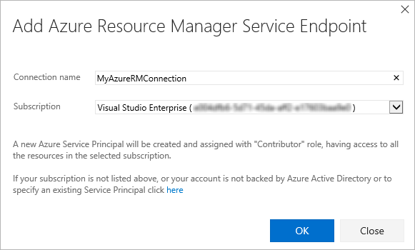
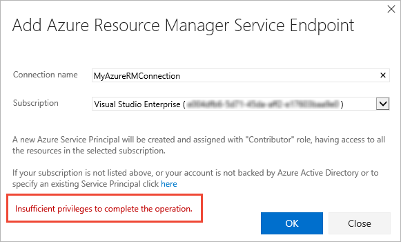
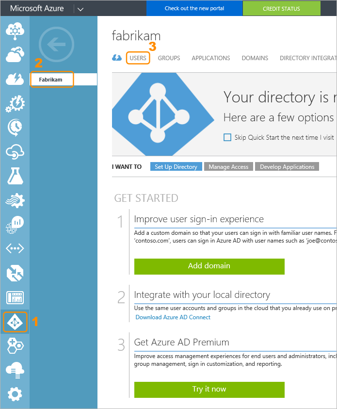
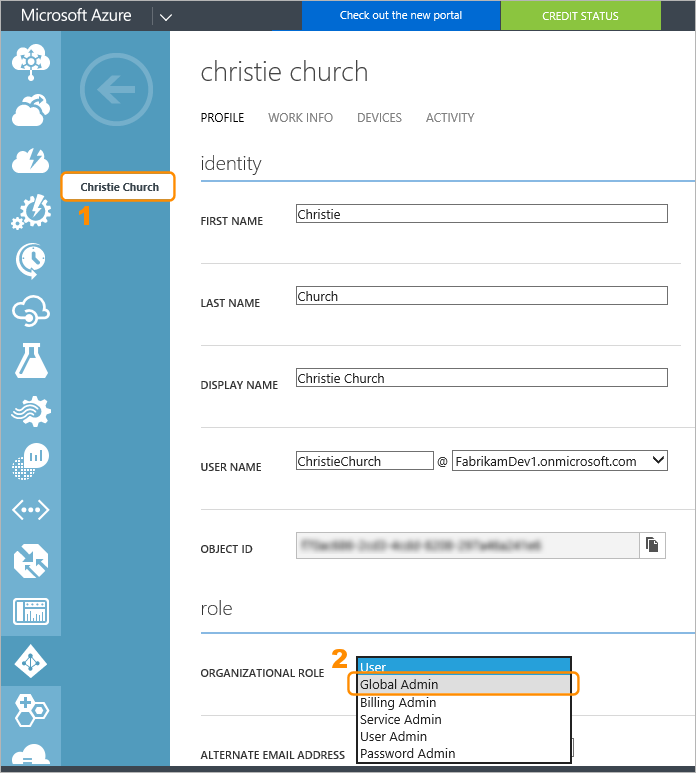
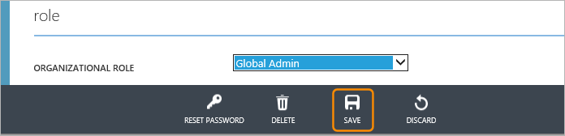
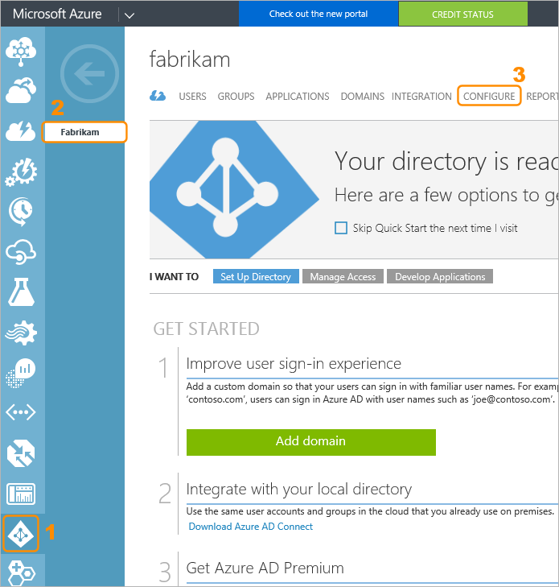
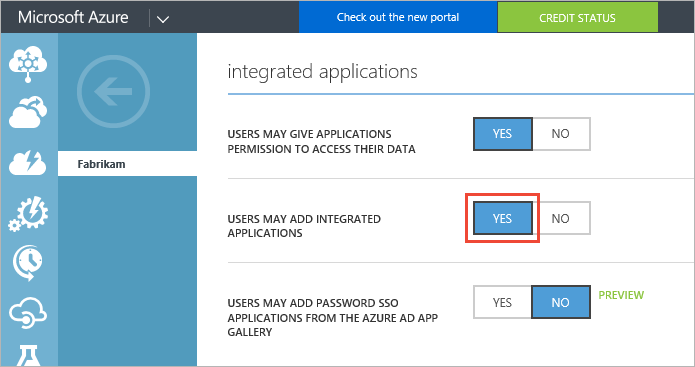
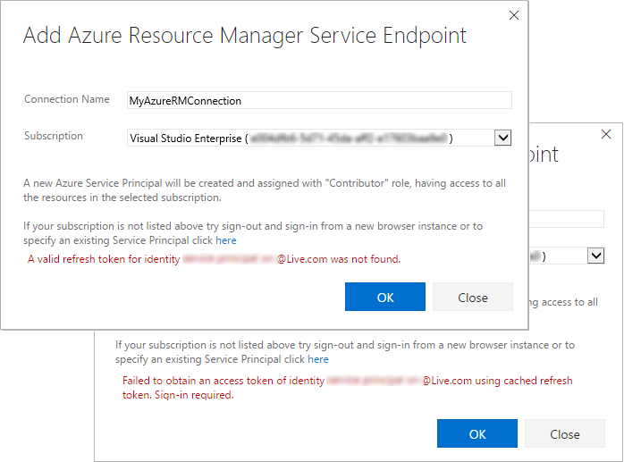
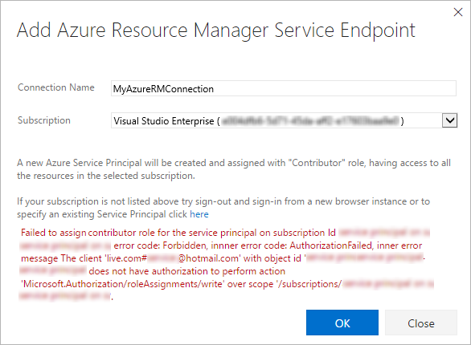

# How to: Troubleshoot Azure Resource Manager service endpoints

**Team Services | TFS 2017 | TFS 2015**

This topic will help you resolve issues you may encounter when creating
a connection to Microsoft Azure using an **Azure Resource Manager** service endpoint.

## What happens when you create a Resource Manager service endpoint?

You open the **Add Azure Resource Manager Service Endpoint** dialog,
provide a connection name, and select a subscription from drop-down
list of your subscriptions.  

When you choose **OK**, the system:

1. Connects to the Azure Active Directory (AAD) tenant for to the selected subscription
1. Creates an application in AAD on behalf of the user
1. After the application has been successfully created, assigns the application as a contributor to the selected subscription
1. Creates an Azure Resource Manager service endpoint using this application's details

## How to troubleshoot errors that may occur

Errors that may occur when the system attempts to create the service endpoint include:

* [Insufficient privileges to complete the operation](#privileges)
* [Failed to obtain an access token](#sessionexpired)
* [A valid refresh token was not found](#sessionexpired)
* [Failed to assign contributor role](#contributorrole)

### Insufficient privileges to complete the operation

This typically occurs when the system attempts to create an
application in AAD on your behalf.

This is a permission issue that may be due to the following causes:

* [The user has only guest permission in the directory](#guestonly)
* [The user is not authorized to add applications in the directory](#notauthtoadd)

#### The user has only guest permission in the directory

You must be a member of the **Global Admin** role in the directory in order
to create an Azure Resource Manager service endpoint.
The directory administrator has permission to change a user's role, as follows:

1. Sign into to Azure Classic portal at [https://manage.windowsazure.com](https://manage.windowsazure.com) using an Administrator account.

1. Choose **Active Directory** in the left navigation bar, select the directory
   corresponding to the user subscription, and open the **USERS** tab.

   

1. Select the user from the list and, in the **role** section change the
   **ORGANIZATION ROLE** to **Global Admin**.

   

1. Save the change.

   

It typically takes 15 to 20 minutes to apply the changes globally.
After this period has elapsed, the user can retry creating the service endpoint.

#### The user is not authorized to add applications in the directory

You must have permission to add integrated applications in the directory.
The directory administrator has permission to change this setting, as follows:

1. Sign into to Azure Classic portal at [https://manage.windowsazure.com](https://manage.windowsazure.com) using an Administrator account.

1. Choose **Active Directory** in the left navigation bar, select the directory
   corresponding to the user subscription, and open the **CONFIGURE** tab.

   

1. Ensure the value of the **USERS MAY ADD INTEGRATED APPLICATIONS** is set to
   **YES**. If not, change it to **YES** and save the change.

   

### Failed to obtain an access token or A valid refresh token was not found

These errors typically occur when your session has expired.

To resolve these issues:

* Sign out of Team Services or TFS.
* Open an InPrivate or incognito browser window and navigate to [https://www.visualstudio.com/team-services/](https://www.visualstudio.com/team-services/).
* If you are prompted to sign out, do so.
* Sign in using the appropriate credentials.
* Choose the account you want to use from the list.
* Select the project you want to add the service endpoint to.
* Create the service endpoint you need by opening the **Settings** page, selecting the **Services** tab,
  choosing **New service endpoint**, and selecting **Azure Resource Manager**.

### Failed to assign Contributor role

This error typically occurs when you do not have **Write** permission
for the selected Azure subscription when the system attempts to assign
the **Contributor** role.

To resolve this issue, ask the subscription administrator
to configure an **Admin Access** role for your identity.

[!INCLUDE [rm-help-support-shared](../_shared/rm-help-support-shared.md)]
