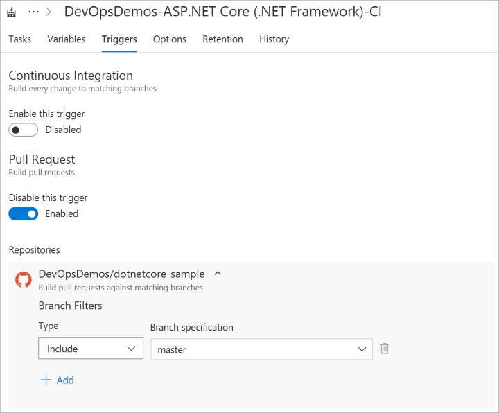

# Define a continuous integration (CI) build process for your GitHub repo

Visual Studio Team Services (VSTS) is an open system that you can use to set up continuous integration (CI) and continuous delivery (CD) for your code, even if you manage it outside our system, for example in GitHub.

In this tutorial, you learn how to:

> [!div class="checklist"]
> * Set up CI builds for your GitHub repo
> * Create a VSTS build status with a GitHub README file
> * Create a pull request trigger for GitHub

## Prerequisites
[!INCLUDE [include](../_shared/ci-cd-prerequisites-vsts.md)]
*	Ensure you have GitHub contributor rights for a repository.    

*	Fork this [sample repository](https://github.com/adventworks/dotnetcore-sample) into your GitHub account

## Set up CI builds for your GitHub repo

You can manage your application code in GitHub, and configure continuous integration using VSTS.   Build every commit in GitHub by modifying the trigger and enabling CI for the build definition.  Follow the steps below to configure GitHub as a source for your VSTS build. 

> [!IMPORTANT]
> Ensure your browser does not block the pop-up on step 7 below.
  
1. Navigate to your VSTS account and team project.  Click **Build & Release**, and then click **Builds**.
2. Click **New** to create a new build definition.
3. Select the **ASP.NET Core (.NET Framework)** build template.
4. Choose **Hosted VS 2017** for Agent queue.
5. Choose the **Get Sources** task for your build definition.  
6. Choose **GitHub** from Get Sources.    
     
7.  Give your connection a name, and then click the **Authorize using OAuth** button.  Optionally you can use a GitHub **personal access token** instead of OAuth.
8.  When prompted, sign in to your **GitHub account**.  Then click **Authorize** your VSTS account.
9.  Choose the **repository** that contains the sample you forked earlier.
10.  Click the **Triggers**.  Under **Continuous Integration**, Toggle on **Enabled** for **Trigger status**.  Ensure you select the **master branch** under branch filters.  This setting ensures each commit to master in GitHub will trigger a build via a **GitHub webhook**.  
11.  **Note:** The trigger setting for CI is for the purpose of this tutorial, and you can choose to leave this setting off to have fewer builds.
12.  Click **Options**, and then toggle on the checkbox to enable the **Badge enabled** setting.  Click **Save** to save your build definition.  
13.  Copy the URL under the **Badge enabled** setting.  You will use this URL in upcoming steps.  The URL displays a build status badge that can be safely viewed in a browser or used in external applications to display the build notification for your VSTS build definition.

## Create a VSTS build status with a GitHub README file

In this section you explore some of the possibilities for further integrating VSTS and GitHub.  You will create a notification for the build definition in VSTS by populating a GitHub readme file with markdown that points to the build notification URL.  This same markdown can link back to the build summary page in VSTS.  

1. Navigate to your GitHub account.  Click **Code**.  Create a README.md file unless one already exists.  
2. For this step, use the URL from step 13 in the previous section.  Modify the **README.md** file by adding markdown and an img tag.  Create a markdown link that displays the build status image and links to the build summary in VSTS.  **Modify** the below example with your account and build ID information.

  	``
3. **Commit** your README.md file to the repository.  The code tab will now display the current build status for your VSTS build.
    
4.  In GitHub, navigate to  **Settings** and click on **Webhooks**.  You should see the webhook that was created earlier.  Every commit to the GitHub repository will trigger a build in VSTS.
5.  Navigate back to your **VSTS build definition**.  Under **Build & Release** choose **Builds**.  You should notice a build is in progress or has completed for your build definition.
6.  View the build summary, and then click the **Commit ID** link under the **Associated Changes** section.  This link navigates you directly to the GitHub commit.
     

##  Create a pull request trigger for GitHub

In this section, you create a pull request trigger for your VSTS build definition.  Enabling the trigger in VSTS  allows you to initiate CI builds for every GitHub pull request. Even if you're using continuous integration (CI) on your development branches to catch problems early, building pull requests helps reduce issues.

1.  Navigate to your VSTS account and team project.  Click **Build & Release**, and then click **Builds**.  Locate your build, and click **edit**.
2.  Click **Triggers**.  Enable the **Pull Request** trigger.  Ensure you choose the **master branch** under **Branch Filters.**
    
3.  Click **Save & queue**, then click **Save**.
4.  Navigate to your GitHub account.  Navigate to the main page for your **repository**.
5.  Click the **Branch** selector, and then type a name for a new branch.  This will create a branch based on master.  Create the branch.
6.  Edit a file in your new branch.  **Commit** your change to the new branch.
7.  Click **Pull requests**.  Click **New pull request**.
8.  Create the pull request.  Navigate back to your **VSTS build definition**.  A build will be queued or completed.

## Q&A

### How do I use a personal access token to authorize the VSTS to GitHub connection?

See this [article](https://help.github.com/articles/creating-a-personal-access-token-for-the-command-line/) for creating a GitHub personal access token.  You can use the token in the VSTS **Get Sources** task for your build or release definitions by creating a service connection and providing the token.

## Next steps

In this tutorial, you learned how to set up and manage CI with GitHub and VSTS.

You learned how to:

> [!div class="checklist"]
> * Set up CI builds for your GitHub repo
> * Create a VSTS build status with a GitHub README file
> * Create a pull request trigger for GitHub

> [!div class="nextstepaction"]
> [Deploy to Azure Web App](../../build-release/apps/cd/deploy-webdeploy-webapps.md)

