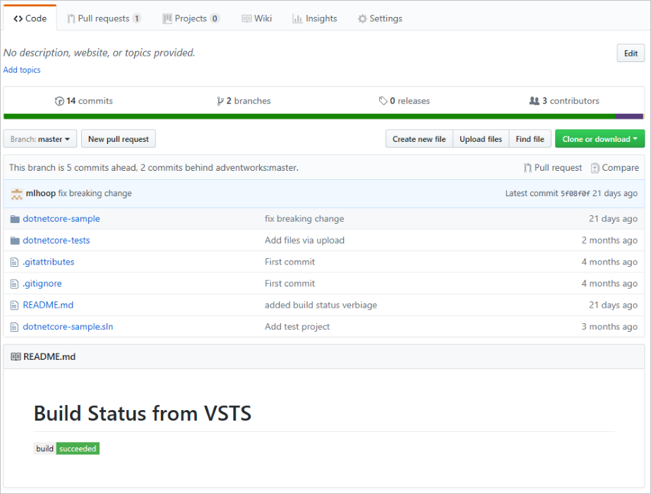
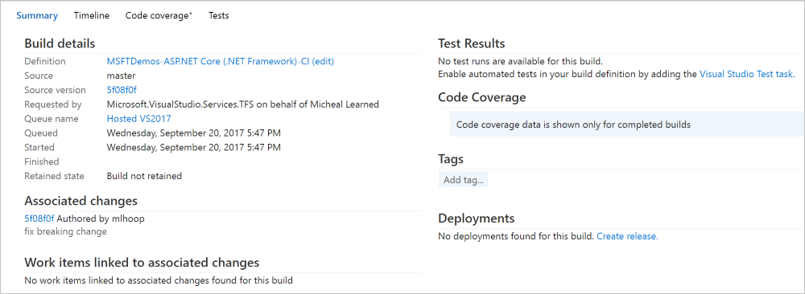

# Define a continuous integration (CI) build process for your GitHub repository

Visual Studio Team Services (VSTS) can perform continuous integration (CI) and continuous delivery (CD) for code in your GitHub repository.

In this tutorial, you learn how to:

> [!div class="checklist"]
> * Set up CI builds for your GitHub repository
> * Create a VSTS build status with a GitHub README file
> * Create a pull request trigger for GitHub

## Prerequisites

[!INCLUDE [include](../_shared/ci-cd-prerequisites-vsts.md)]

* Ensure you have GitHub contributor rights for a repository.
* Fork this [sample repository](https://github.com/adventworks/dotnetcore-sample) into your GitHub account

## Set up CI builds for your GitHub repository

You can manage your application code in GitHub, and configure continuous integration using VSTS. Build every commit in GitHub by adding the trigger and enabling CI for the build definition. Follow the steps below to configure GitHub as a source for your VSTS build. 

> [!IMPORTANT]
> Ensure your browser does not block the pop-up on step 7 below.

1. Navigate to your VSTS account and team project. Select **Build and Release**, and then select **Builds**.
1. Select **New** to create a new build definition.
1. Select the **ASP.NET Core (.NET Framework)** build template.
1. Choose **Hosted VS2017** for Agent queue.
1. Choose the **Get sources** task for your build definition.
1. Choose **GitHub** from **Get sources**.
     
1. Give your connection a name, and then select the **Authorize using OAuth** button. Optionally you can use a GitHub **personal access token** instead of OAuth.
1. When prompted, sign in to your **GitHub account**. Then select **Authorize** to grant access to your VSTS account.
1. Choose the **repository** that contains the sample you forked earlier.
1. Select **Triggers**. Under **Continuous integration**, select on the name of your repository.
1. Toggle on the checkbox labeled **Enable continuous integration**. Ensure you include the **master branch** under **Branch filters**. This setting ensures each commit to `master` in GitHub will trigger a build via a **GitHub webhook**.
1. **Note:** The trigger setting for CI is for the purpose of this tutorial, and you can choose to leave this setting off to have fewer builds.
1. Select **Options**, and then toggle on the checkbox to enable the **Badge enabled** setting.
1. Select **Save & queue**, then select **Save** to save your build definition.
1. Copy the URL under the **Badge enabled** setting. You will use this URL in upcoming steps. The URL displays a build status badge that can be safely viewed in a browser or used in external applications to display the build status of your VSTS build definition.

## Create a VSTS build status with a GitHub README file

This section explores possibilities for further integrating VSTS and GitHub. You will create a notification for the VSTS build definition by populating a GitHub readme file with Markdown that points to the build notification URL. This same Markdown can link back to the build summary page in VSTS.

1. Navigate to your GitHub account. Select **Code**. Create a README.md file unless one already exists.
1. For this step, use the URL from step 13 in the previous section. Modify the **README.md** file by adding Markdown and an `img` tag, as shown below. Create a Markdown link that displays the build status image and links to the build summary in VSTS. **Modify** the below example with your account and build ID information.

    ``
1. **Commit** your README.md file to the repository. The code tab will now display the current status of your VSTS build.
    
1. In GitHub, navigate to  **Settings** and select on **Webhooks**. You should see the webhook that was created by VSTS when you chose GitHub in your build definition. Every commit to the GitHub repository will trigger a build in VSTS.
1. Navigate back to your **VSTS build definition**. Under **Build and Release** choose **Builds**. You should notice a build is in progress or has completed for your build definition because of your `README.md` commit in the GitHub repository.
1. View the build summary, and then select the **Commit ID** link under the **Associated changes** section. This link navigates you directly to the GitHub commit.
     

## Create a pull request trigger for GitHub

In this section, you create a pull request trigger for your VSTS build definition. Enabling the trigger in VSTS allows you to initiate CI builds for every GitHub pull request. Even if you're using continuous integration (CI) on your development branches to catch problems early, building pull requests helps reduce issues before they arrive in your development branches.

1. Navigate to your VSTS account and team project. Select **Build and Release**, and then select **Builds**. Locate your build, and select **Edit**.
1. Select **Triggers**. Enable the **Pull request validation** trigger. Ensure you include the **master branch** under **Branch filters**.
1. Select **Save & queue**, then select **Save**.
1. Navigate to your GitHub account. Navigate to the main page for your **repository**.
1. Select the **Branch** selector, and then type a name for a new branch and press enter. This will create a branch based on master.
1. Edit a file in your new branch. **Commit** your change to the new branch.
1. Select **Pull requests**. Select **New pull request**.
1. Create the pull request. Navigate back to your **VSTS build definition**. A build will be queued or completed for the merge commit of your pull request.

## Building pull requests from repository forks

> [!IMPORTANT]
> These settings impact the security of your build.

To have VSTS automatically build pull requests from forks of your repository, enable the checkbox labeled **Build pull requests from forks of this repository**.

### Security considerations

By default, secrets associated with your build definition are not made available to builds of pull requests from forks. Secrets include:

  * A security token with access to your GitHub repository
  * These items, if used by your build:
    * [Service endpoint](../concepts/library/service-endpoints.md) credentials
    * Files from the [Secure Files library](../concepts/library/secure-files.md)
    * Build [variables](../concepts/definitions/build/variables.md#user-defined-variables) marked **secret**

If your build definition is configured with secrets, these builds will immediately fail. To bypass this precaution, enable the checkbox labeled **Make secrets available to builds of forks**. Be aware of this setting's impact on security as described below.

A GitHub user can fork your repository, change it, and create a pull request to propose changes to your repository. Such a pull request could contain malicious code to run as part of your triggered build. For example, an ill-intentioned script or unit test change could leak secrets or compromise the agent machine performing the build. The following steps are recommended to mitigate this risk:

1. Use a VSTS [hosted agent](../concepts/agents/hosted.md) to build pull requests from forks. Hosted agents are immediately deleted after they complete a build, so there is no lasting impact if they are compromised.

1. If you must use a [private agent](../concepts/agents/agents.md#install), do not store secrets or perform other builds or releases on the same agent, unless your repository is private and you trust pull request creators. Otherwise, secrets could leak and the repository contents or secrets of other builds and releases could be revealed.

1. If your repository is public, do not enable the checkbox labeled **Make secrets available to builds of forks**. Otherwise, secrets could leak during a build.

## Q&A

### How do I use a personal access token to authorize the VSTS to GitHub connection?

See this [article](https://help.github.com/articles/creating-a-personal-access-token-for-the-command-line/) for creating a GitHub personal access token. You can use the token in the VSTS **Get sources** task of your build or release definitions by creating a GitHub [service endpoint](../concepts/library/service-endpoints.md) and entering the token.

## Next steps

In this tutorial, you learned how to set up and manage CI with GitHub and VSTS.

You learned how to:

> [!div class="checklist"]
> * Set up CI builds for your GitHub repository
> * Display a VSTS build status within a GitHub README file
> * Create a pull request trigger for GitHub

> [!div class="nextstepaction"]
> [Deploy to Azure Web App](../../build-release/apps/cd/deploy-webdeploy-webapps.md)