# CI/CD Hello world

**VSTS**

What is continuous integration (CI)? What is continuous deployment (CD)? Why should I care? How do I get started using Team Build and Release Management?

Are any of these questions on your mind? If so, then you've come to the right place. We'll show you how to create a CI build that prints "Hello world" and then automatically creates a CD release that does the same. By the time you finish here, you'll see an end-to-end process run every time you push new code into your team project.

## A quick introduction to CI/CD


CI means starting an automated build (and possibly running tests) whenever new code is committed to or checked into the team project's source control repository. This gives you immediate feedback that the code builds and can potentially be deployed.

CD means starting an automated deployment process whenever a new successful build is available.

Together, CI and CD mean that any code changes you commit to your repository are quickly validated and deployed to a test server, a live web site, or wherever you need it.

Wanna try it?

## Get set up with VSTS

> Do you already have access to a VSTS account and to a team project that has a Git repo? And do you already have [permissions to create builds](../concepts/policies/permissions.md)? If so, then you can [skip to the next section](#add-script). If you're not sure, it takes just a moment to create a new account and there's no charge.

1. [Create a new account in VSTS](http://go.microsoft.com/fwlink/?LinkId=307137).

1. If you're prompted, then sign in using your personal Microsoft account or your work or school account. (Need help signing up? See [Sign up for VSTS](../../accounts/create-account-msa-or-work-student.md).)

1. Create a Visual Studio Team Service account. Keep the option to use **Git** selected.

 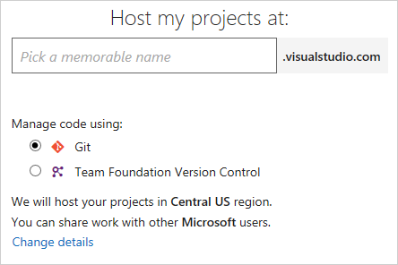

1. Select the option to **Initialize the repository with a README or gitignore**.

1. You see the home page for your first team project with a simple README.md file.

<h2 id="add-script">Add a script to your repository</h2>

Create a PowerShell script that prints `Hello world`.

1. Go to the **Code** hub.

 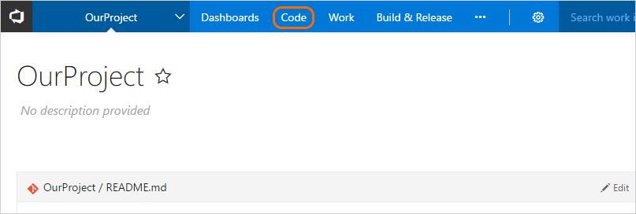

1. Add a file.

 

1. In the dialog box name your new file.
 ```
HelloWorld.ps1
```

1. Copy and paste this script.
 ```ps
Write-Host "Hello world"
 ```

1. **Commit** (save) the file.

> In this tutorial, our focus is on CI/CD, so we're keeping the code part simple. We're working in a VSTS Git repository directly in your web browser.
>
> When you're ready to begin building and deploying a real app, you can use a wide range of version control clients and services with VSTS CI builds. [Learn more](#version-control).

## Create a build definition

Create a build definition that prints "Hello world."

1. Select the **Build and Release** hub in your VSTS project, and then the **Builds** tab.

 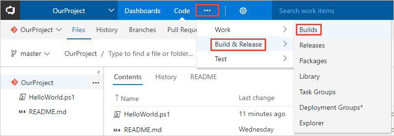

1. Create a new definition.

 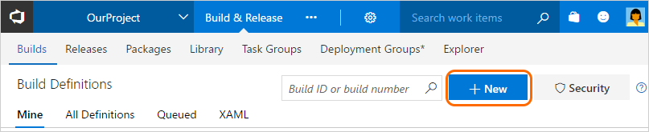

1. Start with an **empty process**.

1. Click **Process** and specify whatever **Name** you want to use. For the **Agent queue**, select **Hosted VS2017**.

1. Make sure that **Get sources** is set with the **Repository** and **Branch** in which you created the script.

1. On the left side click **Add Task**, and then on the right side click the **Utility** category, click the select the **PowerShell** task, and then click **Add**.

1. On the left side click your new **PowerShell** script task.

1. For the **Script Path** argument, click the <span style="background-color: rgb(244,244,244);font-weight:bold;padding:5px">...</span> button to browse your repository and select the script you created.

 

1. Click **Save & queue**, and then click **Save**.

> A build definition is the entity through which you define your automated build process. In the build definition, you compose a set of tasks, each of which perform a step in your build. The task catalog provides a rich set of tasks for you to get started. You can also add PowerShell or shell scripts to your build definition.

## Publish an artifact from your build

A typical build produces an artifact that can then be deployed to various environments in a release. Here to demonstrate the capability in a simple way, we'll simply publish the script as the artifact.

1. On the **Tasks** tab, click **Add Task**.

1. Click the **Utility** category, click the **Publish Build Artifacts** task, and then click **Add**.

 

 **Path to Publish**: Click the <span style="background-color: rgb(244,244,244);font-weight:bold;padding:5px">...</span> button to browse and select the script you created.

 **Artifact Name**

 ```
drop
```

 **Artifact Type**: **Server**.

> Artifacts are the files that you want your build to produce. Artifacts can be nearly anything your team needs to test or deploy your app. For example, you've got a .DLL and .EXE executable files and .PDB symbols file of a C# or C++ .NET Windows app.
>
> To enable you to produce artifacts, we provide tools such as copying with pattern matching, and a staging directory in which you can gather your artifacts before publishing them. See [Artifacts in Team Build](../concepts/definitions/build/artifacts.md).

## Enable continuous integration (CI)

1. Click the **Triggers** tab.

1. Enable **Continuous integration**.

>  A continuous integration trigger on a build definition indicates that the system should automatically queue a new build whenever a code change is committed. You can make the trigger more general or more specific, and also schedule your build (for example, on a nightly basis). See [Build triggers](../concepts/definitions/build/triggers.md).

## Save and queue the build

Save and queue a build manually and test your build definition.

1. Click **Save & queue**, and then click **Save & queue**.

1. On the dialog box click the **Queue** button.

 This queues a new build on the hosted agent. Once the agent is allocated, you'll start seeing the live logs of the build. Notice that the PowerShell script is run as part of the build, and that "Hello world" is printed to the console.

 

1. Go to the build summary.

 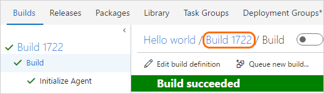

1. On the **Artifacts** tab of the build notice that the script is published as an artifact.

 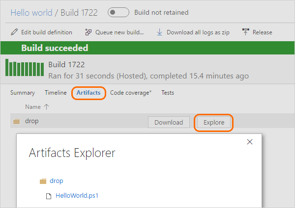

> You can view a summary of all the builds or drill into the logs for each build at any time by navigating to the **Builds** tab in the **Build and Release** hub. For each build, you can also view a list of commits that were built and the work items associated with each commit. You can also run tests in each build and analyze the test failures.

## Add some variables and commit a change to your script

We'll pass some build variables to the script to make our process a bit more interesting. Then we'll commit a change to a script and watch the CI process run automatically to validate the change.  

1. Edit your build definition.

1. On the **Tasks** tab, click the PowerShell script task.

1. Add these arguments.

 

 **Arguments**

 ```
-greeter "$(Build.RequestedFor)" -trigger "$(Build.Reason)"
```

1. Save the build definition.

1. Go to the **Code** hub, **Files** tab.

1. Select the **HelloWorld.ps1** file, and then **Edit** the file.

1. Change the script as follows:

 ```ps
Param(
   [string]$greeter,
   [string]$trigger
)
Write-Host "Hello world" from $greeter
Write-Host Trigger: $trigger
```

1. **Commit** (save) the script.

1. Go to the **Build and Release** hub, and notice that a build is automatically triggered by the change that you committed.

1. Select the new build that was created and view its log.

1. Notice that the person who changed the code has their name printed in the greeting message. You also see printed that this was a CI build.

 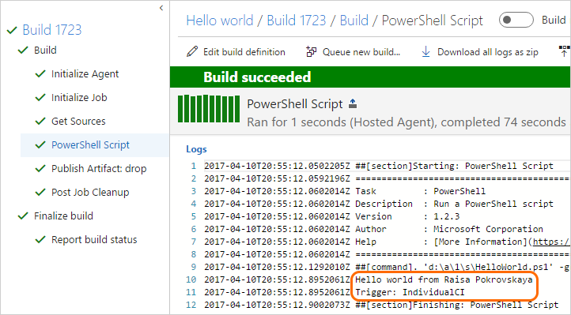

> We just introduced the concept of build variables in these steps. We printed the value of a variable that is automatically predefined and initialized by the system. You can also define custom variables and use them either in arguments to your tasks, or as environment variables within your scripts. To learn more about variables, see [Build variables](../concepts/definitions/build/variables.md).

## Create a release definition

Define the process for running the script in two environments.

1. Go to the **Build and Release** hub, and then to the **Releases** tab.

1. Select the action to create a **New definition**.

1. On the dialog box, select the **Empty** template and click **Next**.

1. Make sure that your **Hello world** build definition that you created above is selected. Select **Continuous deployment**, and then click **Create**.

1. Click **Add tasks** in the environment.

1. On the **Task catalog** dialog box, click **Utility**, locate the **PowerShell** task, and then click its **Add** button. Click the **Close** button.

1. For the **Script Path** argument, click the <span style="background-color: rgb(244,244,244);font-weight:bold;padding:5px">...</span> button to browse your artifacts and select the script you created.

1. Add these **Arguments**:

 ```
-greeter "$(Release.RequestedFor)" -trigger "$(Build.DefinitionName)"
```

1. Rename the environment **QA**.

 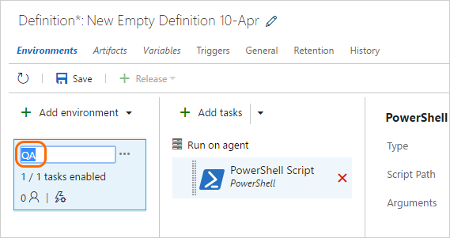

1. **Clone** the **QA** environment.

 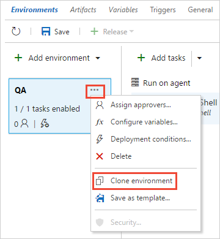

 Leave **Automatically approve** and **Deploy automatically...** selected, and click **Create**.

1. Rename the new environment **Production**.

1. Rename the release definition **Hello world**.

 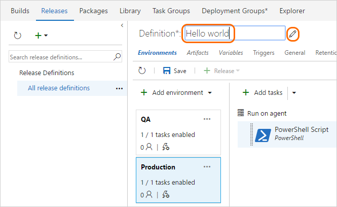

1. Save the release definition.

> A release definition is a collection of environments to which the application build artifacts are deployed. It also defines the actual deployment process for each environment, as well as how the artifacts are promoted from one environment to another.
>
> Also, notice that we used some variables in our script arguments. In this case, we used [release variables](../concepts/definitions/release/variables.md) instead of the build variables we used for the build definition.

## Deploy a release

Run the script in each environment.

1. Create a new release.

 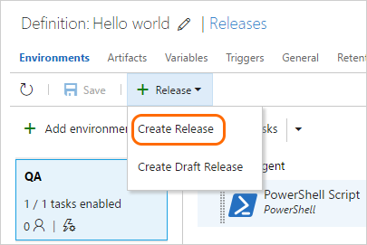

1. Open the release that you just created.

 

3. View the logs to get real-time data about the release.

 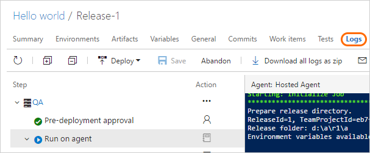


> You can track the progress of each release to see if it has been deployed to all the environments. You can track the commits that are part of each release, the associated work items, and the results of any test runs that you've added to the release process.

## Change your code and watch it automatically deploy to production

We'll make one more change to the script. This time it will automatically build and then get deployed all the way to the production environment.

1. Go to the **Code** hub, **Files** tab, edit the **HelloWorld.ps1** file, and change it as follows:

 ```ps
Param(
   [string]$greeter,
   [string]$trigger
)
Write-Host "Hello world" from $greeter
Write-Host Trigger: $trigger
Write-Host "Now that you've got CI/CD, you can automatically deploy your app every time your team checks in code."
```

1. Save the script.

1. Click the **Builds** tab to see the build queued and run.

1. After the build is completed, click the **Releases** tab, open the new release, and then go to the **Logs**.

 Your new code automatically is deployed in the **QA** environment, and then in the **Production** environment.

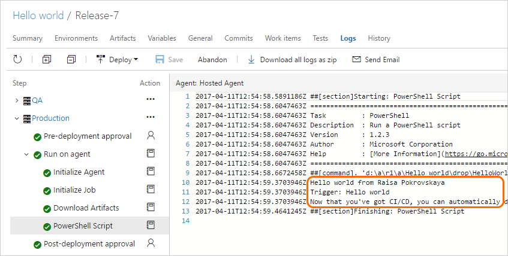

> In many cases, you probably would want to edit the release process so that the production deployment happens
  only after some testing and approvals are in place. See [Approvals and gates overview](../concepts/definitions/release/approvals/index.md).

## Put CI/CD to work for you

We hope this tutorial gave you an understanding of the basic concepts of Team Build and Release Management. To get started building and deploying an app, we suggest you proceed next to one of these topics:

* [ASP.NET](../apps/aspnet/build-aspnet-4.md)

* [ASP.NET core](../apps/aspnet/build-aspnet-core.md)

* [Node.js](../apps/nodejs/build-gulp.md)

* [Build and deploy your app](../apps/index.md)

## Q&A

### Where can I read articles about DevOps and CI/CD?
<!-- BEGINSECTION class="md-qanda" -->

[What is Continuous Integration?](https://www.visualstudio.com/learn/what-is-continuous-integration/)

[What is Continuous Delivery?](https://www.visualstudio.com/learn/what-is-continuous-delivery/)

[What is DevOps?](https://www.visualstudio.com/learn/what-is-devops/)

<h3 id="version-control">What kinds of version control can I use</h3>

We've used a Git repository in VSTS to keep things focused on CI/CD for this tutorial.

When you're ready to get going with CI/CD for your app, you can use the version control system of your choice:

* Clients

 * [Visual Studio Code for Windows, macOS, and Linux](https://code.visualstudio.com)

 * [Visual Studio with Git for Windows](../../git/share-your-code-in-git-vs.md) or [Visual Studio for Mac](https://www.visualstudio.com/vs/visual-studio-mac/)

 * [Visual Studio with TFVC](../../tfvc/share-your-code-in-tfvc-vs.md)

 * [Eclipse](../../git/share-your-code-in-git-eclipse.md)

 * [Xcode](../../git/share-your-code-in-git-xcode.md)

 * [IntelliJ](http://java.visualstudio.com/docs/tools/intellij)

 * [Command line](../../git/share-your-code-in-git-cmdline.md)

* Services

 * [VSTS](https://www.visualstudio.com/team-services/)

 * Git service providers such as GitHub and Bitbucket

 * Subversion

### How do I replicate a definition?

If your definition has a pattern that you want to replicate in other definitions, clone it, export it, or save it as a template.


After you clone a definition, you can make changes and then save it.

After you export a definition, you can import it from the **All Definitions** tab.

After you create a template, your team members can use it to follow the pattern in new definitions.

> [!TIP]
>
> If you're using the **New Build Editor**, then your custom templates are shown at the bottom of the list.

### How do I work with drafts?

If you're editing a build definition and you want to test some changes that are not yet ready for production, you can save it as a draft.


You can edit and test your draft as needed.

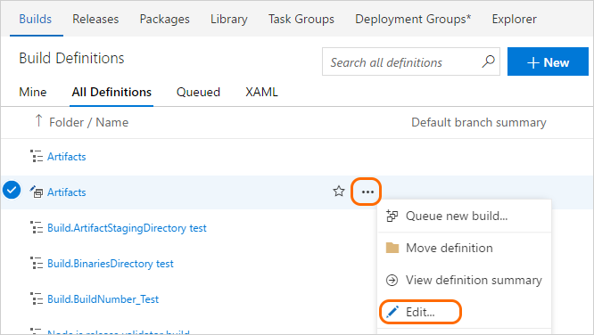

When you're ready you can publish the draft to merge the changes into your build definition.


Or, if you decide to discard the draft, you can delete it from the **All Definition** tab shown above.

<h3 id="queueabuild">What else can I do when I queue a build?</h3>

You can queue builds [automatically](../concepts/definitions/build/triggers.md) or manually.

When you manually queue a build, you can, for a single run of the build:

* Specify the [queue](../concepts/agents/pools-queues.md) into which the build goes.

* Add and modify some [variables](../concepts/definitions/build/variables.md).

* Add [demands](../concepts/definitions/build/options.md#demands).

* In a Git repository

 - Build a [branch](../../git/tutorial/branches.md) or a [tag](http://git-scm.com/book/en/v2/Git-Basics-Tagging).

 - Build a [commit](../../git/tutorial/commits.md).

* In a TFVC repository

 - Specify the source version as a [label](https://msdn.microsoft.com/en-us/library/ms181439.aspx) or [changeset](https://msdn.microsoft.com/en-us/library/ms181408.aspx).

 - Run a private build of a [shelveset](https://msdn.microsoft.com/en-us/library/ms181403.aspx). (You can use this option on either a [hosted agent](../concepts/agents/hosted.md) or a [private agent](../concepts/agents/agents.md).)

### Where can I learn more about build definition settings?

To learn more about build definition settings, see:

* [Getting sources](../concepts/definitions/build/repository.md)

* [Tasks](../tasks/index.md)

* [Variables](../concepts/definitions/build/variables.md)

* [Triggers](../concepts/definitions/build/triggers.md)

* [Options](../concepts/definitions/build/options.md)

* [Retention](../concepts/policies/retention.md)

* [History](../concepts/definitions/build/history.md)

### How do I programmatically create a build definition?

[REST API Reference: Create a build definition](../../integrate/index.md)


<!-- ENDSECTION -->
