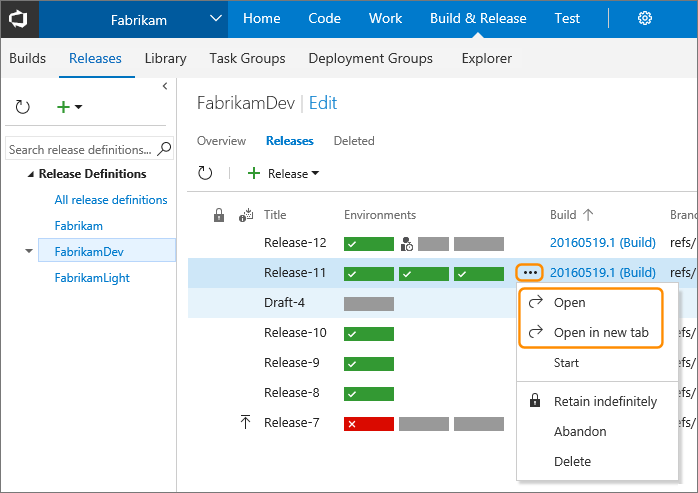
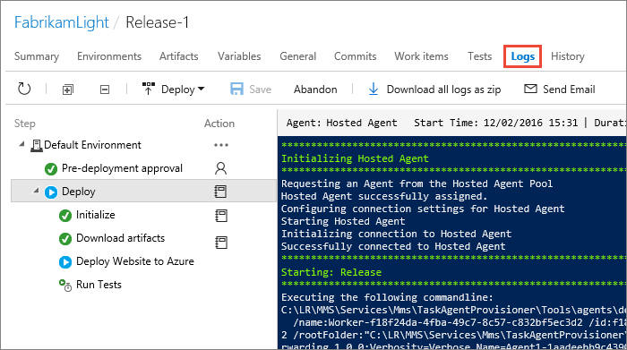
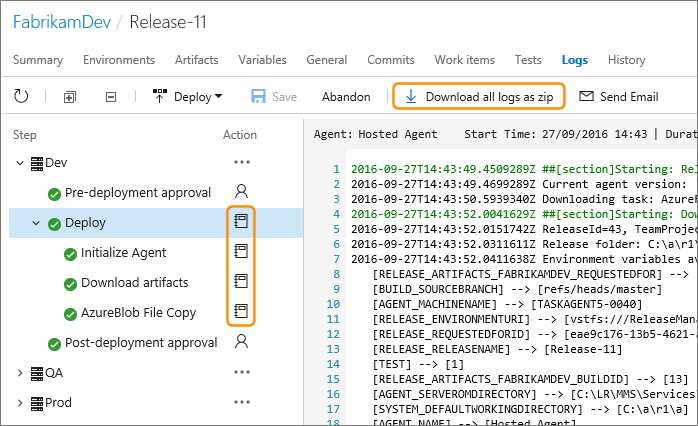
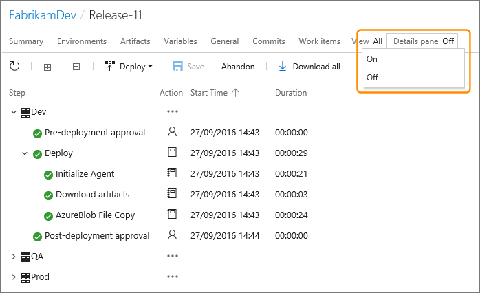

# How To: Monitor releases and debug deployment issues

[!INCLUDE [version-rm-dev14](../_shared/version-rm-dev14.md)]

Release Management creates comprehensive log files as it
executes a release and deploys artifacts. Use these log files
to monitor and debug your releases, and add additional
information to them when required by running a release in
[debug mode](#debug-mode).

## View release log files

Select the release you are interested in and open it.

In the release **Summary** page, choose the **Logs** tab link.
The **Logs** page shows the status for each step or task of the release, for each
of the environments in the release definition. If the release is still running,
you see the live display of the log file as it is generated by the agent.

After a release has completed,
irrespective of whether it succeeded, failed, or was abandoned, this page shows the
log file, the details, and the history for each step or task. You can download
the log file for each task, or download all of the log files as a zip file.

>You can run your deployments in [debug mode](#debug-mode)
to show additional information that can help you resolve issues and failures.

If you don't want to see the live log output, hide it using the **Details pane**
drop-down list at the top right of the page. When the details pane is hidden, you
can sort the list in ascending or descending order based on the values in the
columns by clicking the column headings (the

icon shows the current sorting column).

As the list of environments and tasks grows, including the history for earlier releases,
it may be more difficult to find individual items. Filter the list to show just
approvals or just tasks using the **View** drop-down list at the top right of the page.  

<h2 id="debug-mode">Run a release in debug mode</h2>

Show additional information as a release executes and in the log files
by running the entire release, or just the tasks in an individual
release environment, in debug mode. This can help you resolve issues and failures.

* To initiate debug mode for an entire release, add a variable
  named `System.Debug` with the value `true` to the **Variables**
  tab of a release definition.

* To initiate debug mode for a single environment, open the
  **Configure environment** dialog from the shortcut menu
  of the environment and add a variable named `System.Debug`
  with the value `true` to the **Variables** tab.

* Alternatively, create a [variable group](../concepts/library/variable-groups.md)
  containing a variable named `System.Debug` with the value `true`
  and link this variable group to a release definition.

For more information about configuring environment variables,
see [this topic](../concepts/definitions/release/variables.md).

If you get an error related to an Azure RM service endpoint,
see [How to: Troubleshoot Azure Resource Manager service endpoints](../actions/azure-rm-endpoint.md).

## See also

* [Releases](../concepts/releases/index.md)

* [Work with release definitions](work-with-release-definitions.md)

* [Create and deploy a release from a release definition](create-deploy-releases.md)

* [View and manage releases](view-manage-releases.md)

## Q&A

<!-- BEGINSECTION class="md-qanda" -->

### Where can I learn step-by-step how to build and release my app?

[Examples](../apps/index.md)

[!INCLUDE [qa-agents](../_shared/qa-agents.md)]

[!INCLUDE [qa-versions](../_shared/qa-versions.md)]

<!-- ENDSECTION -->

[!INCLUDE [rm-help-support-shared](../_shared/rm-help-support-shared.md)]
