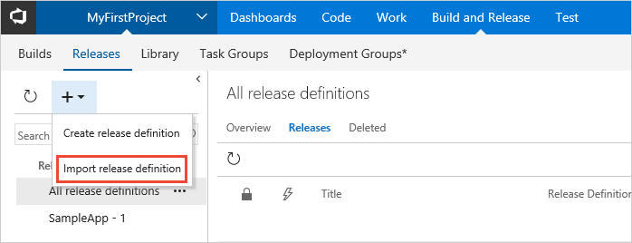
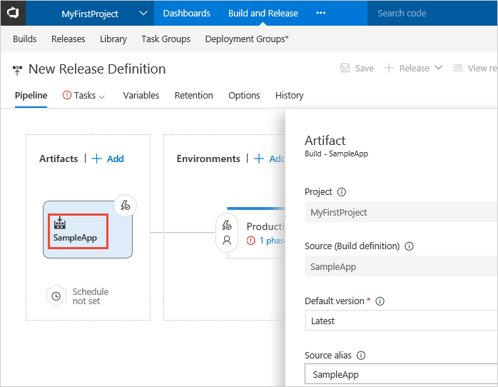
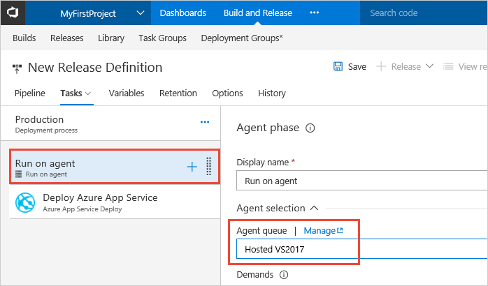
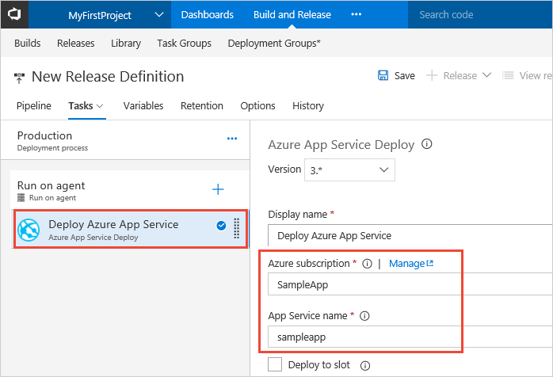

# Define your multi-stage continuous deployment (CD) process

Visual Studio Team Services (VSTS) and Team Foundation Server (TFS) provide a highly
configurable and manageable pipeline for releases to multiple environments
such as development, staging, QA, and production environments; including
requiring approvals at specific stages.

In this tutorial, you learn about:

> [!div class="checklist"]
> * Extending a release definition by adding environments
> * Configuring the environments as a multi-stage release pipeline
> * Configuring triggers within the release pipeline
> * Adding approvals to your release pipeline
> * Creating a release and monitoring the deployment to each environment

[What's the difference between a release definition and a release?](../concepts/releases/index.md)

## Prerequisites

[!INCLUDE [include](_shared/build-prerequisites.md)]

You'll need a CI build that publishes your Web Deploy package. To set up CI for your specific type of app, see:

* [Build your ASP.NET 4 app](../apps/aspnet/build-aspnet-4.md)

* [Build your ASP.NET Core app](../apps/aspnet/build-aspnet-core.md)

* [Build your Node app with Gulp](../apps/nodejs/build-gulp.md)

In addition, you need two Azure web app instances where you will deploy the app.
You will have to choose names that are unique, but it's a good idea to include
"QA" in the name of one, and "Production" in the name of the other, so that you
can easily identify them. If you need help, follow the steps in
[this example](../../deploy-azure/aspnet-core-to-azure-webapp.md#create-webapp-portal).

## Import a release definition

To simplify the setup for this tutorial, you will import an existing release definition.

1. Download the sample release definition from the following URL and save it on your disk:

   ```URL
   insert GitHub URL for release definition
   ```

1. In the **Build &amp; Release** hub, open the **Releases** tab. Open the **+** drop-down list and choose **Import release definition**.

   
   
1. Select the release definition you downloaded and choose **Import**.
   
1. Choose the artifact item in the **Artifacts** section of the release definition. If your
   existing build artifact is not shown, use the settings in the **Artifacts** panel to select it.

   
   
1. Open the **Tasks** tab and select the **Run on agent** item. In the properties panel, set the **Agent queue** to **Hosted VS2017**.

   

1. Select the **Deploy Azure App Service** item. In the properteis panel, select your Azure subscription
   and app service (the web app you created for the Production website). 

   

1. Save the release definition.

   

1. Open the **+ Release** drop-down list and choose **Create release**.

   

1. Enter a description for the release, and check that the correct artifact is selected. Then choose **Queue**.

   

1. After a few moments, a banner appears indicating that the new release was created.
   Choose the link (the name of the release).

   

1. Check that the release was successfully deployed to the Production web app.

   

[!INCLUDE [customize-process-sections](../../deploy-azure/_shared/customize-process-sections.md)]


