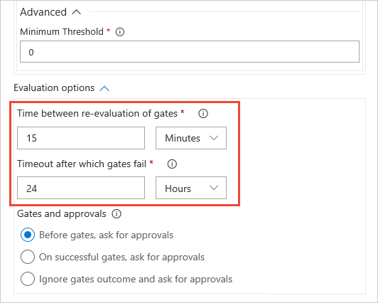

# Use approvals and gates to control your deployment

By using a combination of manual deployment approvals, gates, and manual
intervention within a release definition in Visual Studio Team Services
(VSTS) and Team Foundation Server (TFS), you can quickly and easily configure
a release pipeline with all the control and auditing capabilities you require.

In this tutorial, you learn about:

> [!div class="checklist"]
> * Extending the approval process with gates
> * Extending the approval process with manual intervention
> * Viewing and monitoring approvals and gates

## Prerequisites

This tutorial extends the tutorial [Define your multi-stage
continuous deployment (CD) process](define-multistage-release-process.md).
**You must have completed that tutorial first.**

You'll also need a **work item query** that returns some work items from
your VSTS or TFS account. This query is used in the gate you
will configure. You can use one of the built-in queries, or create a
new one just for this gate to use. For more information, see
[Create managed queries with the query editor](../../work/track/using-queries.md).

In the previous tutorial, you saw a simple use of manual approvals to allow an administrator
to confirm that a release is ready to deploy to the production environment. In this 
tutorial, you'll see some additional and more powerful ways to configure approvals 
for releases and deployments by using manual intervention and gates. 
For more information about the ways you can configure approvals for a release,
see [Approvals and gates overview](../concepts/definitions/release/approvals/index.md).

## Configure a gate

First, you will extend the approval process for the release by adding a gate.
Gates allow you to configure automated calls to external services, where the results
are used to approve or reject a deployment. You can use gates to ensure that the release
meets a wide range or criteria, without requiring user intervention.

1. In the **Releases** tab of the **Build &amp; Release** hub, select your release
   definition and choose **Edit** to open the pipeline editor.

   

1. Choose the pre-deployment conditions icon for the **Production** environment to
   open the conditions panel. You can see that there is already an approver configured
   (this was done in the previous tutorial), but gates are disabled.
   Enable them by using the switch control in the **Gates** section.   

   

1. To allow gate functions to initialize and stabilize (it may take some time for them
   to begin returning accurate results), you configure a delay before the results
   are evaluated and used to determine if the deployment should be approved or rejected.
   For this example, so that you can see a result reasonably quickly, set the delay
   to a short period such as one minute. 

   

1. Choose **+ Add** and select the **Query Work Items** gate.

   

1. Configure the gate by selecting an existing work item query. You can use one of the built-in
   VSTS and TFS queries, or [create your own query](../../work/track/using-queries.md).
   Depending on how many work items you expect it to return, set the maximum and minimum
   thresholds (run the query in the **Work** hub if you're not sure what to expect).

   

   >You'll need to open the **Advanced** section to see the **Maximum Threshold** setting. 
   For more details about the gate arguments, see [Work Item Query task](../tasks/utility/work-item-query.md).

1. Open the **Options for all gates** section and specify the timeout and the sampling interval.
   For this example, choose short periods so that you can see the results reasonably quickly.
   The minimum values you can specify are 6 minutes timeout and 5 minutes sampling interval. 

   

   >The sampling interval and timeout work together so that the gates will call their functions
   at suitable intervals, and reject the deployment if they don't all succeed during the same sampling
   interval and within the timeout period.
   For more details, see [Gates](../concepts/definitions/release/approvals/gates.md).

1. Save you release definition.

   

For more information about using other types of approval gates, see [Approvals and gates](../concepts/definitions/release/approvals/index.md).

<!-- TBD - ADD GATE TASK TO TASKS LIST -->
   
## Configure a manual intervention

Sometimes, you may need to introduce manual intervention into a release pipeline.
For example, there may be tasks that cannot be accomplished automatically such as
confirming network conditions are appropriate, or that specific hardware or software 
is in place, before you approve a deployment. You can do this by using the **Manual
Intervention** task in your pipeline.

1. In the release pipeline editor, open the **Tasks** editor for the **QA** environment.

   

1. Choose the ellipses (**...**) in the **QA** deployment process bar and then choose **Add agentless phase**.

   

   Several tasks, including the **Manual Intervention** task, can be used only in an
   [agentless phase](../concepts/process/phases.md#agentless-phase). 

1. Choose **+** in the **Agentless phase** bar and add a **Manual Intervention** task to the phase. 

   

1. Configure the task by entering a message (the **Instructions**) to display when it executes and pauses the release process.

   

   Notice that you can specify a list of users who will receive a notification that the deployment
   is waiting for manual approval. You can also specify a timeout and the action (approve or reject)
   that will occur if there is no user response within the timeout period.
   For more details, see [Manual Intervention task](../tasks/utility/manual-intervention.md).

1. Save the release definition and start a new release.

   

## View the logs for approvals 

You typically need to validate and audit a release and the associated deployments
after it has completed, or even during the deployment process. This is useful when
debugging a problematic deployment, or when checking when and by whom approvals were
granted. The comprehensive logging capabilities provide this information.

1. Open the release summary for the release you just created. You can do this by choosing the
   link in the information bar in the release editor after you create the release,
   or directly from the **Releases** tab of the **Build &amp; Release** hub.

   

1. Open the **Logs** page. You'll see a live log and status for each step in the release
   process. After the release is complete, choose the icon in the **Action** column
   for the **Manual Intervention** task to see details of who approved, when the approval
   occurred, and the message entered by the approver.  

   

1. The release also required an approval to start deployment to the production environment.
   Choose the icon in the **Action** column for the **Pre-deployment** condition. Again,
   you see details of the approval. 

   

1. Finally, the release was approved by a gate, which validated the results
   of a work item query (which would be used to ensure the work required was complete
   and any bugs reported had been resolved). 
   Choose the icon in the **Action** column for the **Query Work Items** gate. The
   information panel shows the result at each sample interval when the gate executed the work item query.

   

Altogether, by using a combination of manual approvals, approval gates, and the manual
intervention task, you've seen how can configure a release pipeline with all the control and
auditing capabilities you may require. 

## Next step

> [!div class="nextstepaction"]
> [Deploy to IIS web servers on Windows](../apps/cd/deploy-webdeploy-iis-deploygroups.md)
