# View and manage releases

[!INCLUDE [version-rm-dev14](../_shared/version-rm-dev14.md)]

Release Management shows comprehensive information about the
releases you have initiated, and the results of deployments.
This includes a [list](#release-list) and an [overview](#release-overview) of 
all releases, a [summary](#release-summary) of the details 
for each release, [test results](#test-results),
and release logs.

From the Release Management UI you can also
[restore deleted releases](#restore-release),
[redeploy](#redeploy-release) a release, get [release notifications](#notifications),
send [status emails](#send-email), and view [release history](#release-history).
You might also want to add a [releases widget](#add-widget) to your team dashboard.

>See also: [Approvals and gates overview](../concepts/definitions/release/approvals/index.md)

<h2 id="release-list">List of releases</h2>

The default **Releases** page shows a list of
releases. As well as the current status, title, release definition name, and other
details, the list contains information about the source of the release, when the release was started
the user who initiated it, the description, and more (not all columns are visible
in this screenshot).

Select a release definition in the left column to filter the list to just that
release definition. Sort the list in ascending or descending order based on the
values in each column by clicking the column headings (the

icon shows the current sorting column).
Use the links in the rows to open the release definition in edit mode, or to
see the build results linked to that release.

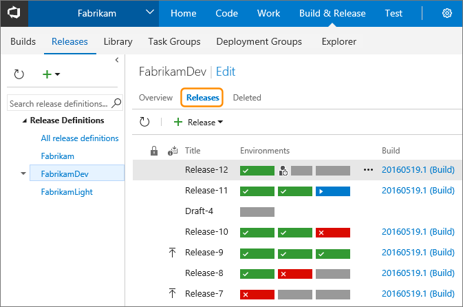

The first column in the list indicates if the release is locked, and the second column
shows the _reason_ for each release. The

icon indicates that this release was automatically initiated when a new build
of the source artifacts was completed - based on the
[continuous deployment](../concepts/definitions/release/triggers.md)
setting in the release definition.

In this view, each environment is shown as a horizontal bar - red for failed,
green for succeeded, orange for partially succeeded, blue for in progress,
and gray for paused or not deployed. Notice the

icon in the first release in the list. This indicates that
you were specified as an approver and the release is paused
waiting for you to approve it. When a release is paused waiting
for a  different user to grant approval, the list displays the
 icon.
See [Approvals](../concepts/definitions/release/approvals/approvals.md).

Use the commands on the toolbar of the **Releases** pane to:

* Refresh the list of releases
* [Create and deploy a release](create-deploy-releases.md) from this definition.

Use the commands on the shortcut menu for a release to:

* Open the details view of a release in the same or in a new browser tab
* Start a canceled or a failed release
* Retain the details and history of a release indefinitely (see [Retention policies](../concepts/policies/retention.md))
* Abandon a canceled or a failed release
* Delete the details of a release

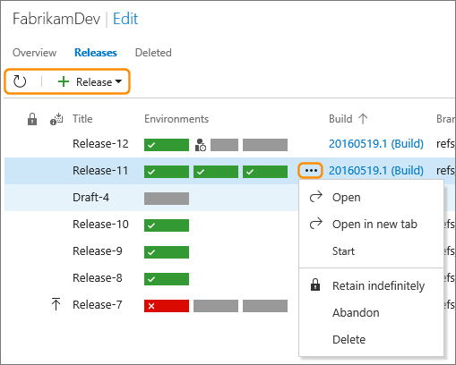

>Depending on the current state of a release, not all of the commands will be available.   

### Find release definitions and releases

Search for a release definition in the left column of the **Releases** pane.

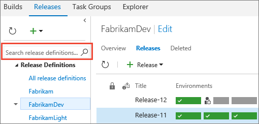

Use the **State** drop-down list at the top right of the **Releases** pane to filter the
list of releases by their current state.

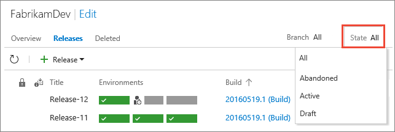

Or use the **Branch** drop-down list to filter the
list of releases by the branch from which the artifacts were generated.

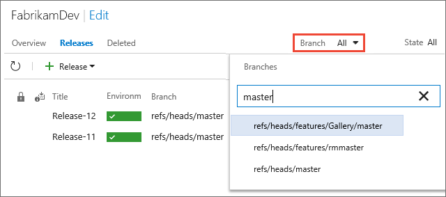

<h2 id="release-overview">Overview of releases</h2>

The **Overview** page also shows a list of release definitions, but as a
series of environments with the name of the release and the date or time it was
started. The color of the heading and the icon in each environment indicate the
current status of the release (using the same color scheme as the **Releases**
page). Select a release definition in the left column to filter the list to just
releases for that definition.

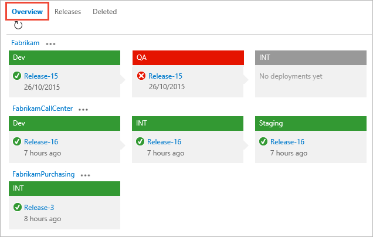

In the **Overview** page, you can:

* Choose the name of the release definition (above the environments) to
  open that definition in edit mode

* Choose the name of the release displayed within any of the environments to open
  the [Summary](#release-summary) page for the _most recent_ release for this definition.

* Choose the ellipses (**...**) next to the release definition name
  to open a shortcut menu where you can create a new release or a draft release for that
  release definition, edit or delete the release definition, add a widget for this release
  to a dashboard on your Home page, or manage the security settings
  for the release definition.

  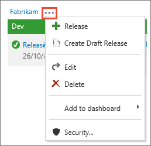

<h3 id="restore-release">Restore deleted releases</h3>

When you delete a release, or it is automatically deleted by a retention policy,
the release is removed from the overview and details lists.
However, it is retained with the release definition for a period (typically
14 days) before it is permanently deleted. During this period, it is shown in
the **Deleted** tab of the overview and details lists. You can restore any of
these releases by opening the shortcut menu and choosing **Undelete**.

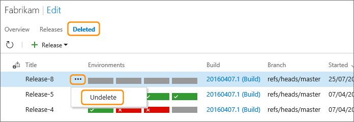

<h3 id="add-widget">Add release information to the dashboard</h3>

To make it easy to monitor the releases and deployments for a release definition, add
widgets to a dashboard or the overview page of your project. The **Release Definition Overview**
widget shows a summary of the releases for a selected release definition. Links in the
widget let you quickly go directly to the list of releases for this release definition,
or open the details view of a specific release.

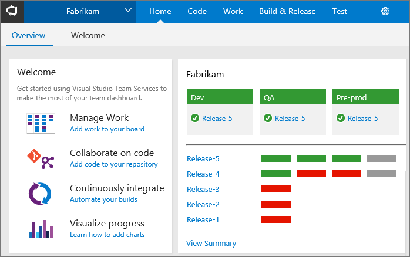

The **Deployment Status** widget shows a summary of releases from a selected build to
all of the environments in which it has been deployed. It displays the status of each
deployment, with an overlay that shows additional information such as the test pass rate.
You can specify a range of options for the widget such as the size of the cells, the
data source for the overlay, the release definition, the environments to include, as
well as the build and branch from with the data is taken.
Links in the widget let you open a deployment summary for the environment, and the build
definition. Hover over a cell to see a pop-up containing a more detailed summary.

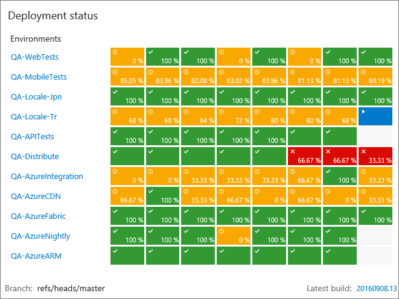

Add widgets to a dashboard as shown in [Add widgets and charts to a dashboard](../../report/add-widget-to-dashboard.md).
You can also add the **Release Definition Overview** directly from the list of release
definitions in the **Release** hub. On the left of the **Overview** or **Releases** page,
or in the details page for a release, open the shortcut menu for any release
definition and choose **Add to Dashboard**.

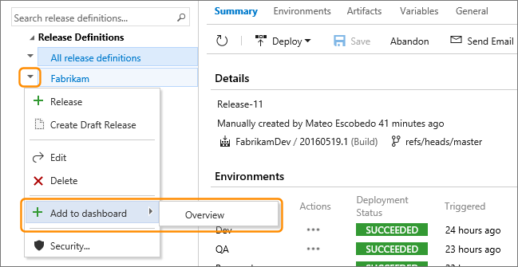

<h2 id="release-summary">Summary view of a release</h2>

As a release progresses, you can view the status. You can also view comprehensive
details of all previous releases for all release definitions. In the **Releases** list,
open the shortcut menu for a release and choose **Open** or **Open in new tab**.

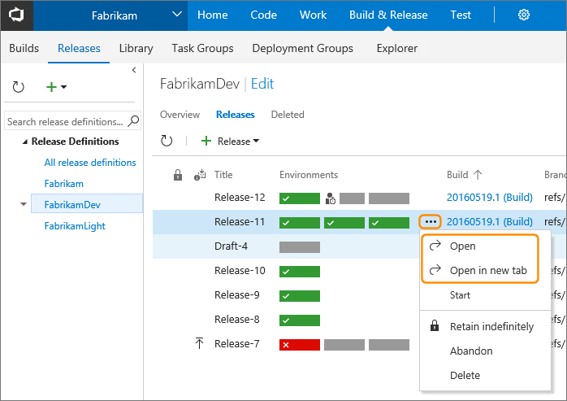

>Alternatively, when using a mouse, double-click the release in the list
to open it. The commands shown on the shortcut menu will vary depending on
the current state of the release.

If you have a release in progress, or recently started, a message bar at the top
of the page contains a link that opens the **Summary** page for that release.

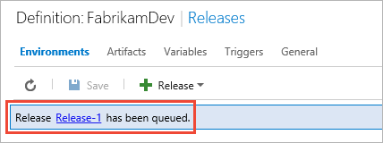

The default **Summary** tab shows details of the release as it is in progress.
The page shows all of the environments for the release, and the current progress and
status for each one. It also contains information about the
release definition and the release itself. This includes details of the artifacts
to deploy, any test results, and the work items related to this release (if any).

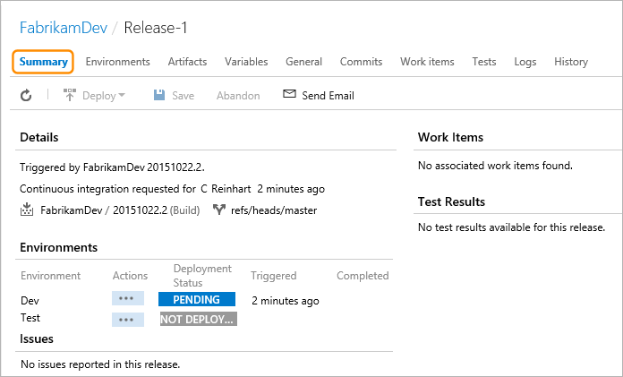

> Hover your mouse pointer over any "not deployed" status items to see a pop-up tip
that indicates the reason, and suggests how or when the deployment will start.

After a release has finished, the page shows full details of the status.
For example, deployments to each environment are shown as as partially
or fully successful, pending, failed, or not deployed. The summary of
test pass rates are also shown for each environment. Choose one of these
links to open details of the tests (also see how to [view test results](#test-results)).

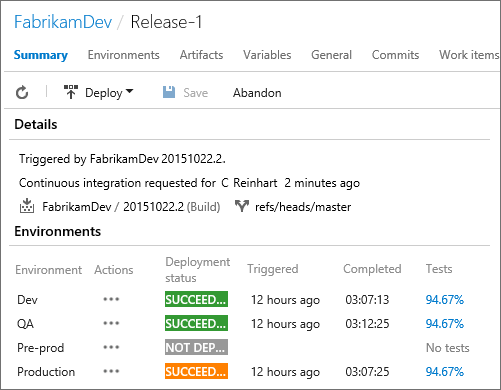

To select the columns you want to see in the list of results for each environment,
use the  icon to open the column selector.

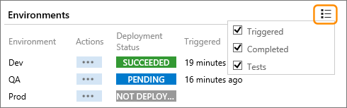

To cancel a pending or in-progress release, use the ellipses (**...**) for the
environment to open the shortcut menu and choose **Cancel**.

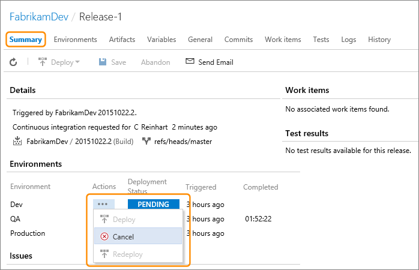

To deploy a release that has not yet been deployed, such as releases where the
environment deployment options only permit a manual release, use the ellipses (**...**) for the
environment to open the shortcut menu and choose **Deploy**.

Alternatively, open the **Deploy** menu and choose the target environment(s).
Here, you can choose a single target environment or select multiple environments.

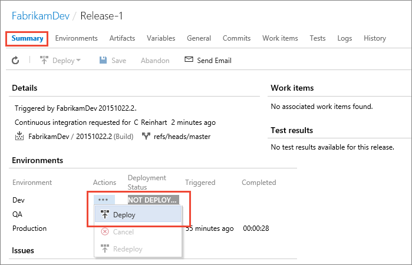

>For more details about environment deployment options, see
[Triggers](../concepts/definitions/release/triggers.md) and
[Queuing policies](../concepts/definitions/release/environments.md#queuing-policies). For more
details about starting deployment of a release, see
[How to: Create and deploy a release from a release definition](create-deploy-releases.md).

Use the tab links at the top of the page to see more information about an in-progress or a completed release.

* Use the **Environments** tab to see details of the release definition used to
  create this release. The view is read-only, but is useful to examine the configuration
  and parameters used for this release. For more details, see
  [Environments](../concepts/definitions/release/environments.md).

* Use the **Artifacts** tab to see a list of the artifacts deployed as part of this release.
  You can also open the **Artifacts** page using the **Show all artifacts** link in the
  **Summary** page. For more details, see
  [Artifacts](../concepts/definitions/release/artifacts.md).

* Use the **Variables** tab to see a list of the configuration variables used for
  this release. For more details, see
  [Variables](../concepts/definitions/release/variables.md)
  and [Variable groups](../concepts/library/variable-groups.md).

* Use the **General** tab to see the option settings for this release definition, such as
  the format for release names and the retention period for release information.
  For more details, see
  [Release names](../concepts/definitions/release/index.md#numbering)
  and [Retention policies](../concepts/policies/retention.md).

* Use the **Commits** tab to see a list of all the source code repository commits
  associated with this release.

* Use the **Work Items** tab to see a list of all the source code repository work items
  associated with this release.

* Use the **Tests** tab to see a summary of the test results for this release.
  For more details, see [View test results](#test-results).

* Use the **Logs** tab at the top of the page to view the log files
  and the current deployment status. 

* Use the **History** tab to see details of the changes to and deployments from
  the release definitions associated with this release.
  For more details, see [Release definition history](#release-history).

<h2 id="test-results">Test results</h2>

Choose the **Tests** tab to see the results of tests that
ran as part of the build and release process.

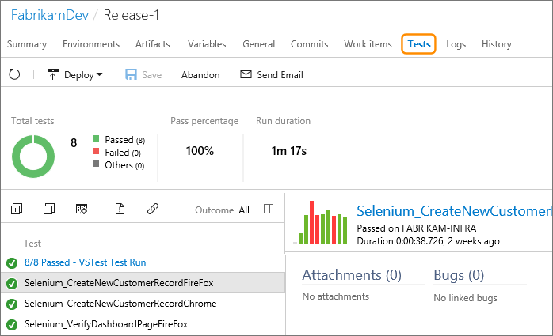

For more details about the **Tests** page, see
[Review continuous test results after a build](../test/review-continuous-test-results-after-build.md)

<h2 id="redeploy-release">Redeploy a release</h2>

If a release fails or is canceled, you can redeploy it. Or if you
discover issues after deployment that require a previous release
to be reinstated, you can redeploy a previously successful release.
Typical scenarios are:

* An approver canceled the release because an environment was temporary offline,
  and you now want to redeploy that release because the environment is
  available again.

* A deployment failed for a release, perhaps there was
  a connectivity failure or a server was temporary offline,
  and you have now fixed the problem that caused the failure.

* The release was successfully deployed, but is not working
  correctly and you are unable to quickly locate the problem
  so you want to redeploy a previous release that was successful.

To redeploy a failed release, open the **Summary** page, use the ellipses (**...**)
to open the shortcut menu for the environment you want to redeploy to, and
choose **Redeploy**.

You can also use the **Deploy** list in the **Summary** page to start
a new deployment for a release...

...or the **Deploy** list in the **Logs** page.

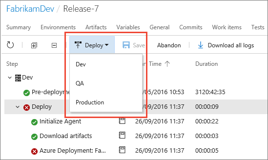

If you instead choose to deploy a previous (older) successful release, simply open
that release from the list of releases ...

... and follow the same procedure as above to start the deployment.

However, it's likely that the source for the app has changed since
the older release was created, and so redeploying this older release
will incur some rollback of commits and work items.

When you start the deployment of a previous release, the **Deploy**
dialog warns you that you are rolling back changes. It shows any
work items and commits that are affected.

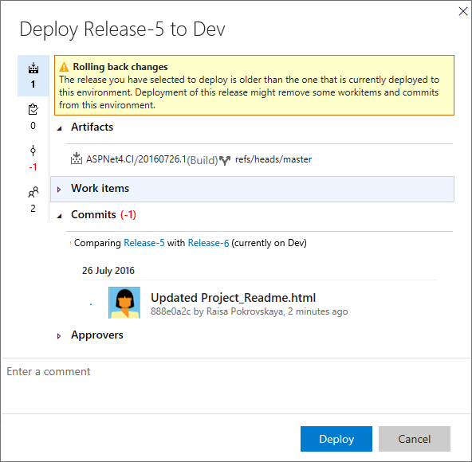

>**Note**: You must ensure that the tasks and automation scripts
used for the deployment can correctly manage the rollback process.
Release Management does not handle this.

If you need to change the release definition before you redeploy, you must
[create a new release](create-deploy-releases.md) from the updated release definition.

[What permission do I need to deploy a release?](../concepts/policies/permissions.md#release-permissions)

<h2 id="notifications">Release notifications</h2>

Release Management automatically defines a set of built-in notifications that
are integrated with the VSTS and TFS notifications system. You can view, opt out,
disable, and manage these notifications in the **Notifications** tab of the **Services** hub.

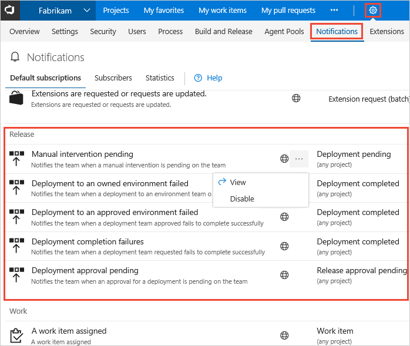

For more information about notifications, see [Manage notifications for a team](../../collaborate/manage-team-notifications.md).

<h2 id="send-email">Release status emails</h2>

In addition to the range of [release notifications](../../collaborate/manage-team-notifications.md),
Release Management can send detailed emails that show the status
of a release to individual users and to groups of users.
During a release or after a release has finished (irrespective
of whether it was successful), choose the **Send Email** link on the toolbar of
the **Logs** page  

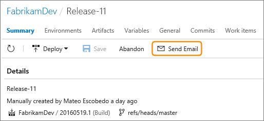

In the **Send release summary mail** dialog:

* Select the recipients for the email.
* Edit the default subject if required, and add any notes.
* Review the list of summary sections that you want to include
  in the email. All the sections are included by default. Clear
  the checkboxes for the section you don't want to include.
* Choose **Send**.  

The email contains links that enable the recipients to go directly to
the release definition and the list of releases.

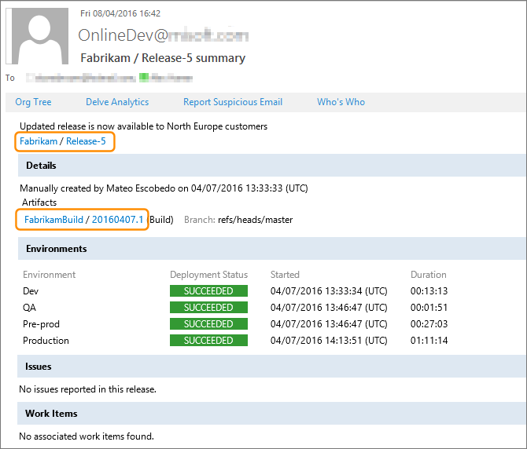

<h2 id="release-history">Release history</h2>

Choose **History** on the main toolbar when a release is selected to show
the list of actions taken on this specific release; such as when it was
created, deployed, and any approvals or rejections. The list shows the
name of the user who initiated the action, the date and time, the type of
action, and the details. There is also a **Comments** column, not visible in this
screenshot, which shows information such as the comments from approvers.  

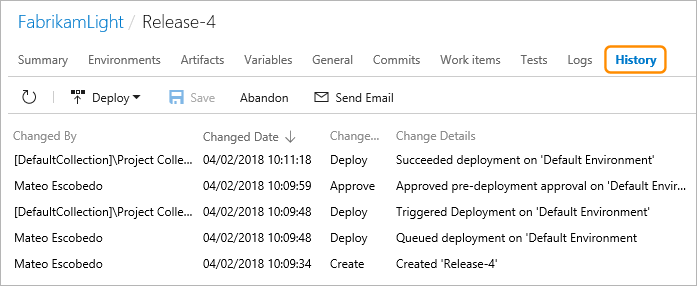

>Notice that some changes may be shown as initiated by a security group, such as
Project Collection Administrators. This occurs when, for example, an
administrator over-rides an action such as a pending approval.

By default, the list of actions is sorted in descending date and time
order (the  icon
indicates the current sort order). Choose any of the column headings
to sort the list in the order of that column's values, and choose the
same heading again to reverse the sort order.

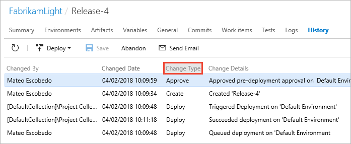

You can easily copy the history information to another application:

* Select some or all of the rows in the history list. Do this using your
  mouse by clicking while holding the **Shift** or **Ctrl** key, or press
  **Ctrl-A** when the list has the focus.
* Press **Ctrl-C** to copy the rows to the clipboard.
* Switch to the target application and press **Ctrl-V**, or
  choose **Paste** from the shortcut menu.

The information is tab delimited, and so it is automatically
imported into separate columns when you paste into a spreadsheet
or a similar type of app.   

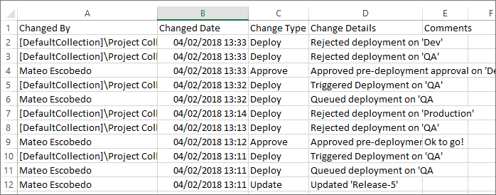

If there are actions that updated the snapshot of the release definition
used to create this release, the **Change Type** column in the **History** list
contains a **View details** link where you can compare the original and the
updated snapshot versions.

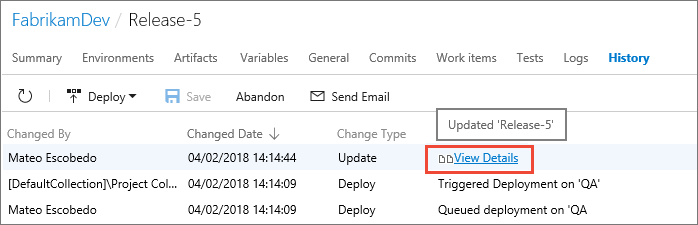

The comparison page highlights the changes with a red and green
background in the usual way. Here, you can see that the change was the
removal of Christie Church as an approver.

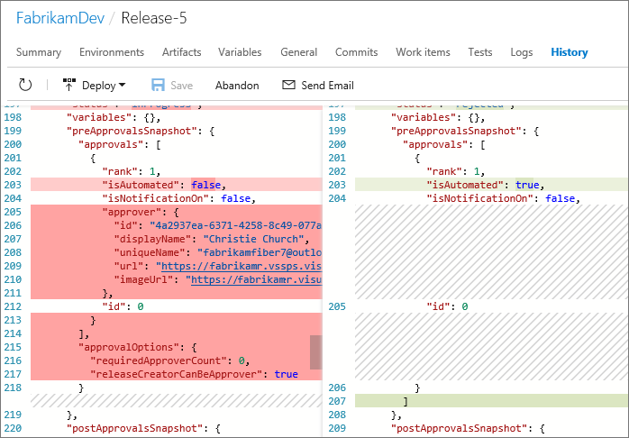

## See also

* [Releases](../concepts/releases/index.md)

* [Work with release definitions](work-with-release-definitions.md)

* [Create and deploy a release](create-deploy-releases.md)

## Q&A

<!-- BEGINSECTION class="md-qanda" -->

### How can I control deployments of my app to each environment?

See: [Approvals and gates overview](../concepts/definitions/release/approvals/index.md)

### Where can I learn step-by-step how to build and release my app?

See: [Examples](../apps/index.md)

### How do I programmatically create a release definition?

See: [Release Management REST API](../../integrate/index.md)

[!INCLUDE [qa-agents](../_shared/qa-agents.md)]

[!INCLUDE [qa-versions](../_shared/qa-versions.md)]

<!-- ENDSECTION -->

[!INCLUDE [rm-help-support-shared](../_shared/rm-help-support-shared.md)]
