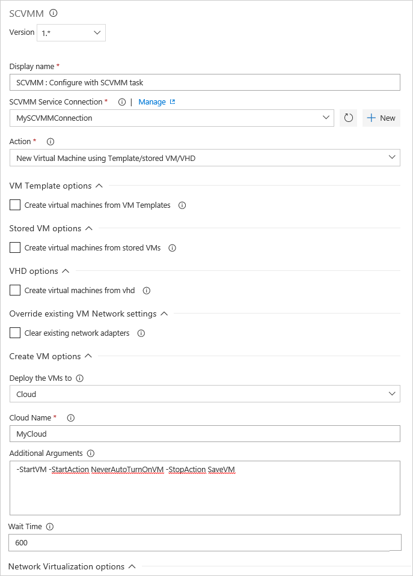
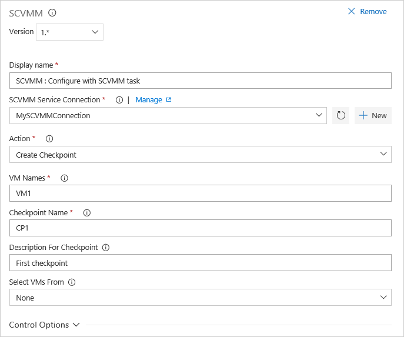

# Task actions for managing VMs using System Center Virtual Machine Manager (SCVMM)

[!INCLUDE [version-rm-dev14](../../_shared/version-rm-dev14.md)]

You can manage your virtual machines using the System Center Virtual
Machine Manager (**SCVMM**) task by performing a range of actions such as:

* [Create new virtual machines from a template, VHD, or stored VM](#newvm)
* [Delete virtual machines](#delete)
* [Start and stop virtual machines](#startstop)
* [Create, restore, and delete checkpoints](#checkpoint)
* [Run custom PowerShell scripts for SCVMM](#runscript)

You must install the **System Center Virtual Machine Manager (SCVMM)** extension from Visual Studio Marketplace into your server or account.
For more information, see [Configure and deploy with SCVMM](../../apps/cd/scvmm/configure-scvmm.md).

## Create new virtual machines from a template, VHD, or stored VM

* **Display name**: The name for the task as it appears in the task list. 
* **SCVMM Service Connection**: Select a SCVMM service connection you already defined, or create a new one.
* **Action**: Select **New Virtual Machine using Template/Stored VM/VHD**.
* **Create virtual machines from VM Templates**: Set this option if you want to use a template.
  - **Virtual machine names**: Enter the name of the virtual machine, or a list of the virtual machine names on separate lines. Example `FabrikamDevVM`
  - **VM template names**: Enter the name of the template, or a list of the template names on separate lines.
  - **Set computer name as defined in the VM template**: If not set, the computer name will be the same as the VM name.
* **Create virtual machines from stored VMs**: Set this option if you want to use a stored VM.
  - **Virtual machine names**: Enter the name of the virtual machine, or a list of the virtual machine names on separate lines. Example `FabrikamDevVM`
  - **Stored VMs**: Enter the name of the stored VM, or a list of the VMs on separate lines in the same order as the virtual machine names.
* **Create virtual machines from VHD**: Set this option if you want to use a stored VM.
  - **Virtual machine names**: Enter the name of the virtual machine, or a list of the virtual machine names on separate lines. Example `FabrikamDevVM`
  - **VHDs**: Enter the name of the VHD or VHDX, or a list of names on separate lines in the same order as the virtual machine names.
  - **CPU count**: Specify the number of processor cores required for the virtual machines.
  - **Memory**: Specify the memory in MB required for the virtual machines.
* **Clear existing network adapters**: Set this option if you want to remove the network adapters and specify new ones in the **Network Virtualization** options.
* **Deploy the VMs to**: Choose either **Cloud** or **Host** to select the set of virtual machines to which the action will be applied.
* **Host Name** or **Cloud Name**: Depending on the previous selection, enter either a cloud name or a host machine name.
* **Placement path for VM**: If you selected **Host** as the deployment target, enter the path to be used during virtual machine placement. Example `C:\ProgramData\Microsoft\Windows\Hyper-V`
* **Additional Arguments**: Enter any arguments to pass to the virtual machine creation template. Example `-StartVM -StartAction NeverAutoTurnOnVM -StopAction SaveVM`
* **Wait Time**: The time to wait for the virtual machine to reach ready state.
* **Network Virtualization**: Set this option to enable network virtualization for your virtual machines. For more information, see [Create a virtual network isolated environment](create-virtual-network.md). 
* **Show minimal logs**: Set this option if you don't want to create detailed live logs about the VM provisioning process.

## Delete virtual machines

* **Display name**: The name for the task as it appears in the task list. 
* **SCVMM Service Connection**: Select a SCVMM service connection you already defined, or create a new one.
* **Action**: Select **New Virtual Machine using Template/Stored VM/VHD**.
* **VM Names**: Enter the name of the virtual machine, or a comma-separated list of the virtual machine names. Example `FabrikamDevVM,FabrikamTestVM`
* **Select VMs From**: Choose either **Cloud** or **Host** to select the set of virtual machines to which the action will be applied.
* **Host Name** or **Cloud Name**: Depending on the previous selection, enter either a cloud name or a host machine name.

## Start and stop virtual machines

* **Display name**: The name for the task as it appears in the task list. 
* **SCVMM Service Connection**: Select a SCVMM service connection you already defined, or create a new one.
* **Action**: Select **Start Virtual Machine** or **Stop Virtual Machine**.
* **VM Names**: Enter the name of the virtual machine, or a comma-separated list of the virtual machine names. Example `FabrikamDevVM,FabrikamTestVM`
* **Select VMs From**: Choose either **Cloud** or **Host** to select the set of virtual machines to which the action will be applied.
* **Host Name** or **Cloud Name**: Depending on the previous selection, enter either a cloud name or a host machine name.
* **Wait Time**: The time to wait for the virtual machine to reach ready state.
 

## Create, restore, and delete checkpoints

* **Display name**: The name for the task as it appears in the task list. 
* **SCVMM Service Connection**: Select a SCVMM service connection you already defined, or create a new one.
* **Action**: Select one of the checkpoint actions **Create Checkpoint**, **Restore Checkpoint**, or **Delete Checkpoint**.
* **VM Names**: Enter the name of the virtual machine, or a comma-separated list of the virtual machine names. Example `FabrikamDevVM,FabrikamTestVM`
* **Checkpoint Name**: For the **Create Checkpoint** action, enter the name of the checkpoint that will be applied to the virtual machines. For the **Delete Checkpoint** or **Restore Checkpoint** action, enter the name of an existing checkpoint.
* **Description for Checkpoint**: Enter a description for the new checkpoint when creating it. 
* **Select VMs From**: Choose either **Cloud** or **Host** to select the set of virtual machines to which the action will be applied.
* **Host Name** or **Cloud Name**: Depending on the previous selection, enter either a cloud name or a host machine name.

## Run custom PowerShell scripts for SCVMM

* **Display name**: The name for the task as it appears in the task list. 
* **SCVMM Service Connection**: Select a SCVMM service connection you already defined, or create a new one.
* **Action**: Select **Run PowerShell Script for SCVMM**.
* **Script Type**: Select either **Script File Path** or **Inline Script**.
* **Script Path**: If you selected **Script File Path**, enter the path of the PowerShell script to execute. It must be a fully-qualified path, or a path relative to the default working directory.
* **Inline Script**: If you selected **Inline Script**, enter the PowerShell script lines to execute.
* **Script Arguments**: Enter any arguments to be passed to the PowerShell script. You can use either ordinal parameters or named parameters.
* **Working folder**: Specify the current working directory for the script when it runs. The default if not provided is the folder containing the script.

## See also

* [Configure and deploy with SCVMM](../../apps/cd/scvmm/configure-scvmm.md)
* [Create a virtual network isolated environment for build-deploy-test scenarios](create-virtual-network.md)

## Q&A

<!-- BEGINSECTION class="md-qanda" -->

[!INCLUDE [temp](../../_shared/qa-versions.md)]

<!-- ENDSECTION -->

[!INCLUDE [rm-help-support-shared](../../_shared/rm-help-support-shared.md)]
