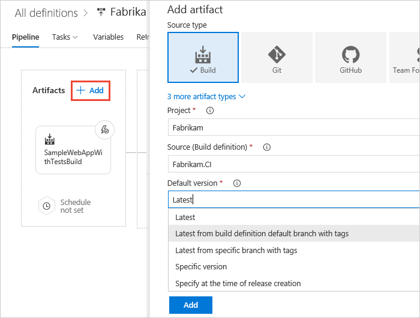

# Work with release definitions

[!INCLUDE [version-rm-dev14](../_shared/version-rm-dev14.md)]

This topic shows you how to:

* **[Create a new release definition](#create-release-def)**
  - [from a template](#create-template)
  - [as an empty definition](#create-empty)
  - [add artifacts and triggers](#create-addartifacts)
  - [replicate a definition](#replicate-def)

* **[Create and use environment templates](#use-template)**
  - [add more environments](#add-envir)
  - [clone environments](#clone-environment)

* **[Define processes in an environment](#define-processes)**
  - [add tasks to an environment](#add-tasks)
  - [use task groups](#task-groups)

<h2 id="create-release-def">Create a new release definition</h2>

1. Open the **Build &amp; Release** hub and choose **Releases**.

1. Choose the **+** icon and select **Create release definition**.

   

   
1. Select a template or start with an empty definition:

   * If a template is relevant to your scenario, select it to
   automatically add some tasks and apply typical settings.
   For example, if you select the **Azure App Service Deployment**
   template, you automatically get a task to deploy your app
   to Azure App Services.

   * If there's no template for your scenario, select **Empty process** and then [add the tasks you need](#add-tasks).

   

   
1. Specify the [artifacts](../concepts/definitions/release/artifacts.md#sources)
   you want to deploy. Choose the type of source and specify
   the details such as the project and build definition.

   

1. Open the **Continuous deployment trigger** panel and set the [trigger](../concepts/definitions/release/triggers.md)
   if you want a new release to be created when a new version of the source artifacts are available.

   

   [What's the difference between a release definition and a release?](../concepts/releases/index.md)

1. Check that the [environment deployment trigger](../concepts/definitions/release/triggers.md#env-triggers)
   is set to automatically start a deployment when the release is created.
   You can also specify other pre-deployment conditions here if required.

   

1. Open the **Tasks** tab and select the default **Run on agent** item. In the properties
   panel, under **Agent selection**, check that a hosted agent is selected to use the default 
   queues and agents available in VSTS. If you want to use a different agent that you have 
   [previously installed](../concepts/agents/pools-queues.md), such as an on-premises agent in TFS, select that agent's queue.

   

1. If required, or if you selected the empty process template, you can now
   [add more tasks](#add-tasks) and [additional environments](#add-envir).

### Replicate a definition or environment

If your definition has a pattern that you want to replicate in other
definitions, clone it or export it.

When you clone a definition, the copy appears in your list of releases.
You can save it with a new name.

When you export a definition, you can import it afterwards. Then, if required, modify it and save it with a new name.

### Create and use a template

Create a template for a definition from an environment within the definition.

After you create a template, it appears in the **Custom** tab of the
**Create release definition** wizard. Your team members can use it to
follow the pattern in new definitions.
For more details, see [Environment templates in Release Management](../concepts/definitions/release/env-templates.md).

### Use the REST API

Create release definitions using the [Release Management REST API](../../integrate/index.md).

### Add more environments

A release definition, by default, contains a single [environment](../concepts/definitions/release/environments.md).
Configure additional environments in a release definition to represent the
target server(s) or locations where you will deploy your app.

1. Open the **+ Add** list and choose **New environment**.

   

1. The template selector panel opens. Follow [these steps](#create-template)
   to configure the new environment.

1. After you have created and configured your environments, [add tasks to them](#add-tasks).

>You can add environments using the [Release Management REST API](../../integrate/index.md).

<h3 id="clone-environment">Clone an existing environment</h3>

A release definition often contains several environments such as
development, testing, QA, and production. Typically, all of these
environments are fundamentally similar - and the techniques used to set up
and deploy to each one are the same with the exception of minor
differences in configuration for each environment and task (such as
target URLs, service paths, and server names).   

After you have added an environment to a release definition and configured
it by adding tasks and setting the properties for each one, clone
it to create another environment within the same definition.

You can clone individual environments directly within a definition in the **Pipeline** tab.

Alternatively, select the environment you want to clone, open the **+ Add** list,
and choose **Clone environment**.

The cloned environment has the same tasks, task properties, and
configuration settings as the original.

Select the cloned environment to open the properties panel, and update the
[pre-deployment approver](../concepts/definitions/release/approvals/approvals.md),
[trigger](../concepts/definitions/release/triggers.md#env-triggers), and
[queue](../concepts/agents/pools-queues.md) settings for the cloned environment as required.

<h2 id="define-processes">Define processes in an environment</h2>

The deployment steps in an [environment](../concepts/definitions/release/environments.md)
are described using [task phases](../concepts/process/phases.md) and [tasks](../concepts/process/tasks.md).

<h3 id="add-tasks">Add tasks</h3>

The **Tasks** tab of the release definition editor shows a list of the task phases and
tasks defined for each environment. Open the tasks list for an environment by
choosing the "phases and tasks" link in the environment, or by selecting the environment
name in the **Tasks** drop-down list.

 

By default, unless you chose the **Empty process** template when you created your release definition,
the definition will contain a **Run on agent** phase. Add tasks to a phase by choosing the **+**
icon in the phase item to open the **Add tasks** panel. Select the type of task you need (or choose
**All**), or search for a task by name. When you find the task, choose the **Add** button
that appears when you select the task.

 

> A link at the top of the list takes you to
[Visual Studio Marketplace](https://marketplace.visualstudio.com/VSTS)
where you can download and install additional tasks.

You can add tasks specifically for execution on the deployment agent,
on a deployment group, or on the server without using an agent by 
adding the appropriate type of [task phase](../concepts/process/phases.md).

For more details, see [Environments](../concepts/definitions/release/environments.md)
and [Phases in Build and Release Management](../concepts/process/phases.md).

>You can add tasks to an environment using the
[Release Management REST API](../../integrate/index.md).

<h3 id="task-groups">Use task groups</h3>

A *task group* lets you to encapsulate a sequence of tasks already defined
in a build or a release definition into a single reusable task that can be
added to a build or release definition just like any other task. You can
choose to extract the parameters from the encapsulated tasks as configuration
variables, and abstract the rest of the task information.

For more details, see [Task groups](../concepts/library/task-groups.md).

## Next

* [Releases](../concepts/releases/index.md)

* [Create and deploy a release from a release definition](create-deploy-releases.md)

* [View and manage releases](view-manage-releases.md)

* [Configure your release pipelines for safe deployments](https://blogs.msdn.microsoft.com/visualstudioalm/2017/04/24/configuring-your-release-pipelines-for-safe-deployments/)

<h2 id="concepts">Release definition concepts</h2>

A [release definition](../concepts/definitions/release/index.md)
contains all the tasks and settings used to create a release and
deployment to your target machines. To learn more about release
definition settings, see:

* [General settings](../concepts/definitions/release/index.md)

* [Phases](../concepts/process/phases.md)

* [Tasks](../concepts/process/tasks.md)

* [Triggers](../concepts/definitions/release/triggers.md)

* [Variables](../concepts/definitions/release/variables.md)

* [Approvals and gates](../concepts/definitions/release/approvals/index.md)

* [Retention](../concepts/policies/retention.md)

* [Releases](../concepts/releases/index.md)

## Q&A

<!-- BEGINSECTION class="md-qanda" -->

### Where can I learn step-by-step how to build and release my app?

[Examples](../apps/index.md)

### How do I programmatically create a release definition?

[Release Management REST API](../../integrate/index.md)

[!INCLUDE [qa-agents](../_shared/qa-agents.md)]

[!INCLUDE [qa-versions](../_shared/qa-versions.md)]

<!-- ENDSECTION -->

[!INCLUDE [rm-help-support-shared](../_shared/rm-help-support-shared.md)]
