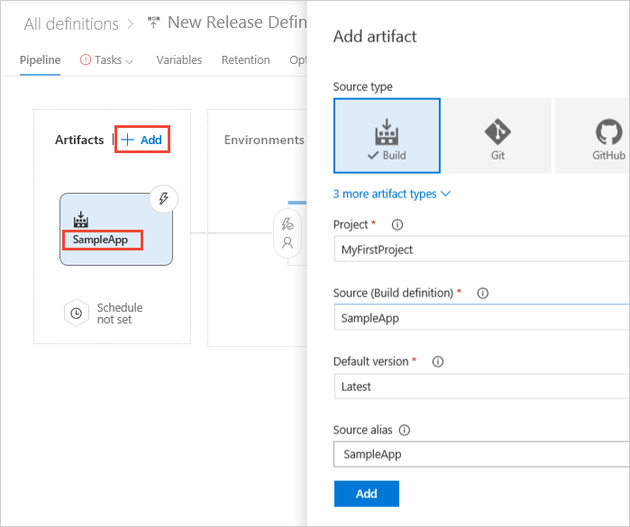

<h2 id="cd">Define your CD release process</h2>

Continuous deployment (CD) means starting an automated release process whenever a new successful build is available.
Your CD release process picks up the artifacts published by your CI build and then deploys them to your Azure web site.

1. Do one of the following:

   * If you've just completed a CI build (see above), choose the link (for example, _Build 20170815.1_)
     to open the build summary. Then choose **Release** to start a new release definition that's automatically linked to the build definition.

     

   * Open the **Releases** tab of the **Build &amp; Release** hub, open the **+** drop-down
     in the list of release definitions, and choose **Create release definition** 

     

1. Select the **Azure App Service Deployment** template and choose **Apply**.

1. If you created your new release definition from a build summary, check that the build definition and artifact
   is shown in the **Artifacts** section on the **Pipeline** tab. If you created a new release definition from
   the **Releases** tab, choose the **+ Add** link and select your build artifact.

   

1. Choose the **Continuous deployment** icon in the **Artifacts** section, check that the
   continuous deployment trigger is enabled, and the **master** branch is selected. If not, set these options now.

   

   > Continuous deployment is not enabled by default when you create a new release definition from the **Releases** tab.

1. Open the **Task** tab, select the **Deploy Azure App Service** task, and configure it as follows:
 
    [Deploy: Azure App Service Deploy](../../tasks/deploy/azure-app-service-deploy.md) task - deploy the app to Azure App Services.
   
   - **Azure Subscription:** Select a connection from the list under **Available Azure Service Connections** or create a more restricted permissions connection to your Azure subscription. For more details, see [Azure Resource Manager service endpoint](../../concepts/library/service-endpoints.md#sep-azure-rm).
   
   - **App Service Name**: the name of the web app (the part of the URL *without* **.azurewebsites.net**).
   
   - **Deploy to Slot**: make sure this is cleared (this is the default setting).
   
   - **Virtual Application:** leave empty.
   
   - **Web Deploy Package:** `$(System.DefaultWorkingDirectory)\**\*.zip` (this is the default setting).
   
   - **Additional Deployment Options - Take App Offline:** check that this is set to avoid deployment problems with assemblies that are locked while the app is running (this is the default setting).

   

   > [!Note]
   >
   > If you are using TFS (rather than VSTS) you may find that the **Azure App Service Deploy** task is not available, depending on your version and update of TFS.
   > Instead, you can use the [Azure Web App Deployment](https://github.com/Microsoft/vsts-tasks/tree/master/Tasks/AzureRmWebAppDeployment) task to deploy your app.

1. Save the release definition.

<h2 id="deploy">Create a release to deploy your app</h2>

You're now ready to create a release, which means to start the process of running the release definition with the artifacts produced by a specific build. This will result in deploying the build to Azure:

1. Choose **+ Release** and select **Create Release**.

1. In the **Create new release** dialog, check that the artifact version you want to use is selected and choose **Queue**.

1. Choose the release link in the information bar message. For example: "Release **Release-1** has been created".

1. Open the **Logs** tab to watch the release console output.

1. After the release is complete, navigate to your site running in Azure using the Web App URL `http://{web_app_name}.azurewebsites.net`, and verify its contents.
