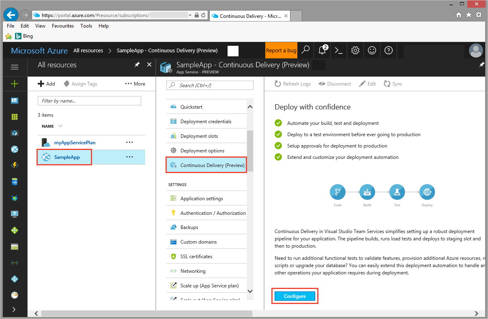
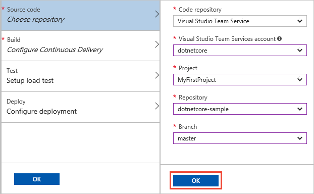
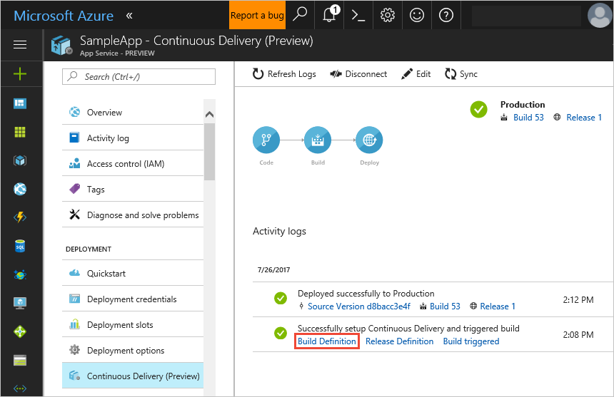
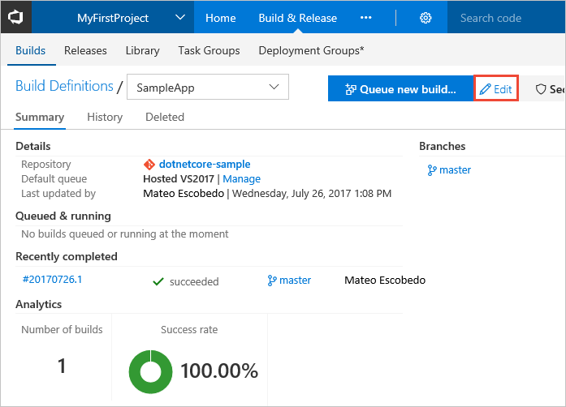
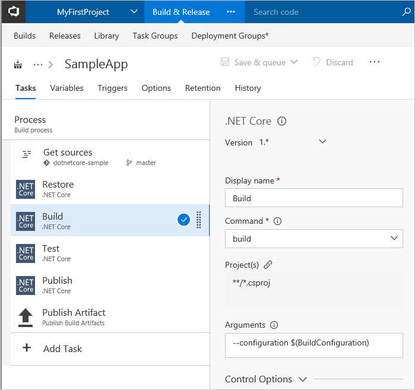
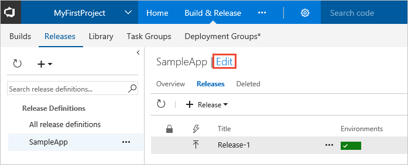
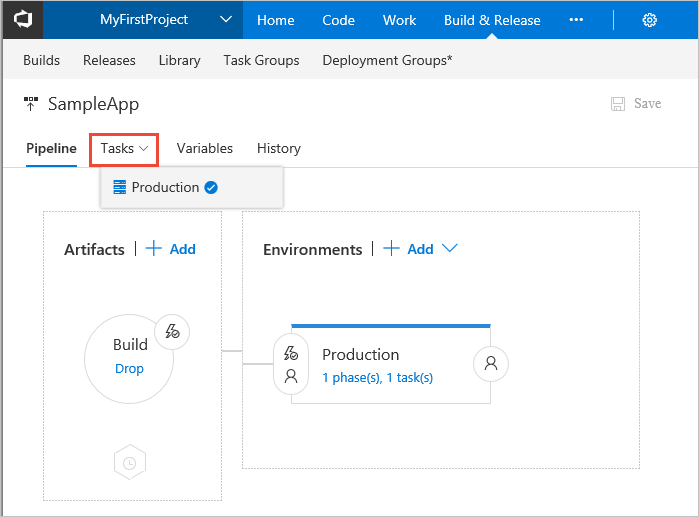
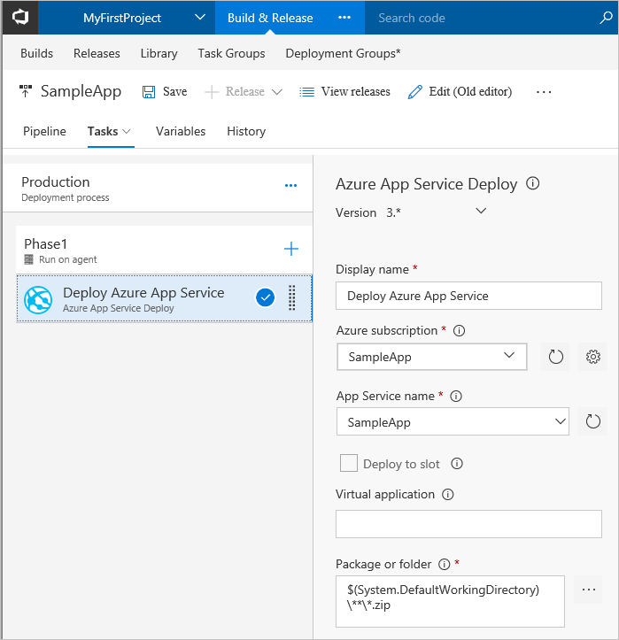

# CI/CD of an ASP.NET Core app to an Azure web app

Visual Studio Team Services (VSTS) provides a highly customizable continuous integration (CI) and continuous deployment (CD) pipeline for your
ASP.NET Core apps. This quickstart shows how to set up CI and CD to deploy an ASP.NET Core application to an Azure web app.
You will use the Azure portal to configure a basic CI/CD pipeline. You will then use the VSTS portal to view the CI/CD pipeline.

With your CI/CD processes in place, you'll push a change into your team's Git repo and the results will automatically show up on your site.

[!INCLUDE [prerequisites](_shared/prerequisites.md)]
* Have an Azure subscription. If you don't have an Azure subscription, you can [create one for free](https://azure.microsoft.com/free/?WT.mc_id=A261C142F).

[!INCLUDE [import-code-aspnet-core](_shared/import-code-aspnet-core.md)]

[!INCLUDE [create-azure-web-app-portal](_shared/create-azure-web-app-portal.md)]

## Configure continuous delivery

1. In the Azure portal, open your web app's blade. Choose **Continuous Delivery** and then choose **Configure**.

   

1. Select **Choose repository** and select **Visual Studio Team Services** for the code repository. Select the project, repository, and branch into which your imported the sample code. When you're done, choose **OK**.

   

1. Select **Configure Continuous Delivery** and choose **ASP.NET Core**. When you're done, choose **OK**.

   

1. Skip the other two steps - **Test** and **Deploy** - and choose **OK** to complete the configuration of continuous delivery. You'll see how to use the test and deployment options in other tutorials.

   

1. When you choose **OK**, Azure Continuous Delivery configures and kicks off a build and deployment in VSTS.
   When the build completes, the deployment is automatically initiated.
   After a while, the deployment is completed. Choose **Refresh Logs** to see this in the **Activity Log**.

   

1. Open a new browser window and navigate to your new web at **http://**_your-app-name_**.azurewebsites.net**.

[!INCLUDE [change-aspnet-core-code](_shared/change-aspnet-core-code.md)]

It takes several minutes for the build and deployment to execute.
Wait until the deployment is done, then verify that your changes are live in your web browser: **http://**_your-app-name_**.azurewebsites.net**.

You're now ready to collaborate with a team on an ASP.NET Core app with a CI/CD process that automatically deploys your latest work to your web site.

## Review the CI/CD pipeline in VSTS

You have seen how easy it is to create a continuous integration and continuous delivery pipeline by using Azure Continuous Delivery.
In later quickstarts and tutorials you'll see how you can tailor the process to create more complex CI/CD pipelines, and integrate with other types of apps and deployment environments.

To see what Azure Continuous Delivery did, you can examine the artifacts and definitions it created in your VSTS project.

1. In the Azure portal, in the "Successfully set up Continuous Delivery..." log entry in the **Continuous Delivery** blade, choose the **Build Definition** link.

   

1. This opens the VSTS portal and takes you to the build definition summary. A **build definition** is a concept in VSTS that defines the CI process. The build definition summary shows recent builds that have been completed or that are in progress. Choose **Edit** to see how the CI process is defined.

   

1. A build definition consists of tasks that should be run as part of a build. When you configured the CI/CD from Azure Continuous Delivery, a number of tasks have been added to the build definition. These tasks automate the compilation and testing of your ASP.NET Core application. You will also notice that the parameters for each of these tasks have been populated for you.

   

1. Open the **Build &amp; Release** hub and choose **Releases**. Select the release definition having the name of your app and choose **Edit** to see how the CD process is defined.

   

1. A release definition consists of a pipeline of one or more environments, and each environment defines a set of tasks that automate deployment.
   When you configured the CI/CD from Azure Continuous Delivery, a simple release definition with a single environment named **Production** has been set up for you automatically.
   Choose this environment from the **Tasks** drop-down list.

   

1.  This environment consists of a single task for deploying the Azure web app.

   

## Next steps

[Learn more about how to customize your CI/CD pipeline]()
