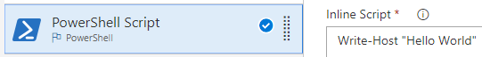
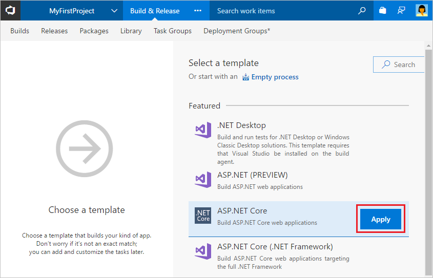

# Build your ASP.NET Core app

**VSTS | TFS 2018 | TFS 2017.3**

Follow these steps to set up a continuous integration (CI) process for an ASP.NET Core app using Visual Studio Team Services (VSTS) or Team Foundation Server (TFS).

As you walk through this quickstart, we'll ask you to choose:

* Which kind of Git service you're using: VSTS or TFS, or GitHub.

* How you want to define your build: in a web interface, or configured as code in YAML

* For continuous deployment, what is your target: Azure web app or IIS server in a Windows VM, a Linux VM, or a Docker container.

As you choose from these options in the sections below, this topic will adapt to your choices.

## Prerequisites

[!INCLUDE [include](../../_shared/ci-cd-prerequisites-vsts.md)]

[!INCLUDE [include](../../_shared/ci-cd-prerequisites-tfs.md)]

## Get the sample code

The sample app we use here is a Visual Studio solution that has two projects: An ASP.NET Core Web Application project and a Unit Test project (both targeting .NET Core 2.0 framework). This quickstart works for any apps that target the .NET Core 1.1 or 2.0 frameworks.

[!INCLUDE [include](../_shared/get-sample-code-intro.md)]

```
https://github.com/adventworks/dotnetcore-sample
```

Where do you want to keep your code? Whichever service you choose, our system can automatically clone and pull code from it every time you push a change.

# [VSTS or TFS repo](#tab/gitvsts)

[!INCLUDE [include](../_shared/get-sample-code-vsts-tfs-2017-update-2.md)]

# [GitHub repo](#tab/github)

[!INCLUDE [include](../_shared/get-sample-code-github.md)]

---

[!INCLUDE [include](../_shared/get-sample-code-other-repos-vsts.md)]

[//]: # (TODO: report and get fix for build warning "All tabs are hidden in the tab group." [!INCLUDE [include](../../_shared/web-or-yaml.md)

## Web or config as code

Do you want to define your build process in your web browser or configure it as code in YAML?

# [Web](#tab/web)

**VSTS | TFS**

Choose this option if you prefer a graphical interface in your web browser.



# [YAML](#tab/yaml)

**VSTS**

Choose this option if you want the advantages of configuration as code. This means your definition is versioned with your code and follows the same branching structure as your code. 

```YAML
steps:
- script: echo hello world 
```

This choice also offers parallel processing (fan out and fan in), and the ability to test and debug the process locally.

[Learn more about YAML builds](../../actions/build-yaml.md).

---

## Create the CI process definition

[!INCLUDE [include](../../_shared/ci-quickstart-intro.md)]

[//]: # (TODO: Restore use of includes when we get support for using them in a list.)

Begin by creating your build definition.

# [VSTS or TFS repo](#tab/gitvsts/web)

1. Navigate to the **Files** tab of the **Code** hub, and then choose **Set up build**.

 

 You are taken to the **Build and Release** hub and asked to **Select a template** for the new build definition.

1. In the right panel, select **ASP.NET Core**, and then choose **Apply**.

 

# [VSTS or TFS repo](#tab/gitvsts/yaml)

To create a definition that is configured as code, you'll modify a YAML file in the repo root that has a well-known name: **.vsts-ci.yml**. The first time you change this file, VSTS automatically uses it to create your build definition.

1. Navigate to the **Code** hub, choose the **Files** tab, and then choose the repository you created in the above steps.

1. Choose the **.vsts-ci.yml** file, and then choose **Edit**.

1. Replace the contents of the file with code from the next section.

# [GitHub repo](#tab/github/web)

In VSTS:

1. Navigate to the **Builds** tab of the **Build and Release** hub in VSTS or TFS, and then choose **+ New**. You're asked to **Select a template** for the new build definition.

1. In the right panel, select **ASP.NET Core**, and then choose **Apply**.

 

# [GitHub repo](#tab/github/yaml)

To create a definition that is configured as code, you'll modify a YAML file in the repo root that has a well-known name: **.vsts-ci.yml**. You'll then create a build definition that points to the YAML file.

In GitHub:

1. Edit the **.vsts-ci.yml** file in the root of your repo, and replace the contents of the file with code from the next section.

---

<a name="deploy"></a>
## Choose your deployment target

While a CI build process is a powerful way to do day-to-day development, continuous deployment is how many teams accelerate how they deliver value to customers. After each successful CI build, you can automatically deploy your app. 

To get ready for continuous deployment, choose which kind of deployment target you want, and then adjust your CI process as needed.

# [Azure web app or IIS server](#tab/deploy-windows/web)

All the tasks you need were automatically added to the build definition by the template. These are the steps that will automatically run every time you check in code. Proceed to finish the CI process definition.

# [Azure web app or IIS server](#tab/deploy-windows/yaml)

```yaml
steps:

- task: dotNetCoreCLI@1
  inputs:
    command: restore
    projects: "**/*.csproj"
  displayName: dotnet restore
   
- task: dotNetCoreCLI@1
  inputs:
    command: build
    projects: "**/*.csproj"
    arguments: --configuration release
  displayName: dotnet build
   
- task: dotNetCoreCLI@1
  inputs:
    command: test 
    projects: "**/*Tests/*.csproj"
    arguments: --configuration release
  displayName: dotnet build
   
- task: dotNetCoreCLI@1
  inputs:
    command: publish
    arguments: --configuration release --output $(Build.ArtifactStagingDirectory)
    zipAfterPublish: true
  displayName: dotnet publish
   
- task: publishBuildArtifacts@1
  inputs:
    PathtoPublish: $(Build.ArtifactStagingDirectory)
    ArtifactName: drop
    ArtifactType: Container
  displayName: Publish the artifacts
```

Commit the above change to the master branch.

# [Linux VM](#tab/deploy-linux/web)

To prepare your CI build to deploy to a Linux VM:

1. Select **Tasks**.

1. Select the **.NET Core** publish task, and then clear the **Zip published projects** checkbox.
  
> **Why do this?** 
By default, the build template creates a .ZIP file for deploying to an Azure Web App or a Windows VM.
This change causes the build to publish a set of uncompressed files and folders suitable for deployment to a Linux VM running the nginx web server.

# [Linux VM](#tab/deploy-linux/yaml)

```yaml
steps:

- task: dotNetCoreCLI@1
  inputs:
    command: restore
    projects: "**/*.csproj"
  displayName: dotnet restore
   
- task: dotNetCoreCLI@1
  inputs:
    command: build
    projects: "**/*.csproj"
    arguments: --configuration release
  displayName: dotnet build
   
- task: dotNetCoreCLI@1
  inputs:
    command: test 
    projects: "**/*Tests/*.csproj"
    arguments: --configuration release
  displayName: dotnet build
   
- task: dotNetCoreCLI@1
  inputs:
    command: publish
    arguments: --configuration release --output $(Build.ArtifactStagingDirectory)
    zipAfterPublish: false
  displayName: dotnet publish
   
- task: publishBuildArtifacts@1
  inputs:
    PathtoPublish: $(Build.ArtifactStagingDirectory)
    ArtifactName: drop
    ArtifactType: Container
  displayName: Publish the artifacts
```

Commit the above change to the master branch.

# [Container](#tab/deploy-container/web)

To deploy to a container service (such as Azure web apps for containers, or a Kubernetes cluster):

1. Select **Tasks**.

1. Select the **.NET Core** publish task, and then 

   1. Clear **Zip published projects**.
   
   1. Change **Arguments** to 
   
   ```
   --configuration $(BuildConfiguration) --output out
   ```

1. Select the **Publish build artifacts** task, and then disable or remove it.

> **Why do this?** 
You don't need artifacts to deploy to a container.

# [Container](#tab/deploy-container/yaml)

```yaml
steps:

- task: dotNetCoreCLI@1
  inputs:
    command: restore
    projects: "**/*.csproj"
  displayName: dotnet restore
   
- task: dotNetCoreCLI@1
  inputs:
    command: build
    projects: "**/*.csproj"
    arguments: --configuration release
  displayName: dotnet build
   
- task: dotNetCoreCLI@1
  inputs:
    command: test 
    projects: "**/*Tests/*.csproj"
    arguments: --configuration release
  displayName: dotnet test
   
- task: dotNetCoreCLI@1
  inputs:
    command: publish
    arguments: --configuration release --output out
    zipAfterPublish: false
  displayName: dotnet publish   
```

Commit the above change to the master branch.

---

## Finish the CI process definition

You're nearly ready to go. Just a few more steps to complete your CI build process.

# [VSTS or TFS repo](#tab/gitvsts/web)

1. For the **Agent queue**:

 * **VSTS:** Select _Hosted VS2017_. This is how you can use our pool of agents that have the software you need to build your app.

 * **TFS:** Select a queue that includes a [Windows build agent](../../actions/agents/v2-windows.md).

1. Select **Get sources** and then:

 Observe that the new build definition is automatically linked to your repository.

1. Select the **Triggers** tab in the build definition. Enable the **Continuous Integration** trigger. This will ensure that the build process is automatically triggered every time you commit a change to your repository.

1. Choose **Save & queue** to kick off your first build. On the **Save build definition and queue** dialog box, choose **Save & queue**.

1. A new build is started. You'll see a link to the new build on the top of the page. Choose the link to watch the new build as it happens.

# [VSTS or TFS repo](#tab/gitvsts/yaml)

1. Navigate to the **Build and Release** hub.

1. Observe that there's a new build definition named _{name-of-your-repo} YAML CI_. A build is queued; its status could be either not started or running. Choose the number of the build: _{year}{month}{day}.1_.

1. In the left column of the running build, select **Job**. After an agent is assigned to your job and the agent is initialized, then you'll see information about the build in the console.

For this example, to learn some of the basics, you changed the YAML file to use the  `dotNetCoreCLI` task instead of calling the `dotnet` command directly in a script. The changes you made affect how the build output is organized. Each step is shown and can be inspected in the build summary, instead of all the output combined in one log from a single script.

The changes you made also modified what the build does. For example, the `dotnet restore` command you replaced creates .DLL files, but it doesn't create a web deployment file. After you've completed the above steps, your build instead uses the `dotNetCoreCLI` task, which in addition to creating the .DLL file, also creates a web deployment package (a .ZIP file) that is more efficient to deploy.

# [GitHub repo](#tab/github/web)

1. For the **Agent queue**:

 * **VSTS:** Select _Hosted VS2017_. This is how you can use our pool of agents that have the software you need to build your app.

 * **TFS:** Select a queue that includes a [Windows build agent](../../actions/agents/v2-windows.md).

1. Select **Get sources** and then:

 Select your version control repository. You'll need to authorize access to your repo.

1. Select the **Triggers** tab in the build definition. Enable the **Continuous Integration** trigger. This will ensure that the build process is automatically triggered every time you commit a change to your repository.

1. Choose **Save & queue** to kick off your first build. On the **Save build definition and queue** dialog box, choose **Save & queue**.

1. A new build is started. You'll see a link to the new build on the top of the page. Choose the link to watch the new build as it happens.

# [GitHub repo](#tab/github/yaml)

In VSTS:

1. Navigate to the **Builds** tab of the **Build and Release** hub, and then choose **+ New**. You're asked to **Select a template** for the new build definition.

1. Select **YAML**, and then select **Apply**.

1. Select **Get sources**, select **GitHub**, and then select your version control repository. You'll need to authorize access to your repo.

1. Select **Process**.

1. For the **Agent queue** select _Hosted VS2017_. This is how you can use our pool of agents that have the software you need to build your app.

1. For the **Yaml path**, select the **.vsts-ci.yml** file in the root of your repo.

1. Select the **Triggers** tab, and then enable continuous integration (CI).

1. Save and queue the build, and then choose the number of the build: _{year}{month}{day}.1_ that has been queued.

1. In the left column of the running build, select **Job**. After an agent is assigned to your job and the agent is initialized, then you'll see information about the build in the console.

For this example, to learn some of the basics, you changed the YAML file to use the  `dotNetCoreCLI` task instead of calling the `dotnet` command directly in a script. The changes you made affect how the build output is organized. Each step is shown and can be inspected in the build summary, instead of all the output combined in one log from a single script.

The changes you made also modified what the build does. For example, the `dotnet restore` command you replaced creates .DLL files, but it doesn't create a web deployment file. After you've completed the above steps, your build instead uses the `dotNetCoreCLI` task, which in addition to creating the .DLL file, also creates a web deployment package (a .ZIP file) that is more efficient to deploy.

[//]: # (TODO: Add link to GitHub tutorial after advice is added there on authentication)

---

## View the build summary

[!INCLUDE [include](../_shared/view-build-summary.md)]

## Next steps

You've just put your own CI build process in place to automatically build and validate whatever code is checked in by your team. What do you want to do next?

### Deploy your app

# [Azure web app or IIS server](#tab/deploy-windows)

> [!IMPORTANT]
> Make sure you followed the **[deployment instructions above](#deploy)** with the **Azure web app or IIS server** tab selected.

See one of the following:

* [Deploy to Azure Web App](../cd/deploy-webdeploy-webapps.md)

* [Deploy to a Windows VM](../cd/deploy-webdeploy-iis-deploygroups.md)

# [Linux VM](#tab/deploy-linux)

> [!IMPORTANT]
> Make sure you followed the **[deployment instructions above](#deploy)** with the **Linux** tab selected.

See [Deploy to a Linux Virtual Machine](../cd/deploy-linuxvm-deploygroups.md).

# [Container](#tab/deploy-container)

> [!IMPORTANT]
> Make sure you followed the **[deployment instructions above](#deploy)** with the **Container** tab selected.

See [Build and push a container for your app](../containers/build.md).

---

### Extend to other Git workflows

Now that you have a CI build process for your master branch, you can extend the process to work with other branches in your repository, or to validate all pull requests. See:

* [CI builds for Git in VSTS](../../actions/ci-build-git.md)

* [CI builds for GitHub](../../actions/ci-build-github.md)