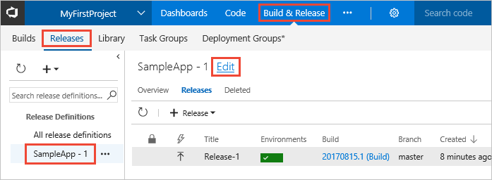
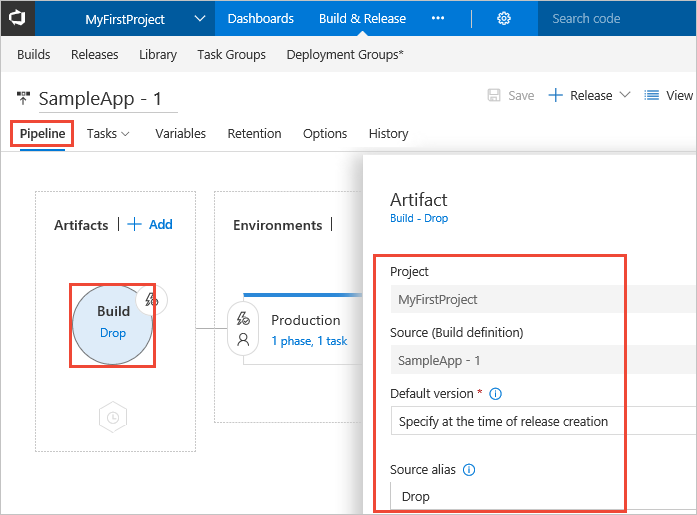
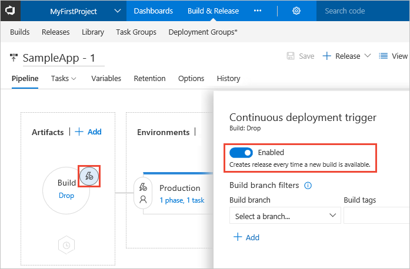
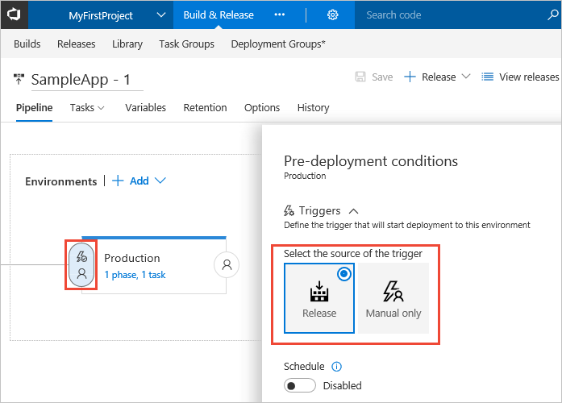
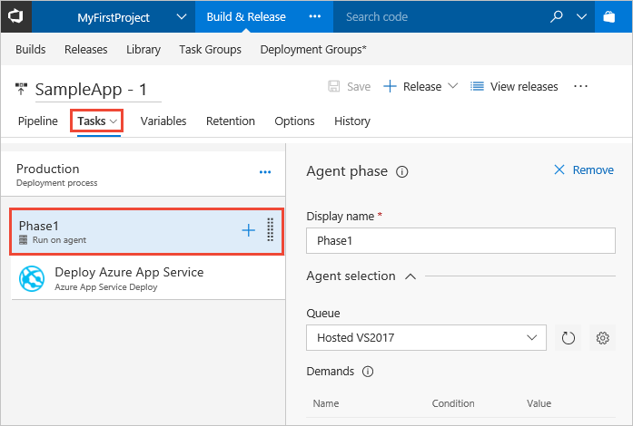
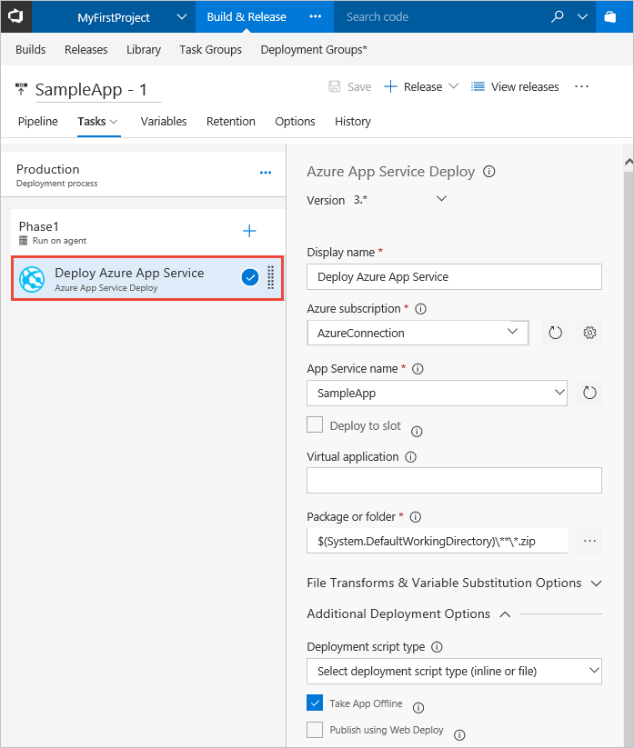

# Customize your continuous deployment (CD) process

Visual Studio Team Services (VSTS) provides a highly customizable continuous deployment service for managing the release
of your applications. Your release definition is where you specify how your deployments work and who approves them. You can also initiate and track releases from here.

In this tutorial, you learn about:

> [!div class="checklist"]
> * Release definitions in VSTS
> * Extending a release definition by adding environments
> * Adding approvals within a release definition
> * Creating a release
> * Monitoring and tracking deployments

## Prerequisites

You need to have worked through the quickstart [Deploy your ASP.NET Core app to an Azure web app](aspnet-core-to-azure-webapp.md)
before you start this tutorial. That quickstart creates an Azure App Services website, and generates a build and release definition
that you will use in this tutorial. However, you can start with any other release definition, perhaps created by one of the other
quickstarts or tutorials, but you will then need to adapt the following steps to match your own release definition. 

You will also need an additional Azure App Services website to deploy your app to when you add a new environment to the release
definition in this tutorial. It's a good idea to create that now by following
[these steps in the quickstart](aspnet-core-to-azure-webapp.md#create-webapp-portal). You'll need to choose
a different name for your new website, perhaps containing the text "QA" to help you easily see which is which later on.

## Release definitions in VSTS

In this section, you will explore the release definition that was created by the [Deploy your ASP.NET Core app to an Azure web app](aspnet-core-to-azure-webapp.md) quickstart.

1. In VSTS, open the **Releases** page in the **Build &amp; Release** hub. Select your release definition in the left pane
   and choose **Edit** in the main section of the page.

   

   Notice that the page shows the release generated by the previous quickstart succeeded. 

   [What's the difference between a release definition and a release?](../../../concepts/releases/index.md)

1. The release definition opens on the **Pipeline** page, which shows the artifacts and the environments in the definition.
   The **Build** item lists the artifacts for the definition; in this case just the artifact named **drop**. Choose this
   to open the **Artifact** panel that shows more details of the artifact. 

   

   You can add more artifacts to a definition by choosing the **+ Add** link in the **Artifacts** section.
   For more information, see [Artifacts](../../../concepts/definitions/release/artifacts.md)
   in the Release Management documentation.

1. Choose the **Continuous deployment trigger** icon in the **Artifacts** section to open the trigger panel.
   You can see that it was set when the release definition was generated by the Azure Continuous Delivery feature
   in the previous quickstart, so that deployment is started after the build is completed.

   

   For more information, see [Release triggers](../../../concepts/definitions/release/triggers.md)
   in the Release Management documentation.

1. Choose the **Pre-deployment conditions** icon in the **Environments** section to open the conditions panel.
   You can see that the Azure Continuous Delivery feature set the trigger for deployment to this environment as
   **Release**. This means that a deployment will be initiated automatically when a new release is created from
   this release definition.   

   

   Notice that you can also set up a schedule for deployments; for example, if you want to deploy at a specific time of day
   when you know the app will not be heavily used. For more information, see [Environment triggers](../../../concepts/definitions/release/triggers.md)
   in the Release Management documentation.

1. Choose the **Tasks** tab to open the page that defines the deployment process for your environment.
   Select the **Phase1** item in the left pane to display details of the process phase that will deploy the app.
   The Azure Continuous Delivery feature selected the **Hosted 2017** queue containing the agent that will
   execute the deployment to the target website. This queue is hosted in Azure (so you don't need to set up
   any additional servers), and is specially designed to deploy ASP.NET Core apps.  

   

   For more information, see [Build and release agents](../../../concepts/agents/agents.md)
   in the Release Management documentation.

1. Select the **Deploy Azure App Service** task in the left pane. This shows the settings for the task that will
   execute the deployment.

   

   Notice that the Azure Continuous Delivery feature set the subscription and App Service name
   when it created the definition. It also specified the location of the packaged website artifacts (a zip file) using
   the pre-defined variable named **System.DefaultWorkingDirectory**. In addition, because this is an ASP.NET Core app,
   it set the **Take App Offline** option to stop the website before deploying a new set of artifacts, and restart it afterwards
   (this is not required for ASP.NET and most other types of app, which allow the web pages to be overwritten while the site is running).

   For more information, see [Tasks for Build and Release](../../../concepts/process/tasks.md)
   and [Variables in Release Management](../../../concepts/definitions/release/variables.md).

[!INCLUDE [customize-process-sections](_shared/customize-process-sections.md)]

## Next step

> [!div class="nextstepaction"]
> 
