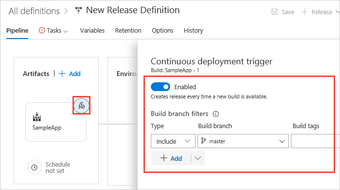

# Deploy using Kubernetes to Azure Container Service

Continuous deployment (CD) means starting an automated deployment process whenever a new successful build is available.
Here. we'll show you how to set up continuous delivery of a Docker based app by using VSTS
to a Kubernetes cluster running in Azure Container Service.

[Azure Container Service (ACS)](https://azure.microsoft.com/services/container-service/) allows to deploy and
manage containers using Kubernetes, Docker Swarm, Mesosphere DC/OS orchestrators. You can deploy these three orchestrators
on Azure by using the portal, an Azure Resource Manager template, or the Azure CLI.

The [Azure Container Registry (ACR)](https://azure.microsoft.com/services/container-registry/) is an implementation of the
open source Docker Registry. ACR is now available as an Azure Service and is fully compatible with all three orchestrators.
ACR is used as a private registry to store Docker images for enterprise applications, instead of needing to use the public Docker Hub.

## Get set up

### Begin with a CI build

Before you begin, you'll need a CI build that pushes your app to a container service:

* [Build and push a Docker image](../../containers/build.md)

### Modify your build to deploy a configuration file

Next, you'll need to modify your build definition.

1. Add one instance of the **Publish Build Artifacts** task to the end of your build definition.

1. Configure the task as follows:

    [Build: Publish Build Artifacts](../../../tasks/deploy/deploy-to-kubernetes.md) - Publish the Kubernetes configuration files used for creating the [deployment](https://kubernetes.io/docs/concepts/workloads/controllers/deployment/) and [service](https://kubernetes.io/docs/concepts/services-networking/service/) in the cluster. These files are added to the [repository](https://github.com/azooinmyluggage/k8s-docker-core/tree/master/k8config).
   
   - **Path to Publish**: Path to the artifacts you want to publish. For example, `k8config`
   
   - **Artifact name:** `yaml`
   
   - **Artifact Type**: `Server` 

1. Save your build definition.

<h2 id="cd">Define and test your CD release process</h2>

Continuous deployment (CD) means starting an automated release process whenever a new successful build is available.
Your CD release process picks up the artifacts published by your CI build and then deploys them.

1. Open the **Releases** tab of the **Build &amp; Release** hub, open the **+** drop-down
   in the list of release definitions, and choose **Create release definition** 

1. Select the **Deploy to Kubernetes cluster** template and choose **Apply**.

1. In the **Artifacts** section on the **Pipeline** tab, choose the **+ Add** link and select your build artifact.

   

1. Choose the **Continuous deployment** icon in the **Artifacts** section, check that the
   continuous deployment trigger is enabled, and add a filter that includes the **master** branch.

   

   > Continuous deployment is not enabled by default when you create a new release definition from the **Releases** tab.

1. Add two more instances of the **Deploy to Kubernetes** task to your release definition.
   This task uses the `kubectl` command to execute operations on a Kubernetes cluster.

1. Configure the tasks as follows:

    [Deploy: Deploy to Kubernetes](../../../tasks/deploy/deploy-to-kubernetes.md) - Create the deployment and secret.
   
   - **Container Registry type**: `Azure Container registry`
   
   - **Azure Subscription:** Select a connection from the list under **Available Azure Service Connections** or create a more restricted permissions connection to your Azure subscription. For more details, see [Azure Resource Manager service endpoint](../../../concepts/library/service-endpoints.md#sep-azure-rm).
   
   - **Azure Container registry**: Select the Azure container registry to which you pushed your container images.
   
   - **Secret name**: Name of the Docker registry secret. You can use this secret name in the Kubernetes YAML configuration file.
   
   - **Command**: `apply` (you can run any kubectl command). See the [command reference](https://kubernetes.io/docs/reference/generated/kubectl/kubectl-commands) for a full description of the task and arguments. 
   
   - **Use Configuration file**: Checked
   
   - **Configuration file**: Select the **deployment.yaml** file that was published as an artifact from the build. Example: `$(System.DefaultWorkingDirectory)/Kubernetes-ACS-CI/yaml/deployment.yaml`

   
    [Deploy: Deploy to Kubernetes](../../../tasks/deploy/deploy-to-kubernetes.md) - Create the service using the yaml file.
   
   - **Container Registry type**: `Azure Container registry`
   
   - **Azure Subscription:** Select a connection from the list under **Available Azure Service Connections** or create a more restricted permissions connection to your Azure subscription. For more details, see [Azure Resource Manager service endpoint](../../../concepts/library/service-endpoints.md#sep-azure-rm).
   
   - **Azure Container registry**: Select the Azure container registry to which you pushed your container images.
   
   - **Secret name**: Name of the Docker registry secret. You can use this secret name in the Kubernetes YAML configuration file.
   
   - **Command**: `apply`. See the [command reference](https://kubernetes.io/docs/reference/generated/kubectl/kubectl-commands) for a full description of the task and arguments. 
   
   - **Use Configuration file**: Checked
   
   - **Configuration file**: Select the **service.yaml** file that was published as an artifact from the build. Example: `$(System.DefaultWorkingDirectory)/Kubernetes-ACS-CI/yaml/service.yaml`

   
    [Deploy: Deploy to Kubernetes](../../../tasks/deploy/deploy-to-kubernetes.md) Update with the latest image.
   
   - **Container Registry type**: `Azure Container registry`
   
   - **Azure Subscription:** Select a connection from the list under **Available Azure Service Connections** or create a more restricted permissions connection to your Azure subscription. For more details, see [Azure Resource Manager service endpoint](../../../concepts/library/service-endpoints.md#sep-azure-rm).
   
   - **Azure Container registry**: Select the Azure container registry to which you pushed your container images.
   
   - **Secret name**: Name of the Docker registry secret. You can use this secret name in the Kubernetes YAML configuration file.
   
   - **Command**: `set`. See the [command reference](https://kubernetes.io/docs/reference/generated/kubectl/kubectl-commands) for a full description of the task and arguments. 
   
   - **Arguments**: Arguments to pass to the command. For example, `image deployment/coreserverdeployment core-server=image:tag` where you are using a private registry (so the image name must be prefixed with the container registry name). We also use the Build Id to tag our images here, so the `image:tag` value will be `{your-acr-name}.azurecr.io/docker-dotnetcore:$(Build.BuildId)`. `docker-dotnetcore` is the image name used in the build.

1. Edit the name of the release definition, choose **Save**, and choose **OK**.
   Note that the default environment is named Environment1, which you can edit by clicking directly on the name.

You're now ready to create a release, which means to start the process of running the release definition with the artifacts produced by a specific build. This will result in deploying the build to Azure:

[!INCLUDE [simple-create-release](../../_shared/simple-create-release.md)]

## Q&A

<!-- BEGINSECTION class="md-qanda" -->

### Why use the Build ID as the tag when deploying?

In this example, we used the kubectl `set image` command with the Build ID as the tag.
Using the Build ID as the tag has an added advantage of traceability. Avoid using the
latest tag with the container image. An alternate approach is to modify the YAML
file with the Build ID used to tag the image.

### How do I define separate environments for my release?

The [Kubernetes namespace](https://kubernetes.io/docs/concepts/overview/working-with-objects/namespaces/)
allows complete separation of resources and management within the same cluster. So namespace can be used
to create multiple environments such as *Dev*, *QA*, and *Production* in the same ACS Kubernetes cluster.

::: moniker range="< vsts"
[!INCLUDE [temp](../../../_shared/qa-versions.md)]
::: moniker-end

<!-- ENDSECTION -->

[!INCLUDE [rm-help-support-shared](../../../_shared/rm-help-support-shared.md)]
