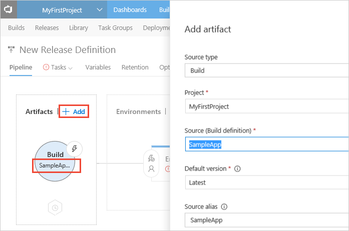

# Deploy your database to Azure SQL database using SQL scripts

[!INCLUDE [temp](../../_shared/version-rm-dev14.md)]

Continuous deployment means starting an automated deployment process whenever a new successful build is available.
Here we'll show you how to run SQL scripts against an Azure SQL Database as part of continuous deployment using Release Management.

## Get set up

### Azure SQL Database

Carry out the following steps to set up an Azure SQL Database server against which
the database script will be executed.

1. Sign into the Azure management portal and choose
   the **+New** icon in the left panel, then choose
   **Data + Storage**. Select **SQL Database** from the
   list.

1. In the **SQL Database** blade, enter a name for
   Azure SQL Database and then
   choose **Server** to configure the required settings
   for the server.

1. In the **Server** blade, choose **Create a new server**.

1. In the **New server** blade, enter a name for the
   server and enter the admin
   login and password for the new server.
   Leave all other settings as they are and choose **OK**.  

1. Back in the **SQL Database** blade, leave all the
   other settings at their default values and choose
   **Create**.

1. After the Azure SQL Database server and database
   have been created, open its blade and make a note
   of the **Server name**.

### Azure SQL scripts

You will need a **SQL script** that is published as an artifact by Team Build or a similar continuous integration service. Alternatively, you can also store the script in a version control repository. If you do not have a script, follow these steps to get started with a simple script.

* Check the following script into a version control repository such as VSTS or TFS as `DatabaseExample.sql`.

  ```sql
  USE [master]
  GO
  IF NOT EXISTS (SELECT name FROM master.sys.databases WHERE name = N'DatabaseExample')
  CREATE DATABASE [DatabaseExample]
  GO
  ```

In addition, you will need Azure Powershell scripts to create and remove firewall rules in Azure. Without the firewall rules, the agent cannot communicate with the Azure SQL Database.

* Check the following PowerShell script into the same location that has your SQL script as `SetAzureFirewallRule.ps1`.

  ```powershell
  [CmdletBinding(DefaultParameterSetName = 'None')]
  param
  (
    [String] [Parameter(Mandatory = $true)] $ServerName,
  	[String] $AzureFirewallName = "AzureWebAppFirewall"
  )

  $ErrorActionPreference = 'Stop'

  function New-AzureSQLServerFirewallRule {
    $agentIP = (New-Object net.webclient).downloadstring("http://checkip.dyndns.com") -replace "[^\d\.]"
    New-AzureSqlDatabaseServerFirewallRule -StartIPAddress $agentIp -EndIPAddress $agentIp -RuleName $AzureFirewallName -ServerName $ServerName
  }
  function Update-AzureSQLServerFirewallRule{
    $agentIP= (New-Object net.webclient).downloadstring("http://checkip.dyndns.com") -replace "[^\d\.]"
    Set-AzureSqlDatabaseServerFirewallRule -StartIPAddress $agentIp -EndIPAddress $agentIp -RuleName $AzureFirewallName -ServerName $ServerName
  }

  If ((Get-AzureSqlDatabaseServerFirewallRule -ServerName $ServerName -RuleName $AzureFirewallName -ErrorAction SilentlyContinue) -eq $null)
  {
    New-AzureSQLServerFirewallRule
  }
  else
  {
    Update-AzureSQLServerFirewallRule
  }
  ```

* Check the following PowerShell script into the same location that has your SQL script as `RemoveAzureFirewallRule.ps1`.

  ```powershell
  [CmdletBinding(DefaultParameterSetName = 'None')]
  param
  (
    [String] [Parameter(Mandatory = $true)] $ServerName,
  	[String] $AzureFirewallName = "AzureWebAppFirewall"
  )

  $ErrorActionPreference = 'Stop'

  If ((Get-AzureSqlDatabaseServerFirewallRule -ServerName $ServerName -RuleName $AzureFirewallName -ErrorAction SilentlyContinue))
  {
    Remove-AzureSqlDatabaseServerFirewallRule -RuleName $AzureFirewallName -ServerName $ServerName
  }
  ```

> [How can I perform other actions on a SQL Server or Azure SQL Database?](sql-server-actions.md)

## Define and test your CD release process

1. Open the **Releases** tab of the **Build &amp; Release** hub, open the **+** drop-down
   in the list of release definitions, and choose **Create release definition**.

1. Choose **Start with an Empty process**.

1. If you created your new release definition from a build summary, check that the build definition or repository that contains the SQL scripts
   is shown in the **Artifacts** section on the **Pipeline** tab. If you created a new
   release definition from the **Releases** tab, choose the **+ Add** link and select your build artifact.

   

1. Choose the **Continuous deployment** icon in the **Artifacts** section, check that the continuous deployment trigger is enabled,
   and add a filter to include the **master** branch.

   

1. Open the **Tasks** tab and add the following tasks to the definition:

    [Deploy: Azure Powershell](../../tasks/deploy/azure-powershell.md) - Add a firewall rule in Azure to allow it to connect to Azure SQL Database.
   
   - **Azure Connection Type**: `Azure Classic`. The scripts provided as samples here work with only an Azure Classic connection.
   
   - **Azure Subscription**: Select an Azure subscription. If you have not created an Azure classic endpoint, create one now by choosing **Add**.
   
   - **Script Type**: `Script File Path`.
   
   - **Script Path**: Select the location of `SetAzureFirewallRule.ps1`.
   
   - **Script Arguments**: Name of the SQL server you created earlier.<p />
   
    [Utility: Command Line](../../tasks/utility/command-line.md) - Run the SQL script.
   
   - **Tool**: `SQLCMD`.
   
   - **Arguments**: `-S {database-server-name}.database.windows.net -U {username}@{database-server-name} -P {password} -d {database-name} -i {SQL file}`. For example, when the SQL script is coming from an artifact source, **{SQL file}** will be of the form: `$(System.DefaultWorkingDirectory)/contoso-repo/DatabaseExample.sql`.<p />
   
    [Deploy: Azure Powershell](../../tasks/deploy/azure-powershell.md) - Remove the firewall rule in Azure.
   
   - **Azure Connection Type**: `Azure Classic`. The scripts provided as samples here work with only an Azure Classic connection.
   
   - **Azure Subscription**: Select an Azure subscription. If you have not created an Azure classic endpoint, create one now by choosing **Add**.
   
   - **Script Type**: `Script File Path`.
   
   - **Script Path**: Select the location of `RemoveAzureFirewallRule.ps1`.
   
   - **Script Arguments**: Name of the SQL server you created earlier.<p />

1. Edit the name of the release definition, choose **Save**, and choose **OK**.
   Note that the default environment is named Environment1, which you can edit by clicking directly on the name.

You're now ready to create a release, which means to start the process of running the release definition.

[!INCLUDE [simple-create-release](../_shared/simple-create-release.md)]

## Q&A

<!-- BEGINSECTION class="md-qanda" -->

### How can I perform other actions on a SQL Server or Azure SQL Database?

You can use a PowerShell task to execute other types of SQL scripts.
For more details, see [Perform SQL server actions in VSTS or TFS](sql-server-actions.md).

::: moniker range="< vsts"
[!INCLUDE [temp](../../_shared/qa-versions.md)]
::: moniker-end

<!-- ENDSECTION -->

[!INCLUDE [rm-help-support-shared](../../_shared/rm-help-support-shared.md)]
