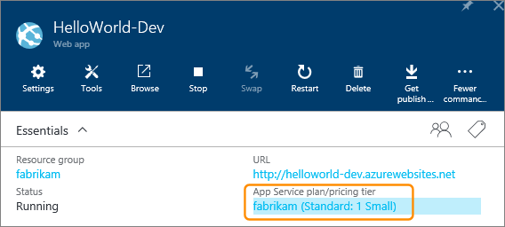
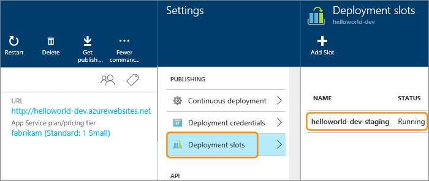

# CD to Azure App Services

[!INCLUDE [temp](../../_shared/version-rm-dev14.md)]

Continuous deployment (CD) means starting an automated deployment process whenever a new successful build is available.
Here we'll show you how to set up continuous deployment of your ASP.NET or Node app to an Azure App Services website using Release Management.

> You can also use these steps to deploy your app to an Azure Government Cloud
by creating a suitable service endpoint for your Azure Government Cloud subscription.
For more details, see the [Azure Government Cloud deployments](../../concepts/library/government-cloud.md).

## Prerequisites

Before you begin, you'll need a CI build that publishes your Web Deploy package. To set up CI for your specific type of app, see:

* [Build your ASP.NET 4 app](../aspnet/ci/build-aspnet-4.md)

* [Build your ASP.NET Core app](../aspnet/ci/build-aspnet-core.md)

* [Build your Node app with Gulp](../nodejs/nodejs-to-azure.md)

[!INCLUDE [azure-web-app-setup](../_shared/azure-web-app-setup.md)]

[!INCLUDE [create-release](../_shared/create-release.md)]

## Next steps

### Deploy multiple apps in the same release

If your CI build process builds multiple apps, you can deploy them in the same release.
To do this, configure a separate instance of the **Azure App Service Deploy** task for each app. In each instance of the task:

* Specify a unique value for **App Service Name**

* Specify the **Web Deploy Package** with a reference to a specific app. For example, replace the default value with a more specific value such as `$(build.stagingDirectory)\**\WebApplication1.zip`

### Configure the environment

If you deploy releases to multiple environments, you can substitute configuration settings in **Web.config** and other configuration files of your website using these steps:

1. Define environment-specific configuration settings in the **Variables** tab of an environment in a release definition; for example,
   `connectionString = <value>`.

1. In the **Azure App Service Deploy** task, select the check box for **XML variable substitution** under **File Transforms and Variable Substitution Options**.
   This option is present only in version **3.\*** and above of the task. It is not yet available in TFS.
   
> If you prefer to manage environment configuration settings in your own database or Azure keyvault, add a task to the environment to read and emit those values using `##vso[task.setvariable variable=connectionString;issecret=true]<value>`.
   
For more details, see [Managing Configuration & App Settings for Multiple Environments in Your CD Pipeline](https://blogs.msdn.microsoft.com/visualstudioalm/2017/04/05/managing-configuration-app-settings-for-multiple-environments-in-your-cd-pipeline/).   

### Swap deployment slots

If you want to deploy to a staging slot in an Azure App Services website, and then swap the staging and production slots, perform these steps.

1. Ensure that your Azure App Services plan is a standard or
   premium level. This is required to configure deployment slots.

   

1. Configure a **Staging** slot in the Azure App Services website.

   

   You do not need to configure a **Production** slot because it is implicitly present in all Azure App Services websites.

   >For more information on configuring deployment slots, see
   [Set up staging environments for web apps in Azure App Service](https://azure.microsoft.com/documentation/articles/web-sites-staged-publishing)
   on the Azure website.

1. Configure the tasks in the environment of the release definition as follows:

    [Deploy: Azure App Service Deploy](../../steps/deploy/azure-app-service-deploy.md) - Deploy the app to Azure App Services.
   
   - **Azure Subscription**: Select a connection from the list under **Available Azure Service Connections** or create a more restricted permissions
     connection to your Azure subscription. For more details, see [Azure Resource Manager service endpoint](../../concepts/library/service-endpoints.md#sep-azure-rm).
   
   - **App Service name**: Select your App Service.
   
   - **Deploy to slot**: `Checked`.
   
   - **Slot**: `Staging`

   
    [Deploy: Azure App Service Manage](../../steps/deploy/azure-app-service-manage.md) - Swap slots.
   
   - **Azure Subscription**: Select a connection from the list under **Available Azure Service Connections** or create a more restricted permissions
     connection to your Azure subscription. For more details, see [Azure Resource Manager service endpoint](../../concepts/library/service-endpoints.md#sep-azure-rm).
   
   - **Action**: `Swap slots`
   
   - **App Service name**: Select your App Service.
   
   - **Resource group**: Select the resource group to which your App Service belongs.
   
   - **Source slot**: `Staging` 

   
You might also consider [Configuring Auto Swap](https://docs.microsoft.com/en-us/azure/app-service-web/web-sites-staged-publishing#Auto-Swap)
for your Azure App Services web app to automatically swap the app into production after successful deployment.
