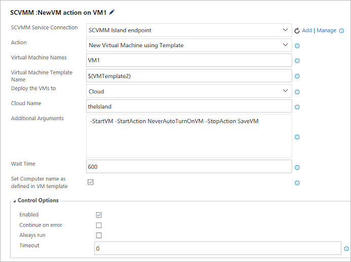
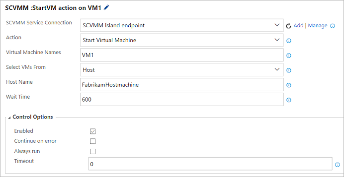

# Task actions for managing VMs using System Center Virtual Machine Manager (SCVMM)

[!INCLUDE [version-rm-dev14](../../../_shared/version-rm-dev14.md)]

You can manage your virtual machines using the System Center Virtual
Machine Manager (**SCVMM**) task by performing actions such as creating, restoring, and 
deleting checkpoints; starting and stopping virtual machines; creating
new virtual machines using templates; and running custom PowerShell scripts for SCVMM.

You must install the **System Center Virtual Machine Manager (SCVMM)**
extension from Visual Studio Marketplace into your server or account.
For more information, see [Configure and deploy with SCVMM](configure-scvmm.md).

## SCVMM task actions

The **SCVMM** task can be used to perform the a range of actions:

* **Create, restore, and delete checkpoints**. Use the following task parameters:

  - **SCVMM Service Connection**: Select a SCVMM service connection you already defined, or create a new one.
  
  - **Action**: Select one of the checkpoint actions **Create Checkpoint**, **Restore Checkpoint**, or **Delete Checkpoint**.
  
  - **Virtual Machines Name**: Enter the name of the virtual machine, or a comma-separated list of the virtual machine names. Example `FabrikamDevVM,FabrikamTestVM`
  
  - **Checkpoint Name**: For the **Create CheckPoint** action, enter the name of the checkpoint that will be applied to the virtual machines. For the **Delete Checkpoint** or **Restore Checkpoint** action, enter the name of an existing checkpoint.
  
  - **Description for Checkpoint**: Enter a description for the new checkpoint when creating it. 
  
  - **Select VMs From**: Choose either **Cloud** or **Host** to select the set of virtual machines to which the action will be applied.
  
  - **Host Name** or **Cloud Name**: Depending on the previous selection, enter either a cloud name or a host machine name.

  

* **Create new virtual machines using a template**. Use the following task parameters:
        
  - **SCVMM Service Connection**: Select a SCVMM service connection you already defined, or create a new one.
  
  - **Action**: Select **New Virtual Machine using Template**.
  
  - **Virtual Machines Name**: Enter the name of the virtual machine, or a comma-separated list of the virtual machine names. Example `FabrikamDevVM,FabrikamTestVM`
  
  - **Virtual Machine Template Name**: To create virtual machines using a template, enter the template name.
  
  - **Deploy the VMs to**: Choose either **Cloud** or **Host** to select the set of virtual machines to which the action will be applied.
  
  - **Host Name** or **Cloud Name**: Depending on the previous selection, enter either a cloud name or a host machine name.
  
  - **Placement path for VM**: If you selected **Host** as the deployment target, enter the path to be used during virtual machine placement. Example `C:\ProgramData\Microsoft\Windows\Hyper-V`
  
  - **Additional Arguments**: Enter any arguments to pass to the virtual machine creation template. Example `-StartVM -StartAction NeverAutoTurnOnVM -StopAction SaveVM`
  
  - **Wait Time**: The time to wait for the virtual machine to reach ready state.
  
  - **Set Computer name as defined in VM template**: Set (tick) this option to set the computer name to that defined in the template (if provided). If not set, the computer name will be that specified for the **Virtual Machine Names** parameter.

  

* **Start and stop virtual machines**. Use the following task parameters:

  - **SCVMM Service Connection**: Select a SCVMM service connection you already defined, or create a new one.
  
  - **Action**: Select **Start Virtual Machine** or **Stop Virtual Machine**.
  
  - **Virtual Machines Name**: Enter the name of the virtual machine, or a comma-separated list of the virtual machine names. Example `FabrikamDevVM,FabrikamTestVM`
  
  - **Select VMs From**: Choose either **Cloud** or **Host** to select the set of virtual machines to which the action will be applied.
  
  - **Host Name** or **Cloud Name**: Depending on the previous selection, enter either a cloud name or a host machine name.
  
  - **Wait Time**: The time to wait for the virtual machine to reach ready state.

 
  

* **Run custom PowerShell scripts for SCVMM**. Use the following task parameters:

  - **SCVMM Service Connection**: Select a SCVMM service connection you already defined, or create a new one.
  
  - **Action**: Select **Run PowerShell Script for SCVMM**.
  
  - **Script Path**: Enter the path of the PowerShell script to execute. It must be a fully-qualified path, or a path relative to the default working directory.
  
  - **Script Arguments**: Enter any arguments to be passed to the PowerShell script. You can use either ordinal parameters or named parameters.
  
  - **Working folder**: Specify the current working directory for the script when it runs. The default if not provided is the folder containing the script.

## Next

You can now add other tasks to the environment, such as **PowerShell on Target Machines**,
and then deploy to the newly provisioned machines.
For more information, see [Configure and deploy with SCVMM](configure-scvmm.md).

   > In the future, we plan for the **SCVMM** task 
   to provide an output variable that you
   set in the task and then use as input to subsequent
   tasks. Until then, if you want to run additional tasks, 
   you must specify the fully-qualified domain 
   names of the virtual machines that are provisioned 
   in SCVMM.

## Q&A

<!-- BEGINSECTION class="md-qanda" -->

[!INCLUDE [temp](../../../_shared/qa-versions.md)]

<!-- ENDSECTION -->

[!INCLUDE [rm-help-support-shared](../../../_shared/rm-help-support-shared.md)]
