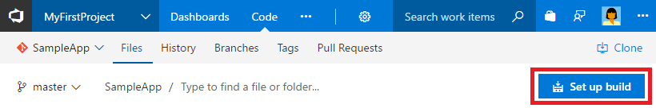

# Build your Android app

**VSTS | TFS 2018 | TFS 2017.2**

Visual Studio Team Services (VSTS) and Team Foundation Server (TFS) provide a highly customizable continuous integration (CI) process to automatically build and package your Android app whenever your team pushes or checks in code. In this quickstart you learn how to define your CI process.

## Prerequisites

[!INCLUDE [include](../../_shared/ci-cd-prerequisites-vsts.md)]

* While the simplest way to try this quickstart is to use a VSTS account, you can also use a TFS server instead.

First, you will need a build agent on which the Android SDK is installed. You may use one of the following:

  1. The **Hosted VS2017** agent provided by VSTS, or
  1. See [Build and release agents](../../concepts/agents/agents.md) for instructions on creating your own Linux, macOS, or Windows build agent. The Android SDK must be installed on your agent.

## Get the Android sample code

[!INCLUDE [include](../_shared/get-sample-code-intro.md)]

```
https://github.com/adventworks/android-sample
```

# [VSTS or TFS repo](#tab/vsts)

[!INCLUDE [include](../_shared/get-sample-code-vsts-tfs-2017-update-2.md)]

# [GitHub repo](#tab/github)

[!INCLUDE [include](../_shared/get-sample-code-github.md)]

---

## Set up continuous integration

[!INCLUDE [include](../../_shared/ci-quickstart-intro.md)]

1. Create a new build definition.

 # [VSTS or TFS repo](#tab/vsts)

 Navigate to the **Files** tab of the **Code** hub, and then click **Set up build**.

 

 You are taken to the **Build and Release** hub and asked to **Select a template** for the new build definition.

 # [GitHub repo](#tab/github)

 Navigate to the **Builds** tab of the **Build and Release** hub in VSTS or TFS, and then click **+ New**. You are asked to **Select a template** for the new build definition.

 ---

1. In the right panel, click **Android**, and then click **Apply**.

 You now see all the tasks that were automatically added to the build definition by the template. These are the steps that will automatically run every time you check in code.

1. For the **Agent queue**, select **Hosted VS2017** or a queue that includes the agent you set up.

1. Click **Get sources** and then:

 # [VSTS or TFS repo](#tab/vsts)

 Observe that the new build definition is automatically linked to your repository.

 # [GitHub repo](#tab/github)

 Select your version control repository. You'll need to authorize access to your repo.

 ---

1. Click the **Triggers** tab in the build definition. Enable the **Continuous Integration** trigger. This will ensure that the build process is automatically triggered every time you commit a change to your repository.

1. Click **Save & queue** to kick off your first build. On the **Save build definition and queue** dialog box, click **Save & queue**.

1. A new build is started. You'll see a link to the new build on the top of the page. Click the link to watch the new build as it happens.

## View the build summary

[!INCLUDE [include](../_shared/view-build-summary.md)]

## Next steps

1. To sign your Android app using a keystore file as part of CI, see [Sign your mobile app](app-signing.md).
1. Your Android app can be tested on physical devices using the **App Center Test** task.
1. You can distribute your Android app using the **App Center Distribute** task or tasks in the [Google Play extension](https://marketplace.visualstudio.com/items?itemName=ms-vsclient.google-play).