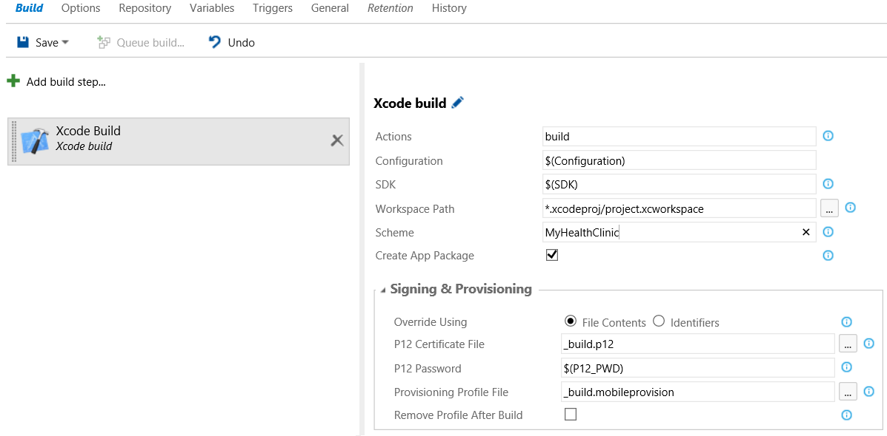

# Build and Test Xcode Projects

[!INCLUDE [temp](../../_shared/version.md)]

> **Notice**: Apple's WWDR certificate expired on Feb 14th and as a result you may experience signing failures if you have not updated the cert and **removed the old one**. Follow the steps outlined by Apple under [What should I do if Xcode doesn’t recognize my distribution certificate?](https://developer.apple.com/support/certificates/expiration/) to resolve the problem. Note that this also affects development certs despite the title.

The prerequisites in this case are simple: Your Mac needs to have Node.js, Xcode, and [xcpretty](https://github.com/supermarin/xcpretty) (for testing) installed. Simply open the OSX Terminal app and follow these [setup instructions](../../actions/agents/v2-osx.md). On startup the agent will automatically register itself with VSTS / TFS when you start up the agent for the first time.

The Xcode Build task used here supports features to simplify configuration of code signing. See **[Simple, Secure CI App Signing](secure-certs.md)** for details.

> **Troubleshooting Tip**: You should either setup the cross-platform agent as a launch agent (./svc.sh install agent) or run it as an interactive process (node agent/vsoagent.js) when building an Xcode project that involves code signing like iOS.

## Project Setup
For the purposes of this tutorial we will assume you are trying to build an iOS app but the concepts described here essentially translate to other Xcode builds.

There is really only one step required for configuring an Xcode project for a CI environment that is not done by default when you create an Xcode project. Xcode has the concept of schemes and you'll need to set one of these as "Shared" and add it to source control so it can be used during your CI builds.  Follow these steps:

1. In Xcode, open your project and go to **Product Scheme Manage Schemes...**

2. Check **Shared** next to the Scheme you want to use during CI. Remember the name of the scheme you shared as we will reference it later.

3. Now add the new files and folders in your .xcodeproj folder (specifically the xcsharedata folder to source control).


## Create the definition

0. Open your team project in your web browser.

 * On-premises ```http://{your_server}:8080/tfs/DefaultCollection/{your_team_project}```
 * Visual Studio Team Services  ```https://{your_account}.visualstudio.com/DefaultCollection/{your_team_project}```

0. Create a build definition.

 

0. Click Empty to start with an empty definition.

## Set Build Variables

Next, click on the **Variables** tab and add in the Configuration and SDK variables.
* **Configuration**: Debug or Release
* **SDK**: iphoneos

	

## Add Steps

On the Build tab, add some steps.

<table>
   <tr>
      <td> <strong>Build: Xcode</strong></td>
      <td>
	  	<p>Settings:</p>
	  	<ul>
		  <li><strong>Actions</strong>: build</li>
		  <li><strong>Configuration</strong>: Xcode can have any number of configurations but "Debug" and "Release" are there by default. We'll use $(Configuration) which gets this value from a **Variable**.</li>
		  <li><strong>SDK</strong>: Run xcodebuild -showsdks to see the valid list of SDKs. Ex: "iphoneos", "iphonesimulator".  We'll use $(SDK) so it is set as a variable.</li>
		  <li><strong>Workspace Path</strong>: This can be left to the default value unless you want to explicitly override it.</li>
		  <li><strong>Scheme</strong>: Set this to the name of the Scheme you shared in your project</li>
		  <li><strong>Create App Pacakge</strong>: Checked. This will automatically generate an app package (ipa) for your project once the build has completed.</li>
		</ul>
		<p>There are a few other options worth noting:</p>
		<ul>
		  <li>The <strong>Signing & Provisioning</strong> category provides a number of options for making signing less complicated. See **[Simple, Secure CI App Signing](secure-certs.md)** for details.</li>
	      <li><strong>Advanced / Use xcpretty</strong> will format xcodebuild output with xcpretty [xcpretty](https://github.com/supermarin/xcpretty). We'll cover this more when we add in a test.</li>
		  <li><strong>Advanced / Xcode Developer Path</strong> allows you to specify the path of a different version of Xcode than is installed by default.  Ex: */Applications/Xcode6.4.app/Contents/Developer*</li>
		</ul>
      </td>
   </tr>
   <tr>
      <td> <strong>Build: Publish Build Artifacts</strong></td>
	  <td>
	  	<p>Settings:</p>
	  	<ul>  	   
		<li> <strong>Copy Root</strong>: The default location is <strong>output/$(SDK)/$(Configuration)/$(Configuration)-$(SDK)/build.dsym</strong></li>
		<li> <strong>Contents:</strong> *.ipa</li>
		<li> <strong>Artifact Name:</strong> ipa</li>
		<li> <strong>Artifact Type:</strong> Server</li>
		</ul>
	</td>
   </tr>
</table>

Save and click "Queue Build..." to test it out!



> **Troubleshooting Tip**: If you encounter a "User interaction not allowed" error when running the agent as a launch agent, you will either need check the "Unlock default keychain" option or switch to referencing signing certificates using a file. See **[Simple, Secure CI App Signing](secure-certs.md)** for details.

## Add In Tests
If you've created unit or UI tests in your Xcode project, you can run these and publish the results to VSTS using **[xcpretty](https://github.com/supermarin/xcpretty)**. Note you will need to have xcpretty installed on the OSX machine the cross-platform build agent is on as this is not part of Xcode itself.

On the Build tab, add some steps.

<table>
   <tr>
      <td>  <strong>Build: Xcode</strong></td>
	  <td>
		<p>Move this to the top of your build definition (before build) and use the following settings:</p>
		<ul>
		<li><strong>Actions</strong> test</li>
		<li><strong>Configuration</strong> $(Configuration)</li>
		<li><strong>SDK</strong>: $(Test_SDK)</li>
		<li><strong>Workspace Path</strong>: The same value as your build.</li>
		<li><strong>Scheme</strong>: The same value as your build.</li>
		<li><strong>Create App Pacakge</strong>: Unchecked.</li>
		<li><strong>Advanced &gt; Use xcpretty</strong>: Checked.</li>
		<li><strong>Advanced &gt; Xcode Developer Path</strong>: The same value as your build.</li>
		</ul>
      </td>
   </tr>
</table>

> **Troubleshooting Tip**: The "Release" configuration is not testable by default. You'll either need to use "Debug" or enable testability in for the configuration in Xcode. Also, be sure to pay attention to capitalization as "Debug" will work but "debug" may not.

Next, click on the **Variables** tab and add **Test_SDK** as a variable set to **iphonesimulator**

Save and click "Queue Build..." to test it out!

> **Troubleshooting Tip**: If you run into issues with your tests hanging and/or not being able to start the iOS Simulator at times you can opt to add a Command Line task for the "killall" tool with "iOS\ Simulator" as an argument (killall iOS\ Simulator). This will force shut down the simulator in the event it is hung. Exercise care when running the command if you have multiple agents running for the same user and that you do not accidently kill other processes.   


## Q&A

<!-- BEGINSECTION class="md-qanda" -->

[!INCLUDE [temp](../../_shared/qa-definition-common-all-platforms.md)]

[!INCLUDE [temp](../../_shared/qa-agents.md)]

[!INCLUDE [temp](../../_shared/qa-versions.md)]

<!-- ENDSECTION -->
